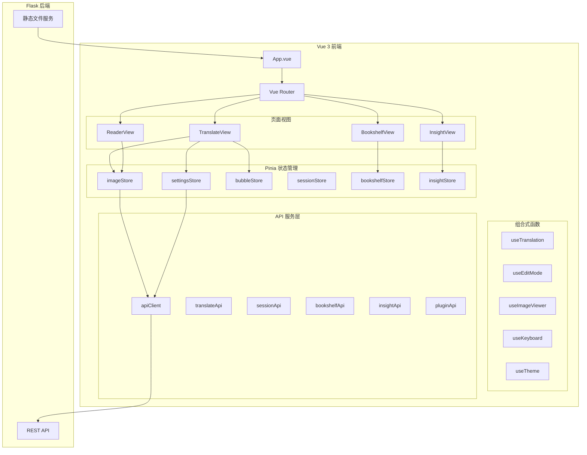

# Vue 前端迁移设计文档

## 概述

本设计文档描述将 Saber-Translator 漫画翻译项目的前端从 Jinja2 模板 + jQuery + 原生 JavaScript 架构迁移到 Vue 3 + TypeScript 现代前端框架的技术方案。

### 核心设计原则

1. **用户体验零变化** - UI外观、操作行为、功能逻辑必须与现有版本100%一致
2. **渐进式迁移** - 支持与现有Flask后端无缝集成
3. **CSS复用** - 直接复用现有14个CSS文件，确保视觉一致性
4. **类型安全** - 使用TypeScript提供完整的类型定义

## 架构设计

### 整体架构图



### 技术栈选型

| 技术 | 版本 | 用途 |
|------|------|------|
| Vue | 3.4+ | 前端框架 |
| TypeScript | 5.0+ | 类型系统 |
| Vite | 5.0+ | 构建工具 |
| Pinia | 2.1+ | 状态管理 |
| Vue Router | 4.2+ | 路由管理 |
| Axios | 1.6+ | HTTP客户端 |

## 组件与接口设计

### 目录结构

```
vue-frontend/
├── src/
│   ├── App.vue                    # 根组件
│   ├── main.ts                    # 入口文件
│   ├── router/
│   │   └── index.ts               # 路由配置
│   ├── stores/                    # Pinia 状态管理
│   │   ├── imageStore.ts          # 图片状态
│   │   ├── settingsStore.ts       # 设置状态
│   │   ├── bubbleStore.ts         # 气泡状态
│   │   ├── sessionStore.ts        # 会话状态
│   │   ├── bookshelfStore.ts      # 书架状态
│   │   └── insightStore.ts        # 漫画分析状态
│   ├── views/                     # 页面视图
│   │   ├── BookshelfView.vue      # 书架页面
│   │   ├── TranslateView.vue      # 翻译页面
│   │   ├── ReaderView.vue         # 阅读器页面
│   │   └── InsightView.vue        # 漫画分析页面
│   ├── components/                # 组件
│   │   ├── common/                # 通用组件
│   │   │   ├── AppHeader.vue      # 页面头部
│   │   │   ├── BaseModal.vue      # 模态框基础组件
│   │   │   ├── ToastNotification.vue
│   │   │   └── ImageViewer.vue    # 图片查看器
│   │   ├── bookshelf/             # 书架组件
│   │   │   ├── BookCard.vue
│   │   │   ├── ChapterList.vue
│   │   │   └── BookSearch.vue
│   │   ├── translate/             # 翻译组件
│   │   │   ├── SettingsSidebar.vue
│   │   │   ├── ImageUpload.vue
│   │   │   ├── ThumbnailList.vue
│   │   │   ├── TranslationProgress.vue
│   │   │   └── EditWorkspace.vue
│   │   ├── edit/                  # 编辑模式组件
│   │   │   ├── DualImageViewer.vue
│   │   │   ├── BubbleOverlay.vue
│   │   │   ├── BubbleEditor.vue
│   │   │   ├── EditToolbar.vue
│   │   │   ├── JapaneseKeyboard.vue
│   │   │   └── BrushTool.vue
│   │   ├── reader/                # 阅读器组件
│   │   │   ├── ReaderCanvas.vue
│   │   │   └── ReaderControls.vue
│   │   ├── insight/               # 漫画分析组件
│   │   │   ├── BookSelector.vue
│   │   │   ├── AnalysisProgress.vue
│   │   │   ├── OverviewPanel.vue
│   │   │   ├── TimelinePanel.vue
│   │   │   ├── QAPanel.vue
│   │   │   └── NotesPanel.vue
│   │   └── settings/              # 设置组件
│   │       ├── SettingsModal.vue
│   │       ├── OcrSettings.vue
│   │       ├── TranslationSettings.vue
│   │       ├── HqTranslationSettings.vue
│   │       ├── ProofreadingSettings.vue
│   │       └── PluginManager.vue
│   ├── composables/               # 组合式函数
│   │   ├── useTranslation.ts
│   │   ├── useEditMode.ts
│   │   ├── useImageViewer.ts
│   │   ├── useKeyboard.ts
│   │   ├── useBrush.ts
│   │   ├── useTheme.ts
│   │   └── useValidation.ts
│   ├── api/                       # API 服务层
│   │   ├── client.ts              # HTTP 客户端
│   │   ├── translate.ts           # 翻译 API
│   │   ├── session.ts             # 会话 API
│   │   ├── bookshelf.ts           # 书架 API
│   │   ├── insight.ts             # 漫画分析 API
│   │   └── plugin.ts              # 插件 API
│   ├── types/                     # TypeScript 类型定义
│   │   ├── image.ts
│   │   ├── bubble.ts
│   │   ├── settings.ts
│   │   ├── session.ts
│   │   ├── bookshelf.ts
│   │   └── api.ts
│   ├── utils/                     # 工具函数
│   │   ├── file.ts                # 文件处理
│   │   ├── image.ts               # 图片处理
│   │   └── storage.ts             # localStorage
│   └── assets/
│       └── styles/                # 引入现有CSS
│           └── index.css          # CSS入口文件
├── public/
│   └── favicon.ico
├── index.html
├── vite.config.ts
├── tsconfig.json
└── package.json
```

### 核心接口定义

#### 图片状态接口
```typescript
// types/image.ts
interface ImageData {
  id: string;
  filename: string;
  originalImage: string;      // base64
  translatedImage?: string;   // base64
  cleanImage?: string;        // base64
  bubbleStates: BubbleState[];
  hasUnsavedChanges: boolean;
  translationStatus: 'pending' | 'processing' | 'completed' | 'failed';
  errorMessage?: string;
}

interface ImageStore {
  images: ImageData[];
  currentIndex: number;
  isLoading: boolean;
  
  // Actions
  addImages(files: File[]): Promise<void>;
  setCurrentIndex(index: number): void;
  updateImage(index: number, data: Partial<ImageData>): void;
  deleteImage(index: number): void;
  clearAll(): void;
}
```

#### 气泡状态接口
```typescript
// types/bubble.ts
interface BubbleState {
  id: string;
  coords: [number, number, number, number];
  polygon?: number[][];
  originalText: string;
  translatedText: string;
  textboxText: string;
  
  // 渲染参数
  fontSize: number;
  fontFamily: string;
  textDirection: 'vertical' | 'horizontal';
  autoTextDirection: 'vertical' | 'horizontal';
  textColor: string;
  fillColor: string;
  rotationAngle: number;
  
  // 描边参数
  strokeEnabled: boolean;
  strokeColor: string;
  strokeWidth: number;
  
  // 修复参数
  inpaintMethod: 'solid' | 'lama_mpe' | 'litelama';
}

interface BubbleStore {
  bubbles: BubbleState[];
  selectedIndex: number;
  selectedIndices: number[];  // 多选
  initialStates: BubbleState[];
  
  // Actions
  setBubbles(bubbles: BubbleState[]): void;
  selectBubble(index: number): void;
  toggleMultiSelect(index: number): void;
  updateBubble(index: number, data: Partial<BubbleState>): void;
  addBubble(coords: [number, number, number, number]): void;
  deleteBubble(index: number): void;
  deleteSelected(): void;
}
```

#### 设置状态接口
```typescript
// types/settings.ts
interface TranslationSettings {
  // 文字设置
  fontSize: number;
  fontFamily: string;
  layoutDirection: 'auto' | 'vertical' | 'horizontal';
  textColor: string;
  fillColor: string;
  strokeEnabled: boolean;
  strokeColor: string;
  strokeWidth: number;
  inpaintMethod: 'solid' | 'lama_mpe' | 'litelama';
  autoFontSize: boolean;
  
  // OCR设置
  ocrEngine: 'manga_ocr' | 'paddle_ocr' | 'baidu_ocr' | 'ai_vision';
  sourceLanguage: string;
  textDetector: 'ctd' | 'yolo' | 'yolov5' | 'default';
  
  // 翻译服务设置
  modelProvider: string;
  apiKey: string;
  modelName: string;
  customBaseUrl: string;
  rpmLimit: number;
  maxRetries: number;
  
  // 高质量翻译设置
  hqProvider: string;
  hqApiKey: string;
  hqModelName: string;
  hqBatchSize: number;
  hqRpmLimit: number;
  
  // AI校对设置
  proofreadingEnabled: boolean;
  proofreadingRounds: ProofreadingRound[];
}

interface SettingsStore {
  settings: TranslationSettings;
  theme: 'light' | 'dark';
  
  // Actions
  updateSettings(data: Partial<TranslationSettings>): void;
  toggleTheme(): void;
  loadFromStorage(): void;
  saveToStorage(): void;
}
```

## 数据模型

### 状态映射关系

现有 `state.js` 到 Pinia Store 的映射：

| 现有状态 | Pinia Store | 说明 |
|----------|-------------|------|
| images, currentImageIndex | imageStore | 图片数据和当前索引 |
| bubbleStates, selectedBubbleIndex | bubbleStore | 气泡状态管理 |
| defaultFontSize, defaultFontFamily... | settingsStore | 翻译设置 |
| currentSessionName, currentBookId... | sessionStore | 会话和书籍上下文 |
| isBatchTranslationInProgress... | imageStore | 批量翻译状态 |
| hqTranslateProvider, hqApiKey... | settingsStore | 高质量翻译设置 |
| proofreadingRounds... | settingsStore | AI校对设置 |

### localStorage 持久化

```typescript
// 持久化键名保持与现有实现一致
const STORAGE_KEYS = {
  THEME: 'theme',
  SETTINGS: 'translationSettings',
  FONT_PRESETS: 'customFontSizePresets',
  PLUGIN_STATES: 'pluginDefaultStates',
} as const;
```


## 正确性属性预分析

在编写正确性属性之前，需要对需求文档中的验收标准进行可测试性分析。


## 正确性属性

*属性是系统在所有有效执行中应保持为真的特征或行为——本质上是关于系统应该做什么的形式化陈述。属性作为人类可读规范和机器可验证正确性保证之间的桥梁。*

基于预分析，以下是本项目的核心正确性属性：

### Property 1: 书籍搜索过滤一致性
*对于任意* 书籍列表和搜索关键词，过滤后的结果应当仅包含标题或描述中包含该关键词的书籍，且不遗漏任何匹配项。
**Validates: Requirements 3.3**

### Property 2: 标签筛选一致性
*对于任意* 书籍列表和标签集合，筛选后的结果应当仅包含拥有所选标签的书籍，且不遗漏任何匹配项。
**Validates: Requirements 3.4**

### Property 3: 图片上传状态一致性
*对于任意* 有效图片文件，上传后 imageStore 中的图片数量应当增加相应数量，且每张图片都有唯一ID和正确的初始状态。
**Validates: Requirements 4.1**

### Property 4: 设置持久化往返一致性
*对于任意* 有效的设置对象，保存到 localStorage 后再读取应当得到等价的设置对象。
**Validates: Requirements 7.2, 7.3**

### Property 5: 主题切换状态一致性
*对于任意* 初始主题状态，切换主题后 document.documentElement 的 data-theme 属性应当与 settingsStore.theme 保持一致。
**Validates: Requirements 10.1, 10.2**

### Property 6: 气泡状态序列化往返一致性
*对于任意* 有效的气泡状态数组，序列化后再反序列化应当得到等价的气泡状态数组。
**Validates: Requirements 30.4**

### Property 7: 气泡多选状态一致性
*对于任意* 气泡列表和选择操作序列，selectedIndices 数组应当准确反映所有被选中的气泡索引，且不包含重复项。
**Validates: Requirements 37.1, 37.2**

### Property 8: 配置验证完整性
*对于任意* 翻译配置组合，验证函数应当正确识别所有缺失的必填项，且不产生误报。
**Validates: Requirements 31.2, 31.3**

### Property 9: 图片切换状态保存一致性
*对于任意* 图片索引切换操作，切换前的图片气泡状态应当被正确保存，切换后应当加载目标图片的气泡状态。
**Validates: Requirements 30.3**

### Property 10: 快捷键事件处理一致性
*对于任意* 有效的快捷键组合，事件处理器应当触发对应的操作，且不与其他快捷键冲突。
**Validates: Requirements 19.1-19.7**

## 错误处理

### API 错误处理策略

```typescript
// api/client.ts
interface ApiError {
  code: string;
  message: string;
  status: number;
  details?: Record<string, unknown>;
}

class ApiClient {
  async request<T>(config: RequestConfig): Promise<T> {
    try {
      const response = await axios(config);
      return response.data;
    } catch (error) {
      if (axios.isAxiosError(error)) {
        const apiError: ApiError = {
          code: error.response?.data?.code || 'UNKNOWN_ERROR',
          message: error.response?.data?.error || error.message,
          status: error.response?.status || 500,
          details: error.response?.data?.details,
        };
        throw apiError;
      }
      throw error;
    }
  }
}
```

### 错误边界组件

```vue
<!-- components/common/ErrorBoundary.vue -->
<template>
  <slot v-if="!error" />
  <div v-else class="error-boundary">
    <p>{{ error.message }}</p>
    <button @click="retry">重试</button>
  </div>
</template>
```

### 全局错误处理

```typescript
// main.ts
app.config.errorHandler = (err, instance, info) => {
  console.error('Vue Error:', err, info);
  // 显示全局错误提示
  useToast().error('发生错误，请刷新页面重试');
};
```

## 测试策略

### 双重测试方法

本项目采用单元测试和属性测试相结合的测试策略：

- **单元测试**: 验证特定示例和边界情况
- **属性测试**: 验证在所有输入上应保持的通用属性

### 测试框架选择

| 测试类型 | 框架 | 用途 |
|----------|------|------|
| 单元测试 | Vitest | 组件和函数测试 |
| 属性测试 | fast-check | 属性基测试 |
| 组件测试 | @vue/test-utils | Vue组件测试 |
| E2E测试 | Playwright | 端到端测试 |

### 属性测试配置

```typescript
// vitest.config.ts
export default defineConfig({
  test: {
    // 属性测试运行100次迭代
    fuzz: {
      numRuns: 100,
    },
  },
});
```

### 测试文件组织

```
vue-frontend/
├── src/
│   └── ...
└── tests/
    ├── unit/                    # 单元测试
    │   ├── stores/
    │   │   ├── imageStore.test.ts
    │   │   ├── settingsStore.test.ts
    │   │   └── bubbleStore.test.ts
    │   ├── composables/
    │   │   └── useTranslation.test.ts
    │   └── utils/
    │       └── file.test.ts
    ├── property/                # 属性测试
    │   ├── bookSearch.property.ts
    │   ├── settingsPersistence.property.ts
    │   ├── bubbleSerialization.property.ts
    │   └── configValidation.property.ts
    └── e2e/                     # 端到端测试
        ├── bookshelf.spec.ts
        ├── translate.spec.ts
        └── reader.spec.ts
```

### 属性测试示例

```typescript
// tests/property/bookSearch.property.ts
import { fc } from 'fast-check';
import { filterBooksByKeyword } from '@/utils/bookshelf';

describe('Book Search Properties', () => {
  /**
   * Feature: vue-frontend-migration, Property 1: 书籍搜索过滤一致性
   * Validates: Requirements 3.3
   */
  it('filtered results should only contain matching books', () => {
    fc.assert(
      fc.property(
        fc.array(fc.record({
          id: fc.string(),
          title: fc.string(),
          description: fc.string(),
        })),
        fc.string(),
        (books, keyword) => {
          const filtered = filterBooksByKeyword(books, keyword);
          
          // 所有结果都应包含关键词
          return filtered.every(book => 
            book.title.includes(keyword) || 
            book.description.includes(keyword)
          );
        }
      ),
      { numRuns: 100 }
    );
  });
});
```

## Flask 集成方案

### 构建输出配置

```typescript
// vite.config.ts
export default defineConfig({
  build: {
    outDir: '../src/app/static/vue',
    emptyOutDir: true,
    rollupOptions: {
      output: {
        entryFileNames: 'js/[name].[hash].js',
        chunkFileNames: 'js/[name].[hash].js',
        assetFileNames: 'assets/[name].[hash].[ext]',
      },
    },
  },
  base: '/static/vue/',
});
```

### Flask 路由配置

```python
# app.py
@app.route('/')
@app.route('/translate')
@app.route('/reader')
@app.route('/insight')
def serve_vue():
    return send_from_directory('static/vue', 'index.html')
```

### CSS 复用策略

```css
/* src/assets/styles/index.css */
/* 引入现有CSS文件 */
@import '../../../src/app/static/css/variables.css';
@import '../../../src/app/static/css/base.css';
@import '../../../src/app/static/css/style.css';
@import '../../../src/app/static/css/components.css';
@import '../../../src/app/static/css/header-footer.css';
@import '../../../src/app/static/css/sidebar.css';
@import '../../../src/app/static/css/image-display.css';
@import '../../../src/app/static/css/modals.css';
@import '../../../src/app/static/css/settings-modal.css';
@import '../../../src/app/static/css/edit-mode.css';
@import '../../../src/app/static/css/thumbnail.css';
@import '../../../src/app/static/css/bookshelf.css';
@import '../../../src/app/static/css/reader.css';
@import '../../../src/app/static/css/manga-insight.css';
```

## UI/UX 一致性保证措施

### CSS 完全复用
- 直接引入现有14个CSS文件，不做任何修改
- Vue组件使用与现有HTML模板完全相同的CSS类名
- 不使用CSS Modules或CSS-in-JS，避免样式冲突

### DOM 结构一致
- Vue组件渲染的DOM结构与现有Jinja2模板保持一致
- 保持相同的HTML标签层级和属性
- 确保CSS选择器能正确匹配

### 交互行为一致
- 所有事件处理逻辑从现有JS文件1:1迁移
- 快捷键映射完全保留
- 鼠标操作行为完全保留
- 动画和过渡效果保持一致

### 验证方法
- 视觉回归测试：截图对比新旧版本
- E2E测试：验证所有用户操作流程
- 人工测试：核心功能逐一验证

## 迁移策略

### 阶段一：基础架构搭建
1. 创建 Vue 3 + TypeScript + Vite 项目
2. 配置路由和状态管理
3. 引入现有 CSS 文件
4. 实现通用组件（Header、Modal、Toast）

### 阶段二：核心功能迁移
1. 书架页面迁移
2. 翻译页面迁移（不含编辑模式）
3. 阅读器页面迁移
4. 漫画分析页面迁移

### 阶段三：编辑模式迁移
1. 双图查看器组件
2. 气泡覆盖层和编辑器
3. 笔刷工具
4. 50音键盘

### 阶段四：测试和优化
1. 属性测试实现
2. E2E测试实现
3. 性能优化
4. 视觉回归测试
