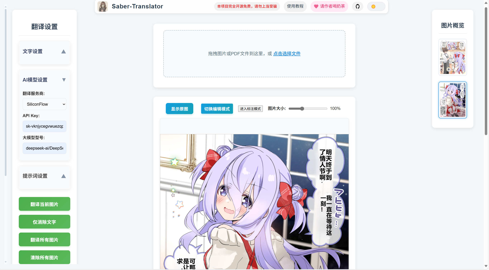
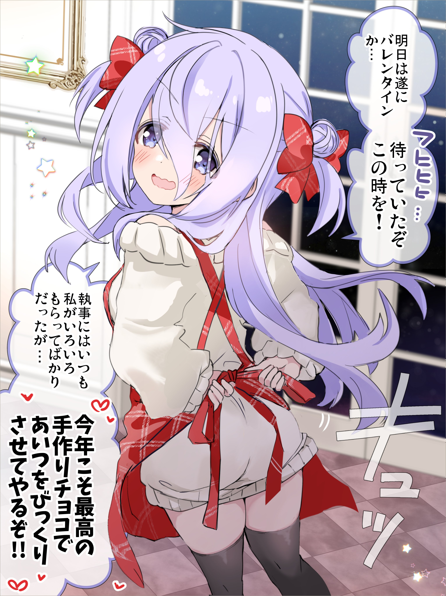
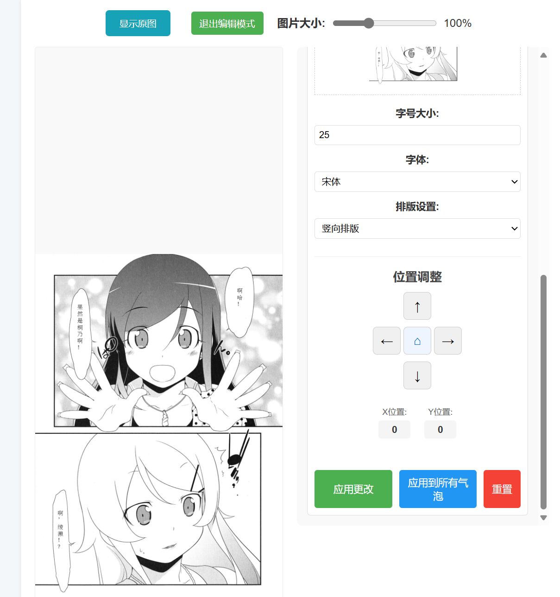
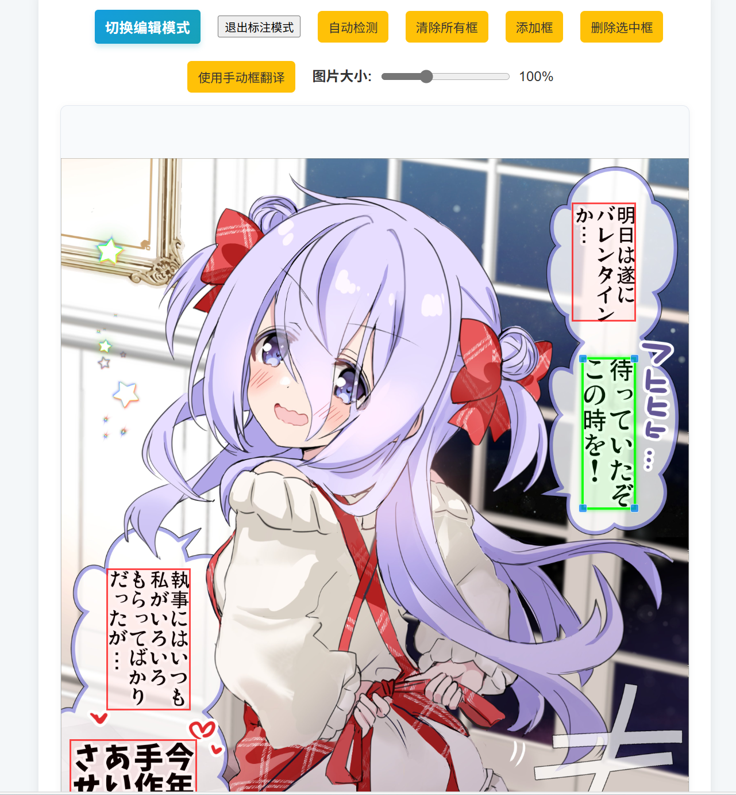
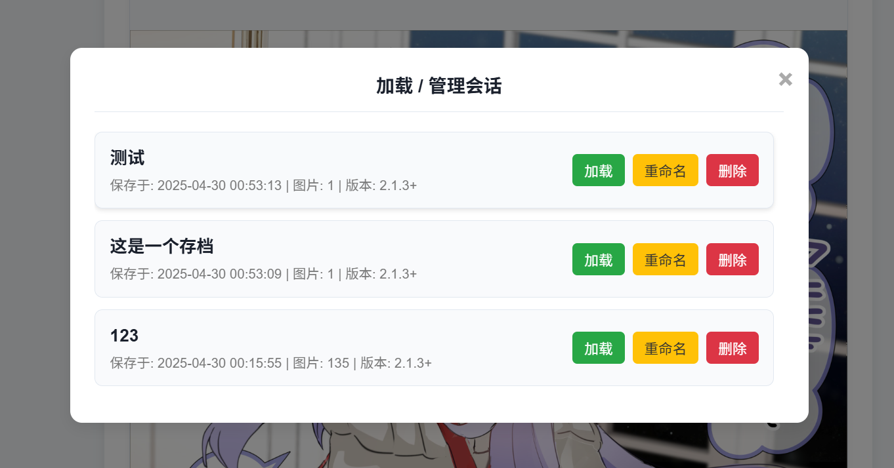
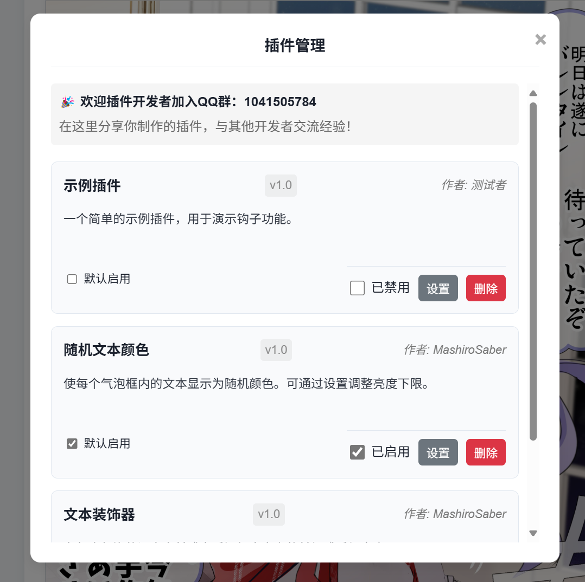
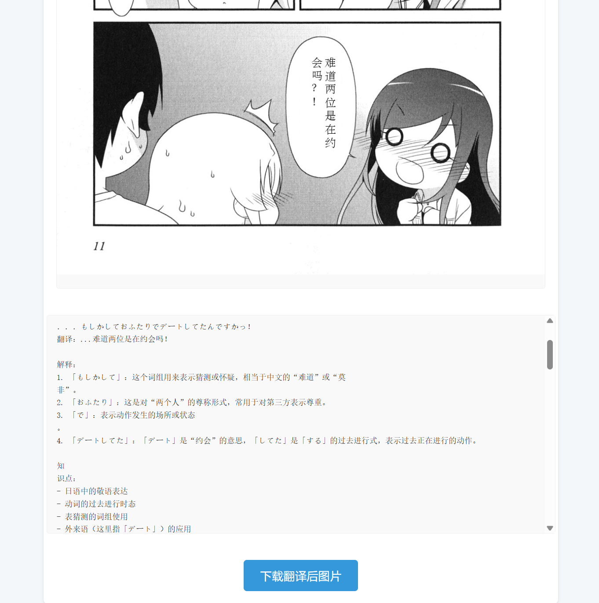

    

<h1 align="center">Saber-Translator</h1>

    ✨ 你的专属 AI 漫画翻译与编辑神器，支持多种模型、手动标注、会话管理和插件扩展！✨

    
    

    <a href="https://github.com/MashiroSaber03/Saber-Translator/issues">问题反馈 / 建议</a>
    |
    <a href="http://www.mashirosaber.top" target="_blank">使用教程</a> <!-- 添加教程链接 -->

---

## ✨ 主要功能

Saber-Translator 提供了一站式的漫画翻译解决方案，主要功能包括：

1.  **漫画图片/PDF 处理**:
    *   支持上传 **图片** (JPG, PNG 等) 和 **PDF** 漫画文件。
    *   支持**拖拽**上传，自动从 PDF 中提取图片。

2.  **精准的文本区域检测**:
    *   **YOLOv5** 模型自动检测漫画对话气泡。
    *   提供**手动标注模式** ，允许用户绘制、拖动、缩放和删除文本框，覆盖或补充自动检测，提高精度。

3.  **多语言 OCR 引擎**:
    *   基于 **[Manga OCR](https://github.com/kha-white/manga-ocr)** 实现高效的**日语**文本识别。
    *   集成 **[Paddle OCR](https://github.com/PaddlePaddle/PaddleOCR)** 支持**英语、韩语、繁体中文、法语、德语**等多种其他语言的文本识别。

4.  **强大的 AI 翻译核心**:
    *   内置支持 **SiliconFlow**, **DeepSeek**, **火山引擎 (Volcano Engine)**, **彩云小译** 等多种云端翻译服务。
    *   支持连接本地部署的 **Ollama** 和 **Sakura** 大语言模型进行翻译，保护隐私并降低成本。
    *   支持 **API Key** 管理和模型选择。

5.  **先进的背景修复/填充**:
    *   提供**纯色填充**选项，速度快。
    *   集成 **MI-GAN (ONNX)** 模型，提供 AI 背景修复（效果一般）。
    *   集成 **LAMA** 模型 (基于 `sd-webui-cleaner`)，提供业界领先的背景修复效果（效果很好，可参考翻译对比图）。
    *   可调节修复强度和边缘融合，优化修复效果。

6.  **高度可定制的文本渲染**:
    *   **字体选择**: 内置多种常用中文字体。
    *   **字号控制**: 支持**手动设置**字号和**自动计算**最佳字号。
    *   **排版方向**: 支持**横向**和**竖向**排版。
    *   **样式微调**: 支持调整文本**颜色**、**旋转角度**和**位置偏移**。

7.  **精细化编辑与预览**:
    *   **实时预览**: 在 Web 界面即时查看翻译和渲染效果。
    *   **编辑模式**: 翻译完成后，可进入编辑模式**独立修改每个气泡**的文本内容、字体、大小、颜色、方向、旋转和位置。
    *   支持将单个气泡的样式**应用到所有气泡**。

8.  **工作流管理**:
    *   **缩略图导航**: 侧边栏展示所有图片缩略图，方便快速切换。
    *   **会话管理**: 支持将当前所有图片、设置、翻译结果、编辑状态等完整**保存/另存为**会话，并可随时**加载、删除、重命名**已保存的会话，方便中断和恢复工作。
    *   **缩略图标记**: 缩略图会显示翻译失败或包含手动标注的状态。

9.  **配置与定制**:
    *   **自定义提示词**: 支持为漫画翻译和文本框解释分别设置、保存和加载不同的提示词。
    *   **模型历史**: 自动记录最近使用的翻译模型，方便快速选择。
    *   **系统工具**: 提供本地 Ollama/Sakura/LAMA 连接测试，以及清理调试文件的功能。
    *   **亮/暗模式**: 支持界面主题切换。

10. **可扩展的插件系统**:
    *   提供插件管理界面，用户可以**查看、启用/禁用、配置、删除**插件。
    *   支持设置插件**默认启用状态**。
    *   允许开发者通过编写插件扩展或修改核心处理流程（详见开发手册）。

11. **外语学习辅助**:
    *   可启用独立的“文本框提示词”，让 AI 在翻译的同时，在文本框区域提供更详细的解释、语法分析或知识点说明。

12. **便捷下载**:
    *   支持下载单张翻译后的 PNG 图片。
    *   支持一键将所有翻译图片打包下载为 **ZIP** 压缩包、**PDF** 文件或 **CBZ** 漫画格式文件。

## ✨ Demo (效果示例)

    
    
_✨ Saber-Translator 翻译界面概览 ✨_

 

**翻译效果对比：**

    <table style="width: 80%; border-collapse: collapse;">
        <tr>
            <th style="width: 50%; border: 1px solid #ddd; padding: 8px; text-align: center;">翻译前</th>
            <th style="width: 50%; border: 1px solid #ddd; padding: 8px; text-align: center;">翻译后</th>
        </tr>
        <tr>
            <td style="border: 1px solid #ddd; padding: 8px; text-align: center;">
                
            </td>
            <td style="border: 1px solid #ddd; padding: 8px; text-align: center;">
                
            </td>
        </tr>
        <tr>
            <td style="border: 1px solid #ddd; padding: 8px; text-align: center;">
                
            </td>
            <td style="border: 1px solid #ddd; padding: 8px; text-align: center;">
                
            </td>
        </tr>
    </table>

 

## ✨ 使用方式

### 快速上手

1.  **下载最新版本**: 前往 [Releases](https://github.com/MashiroSaber03/Saber-Translator/releases) 页面，下载对应你操作系统的最新版本压缩包。
2.  **解压**: 将下载的压缩包解压到你希望存放程序的目录。
3.  **运行程序**: 在解压后的目录中，找到 `Saber-Translator.exe` (Windows) 或对应名称的可执行文件，双击运行。
4.  **开始翻译**: 程序启动后，通常会自动在你的默认浏览器中打开 Saber-Translator 的 Web 界面 (默认地址为 `http://127.0.0.1:5000/`)。如果未自动打开，请手动访问该地址。
5.  **上传与配置**: 通过拖拽或点击选择按钮上传你的漫画图片或 PDF 文件。在左侧边栏根据需要调整翻译语言、字体、排版、修复方式、翻译模型和 API Key 等设置。
6.  **翻译**: 点击“翻译当前图片”或“翻译所有图片”按钮开始处理。
7.  **查看与下载**: 在主界面查看翻译结果，使用右侧缩略图切换图片，调整显示大小，并通过下载按钮获取翻译后的文件。
8.  **详细教程**: 参考 [使用教程](http://www.mashirosaber.top) 获取更详细的步骤和技巧。

### 编辑模式

    
    
_✨ Saber-Translator 编辑模式示例 ✨_

翻译完成后，如果对某个气泡的翻译文本或样式不满意，可以点击图片上方的“**切换编辑模式**”按钮进入编辑模式。

*   **选择气泡**: 点击右侧的气泡列表或直接点击图片上的高亮框来选择要编辑的气泡。
*   **修改文本**: 在文本编辑框中直接修改翻译文本。
*   **调整样式**: 修改该气泡的字体、字号（可设为自动）、颜色、排版方向、旋转角度。
*   **调整位置**: 使用方向键或输入坐标微调文本在气泡内的位置。
*   **实时预览**: 更改会自动实时预览在主图上。
*   **应用更改**: 点击“应用更改”确认修改。
*   **应用到全部**: 可以将当前选中气泡的样式（字体、大小、颜色等，不含文本和位置）快速应用到所有其他气泡。
*   **重置**: 恢复当前选中气泡到进入编辑模式时的初始状态。
*   **退出**: 再次点击“退出编辑模式”按钮保存更改并退出。

### 手动标注模式

    
    
_✨ Saber-Translator 标注模式示例 ✨_

如果自动气泡检测效果不佳（漏检、错检、范围不准），可以点击图片上方的“**进入标注模式**”按钮。

*   **绘制新框**: 在图片上按住鼠标左键拖拽绘制矩形框。
*   **选择框**: 单击已绘制的框进行选中。
*   **移动框**: 按住选中的框内部（非边缘手柄）拖动。
*   **调整大小**: 拖动选中框边缘的控制点（小方块）调整大小。
*   **删除框**: 选中框后，点击“删除选中框”按钮；或点击“清除所有框”。
*   **自动检测辅助**: 可以点击“自动检测”按钮，程序会尝试检测框并添加到当前手动框列表，你可以在此基础上修改。
*   **使用标注框翻译**: 编辑完成后，点击“**使用手动框翻译**”按钮，程序将**仅使用你手动绘制/编辑的框**进行后续的 OCR 和翻译流程。翻译完成后会自动退出标注模式。
*   **退出**: 如果不想使用手动框翻译，可以点击“退出标注模式”，会提示你是否保存当前的手动框（保存后下次进入标注模式会加载），或者直接放弃更改退出。

### 会话管理

    
    
_✨ Saber-Translator 历史记录示例 ✨_

当你处理多页漫画或需要中断工作时，可以使用会话管理功能：

*   **保存**: 点击侧边栏的“保存”按钮，如果当前是已加载或已保存过的会话，会直接覆盖保存当前所有进度和设置；如果是新任务，则会提示输入会话名称（类似另存为）。
*   **另存为**: 点击“另存为...”按钮，总是会提示输入一个新的会话名称来保存当前状态。
*   **加载/管理**: 点击“加载/管理会话”按钮，会弹出模态窗口：
    *   显示所有已保存的会话列表（包含名称、保存时间、图片数量等信息）。
    *   点击“加载”按钮恢复选定会话的所有状态。
    *   点击“重命名”按钮修改选定会话的名称。
    *   点击“删除”按钮永久删除选定会话。

### 插件管理

    
    
_✨ Saber-Translator 插件系统示例 ✨_

点击侧边栏的“插件管理”按钮，可以管理已安装的插件：

*   **查看**: 列出所有检测到的插件及其版本、作者、描述信息。
*   **启用/禁用 (实时)**: 通过开关实时控制插件是否在当前运行的应用中生效（注意：此状态非持久化，重启后会恢复默认）。
*   **设置默认启用**: 通过复选框设置该插件在下次启动应用时是否默认启用（此状态会保存）。
*   **配置**: 如果插件提供了可配置项，点击“设置”按钮会弹出配置窗口。
*   **删除**: 永久删除插件文件（需要重启应用完全生效）。

### 外语学习

通过启用左侧边栏的“**启用独立文本框提示词**”并配置相应的提示词（例如，要求 AI 解释翻译和知识点），可以在翻译漫画的同时，在图片下方的文本框区域看到 AI 对翻译内容更详细的解读。**（注意：启用此功能会显著增加翻译所需时间和潜在的 API 成本）**

    
    
_✨ Saber-Translator 外语学习示例 ✨_

## 🚀 路线图 (未来计划)

我们计划在未来的版本中加入更多令人兴奋的功能：

*   **更多 AI 服务支持**: 集成更多云端翻译服务
*   **更多目标语言**: 增加对更多目标语言的翻译支持。
*   **智能排版 V2**: 进一步优化自动字号和排版逻辑，考虑气泡形状、文字密度等因素。
*   **上下文关联翻译**: 尝试利用相邻页面的内容或注释信息提高翻译连贯性和准确性。
*   **术语库/词典**: 允许用户导入自定义术语库，保证特定词汇翻译的一致性。
*   **性能优化**: 持续优化图像处理和模型推理速度。
*   **UI/UX 改进**: 进一步提升用户界面的易用性和美观度。

## 💖 赞助 (Sponsorship)

感谢你对 Saber-Translator 项目的关注和支持！ 如果你觉得本项目对你有所帮助，并且愿意支持我继续开发和维护，可以通过以下方式进行赞助。 你的支持是我前进的最大动力！

**赞助方式：**

你可以通过微信或支付宝扫描下方二维码进行赞赏。 你的每一份支持都将用于功能开发和持续优化。

    <table>
        <tr>
            <td style="text-align: center; padding: 0 20px;">
                
                
微信赞赏码

            </td>
            <td style="text-align: center; padding: 0 20px;">
                
                
支付宝赞赏码

            </td>
        </tr>
    </table>

    再次感谢你的慷慨支持！

## ❤️ 贡献

欢迎任何形式的贡献，包括但不限于：

*   **代码贡献 (Pull Requests)**: 修复 Bug, 增加新功能, 优化代码性能, 开发新插件等。
*   **问题反馈 (Issues)**: 报告 Bug, 提出功能建议, 分享使用遇到的问题等。
*   **文档完善**: 改进 README 文档, 编写更详细的使用教程或开发文档。
*   **翻译贡献**: 将 README 文档或界面翻译成其他语言。
*   **推广宣传**: 向更多人介绍和推荐 Saber-Translator。

如果你希望为 Saber-Translator 做出贡献，请查阅**开发手册 (`docs/开发手册.md`)** 并随时提交 Issues 或 Pull Requests！

## 🌟 支持

*   **Star 项目**: 如果你觉得 Saber-Translator 对你有帮助，请给项目点个 Star ⭐，这将是对我最大的鼓励和支持！
*   **分享推荐**: 将 Saber-Translator 分享给你的朋友或有需要的人。

## 🛠️ 技术栈 (Tech Stack)

*   **后端:** Python 3.10+, Flask, PyTorch, ONNX Runtime, PaddlePaddle-OCR, MangaOCR, Pillow, OpenCV, NumPy, `openai`, `litelama`, PyPDF2, Requests, PyYAML, Colorama。
*   **前端:** HTML5, CSS3, JavaScript (ES6 Modules), jQuery, JSZip, jsPDF。
*   **打包:** PyInstaller。

## ⚠️ 免责声明 (Disclaimer)

1.  Saber-Translator 主要用于学习和技术交流，请在遵守当地法律法规和版权政策的前提下使用。**严禁用于非法目的或商业用途。**
2.  本项目依赖第三方 AI 服务 (如 OCR, 翻译 API, 背景修复模型)，其服务质量、可用性和成本由相应服务商决定。请用户自行了解并遵守相关服务商的使用协议和条款。
3.  翻译结果由 AI 模型生成，可能存在错误或不准确之处。本项目不对翻译结果的准确性、完整性或及时性做任何保证。
4.  用户应对使用本工具处理的任何内容负责，包括确保拥有处理这些内容的合法权利。
5.  对于因使用或无法使用本项目而造成的任何直接或间接损失，项目作者不承担任何责任。

---

    感谢使用 Saber-Translator！希望它能帮助你更轻松地跨越语言障碍，享受漫画的乐趣！

