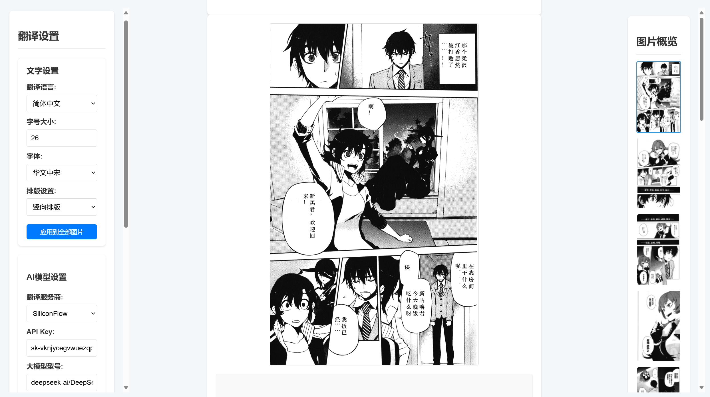
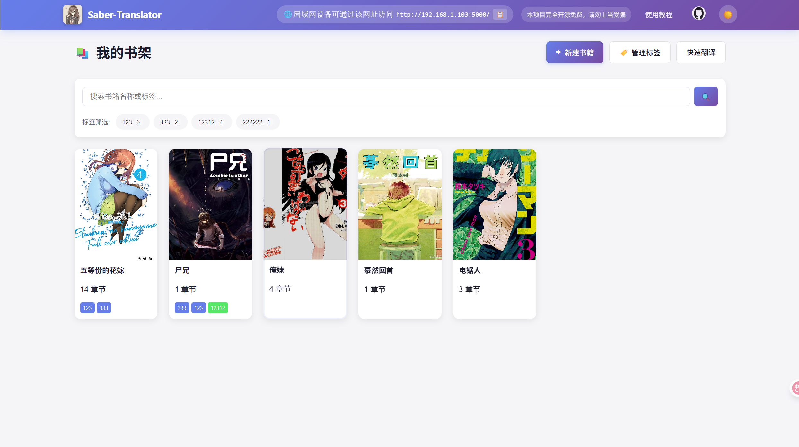
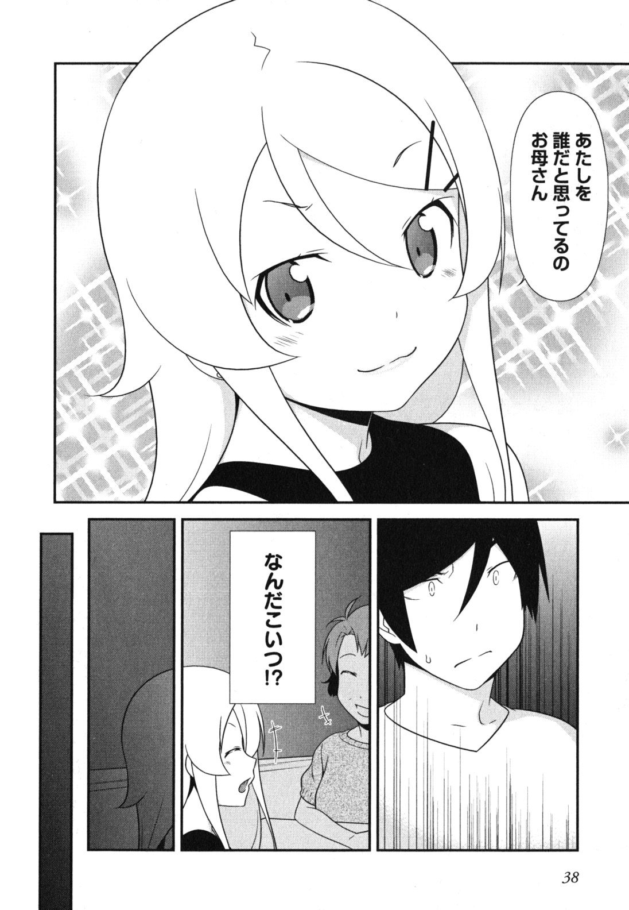
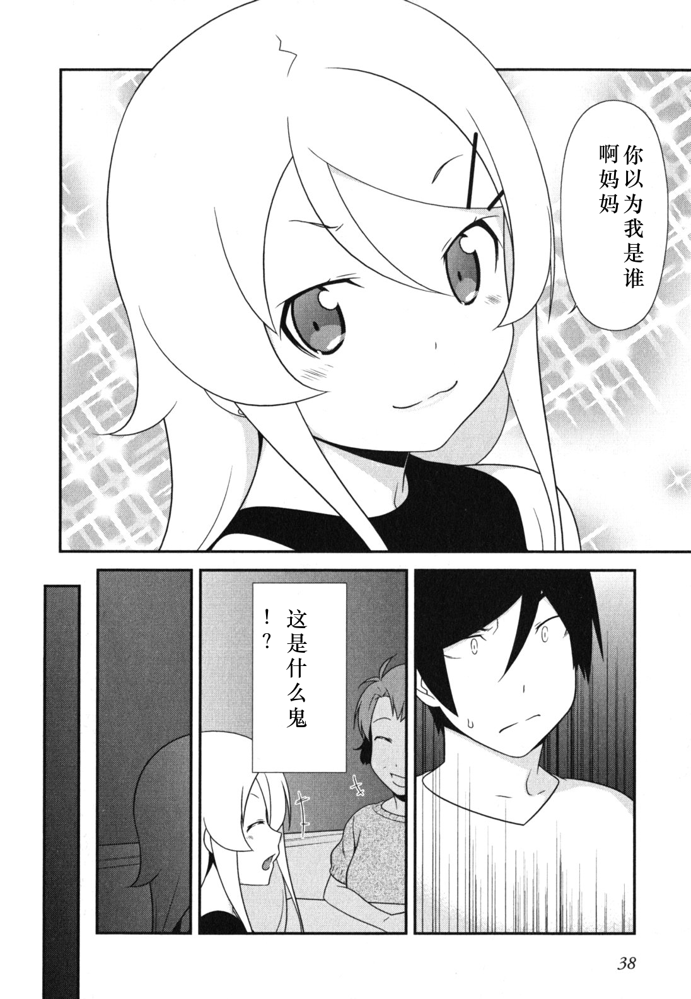
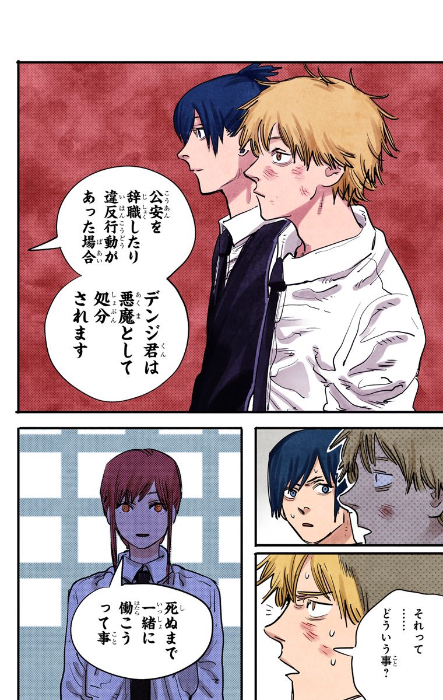
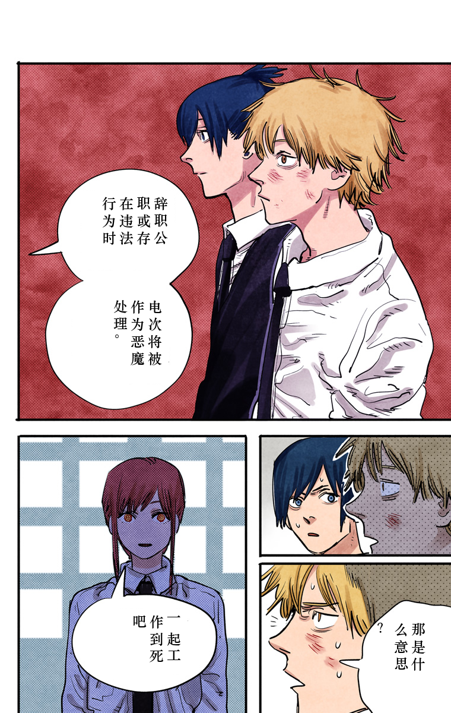
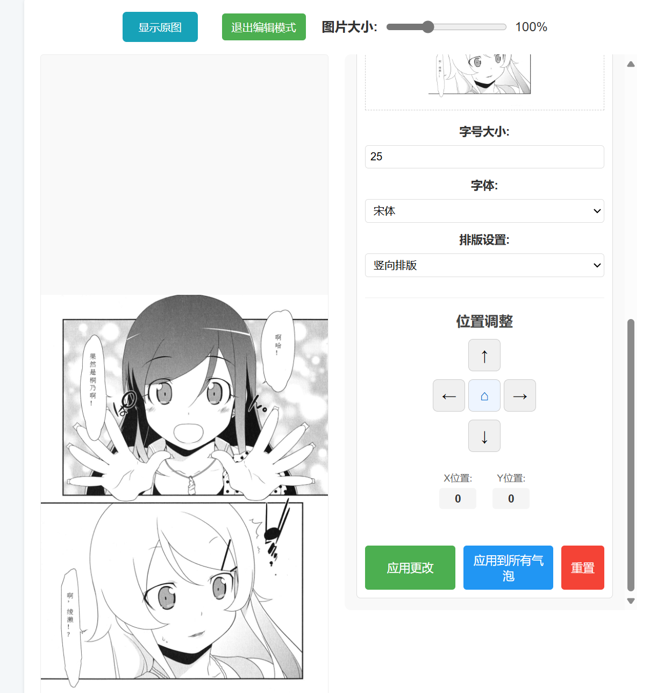

<p align="center">
    
</p>

<h1 align="center">Saber-Translator</h1>

<p align="center">
    ✨ 你的专属 AI 漫画翻译与管理神器，集翻译、编辑、书架管理、智能分析于一体！✨
</p>

<p align="center">
    <a href="https://github.com/MashiroSaber03/Saber-Translator/stargazers">
        
    </a>
    <a href="LICENSE">
        
    </a>
</p>

<div align="center">
    <a href="https://github.com/MashiroSaber03/Saber-Translator/issues">问题反馈 / 建议</a>
    |
    <a href="http://www.mashirosaber.top" target="_blank">使用教程</a>
    |
    <a href="https://saber.mashirosaber.work/" target="_blank">在线体验站</a>
</div>

---

## ✨ 主要功能

Saber-Translator 提供了一站式的漫画翻译与管理解决方案，集成了从内容导入、翻译编辑、书架管理到智能分析的完整工作流。

### 🔄 核心翻译流程

```
📥 导入漫画 → 🔍 文本检测 → 📝 OCR识别 → 🌐 AI翻译 → 🎨 图像修复 → ✏️ 文字渲染 → 📤 导出
```

<table>
<tr>
<th>模块</th>
<th>功能</th>
<th>支持选项</th>
</tr>
<tr>
<td><b>📥 文件导入</b></td>
<td>支持多种格式上传</td>
<td>图片及图片文件夹 / PDF / ZIP、CBZ / MOBI、AZW、AZW3</td>
</tr>
<tr>
<td><b>🔍 文本检测</b></td>
<td>自动识别漫画气泡/文本区域</td>
<td>Default (DBNet) / CTD / YSGYolo / SaberYOLO / 手动标注</td>
</tr>
<tr>
<td><b>📝 OCR 识别</b></td>
<td>多引擎多语言文字识别</td>
<td>MangaOCR (日语) / 48px OCR / PP-OCRv6 Medium / PaddleOCR-VL 1.6 / 百度OCR / AI视觉OCR；支持 MangaOCR 与 48px 混合识别</td>
</tr>
<tr>
<td><b>🌐 AI 翻译</b></td>
<td>多服务商翻译引擎</td>
<td>SiliconFlow / DeepSeek / Gemini / 火山引擎 / Ollama / Sakura 等</td>
</tr>
<tr>
<td><b>🎨 图像修复</b></td>
<td>消除原文文字</td>
<td>lama漫画(推荐，默认) / 纯色填充 / lama通用 / lama速度</td>
</tr>
<tr>
<td><b>✏️ 文字渲染</b></td>
<td>将译文嵌入图片</td>
<td>自定义字体/字号/颜色/描边/方向/位置</td>
</tr>
<tr>
<td><b>📤 导出下载</b></td>
<td>多格式导出</td>
<td>PNG / ZIP / PDF / CBZ</td>
</tr>
</table>

> 💡 **高质量翻译模式 (Beta)**: 使用多模态模型进行多图上下文感知翻译，通过结合多张图片信息提升翻译连贯性和准确性。

也可选择 **AI 校对** 或 **仅消字**，按当前图片或批量范围处理。书籍可独立设置术语表和禁翻表。

### 🌸 网页漫画翻译扩展

商店安装：[Edge 浏览器插件](https://microsoftedge.microsoft.com/addons/detail/saber-%E6%BC%AB%E7%94%BB%E7%BF%BB%E8%AF%91/obhjpabpgnenlgcakbiaoekdjfjfcmbm) · [Chrome 浏览器插件](https://chromewebstore.google.com/detail/saber-%E6%BC%AB%E7%94%BB%E7%BF%BB%E8%AF%91/eocjphcpiagifkhfigoekaemdbbfdcjl)

桌面版 Chrome/Edge 扩展支持站点识别、DOM Agent 和手选同类图片，确认后调用本机 Saber 翻译并在网页原位置显示译图。悬浮窗内可修改配置、操作任务，也可选择“仅导入书架”或“下载原图”。连接接口默认关闭，需在桌面控制中心启用并配对。

刷新、关闭标签页或离开漫画页面会清理临时翻译任务和数据；需要保留时请先导入书架。安装、配置范围与商店更新说明见 [浏览器扩展文档](browser-extension/README.md)。

### 🖥️ 桌面控制中心与任务中心

桌面控制中心提供后端启停、运行日志、基础设置和常驻模型管理。GUI、Web 与浏览器扩展共用任务中心，可查看进度、暂停、恢复、取消或重试任务。普通翻译和分析任务关闭 Web 页面后仍继续执行，后端需保持运行。

### 🧩 插件与插件助手

在“设置 → 插件管理”中安装、配置和启用插件，也可让插件助手根据自然语言需求创建或修改插件。助手会先判断需求是否受现有接口支持，执行过程可在任务中心查看。插件开发与包格式见 [插件文档](plugins/README.md)。

### 🛠️ 编辑与管理功能

| 功能 | 说明 |
|------|------|
| **编辑模式** | 翻译后精细调整：修改文本/字体/颜色/位置，内置标注功能可手动绘制/调整文本框 |
| **后端持久化** | 图片导入后立即进入后端书籍/章节，任务和编辑结果持续落库 |
| **文本导入导出** | Saber JSON 导入导出、LabelPlus 文本导出，便于协作校对 |

### 📚 书架系统

<table>
<tr>
<td width="33%" align="center"><b>📖 书籍管理</b><br/>创建/编辑/搜索/批量操作</td>
<td width="33%" align="center"><b>📑 章节管理</b><br/>创建/排序/自动统计</td>
<td width="33%" align="center"><b>🏷️ 标签系统</b><br/>分类/筛选/自定义颜色</td>
</tr>
</table>

### 📖 漫画阅读器

支持单页、双页、纵向连续和横向连续阅读，可调整左右阅读方向、双页偏移与图片适配方式；支持原图/译图切换、章节导航和键盘翻页。

### 🧠 Manga Insight 智能分析

> 🔮 基于 AI 的漫画内容深度理解引擎

| 功能 | 说明 |
|------|------|
| **内容分析** | 角色识别、剧情梳理、对话提取 |
| **任务管理** | 全书/增量/章节分析，支持暂停恢复 |
| **智能问答** | 基于分析结果对漫画具体情节进行智能问答 |
| **向量检索** | 语义搜索快速定位内容 |

还提供续写与角色工坊，可基于漫画分析创建和编辑角色文档、预览角色聊天，以及导入导出角色卡。

## ✨ Demo (效果示例)

<div align='center'>
    
    <p>_✨ Saber-Translator 翻译界面概览 ✨_</p>
</div>
<div align='center'>
    
    <p>_📚 Saber-Translator 书架管理界面概览 📚_</p>
</div>

**翻译效果对比：**

<div align='center'>
    <table style="width: 80%; border-collapse: collapse;">
        <tr>
            <th style="width: 50%; border: 1px solid #ddd; padding: 8px; text-align: center;">翻译前</th>
            <th style="width: 50%; border: 1px solid #ddd; padding: 8px; text-align: center;">翻译后</th>
        </tr>
        <tr>
            <td style="border: 1px solid #ddd; padding: 8px; text-align: center;">
                
            </td>
            <td style="border: 1px solid #ddd; padding: 8px; text-align: center;">
                
            </td>
        </tr>
        <tr>
            <td style="border: 1px solid #ddd; padding: 8px; text-align: center;">
                
            </td>
            <td style="border: 1px solid #ddd; padding: 8px; text-align: center;">
                
            </td>
        </tr>
    </table>
</div>
<br/>

## ✨ 使用方式

### 快速上手

1.  **下载最新版本**: 前往 [Releases](https://github.com/MashiroSaber03/Saber-Translator/releases) 页面，或加入 QQ 群下载 Windows CPU/GPU 包。没有可用 NVIDIA 显卡时选择 CPU 版；GPU 版使用 CUDA 13.0，需要兼容的 NVIDIA 显卡和驱动。其他系统暂未提供自动构建的安装包。
    - 1群: 1041505784
    - 2群: 1047553423
    - 3群: 536706173
    - 4群: 1074032394
2.  **解压**: 下载同版本、同类型的全部 `.7z.*` 分卷，放在同一目录，用 7-Zip 或 Bandizip 从 `.7z.001` 解压。保留完整程序目录，不要单独移动 EXE。CPU/GPU 包已包含模型。
3.  **运行程序**: 在 Windows 解压目录中找到 `Saber-Translator.exe`，双击运行。
4.  **启动后端**: 桌面控制中心会立即打开，桌宠同时出现；点击“启动后端”后，控制中心会启动相互隔离的 API 与 Worker，并按设置打开 Web 界面（默认 `http://127.0.0.1:5000/`）。
5.  **导入与配置**: 从书架创建书籍和章节，或进入“快速翻译”导入漫画。在顶部“设置”中配置 OCR、翻译服务商、模型与 API Key。
6.  **翻译**: 在左侧选择“翻译当前图片”“翻译所有图片”等操作模式，再点击启动按钮。可在任务中心查看、暂停、恢复、取消或重试。
7.  **查看与下载**: 在主界面查看翻译结果，使用右侧缩略图切换图片，调整显示大小，并通过下载按钮获取翻译后的文件。
8.  **详细教程**: 参考 [使用教程](http://www.mashirosaber.top) 获取更详细的步骤和技巧。

源码 main/dev 保留“从网页导入”入口，release 发行包已隐藏此入口；浏览器漫画翻译扩展仍可使用。

### 数据保存与更新

翻译页的编辑和设置修改会自动保存到后端；快速翻译内容也会保留，直到主动重置工作区，可通过“保存到书架”长期整理。角色工坊的文档编辑仍需点击“保存”。

- **数据位置**：打包版默认在 EXE 同级的 `data-v2`，源码版默认在项目内 `data-v2`；可用 `--data-dir` 指定其他目录。
- **更新程序**：保留整个数据目录；解压到新位置时，将原程序目录的 `data-v2` 一并迁入。备份或搬迁前先退出桌面和后端。
- **旧版兼容**：重构前无版本标记的数据目录不支持直接升级，请保留原目录并为新版选择新目录。已有版本的数据由程序检查是否支持升级。应用版本与存储版本独立，详细说明见 [存储与升级文档](docs/storage-migrations.md)。

### 编辑模式

<div align='center'>
    
    <p>_✨ Saber-Translator 编辑模式示例 ✨_</p>
</div>

翻译完成后，点击图片上方的“**切换编辑模式**”按钮进入编辑模式，可进行以下操作：

**气泡编辑**：
*   选择气泡后可修改文本、字体、字号、颜色、填充色、排版方向、旋转角度、位置偏移
*   所有更改实时预览，支持一键应用样式到全部气泡
*   修改文字颜色和描边颜色会实时应用，无需额外点击确认；描边宽度支持小数调整

**标注功能**：

*   绘制/移动/调整/删除文本框，解决自动检测不准确的问题
*   支持自动检测辅助、批量检测所有图片
*   可使用手动标注框进行翻译

### 高质量翻译模式

在“设置 → 高质量翻译”中配置服务，在左侧操作模式中选择“高质量翻译”启动。该模式通过多模态模型结合多张图片的上下文信息来提升翻译的连贯性和准确性。

*   **配置**: 用户可以设置AI服务商、API Key、模型、批处理大小（一次发送给AI的图片数量）、会话重置频率（多少批次后清空AI的短期记忆）、RPM限制、是否强制AI返回JSON格式以及自定义的上下文翻译提示词。
*   **流程**:
    1.  程序会先对图片执行文本检测、OCR 与颜色提取。
    2.  然后把每张图的原文文本组织成 JSON，同时保留原图上下文。
    3.  系统会根据“每批次图片数”把多张图片与对应文本分批发送给多模态模型。
    4.  AI返回批量翻译结果后，程序会将译文回填到对应图片与气泡。
    5.  最后再执行背景修复与重新渲染，生成最终译图。
*   **适用场景**: 当漫画对话连贯性要求较高，且单个气泡的独立翻译效果不佳时，可以尝试此模式。
*   **注意**: 此模式会消耗更多的处理时间和API配额，因为它需要对所有图片进行多次处理和AI调用。请确保你的API Key有足够的额度，并根据服务商的限制合理配置RPM。

### AI 校对与仅消字

*   **AI 校对**: 在“设置 → AI 校对”中配置服务，再从左侧操作模式启动，对已有译文进行校对。
*   **仅消字**: 选择“仅消除当前文字”或“消除所有图片文字”，生成不含译文的背景图，便于后续手工排版。
*   **术语与禁翻**: 在左侧书籍设置中管理当前漫画的术语表和禁翻表，用于统一专有名词或保留指定内容，不影响其他书籍。

### 书架系统

书架系统提供了完整的漫画管理功能，让你的翻译项目井井有条：

*   **访问书架**: 点击导航栏的"书架"按钮进入书架管理界面.
*   **创建书籍**: 点击"新建书籍"，输入书名，可选择上传封面图片和添加标签.
*   **管理章节**: 进入书籍后，可以创建、编辑、删除和排序章节.
*   **翻译章节**: 点击章节进入翻译工作区；导入、翻译、分析和编辑结果都由后端强制持久化，不依赖浏览器自动保存。
*   **阅读模式**: 完成翻译后，可以进入阅读器查看翻译成果.
*   **标签管理**: 在书架页面可以创建和管理标签，为书籍分类整理.

### 漫画阅读器

从书籍章节进入阅读器，在阅读设置中选择单页、双页、纵向连续或横向连续模式。

*   **翻页与方向**: 单页、双页模式可点击左右翻页标识或使用方向键；按漫画排版选择从左到右或从右到左阅读。
*   **双页配对**: 两页配对不合适时，可使用“双页错开一页”调整。
*   **显示与导航**: 可调整图片适配方式、切换原图/译图，按页码跳转或切换章节；图片按可见范围加载，减少长章节的内存占用。

### 浏览器扩展的配置与任务

完成前述配对后，悬浮窗内的“翻译”“配置”“任务”页签即可完成主要操作，无需反复跳转 Web 页面。

*   **选择图片**: 三种识别方式分别执行各自的流程；“点选同类图片”需要先手动点击一张漫画图。已有适配规则通过“使用上次规则”单独使用。
*   **修改配置**: OCR、检测和翻译服务复用翻译器配置；插件文本样式独立保存，可在悬浮窗或 Web“设置 → 浏览器插件”中修改。新配置在重新开始翻译时生效。
*   **保留或下载**: 选图后可直接“仅导入书架”或“下载原图（ZIP）”，两者只处理当前勾选图片，不启动翻译。收起悬浮窗不会取消任务，退出漫画页面则会清理临时数据。

### 使用插件助手

在插件管理中描述需求，确认方案和目标插件后开始执行；助手会校验生成结果，通过后安装插件。执行进度和失败重试使用同一个任务中心。

已完成的会话用于查看过程和结果，需要继续调整时使用“修改插件”创建新的修改会话。卸载后插件不再用于新任务，历史任务仍需要的版本会保留供恢复和重试使用。

### Manga Insight 智能分析

Manga Insight 是一个基于 AI 的漫画内容深度理解引擎，它能够分析漫画原图、提取剧情信息、构建知识库，并支持基于分析结果的智能问答。

#### 1. 分析任务管理

*   **多种分析模式**:
    *   **全书分析**: 从头到尾分析整本漫画，适合首次分析。
    *   **增量分析**: 仅分析新增的章节/页面，适合连载漫画的更新。
    *   **章节分析**: 分析指定章节，适合部分内容重新分析。
    *   **批量页面分析**: 分析指定的多个页面，适合精细化调整。
*   **任务控制**: 分析过程中支持**暂停**、**恢复**、**取消**操作，任务进度实时可见。
*   **任务历史**: 查看历史分析任务的状态和结果。

#### 2. 可配置层级分析架构

采用 2～4 层预设或自定义层级，从页面批次逐步汇总到全书级：

```
📄 批量分析 (每5页) → 📑 段落总结 → 📖 章节总结 → 📚 全书概述
```

*   **架构预设**:
    *   **简洁模式**: 批量分析 → 全书总结（适合100页以内的短篇）
    *   **标准模式**: 批量分析 → 段落总结 → 全书总结（通用）
    *   **章节模式**: 批量分析 → 章节总结 → 全书总结（有明确章节的漫画）
    *   **完整模式**: 批量分析 → 小总结 → 章节总结 → 全书总结（长篇连载）
*   **上下文关联**: 批量分析时自动引用前N批的分析结果作为上下文，保持剧情理解的连贯性。

#### 3. 智能问答 (RAG)

基于检索增强生成 (RAG) 技术，支持对漫画内容进行智能问答：

*   **两种问答模式**:
    *   **精确模式**: 使用向量检索定位相关页面，适合具体问题（如"第15页发生了什么"）
    *   **全局模式**: 使用全书摘要作为上下文，适合总结性问题（如"故事的主题是什么"）
*   **混合检索**: 结合向量相似度（80%）和关键词匹配（20%）的双路检索策略。
*   **Reranker 重排序**: 支持 Jina、Cohere、SiliconFlow、BGE 等重排序模型，提升检索精度。
*   **推理检索**: 启用后把复合问题拆成多个查询变体，统一检索并合并去重后回答。
*   **父子块检索**: 返回匹配内容所属批次的完整上下文，便于理解前后剧情。
*   **引用定位**: 回答时自动标注引用的页码，支持点击跳转到对应页面。

#### 4. 多模板概述生成

支持多种风格的概述生成，满足不同场景需求：

| 模板 | 说明 |
|------|------|
| 📖 故事概要 | 完整的剧情回顾，包含所有剧透 |
| 🎁 无剧透简介 | 不含关键剧透的故事简介，适合推荐给朋友 |
| ⏪ 前情回顾 | 精炼版剧情回顾，适合接续阅读前快速回忆 |
| 👥 角色图鉴 | 详细的人物介绍和关系梳理 |
| 🌍 世界观设定 | 故事的世界观、势力、规则等背景设定 |
| ✨ 名场面盘点 | 精彩场景和高光时刻回顾，附页码定位 |
| 📝 阅读笔记 | 结构化的阅读笔记，包含要点和思考 |

#### 5. 剧情时间线

*   **增强模式**: 使用 LLM 智能整合事件，生成结构化的剧情弧和角色行动线。
*   **简单模式**: 直接提取关键事件列表，按页面顺序排列。
*   **可视化展示**: 时间线数据可在界面中直观查看。

#### 6. 向量检索系统

*   **双层索引**: 页面级向量（page_summary）+ 事件级向量（key_events）
*   **语义搜索**: 输入关键词或描述，快速定位相关内容。
*   **重建向量**: 支持在更换 Embedding 模型后重新构建向量索引。

#### 7. 续写与角色工坊

完成漫画分析后，可在分析页进入“续写”或“角色工坊”，继续使用当前书籍的分析上下文。

*   **续写**: 基于已有剧情和角色信息继续创作故事，相关生成任务可在任务中心查看。
*   **角色工坊**: 创建、编辑角色文档，管理角色设定与世界书，预览角色聊天，并导入导出角色卡。文档编辑完成后需点击“保存”。

## 🏗️ 当前运行架构

Saber-Translator 采用后端优先架构。原生控制中心只负责进程、任务和日志控制，完整工作区仍由 Web 前端承载：

```text
桌面控制中心 / 桌宠（启停、任务中心、日志、基础设置）
  ├─ 进程控制 → Launcher（单实例、进程监护、崩溃恢复裁决）
  │                ├─ API 进程
  │                └─ Worker 进程
  └─ 任务状态 → REST / SSE
浏览器（交互、显示、缩略图懒加载）
  ↕ REST / SSE / 媒体流
API 进程（校验、查询、短操作、静态站点）
  ↕ SQLite + 不可变资产
Worker 进程（翻译、分析、导入、导出、插件、模型）
```

- 桌宠只根据顶层任务类型切换状态；翻译和分析内部的原子步骤不会触发动作切换。
- 浏览器只负责交互与展示，不执行跨页翻译、分析、PDF 解析或批量导出。
- Worker 从持久队列领取任务，浏览器关闭后任务继续；检查点支持暂停、恢复和失败重试。
- SQLite 保存业务元数据、版本、任务、事件和发布指针；原图、缩略图、译图与导出文件作为不可变资产保存。
- 列表只加载缩略图并懒加载；当前编辑图和阅读器可见窗口才请求原图。
- 快速翻译是后端中的固定工作区；“新建快速翻译”会明确重置该工作区。
- 插件使用不可变 v3 revision 快照，由 Worker 执行；插件运行时不是 Python 安全沙箱，请仅安装可信插件。

### 源码开发

以下以 Windows、Python 3.12 为例，在项目根目录执行。CPU 与 GPU 依赖二选一。

```powershell
# 创建环境
py -3.12 -m venv venv
.\venv\Scripts\python.exe -m pip install --upgrade pip

# CPU 版
.\venv\Scripts\python.exe -m pip install "torch==2.11.0+cpu" "torchvision==0.26.0+cpu" --index-url https://download.pytorch.org/whl/cpu
.\venv\Scripts\python.exe -m pip install -r requirements-cpu.txt
```

GPU 版将上面的 CPU 安装命令替换为：

```powershell
.\venv\Scripts\python.exe -m pip install "torch==2.11.0+cu130" "torchvision==0.26.0+cu130" --index-url https://download.pytorch.org/whl/cu130
.\venv\Scripts\python.exe -m pip install -r requirements-gpu.txt
.\venv\Scripts\python.exe -m pip install --force-reinstall --no-deps "onnxruntime-gpu>=1.27,<2"
```

从 Releases 下载完整模型包并解压到项目根目录，得到 `models/`（包含检测、OCR 和 LaMA 等模型），然后校验并启动：

```powershell
.\venv\Scripts\python.exe .github/scripts/check_models.py models
# 桌面控制中心（项目根目录，默认入口）
.\venv\Scripts\python.exe saber_v2.py

# 需要纯终端启动时
.\venv\Scripts\python.exe saber_v2.py --role launcher
```

需要修改前端时，另开终端，使用 Node.js 22.12+：

```powershell
cd vue-frontend
npm ci
npm run dev
```

生产前端由 `npm run build:check` 输出到 `src/backend_v2/static/vue`，PyInstaller 使用 `app.spec` 打包统一桌面入口；API 与 Worker 仍由同一可执行文件以独立角色启动。

开发参考：[前端说明](vue-frontend/README.md) · [HTTP 契约](openapi/v2.yaml) · [插件开发](plugins/README.md) · [存储升级](docs/storage-migrations.md)。

## 🚀 路线图 (未来计划)

我们计划在未来的版本中加入更多令人兴奋的功能：

*   **更多 AI 服务支持**: 集成更多云端翻译和OCR服务。
*   **更多目标语言**: 增加对更多目标语言的翻译支持。
*   **术语库增强**: 持续改善现有术语表、不翻译表与批量导入体验。
*   **性能优化**: 持续优化图像处理、模型推理速度和前端交互的流畅性。
*   **UI/UX 改进**: 进一步提升用户界面的易用性和美观度，例如提供更直观的字体预览、颜色选择器等。
*   **国际化 (i18n)**: 支持界面语言切换。
*   **Docker 支持**: 提供 Docker 镜像，简化部署和环境配置。
*   **Manga Insight 增强**: 进一步完善智能分析功能，增加更多角色识别和剧情分析能力。

## 💖 赞助 (Sponsorship)

感谢你对 Saber-Translator 项目的关注和支持！ 如果你觉得本项目对你有所帮助，并且愿意支持我继续开发和维护，可以通过以下方式进行赞助。 你的支持是我前进的最大动力！

**赞助方式：**

你可以通过微信或支付宝扫描下方二维码进行赞赏。 你的每一份支持都将用于功能开发和持续优化。

<div align="center">
    <table>
        <tr>
            <td style="text-align: center; padding: 0 20px;">
                
                <p>微信赞赏码</p>
            </td>
            <td style="text-align: center; padding: 0 20px;">
                
                <p>支付宝赞赏码</p>
            </td>
        </tr>
    </table>
</div>

<p align="center">
    再次感谢你的慷慨支持！
</p>

## ❤️ 贡献

欢迎任何形式的贡献，包括但不限于：

*   **代码贡献 (Pull Requests)**: 修复 Bug, 增加新功能, 优化代码性能, 开发新插件等。
*   **问题反馈 (Issues)**: 报告 Bug, 提出功能建议, 分享使用遇到的问题等。
*   **文档完善**: 改进 README 文档, 编写更详细的使用教程或开发文档。
*   **翻译贡献**: 将 README 文档或界面翻译成其他语言。
*   **推广宣传**: 向更多人介绍和推荐 Saber-Translator。

## 🌟 支持

*   **Star 项目**: 如果你觉得 Saber-Translator 对你有帮助，请给项目点个 Star ⭐，这将是对我最大的鼓励和支持！
*   **分享推荐**: 将 Saber-Translator 分享给你的朋友或有需要的人。

## 🛠️ 技术栈 (Tech Stack)

*   **后端:** Python 3.12, Flask, Waitress, SQLAlchemy, SQLite, PyTorch, MangaOCR/RapidOCR, Pillow, OpenCV, `openai`, LiteLAMA/LAMA-MPE, PyMuPDF.
*   **前端:** **Vue 3**, **Vite**, **TypeScript**, **Pinia**, Axios；只承担交互、展示和媒体窗口加载。
*   **文本检测:** Default (DBNet ResNet34), CTD (Comic Text Detector), YSGYolo.
*   **图像修复:** LAMA-MPE、LiteLAMA、LaMA Manga。「设置 → 更多 → LAMA 修复设置」提供「分区域高质量修复」开关，默认关闭、修改后自动保存。开启后保留局部上下文并逐区修复，适用于翻译消字和手动背景修复，通常更耗时；不同图片的改善程度不同。
*   **向量检索:** Embedding, Reranker (用于 Manga Insight).
*   **打包:** PyInstaller.

## ⚠️ 免责声明 (Disclaimer)

1.  Saber-Translator 主要用于学习和技术交流，请在遵守当地法律法规和版权政策的前提下使用。**严禁用于非法目的或商业用途。**
2.  本项目依赖第三方 AI 服务 (如 OCR, 翻译 API, 背景修复模型)，其服务质量、可用性和成本由相应服务商决定。请用户自行了解并遵守相关服务商的使用协议和条款。
3.  翻译结果由 AI 模型生成，可能存在错误或不准确之处。本项目不对翻译结果的准确性、完整性或及时性做任何保证。
4.  用户应对使用本工具处理的任何内容负责，包括确保拥有处理这些内容的合法权利。
5.  对于因使用或无法使用本项目而造成的任何直接或间接损失，项目作者不承担任何责任。

---

<p align="center">
    感谢使用 Saber-Translator！希望它能帮助你更轻松地跨越语言障碍，享受漫画的乐趣！
</p>
