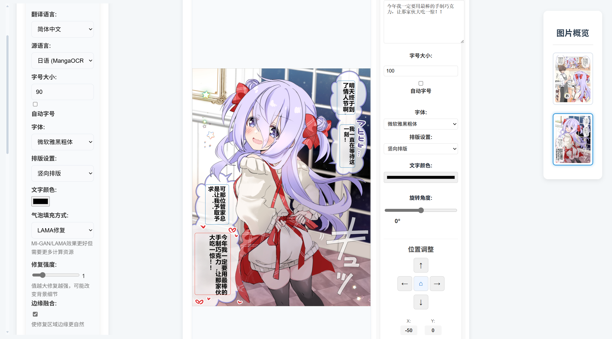

    

<h1 align="center">Saber-Translator</h1>

    ✨ 一站式 AI 漫画翻译、阅读与智能分析平台，集成书架管理、多引擎翻译、精细编辑、智能问答等全方位功能！✨

    
    

    <a href="https://github.com/MashiroSaber03/Saber-Translator/issues">问题反馈 / 建议</a>
    |
    <a href="http://www.mashirosaber.top" target="_blank">使用教程</a>

**求职广告：本人是26届应届本科生，走过路过的老板们给个工作机会好不好😭😭😭😭😭😭😭😭**

---

## 🎯 核心亮点

- 🏠 **书架系统** - 像管理本地漫画库一样管理你的翻译项目，支持书籍、章节、标签分类
- 📖 **漫画阅读器** - 内置阅读器，原图/译图一键切换，章节无缝跳转
- 🧠 **Manga Insight 智能分析** - AI 驱动的漫画内容分析，角色识别、剧情梳理、智能问答
- 🎨 **专业翻译工作流** - 检测→OCR→翻译→修复→渲染，全流程自动化
- ✏️ **精细编辑模式** - 每个气泡独立调整，像素级控制，描边效果
- 🔌 **插件系统** - 通过钩子机制扩展核心功能

---

## ✨ 功能详解

### 📚 一、书架系统（全新功能）

全新的书架系统让你像管理本地漫画库一样管理翻译项目：

*   **书籍管理**：
    *   创建书籍，上传封面，设置标题
    *   支持自定义**标签系统**，按标签分类和筛选
    *   支持搜索书籍、批量删除、批量添加/移除标签
*   **章节管理**：
    *   每本书可创建多个章节，支持拖拽排序
    *   自动统计每章图片数量
    *   章节数据独立存储，加载更高效
*   **封面系统**：
    *   支持上传自定义封面
    *   自动生成封面缩略图

### 📖 二、漫画阅读器（全新功能）

内置专业的漫画阅读器：

*   **阅读体验**：
    *   流畅的翻页阅读，支持键盘快捷键
    *   **原图/译图一键切换**，方便对照阅读
    *   自适应缩放，支持全屏模式
*   **导航功能**：
    *   章节间无缝切换（上一章/下一章）
    *   缩略图快速定位
    *   记录阅读进度

### 🧠 三、Manga Insight 智能分析（全新功能）

AI 驱动的漫画内容深度分析系统：

*   **分析模式**：
    *   **全书分析**：分析整本漫画的内容
    *   **增量分析**：只分析新增的页面
    *   **章节分析**：分析指定章节
    *   **批量分析**：分析指定页面范围
*   **分析内容**：
    *   **角色识别**：提取角色、分析关系、统计出场
    *   **剧情分析**：故事情节梳理、时间线构建
    *   **对话分析**：对话提取、情感分析
*   **智能问答**：
    *   基于分析结果的智能问答
    *   支持多轮对话，上下文理解
    *   引用原文定位
*   **任务管理**：
    *   支持暂停/恢复/取消分析任务
    *   实时进度推送
    *   任务历史记录

### 🔍 四、文本检测

*   **CTD（Comic Text Detector）**（默认，推荐）：
    *   专为漫画设计的文本检测模型
    *   支持生成**精确文字掩膜**，修复效果更好
    *   自动合并同一气泡内的多行文本
    *   支持**自动检测文字方向**（横排/竖排）
*   **YOLOv5**（向后兼容）：
    *   通用目标检测，速度快
*   **手动标注模式**：
    *   在图片上**绘制新的文本框**
    *   **拖动、调整大小、删除**已有框
    *   "**检测所有图片**"批量自动检测
    *   手动框优先用于后续流程

### 📝 五、OCR 识别

支持多种 OCR 引擎：

*   **MangaOCR**：针对**日语**漫画优化，支持模型预加载
*   **PaddleOCR**：支持**英语、韩语、繁体中文、法语、德语、俄语**等多语言
*   **百度OCR**：云端服务，支持标准版和高精度版
*   **AI 视觉 OCR**：
    *   支持 **SiliconFlow、火山引擎、Google Gemini** 等
    *   支持**自定义 OpenAI 兼容视觉服务**
    *   支持 **JSON 格式提示词**

### 🌐 六、翻译引擎

支持丰富的翻译服务：

*   **云服务 API**：
    *   SiliconFlow、DeepSeek、火山引擎
    *   Google Gemini
    *   彩云小译、百度翻译、有道翻译
*   **本地部署**：
    *   **Ollama**（支持 Llama 3、Qwen 等）
    *   **Sakura**（专为二次元内容优化）
*   **自定义服务**：
    *   支持任意 **OpenAI 兼容 API**（vLLM、TGW 等）
    *   自定义 Base URL 和 API Key
*   **高级功能**：
    *   **自定义提示词**，支持 JSON 格式输出
    *   **RPM 限制**，避免超出 API 频率限制
    *   **自动重试**，翻译失败自动重试

### 🎨 七、图像修复

*   **LAMA 智能修复**：
    *   **LAMA-MPE**（速度优化，推荐）
    *   **LiteLAMA**（通用模型）
    *   几乎无痕的文字消除
*   **精确掩膜模式**：
    *   使用 CTD 生成的精确文字掩膜
    *   修复效果更精准
    *   支持掩膜膨胀调整
*   **纯色填充**：快速填充，可自定义颜色

### ✏️ 八、文本渲染与编辑

**渲染参数**：
*   **字体**：内置多种中文字体，支持上传自定义字体
*   **字号**：手动设置或自动计算最佳字号
*   **排版**：横向/竖向，自动处理竖排标点
*   **颜色**：自定义文字颜色
*   **描边**：文字描边效果，可调颜色和宽度
*   **旋转**：任意角度旋转文字
*   **位置**：像素级偏移调整

**编辑模式**：
*   **单气泡独立编辑**：每个气泡可单独设置所有参数
*   **实时预览**：所有修改即时呈现
*   **样式复用**：一键将样式应用到所有气泡
*   **重置功能**：恢复到初始状态

### 💾 九、会话管理

*   **保存/加载**：完整保存工作进度，随时恢复
*   **自动存档**：关键操作后自动保存，防止数据丢失
*   **分批保存**：大型项目分批存储，提高效率
*   **会话管理**：重命名、删除、列表管理

### 🚀 十、高质量翻译模式 (Beta)

实验性的多步骤翻译流程：

*   结合多张图片的**上下文信息**
*   **分批处理**，支持配置批次大小
*   支持**低推理模式**和**强制 JSON 输出**
*   流程：消除文字 → 提取原文 → 分批翻译 → 合并结果 → 重新渲染

### 🔌 十一、插件系统

*   **插件管理**：查看、启用/禁用、配置、删除插件
*   **钩子机制**：支持在处理流程的各阶段插入自定义逻辑
    *   `BEFORE_PROCESSING` - 处理前
    *   `AFTER_DETECTION` - 检测后
    *   `BEFORE_OCR` / `AFTER_OCR` - OCR 前后
    *   `BEFORE_TRANSLATION` / `AFTER_TRANSLATION` - 翻译前后
    *   `BEFORE_INPAINTING` / `AFTER_INPAINTING` - 修复前后
    *   `BEFORE_RENDERING` - 渲染前
    *   `AFTER_PROCESSING` - 处理后
*   **持久化配置**：插件默认启用状态会保存

### 📦 十二、导入/导出

*   **下载格式**：单张 PNG、ZIP 压缩包、PDF、CBZ 漫画格式
*   **文本导出**：导出原文和译文为 JSON 文件
*   **文本导入**：从 JSON 导入翻译结果并重新渲染
*   **PDF 支持**：上传 PDF 自动提取图像

### 🎓 十三、外语学习

*   启用"**文本框提示词**"模式
*   AI 提供详细解释、语法分析、文化背景注释
*   辅助理解原文和学习外语

### ⚙️ 十四、系统配置

*   **连接测试**：Ollama、Sakura、LAMA、各 OCR/翻译服务
*   **模型历史**：自动记录最近使用的模型
*   **界面主题**：亮色/暗色模式切换
*   **调试工具**：一键清理临时文件

## ✨ Demo (效果示例)

    
    
_✨ Saber-Translator 翻译界面概览 ✨_

 

**翻译效果对比：**

    <table style="width: 80%; border-collapse: collapse;">
        <tr>
            <th style="width: 50%; border: 1px solid #ddd; padding: 8px; text-align: center;">翻译前</th>
            <th style="width: 50%; border: 1px solid #ddd; padding: 8px; text-align: center;">翻译后</th>
        </tr>
        <tr>
            <td style="border: 1px solid #ddd; padding: 8px; text-align: center;">
                
            </td>
            <td style="border: 1px solid #ddd; padding: 8px; text-align: center;">
                
            </td>
        </tr>
        <tr>
            <td style="border: 1px solid #ddd; padding: 8px; text-align: center;">
                
            </td>
            <td style="border: 1px solid #ddd; padding: 8px; text-align: center;">
                
            </td>
        </tr>
    </table>

 

## ✨ 使用方式

### 快速上手

1.  **下载最新版本**: 前往 [Releases](https://github.com/MashiroSaber03/Saber-Translator/releases) 页面，下载对应你操作系统的最新版本压缩包。
2.  **解压**: 将下载的压缩包解压到你希望存放程序的目录。
3.  **运行程序**: 找到 `Saber-Translator.exe` (Windows)，双击运行。
4.  **访问界面**: 程序启动后会自动在浏览器中打开 Web 界面 (默认 `http://127.0.0.1:5000/`)。同时支持局域网访问。
5.  **选择工作模式**：
    *   **翻译模式**：直接上传图片进行翻译（传统模式）
    *   **书架模式**：创建书籍和章节，系统化管理翻译项目
6.  **配置参数**: 在左侧边栏调整翻译语言、字体、排版、修复方式、翻译模型和 API Key 等设置。
7.  **翻译**: 点击"翻译当前图片"或"翻译所有图片"按钮开始处理。
8.  **查看与下载**: 在主界面查看翻译结果，使用缩略图切换图片，通过下载按钮获取翻译后的文件。
9.  **详细教程**: 参考 [使用教程](http://www.mashirosaber.top) 获取更详细的步骤和技巧。

### 书架系统

书架系统提供了更系统化的漫画翻译管理方式：

1.  **进入书架**: 点击顶部导航栏的"书架"按钮进入书架页面。
2.  **创建书籍**: 点击"新建书籍"，输入书名，可选上传封面图片。
3.  **添加章节**: 进入书籍后，点击"添加章节"创建新章节。
4.  **翻译章节**: 点击章节进入翻译工作区，上传该章节的图片进行翻译。
5.  **保存进度**: 翻译完成后保存，进度会自动关联到对应章节。
6.  **阅读模式**: 点击"阅读"按钮进入阅读器，流畅阅读翻译后的漫画。
7.  **标签管理**: 为书籍添加标签，方便分类和筛选。

### Manga Insight 智能分析

AI 驱动的漫画内容分析功能：

1.  **进入分析页面**: 在书架中选择一本书籍，点击"智能分析"按钮。
2.  **配置分析参数**: 选择分析模式（全书/增量/指定章节）和 AI 服务配置。
3.  **启动分析**: 点击"开始分析"，系统会自动分析漫画内容。
4.  **查看进度**: 实时查看分析进度，支持暂停/恢复/取消。
5.  **浏览分析结果**: 分析完成后可查看：
    *   角色列表和出场统计
    *   剧情时间线
    *   对话内容摘要
6.  **智能问答**: 在问答区输入问题，AI 会基于分析结果进行回答。

### 编辑模式

    
    
_✨ Saber-Translator 编辑模式示例 ✨_

翻译完成后，如果对某个气泡的翻译文本或样式不满意，可以点击图片上方的“**切换编辑模式**”按钮进入编辑模式。

*   **选择气泡**: 点击右侧的气泡列表或直接点击图片上的高亮框来选择要编辑的气泡。
*   **修改文本**: 在文本编辑框中直接修改翻译文本。
*   **调整样式**: 修改该气泡的字体、字号（可设为自动）、文本颜色、气泡填充颜色、排版方向、旋转角度。
*   **调整位置**: 使用方向键或输入坐标微调文本在气泡内的位置。
*   **实时预览**: 更改会自动实时预览在主图上。
*   **应用更改**: 点击“应用更改”确认修改。
*   **应用到全部**: 可以将当前选中气泡的样式（字体、大小、颜色等，不含文本和位置）快速应用到所有其他气泡。
*   **重置**: 恢复当前选中气泡到进入编辑模式时的初始状态。
*   **退出**: 再次点击“退出编辑模式”按钮保存更改并退出。

### 手动标注模式

    
    
_✨ Saber-Translator 标注模式示例 ✨_

如果自动气泡检测效果不佳（漏检、错检、范围不准），可以点击图片上方的“**进入标注模式**”按钮。

*   **绘制新框**: 在图片上按住鼠标左键拖拽绘制矩形框。
*   **选择框**: 单击已绘制的框进行选中。
*   **移动框**: 按住选中的框内部（非边缘手柄）拖动。
*   **调整大小**: 拖动选中框边缘的控制点（小方块）调整大小。
*   **删除框**: 选中框后，点击“删除选中框”按钮；或点击“清除所有框”。
*   **自动检测辅助**: 可以点击“自动检测”按钮，程序会尝试检测框并添加到当前手动框列表，你可以在此基础上修改。
*   **批量自动检测**: 点击“检测所有图片”对所有已上传图片执行自动检测，并将结果作为每张图片的初始手动标注框。
*   **使用标注框翻译**: 编辑完成后，点击“**使用手动框翻译**”按钮，程序将**仅使用你手动绘制/编辑的框**进行后续的 OCR 和翻译流程。翻译完成后会自动退出标注模式。
*   **退出**: 如果不想使用手动框翻译，可以点击“退出标注模式”，程序会自动保存当前的手动框（下次进入该图片的标注模式会加载），然后退出。

### 高质量翻译模式 (Beta)

位于左侧设置栏的 "高质量翻译模式 (Beta)" 板块提供了一个实验性的多步骤翻译流程。该模式旨在通过结合多张图片的上下文信息来提升翻译的连贯性和准确性。

*   **配置**: 用户可以设置AI服务商、API Key、模型、批处理大小（一次发送给AI的图片数量）、会话重置频率（多少批次后清空AI的短期记忆）、RPM限制、是否使用低推理模式（部分模型支持以降低思考深度换取速度）、是否强制AI返回JSON格式以及自定义的上下文翻译提示词。
*   **流程**:
    1.  程序会先对所有已上传的图片进行文字区域的消除和原文提取。
    2.  然后将所有图片的原文组织成JSON格式。
    3.  同时收集所有原始图片的Base64数据。
    4.  接着，它会根据用户设置的“每批次图片数”，分批将图片和对应的JSON文本片段发送给AI进行上下文感知的翻译。
    5.  AI返回的翻译结果会被合并。
    6.  最后，程序将合并后的翻译结果导入到对应的图片和气泡中，并重新渲染。
*   **适用场景**: 当漫画对话连贯性要求较高，且单个气泡的独立翻译效果不佳时，可以尝试此模式。
*   **注意**: 此模式会消耗更多的处理时间和API配额，因为它需要对所有图片进行多次处理和AI调用。请确保你的API Key有足够的额度，并根据服务商的限制合理配置RPM。

### 会话管理

    
    
_✨ Saber-Translator 历史记录示例 ✨_

当你处理多页漫画或需要中断工作时，可以使用会话管理功能：

*   **保存**: 点击侧边栏的“保存”按钮，如果当前是已加载或已保存过的会话，会直接覆盖保存当前所有进度和设置；如果是新任务，则会提示输入会话名称（类似另存为）。
*   **另存为**: 点击“另存为...”按钮，总是会提示输入一个新的会话名称来保存当前状态。
*   **加载/管理**: 点击“加载/管理会话”按钮，会弹出模态窗口：
    *   **自动存档**: 顶部会显示“自动存档”槽位，记录了最近一次自动保存的状态，可以直接加载。可以通过开关控制是否启用自动存档功能。
    *   **用户会话**: 列出所有用户手动保存的会话（包含名称、保存时间、图片数量等信息）。
    *   点击“加载”按钮恢复选定会话的所有状态。
    *   点击“重命名”按钮修改选定会话的名称。
    *   点击“删除”按钮永久删除选定会话。

### 插件管理

    
    
_✨ Saber-Translator 插件系统示例 ✨_

点击侧边栏的“插件管理”按钮，可以管理已安装的插件：

*   **查看**: 列出所有检测到的插件及其版本、作者、描述信息。
*   **启用/禁用 (实时)**: 通过开关实时控制插件是否在当前运行的应用中生效（注意：此状态非持久化，重启后会恢复默认）。
*   **设置默认启用**: 通过复选框设置该插件在下次启动应用时是否默认启用（此状态会保存）。
*   **配置**: 如果插件提供了可配置项，点击“设置”按钮会弹出配置窗口。
*   **删除**: 永久删除插件文件（需要重启应用完全生效）。
*   **QQ群信息**: 插件管理界面顶部会显示插件开发交流QQ群号。

### 外语学习

通过启用左侧边栏的“**启用独立文本框提示词**”并配置相应的提示词（例如，要求 AI 解释翻译和知识点），可以在翻译漫画的同时，在图片下方的文本框区域看到 AI 对翻译内容更详细的解读。**（注意：启用此功能会显著增加翻译所需时间和潜在的 API 成本）**

    
    
_✨ Saber-Translator 外语学习示例 ✨_

## 🚀 路线图 (未来计划)

我们计划在未来的版本中加入更多功能：

*   **术语库/词典**: 允许用户导入自定义术语库，保证特定词汇翻译的一致性。
*   **角色名一致性**: 基于 Manga Insight 的角色识别，自动保持角色名翻译一致。
*   **批量导出增强**: 支持更多导出格式和自定义选项。
*   **性能优化**: 持续优化图像处理、模型推理速度和前端交互的流畅性。
*   **UI/UX 改进**: 进一步提升用户界面的易用性和美观度。
*   **国际化 (i18n)**: 支持界面语言切换。
*   **移动端适配**: 优化移动设备上的阅读体验。
*   **Docker 支持**: 提供 Docker 镜像，简化部署和环境配置。

## 💖 赞助 (Sponsorship)

感谢你对 Saber-Translator 项目的关注和支持！ 如果你觉得本项目对你有所帮助，并且愿意支持我继续开发和维护，可以通过以下方式进行赞助。 你的支持是我前进的最大动力！

**赞助方式：**

你可以通过微信或支付宝扫描下方二维码进行赞赏。 你的每一份支持都将用于功能开发和持续优化。

    <table>
        <tr>
            <td style="text-align: center; padding: 0 20px;">
                
                
微信赞赏码

            </td>
            <td style="text-align: center; padding: 0 20px;">
                
                
支付宝赞赏码

            </td>
        </tr>
    </table>

    再次感谢你的慷慨支持！

## ❤️ 贡献

欢迎任何形式的贡献，包括但不限于：

*   **代码贡献 (Pull Requests)**: 修复 Bug, 增加新功能, 优化代码性能, 开发新插件等。
*   **问题反馈 (Issues)**: 报告 Bug, 提出功能建议, 分享使用遇到的问题等。
*   **文档完善**: 改进 README 文档, 编写更详细的使用教程或开发文档。
*   **翻译贡献**: 将 README 文档或界面翻译成其他语言。
*   **推广宣传**: 向更多人介绍和推荐 Saber-Translator。

## 🌟 支持

*   **Star 项目**: 如果你觉得 Saber-Translator 对你有帮助，请给项目点个 Star ⭐，这将是对我最大的鼓励和支持！
*   **分享推荐**: 将 Saber-Translator 分享给你的朋友或有需要的人。

## 🛠️ 技术栈 (Tech Stack)

*   **后端:** Python 3.10+, Flask, Flask-CORS, PyTorch, ONNX Runtime
*   **文本检测:** CTD (Comic Text Detector), YOLOv5
*   **OCR 引擎:** MangaOCR, PaddleOCR, 百度OCR, AI视觉OCR
*   **翻译服务:** OpenAI SDK, 多服务商API支持
*   **图像修复:** LAMA, LAMA-MPE, LiteLAMA
*   **图像处理:** Pillow, OpenCV, NumPy
*   **向量检索:** 向量数据库, Embedding, Reranker (Manga Insight)
*   **其他:** PyPDF2, Requests, Loguru, Colorama, asyncio
*   **前端:** HTML5, CSS3, JavaScript (ES6 Modules), jQuery, JSZip, jsPDF
*   **打包:** PyInstaller

## ⚠️ 免责声明 (Disclaimer)

1.  Saber-Translator 主要用于学习和技术交流，请在遵守当地法律法规和版权政策的前提下使用。**严禁用于非法目的或商业用途。**
2.  本项目依赖第三方 AI 服务 (如 OCR, 翻译 API, 背景修复模型)，其服务质量、可用性和成本由相应服务商决定。请用户自行了解并遵守相关服务商的使用协议和条款。
3.  翻译结果由 AI 模型生成，可能存在错误或不准确之处。本项目不对翻译结果的准确性、完整性或及时性做任何保证。
4.  用户应对使用本工具处理的任何内容负责，包括确保拥有处理这些内容的合法权利。
5.  对于因使用或无法使用本项目而造成的任何直接或间接损失，项目作者不承担任何责任。

---

    感谢使用 Saber-Translator！希望它能帮助你更轻松地跨越语言障碍，享受漫画的乐趣！

