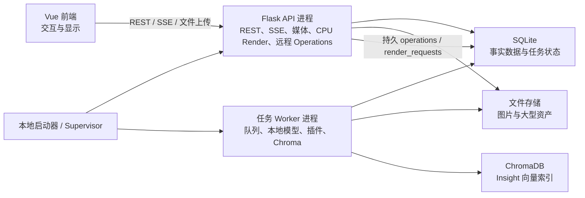
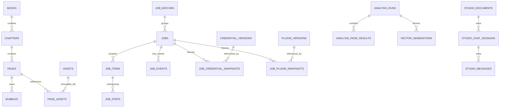

# Saber Translator Backend-First 全局重构实施方案

> 文档状态：最终架构基线；已合并 2026-07-28 Backend-First 专项讨论结论
>
> 文档角色：本项目后端中心化重构的唯一主方案文档；实施、评审和验收均以本文为准
>
> 最后更新：2026-07-28

## 1. 文档目的

本文档用于固化 Saber Translator 的全局重构方向、核心架构、存储模型、任务系统、图片加载策略、实施阶段与验收标准。

书架、任务中心、快速翻译、翻译页、编辑器、阅读器、Insight、角色工坊、导入导出、设置与插件的页面级方案已全部写入对应章节。实施过程中如需改变已确认的决策，应先更新本文档并记录原因，再修改代码。

本次重构不以局部修补现有架构为目标，而是按照“如果项目从第一天就按后端中心化方式开发”的标准重新设计。

### 1.1 拍板结论与开工边界

**结论：GO，可以按本文开始重构。** 本文已作为最终架构基线冻结，第一步只能从阶段 0“契约与骨架”开工，不能跳过阶段 0 直接边写页面 handler 边补数据库。阶段 0 的退出门禁为：

1. 关键 ADR、SQLAlchemy Metadata/首个 Alembic revision、SQLite partial index/FK 删除矩阵和状态机测试形成可评审产物。
2. OpenAPI 已冻结页面 batch mutation、统一 page-repair multipart、operation kind、job transition、Idempotency-Key 和 Studio session fencing，并能生成前端 TypeScript 类型。
3. `Launcher + 独立 v2 API + Worker` 最小骨架可启动；API import graph 在源码态/打包态均证明不加载 torch、Chroma、插件业务代码或 legacy 高层渲染入口。
4. Worker/API executor epoch、attempt/lease fencing、续租失败后的执行器自我隔离、章节写入意图/排空屏障、队列/ordinal 算法、pause/cancel drain 和对象提交 journal 均有故障注入测试设计，实施阶段不得另造第二套语义。
5. 阶段 0 发现本文与真实技术约束冲突时，必须先更新本文与 ADR 再改实现；任何页面临时兼容、双写或绕过 Repository 的方案都不视为可接受捷径。

阶段 0 通过后依次执行阶段 1–6；用户可见正式入口仍只在阶段 6 全量验收通过后一次切换。

## 2. 已确认的核心决策

| 主题 | 已确认决策 |
| --- | --- |
| 总体方向 | 后端持有事实数据、任务状态和执行权，浏览器主要负责交互与显示 |
| 存储底座 | SQLite 管理结构化数据，文件系统管理图片和大型二进制资产 |
| 运行拓扑 | `Launcher + API + Worker`；API 负责 REST/SSE/媒体/纯 CPU 渲染与保存型远程 operation，Worker 负责全局队列、本地模型 operation、插件与 Chroma |
| 启动与恢复裁决 | Launcher 持有全局启动裁决权；API 单独重启不得中断健康 Worker，只有确认 Worker epoch 失效后才能把 running/pausing 转 interrupted |
| API executor 恢复裁决 | Launcher 同样持有 API executor epoch 的失效裁决权；旧 API 进程确认终止后，新的 API epoch 才能接管 pending render/operation，并以 epoch + attempt + lease fencing 永久拒绝旧执行器迟到写回 |
| 任务范围 | 批量和可恢复长任务进入统一 jobs；保存型短操作进入持久 operations；不保存的预览、问答与连接测试只在当前连接内运行 |
| 输入绑定 | 任务创建时冻结范围和配置；具体输入资产按任务类型在创建时或 item 开始时绑定，统一写真实 asset FK 并按 source/document revision + attempt fencing 发布 |
| 队列模型 | 一个全局串行 job 队列，任意时刻只执行一个 job；operations 不作为队列项展示 |
| 即时模型请求 | 单泡 OCR、LaMA/LiteLaMA 页面修复、单页检测、单泡颜色经持久 operations 由 Worker 在当前重步骤后的安全点优先执行；纯 CPU 文字渲染与 solid/restore_source 页面修复由 API 有界 executor 执行 |
| 章节写入准入 | 队首章节写 job 先为全部目标章节建立持久写入意图，封闭新写入并排空意图建立前的即时写链；排空后在一个事务中把意图原子升级为章节写锁并进入 running，避免持续编辑造成任务饥饿 |
| 执行器失租 | heartbeat/lease 续租 CAS 影响 0 行即视为失去执行权；执行器立即关闭新工作准入并毒化相关 attempt，外部调用可返回但结果必须丢弃，进程 epoch 失效时进程受控退出等待 Launcher 重启 |
| 队列排序 | 当前任务锁定在顶部；普通等待任务允许手动排序，写入排空意图项与 paused/interrupted 继续后仍持章节锁的 queued 任务不可排序 |
| 暂停语义 | paused 阻塞 job 队列；若暂停的是章节写任务，其目标章节因持久写锁返回 423，其他章节的 operation 仍可运行 |
| 队列重启行为 | 提交即自动运行；API 单独重启不改变任务，Worker epoch 确认失效或 Launcher 整体重启后 queued 保持顺序并自动继续、running/pausing 转 interrupted，interrupted 必须人工继续 |
| 翻译任务粒度 | 每个章节是一个独立任务；批量选择创建任务批次和多个章节任务 |
| 翻译内部执行模式 | 顺序执行模式和并行流水线模式都必须保留；同一 Pool 串行，不同 Pool 可处理不同页面，所有队列和解码缓存必须有界；并行模式专属的多阶段 Pool 进度条继续保留 |
| 任务范围冻结 | 处理既有页面的任务在创建时把选择器解析为有序 `page_id` 集合；container_import 冻结源容器并在首次解析检查点固化成员 manifest，web_import_commit 冻结有序 draft_page_id；后续新增页面/候选不进入已有任务 |
| 修复方法调度 | solid、LaMA、LiteLaMA、restore_source 共用一个 `page_repair` 业务契约、掩膜格式、operation 状态机、clean 发布与后续整页渲染链；后端仅按 method 把 solid/restore_source 路由到 API CPU executor、LaMA/LiteLaMA 路由到 Worker，批量任务则在 Worker 内调用同一 RepairService |
| 快速翻译 | 使用固定的后端系统工作区（单章节结构）；只有显式"新建快速翻译"时才重置；入口维持书架按钮 + /translate 无参数形态；术语表/非翻译表放开；提供"保存到书架"转正 |
| 浏览器崩溃 | 已提交任务继续在 Worker 中运行 |
| Worker/Launcher 崩溃 | 确认旧 Worker epoch 失效后 running/pausing 转 interrupted 并保留检查点，人工继续；尚未开始的 queued 自动继续；API 单独崩溃不改变 Worker 任务 |
| 兼容策略 | 项目尚未正式发版，v2 作为首个正式数据架构；开发期旧数据已明确视为可放弃数据，永久不兼容、不读取、不探测、不转换，且不在切换前再次评估迁移需求；旧 API 和旧插件同样不兼容 |
| 交付方式 | v2 在独立链路分阶段开发验证，发行时一次切换，不做双写或混合运行 |
| 开发环境 | 重构全程固定使用项目根目录现有 Python 虚拟环境 `venv/`；依赖安装、脚本、后端启动、迁移、测试和打包辅助命令均不得使用系统全局 Python |
| 自动保存 | 删除旧的可选自动保存功能；任务产物始终强制持久化 |
| 导入 | 普通图片由浏览器逐页幂等上传；容器与网页导入由后端 job 解析，逐页正式入库 |
| 删除 | 用户语义为永久删除；非终态 job、active operation 或有效导入租约仍引用目标时禁止删除 |
| 并发调度 | 不增加资源类型调度、智能穿插或多任务并发 |
| Insight 页面结果 | 页面级规范只保存摘要、关键事件、连续性说明和警告；角色、时间线等结构化数据由派生任务独立生成 |
| Insight 全书发布 | 新 run 隔离写入，全部必需步骤完成后原子切换 active 指针（允许带失败页发布为 completed_with_errors，失败页由"重试失败项"局部补齐）；任务级失败或取消不破坏旧正式结果 |
| Insight 局部发布 | 章节、单页和增量任务按成功页面即时发布；失败页面继续使用旧结果，相关派生物标记 stale |
| Insight 问答 | API 流式临时请求：检索段经 transient vector_query 由 Worker 执行，rerank 与 LLM 在 API；不入队、不持久化、断开即中断 |
| Insight 分析层级 | 保留简洁、标准、章节、完整预设与自定义多层；汇总层使用通用层级结果表，run 创建时冻结层定义 |
| Insight 派生物刷新 | 只有全书 run 在任务内生成默认派生物；单页、章节和增量任务完成后只标 stale，由用户手动重建 |
| Character Studio | 文档使用 revision CAS，会话另用 revision + generation fencing；保存型生成/聊天/总结使用持久 operation，断线后继续并落库，旧回复不能覆盖已编辑/中止会话；助手对话不持久化且断线取消 |
| 书架页面 | 列表/详情/标签迁 SQLite 参数化查询（标签 AND 语义）；封面为 WebP 资产；详情章节多选与主页书籍批量模式创建翻译任务批次；章节徽章+卡片角标显示任务状态；删除 description 与前端二次过滤 |
| 任务中心 | 全局抽屉+顶栏角标，无独立路由页；队列按批次卡片可展开组织；历史按批次保留最近 200 批；提供排序、取消全部排队与批次级继续，不提供“开始队列” |
| 阅读器 | 纯只读消费端：一次取全章元数据（all=1）+资产 URL、视口窗口化渲染；不做阅读进度、翻页模式、章节预取；译图缺失回退原图并角标提示 |
| 设置与凭据 | 全局设置按 domain JSON 存储，Insight 单书覆盖使用独立 book_settings；凭据使用不可变 credential_versions；每个设置弹窗的设置、Provider 记忆和凭据编辑在一次后端事务中原子保存 |
| 插件 | v3 钩子全部在 Worker 执行；插件包使用不可变 plugin_versions，任务冻结并引用具体包版本；API 只读 manifest/config schema，不加载插件业务代码 |
| 资产 | 文件以不可变 asset_id 对象存储；SQLite 保存元数据和明确关联，不使用语义文件名、多态 owner 字段或内容去重 |
| 图片加载 | 每张 source/translated 只配一张缩略图；列表只加载缩略图，主图只按当前页或视口窗口懒加载原图，离开窗口即释放；不增加中档 preview 或瓦片 |
| 页面文档 | `pages.document_revision + bubbles` 独立行；font_id 等需外键保护的引用规范化成列，其余 BubbleState 使用单泡 payload，删除平行镜像数组和整页 JSON 双事实 |
| API 契约 | OpenAPI 3 为正式契约并生成前端 TypeScript 类型；业务端点负责创建任务，通用 jobs API 只做管理 |
| 部署与安全 | 本地单实例、单数据空间、局域网完全开放且免认证；明确接受同一局域网内其他设备可直接访问 API 的信任模型，不增加账号、令牌、配对或 Origin/同源写保护；上传受限，凭据不回显、不写日志 |

## 3. “后端中心化”的准确边界

“后端中心化”不等于浏览器不执行任何逻辑，而是指业务事实和长任务不依赖浏览器生命周期。

### 3.1 后端负责

- 书籍、章节、页面、标签和页面文档的规范数据。
- 原图、缩略图、修复图、译图、掩膜和其他资产的持久化。
- 翻译、Insight、辅助处理和批量导出任务的创建、排队、执行、暂停、取消、重试和进度记录。
- 检测、OCR、颜色提取、翻译、修复、渲染、分析和向量构建。
- 文本导入预检与应用、批量样式应用、后端导出和结果文件保留。
- 任务配置快照、步骤检查点、失败信息和结果版本。
- 图片导入后的缩略图生成和媒体服务。
- SSE 事件、任务历史和后端恢复状态。

### 3.2 浏览器负责

- 页面布局、弹窗、选择、排序、导航和显示。
- 当前可见页面的临时交互状态。
- 气泡拖拽、缩放、旋转、文字编辑等即时操作。
- 将用户操作以命令或 revision patch 提交到后端。
- 显示后端任务进度、日志和已持久化结果。
- 本地文件选择、普通图片逐页读取和文件传输。
- 网页导入草稿的选择交互与日志显示；草稿事实和下载状态由后端持有。

### 3.3 不可避免的浏览器依赖

普通 Web 页面无法绕过浏览器直接读取用户本地文件。因此，普通图片和文件夹在上传完成前仍然依赖浏览器。浏览器按页读取并以 multipart 流式上传，任何时刻不持有整批原图或 Data URL。PDF、MOBI、AZW、AZW3、CBZ 等容器只由浏览器上传源文件，解析、页序确定、图片提取、缩略图生成和页面入库全部在后端 `container_import` job 中完成。网页导入的提取状态、候选页、缩略图、日志和选择结果全部保存在后端 `web_import_drafts` 中。

后端只有在完成以下步骤后才能确认页面已经入库：

1. 接收当前页的完整文件。
2. 校验图片格式、尺寸、MIME 和 checksum。
3. 将原图流式写入 staging，完成格式、MIME、尺寸与 checksum 校验并同步生成缩略图。
4. flush/fsync 后在同卷内原子改名为不可变 objects 文件。
5. 在一个短数据库事务中创建 assets、pages 和明确资产引用。
6. 向前端返回正式 `page_id` 和页面元数据。

只有完成入库的页面才能加入翻译或 Insight 任务。普通图片导入不提供断点会话，但每页使用 `Idempotency-Key`，章节导入租约使用 owner token 并在最后活动 60 秒后释放；中断时保留已入库页面。容器和网页导入属于队列任务，浏览器关闭后继续，逐页发布成功页面，任务终态后按 TTL 清理原始容器和草稿临时文件。

## 4. 目标运行架构



### 4.1 本地启动器

本地启动器负责：

- 启动 API 和 Worker 两个后端进程。
- 获取数据根级单实例锁；同一 data-v2 不允许第二个 Launcher/Worker 同时启动。
- 唯一解析并传递绝对数据目录和运行配置；API/Worker 不得根据自身 cwd 再推导数据根。
- 监控子进程状态。
- 处理正常退出和异常退出。
- 避免 API 与 Worker 各自初始化一套冲突的运行目录。

**进程失败策略**（子进程崩溃后的复活路径）：

- Launcher 对崩溃的 API/Worker 进程**自动重启**，每进程连续失败上限 3 次；超限后停止重启，由 API（若存活）向前端推送"后端异常，请重启程序"横幅，或由 Launcher 直接弹出系统提示。
- Worker 心跳过期由 API 的共享轮询器判定并落库（running → interrupted，§7.3）；任务中心在 worker_leases 心跳丢失时显示"Worker 离线"横幅，Worker 重启回归后自动消除。
- Worker 崩溃重启后：running/pausing 转 interrupted 等待用户手动继续，cancelling 转 cancelled；其余 queued 任务保持 FIFO 顺序并在 Worker 恢复后自动继续。
- API 单进程重启不影响 Worker 与队列执行（§7.7）；Launcher 必须先确认旧 API 进程已终止并使旧 `api_epoch_id` 失效，再启动替代 API。旧 epoch 下 running 的远程 operation 置 failed，pending operation 和可安全重做的 render/CPU operation 才可由新 epoch 领取；前端 SSE 断线重连按事件序号补发。
- Launcher 执行 Alembic 前使用 SQLite Backup API 创建一次仅供升级失败回滚的临时数据库副本；备份在 API/Worker 尚未启动且 Launcher 已持有数据根单实例锁时完成，必须包含 WAL 中已提交内容，禁止只复制单个 `.sqlite3` 文件。迁移成功并完成 schema smoke test 后才删除副本；迁移失败时不启动子进程并保留副本用于自动回滚。这不是用户备份功能，不提供备份/恢复界面。涉及 objects 关系变化的未来迁移必须使用可恢复 migration journal，禁止先破坏性修改不可变文件再迁数据库。

**唯一启动与恢复顺序**：

1. Launcher 解析并规范化 data root，获取该根的单实例锁；锁未取得时立即退出。
2. 完成 SQLite Backup API 升级副本、Alembic 迁移和数据库完整性/schema smoke test。
3. Launcher 在一个短事务中登记新的 `launcher_epoch_id`，并调用唯一的 `reconcile_dead_worker()` 与 `reconcile_dead_api_executor()` 恢复命令。新 Launcher 已取得单实例锁且旧 Windows Job Object 中的子进程已终止时，可确定旧 worker/API epoch 已失效；普通 API 自动重启只执行由 Launcher 裁决的 API executor 恢复，绝不执行 Worker 恢复。
4. `reconcile_dead_worker()` 以旧 `worker_epoch_id + lease_token` 为 fencing 条件，原子执行：旧 running/pausing → interrupted、旧 cancelling → cancelled、保留 paused/interrupted 的章节锁、删除旧 epoch 持有的 `chapter_write_intents`（对应 job 保持 queued）、使旧 attempt 永久失去写回资格。命令可重复执行且结果幂等。
5. `reconcile_dead_api_executor()` 以旧 `api_epoch_id + lease_token` 为 fencing 条件，原子执行：旧 API epoch 下 running 的远程 operation → failed（`API_EXECUTOR_LOST`），可安全重做的 running render/CPU operation → pending，并使旧 attempt 永久失去写回资格；pending 保持 pending。随后 Launcher 登记新 `api_epoch_id`，把只在当前子进程内存中可用的高熵 `api_epoch_token` 通过仅对子进程可见的继承环境/匿名管道传入 API，不放命令行、数据库明文或日志。
6. 启动 API 并通过健康检查；API 只领取绑定当前 `api_epoch_id` 的 pending render/remote/CPU operation，不因自身启动改变任何健康 Worker job。API 进程不得自行宣告前一个 API epoch 失效。
7. 启动 Worker。Worker 在短事务中登记新的 `worker_epoch_id`，确认恢复命令已完成后才开始领取 operations、transient requests 或 queued jobs。
8. Launcher 运行期间若只重启 API，只针对旧 API epoch 执行第 5 步，跳过 Worker 恢复；若只重启 Worker，Launcher 必须先针对旧 worker epoch 执行第 4 步，再启动替代 Worker。

运行期 API 共享轮询器与 Launcher 复用同一个 Worker Repository 恢复命令：只有观察到同一 `worker_epoch_id` 的心跳和租约确实过期时才允许调用。API executor epoch 只能由持有 Launcher 单实例锁、且已确认旧 API 子进程终止的 Launcher 裁决，API 进程不得自我恢复前一 API epoch。不得由多个调用方各写一套状态转换 SQL；数据库 fencing 使并发重复调用只有一个产生状态变化。活进程续租 CAS 影响 0 行时不能继续假定自己仍是 owner：必须按 §4.4 的自我隔离协议停止准入并退出，由 Launcher 完成唯一恢复裁决。

### 4.2 API 进程

API 进程负责短请求，不直接执行翻译和 Insight 长任务：

- 书架、章节、页面和设置 CRUD。
- 文件上传和导入提交。
- 创建与控制任务。
- 查询任务、页面和分析结果。
- 提供图片、缩略图、导出文件等媒体响应。
- 接受按稳定 `bubble_id` 的 revision PATCH，并把每页最多一条待处理渲染请求持久化。
- 在有界 API executor 中执行纯 PIL/numpy/freetype 文字渲染，以及统一 `page_repair` 契约下的 solid 填充和 restore_source 像素恢复；只有最新 `document_revision` 的结果可以发布。
- 执行保存型远程 AI operation：Character Studio 生成、聊天、总结等先持久化 operation，再由 API 固定大小的 remote-operation executor 执行；浏览器断线后继续。只有 Launcher 确认旧 API epoch 失效后才把该 epoch 遗留 running 标记失败，pending 可由新 epoch 领取。
- 执行不保存的短连接请求：Insight 问答、卡片助手、预览、连接测试；连接断开即取消，不承诺恢复。
- 将需要本地模型的保存型即时操作写入 `operations`，由 Worker 在下一个安全点优先执行。
- 将持久化的 `job_events` 转换为 SSE 流。

API 进程不加载检测、OCR、LaMA 等大型本地模型，**禁止 import torch、禁止直连 ChromaDB、禁止加载插件业务代码**。纯渲染模块必须从现有渲染链路中抽离为不依赖 torch 的纯 PIL/numpy/freetype 模块，API 启动测试断言 `torch` 不在 `sys.modules`。Worker 中的任务最终渲染复用同一纯函数模块，但不通过 API 回调。

这一边界从 v2 第一条启动链路开始成立，不能依赖阶段 6 删除旧路由后才成立。v2 API 必须由独立 app factory 创建并只注册 v2 蓝图；现有 legacy `app.py`、旧 `src.app.api` 聚合蓝图和旧插件管理器不得被 v2 API 角色导入。开发期间如需保留旧程序用于行为对照，只能通过独立 legacy 入口单独启动，禁止把旧蓝图与 v2 蓝图注册到同一个 API 进程。

纯渲染抽取不能直接复用会惰性导入修复模型的 legacy 高层入口：v2 `rendering` 包的 import graph 必须静态禁止 `src.core.inpainting`、模型接口层、插件层与 `torch`。Worker 先在自身边界完成修复/检测等模型步骤，再把普通图片资产与结构化页面文档交给这组无模型纯函数；API 与 Worker 只共享纯函数和 DTO，不共享模型生命周期。

**API executor epoch**：

- API 进程启动时必须携带 Launcher 签发的 `api_epoch_id + api_epoch_token`；数据库只保存 token 的不可逆摘要。未携带有效 epoch 的直接 `--role=api` 启动只能运行显式的测试模式，禁止连接正式 data root 或领取 operation/render_request。
- API remote executor、render executor 和 CPU operation executor 每次领取都生成新的 `attempt_id + lease_token`，并同时记录 `api_epoch_id`。续租线程独立于实际渲染/远程调用线程。
- operation/render_request 发布与终态写入必须同时验证：目标仍有效、base revision、active/pending 状态、attempt_id、lease_token、lease 未过期以及 api_epoch_id 仍为当前有效 epoch。
- Launcher 在确认旧 API 进程终止前不得登记替代 epoch。旧 API 即使因系统调度延迟或迟到回调恢复，也会因 epoch fencing 无法写回。
- API 健康检查失败但进程仍存活时，Launcher 先终止并等待旧 PID 退出，再执行 `reconcile_dead_api_executor()`；不得在旧进程仍可能写库时并行拉起第二个 API executor。
- API 自身 epoch heartbeat 续租影响 0 行或发现 `api_epoch_id` 已失效时，立即关闭 remote/render/CPU executor 的领取准入、毒化本进程全部 active attempt、把健康检查置为失败并触发受控进程退出；当前 HTTP 请求可以失败返回，已经发出的外部调用即使返回也只能丢弃结果，不得由 API 自行登记新 epoch 或恢复旧 operation。

### 4.3 Worker 进程

Worker 进程内有一条全局 FIFO job 执行主线，并可在原子重步骤之间的安全点处理本地模型 operation。两者共享同一把深度学习信号量。Worker 进程负责：

- 加载和复用本地模型（生命周期见 §4.6）。
- 队列执行线程按队列顺序领取批量任务（封闭类型清单见 §7.2 三分类表）。
- 在安全点领取本地模型 operations（单泡 OCR、`page_repair(method=lama_mpe|litelama)`、单页检测、单泡颜色提取），不得抢占正在执行的模型步骤。
- 在相同安全点处理连接仍有效的 `vector_query` transient request；它不进入 job 历史、不触发插件，也不得抢占正在执行的模型步骤。
- 执行翻译、分析、全章批量检测、样式应用、文本导入和导出流水线。
- 在单个翻译任务内部运行阶段 Pool，并通过共享信号量限制深度学习步骤并发。
- 在安全点检查暂停和取消状态。
- 将每个成功步骤和页面结果持久化。
- 写入任务事件、进度、错误和检查点。
- 独占访问 ChromaDB（全书向量重建与问答检索均在本进程执行）。
- 执行**分类型孤儿清理**（§5.5）：对照 SQLite 引用回收无 DB 记录 objects、无主 Chroma 集合与不再被历史/续写引用的 staging/temp；不同清理器使用各自宽限期和指标，API 进程禁连 ChromaDB。

API 与 Worker 不通过进程内单例共享业务状态，只通过 SQLite 和文件存储协作（协作通道全集见 §4.4）。

### 4.4 进程协作矩阵

API 与 Worker 的全部**业务数据协作**通道如下，均经 SQLite 与文件存储；不存在承载任务 payload/结果的隐藏 IPC 或进程内单例。Launcher 启停/健康监护以及启动时经继承环境或匿名管道单向签发 epoch token 仅属于进程控制面，不传业务数据。

| 协作场景 | 通道 | 说明 |
| --- | --- | --- |
| 批量任务 | `jobs` 及相关表 | API 创建，Worker 队列线程领取执行 |
| 保存型即时操作 | `operations` 表 | API 远程 operation、Worker 本地模型 operation 与统一 `page_repair` 共用持久状态机；repair executor 由后端根据 method 路由 |
| 临时 Worker 请求 | `transient_requests` 表 | 仅用于 vector_query 等必须跨进程但不保存的请求；绑定连接 token，断线取消，完成结果由 API 消费确认后删除，遗留终态按短 TTL 清理 |
| 页面渲染 | `render_requests` 表 | 每页最多一个待处理请求；新 revision 覆盖旧待处理 revision，由 API render executor 消费 |
| 任务事件与进度 | `job_events` + `jobs.latest_progress` | 关键状态、页面结果、警告和错误写事件；高频百分比只覆盖 latest_progress，禁止逐 tick 堆积事件 |
| 章节写入意图 | `chapter_write_intents` | 队首章节写 job 在 queued 排空阶段为全部目标章节建立；封闭新编辑、写 operation/render 链和导入租约，旧即时写链排空后原子升级为章节写锁；绑定 Worker epoch/租约，旧 epoch 恢复时清理 |
| 章节写锁 | `chapter_write_locks` | 仅修改章节页面/文档的 job 启动时按全部目标章节原子获取；记录 job/lock_generation/当前 owner attempt/lease，paused/interrupted 继续持有，终态释放 |
| 插件包版本 | `plugins`、`plugin_versions` | API 管理 manifest 与版本；Worker 按任务快照加载固定 package_version |
| 导入租约 | `import_leases` | owner_token_hash、目标章节、最后活动时间和 60 秒到期时间；明文 token 只在签发响应返回一次，Worker 启动写任务前校验租约 |
| Provider 限速 | `provider_rate_limits` | API 与 Worker 共用 SQLite 令牌/时间窗，合计遵守 RPM |
| 进程 epoch | `process_epochs` + `worker_leases` + `api_executor_leases` | Launcher/API/Worker 启动身份、心跳和恢复完成标记；API 单独重启只创建新的 api epoch，不创建或失效 worker epoch |
| Worker 控制命令 | `worker_commands` | API 提交释放模型等进程控制事实，Worker 只在原子步骤安全点领取；命令绑定 worker epoch，旧 epoch 的 running 命令由新 Worker 恢复为 pending |

**operations 状态机**：

```text
pending → running → completed | failed | cancelled
```

- 保存型 operation 在向浏览器返回 `202` 前已经落库，浏览器断线不改变其生命周期。
- operation 创建时按 kind 冻结其执行所需的设置、credential_version、plugin_version/font_id、输入 asset 和 base_revision；版本及输入资产通过 operation snapshot/asset-input 关联表建立真实外键，运行中全局配置变化或当前资产指针变化不影响它。
- 本文中的 **active operation** 固定指 `pending` 或 `running`；`completed/failed/cancelled` 均为终态。删除保护和“同目标唯一 active”约束一律使用这一定义。
- operation 领取时与 job 一样生成 attempt_id/lease_token 并续期；API executor 领取还必须绑定当前 `api_epoch_id`。结果发布和终态写入必须同时验证 active 状态、attempt_id、lease_token、执行进程 epoch、目标与 base_revision。租约或 epoch 失效后，旧执行器即使迟到恢复也无权写回。
- job/operation 租约续期由各进程独立的轻量 heartbeat 协调器完成，不能依赖正在执行模型或网络调用的同一线程返回后才续期；一次长外部调用本身不得造成假失联。
- **续租失败与执行器自我隔离**：任何 epoch 或 attempt/lease 的 heartbeat `UPDATE ... WHERE epoch/attempt/lease_token/未过期条件` 影响 0 行，都不是可忽略的瞬时告警，而是该执行器已经失去写入资格的 fencing 信号。若进程 epoch 续租失败，Worker/API 立即关闭全部新 job/operation/render/transient 领取与后继步骤 admission，毒化本进程所有 attempt，停止 heartbeat 并受控退出，交由 Launcher 裁决和重启；若只有单个 attempt 续租失败而进程 epoch 仍有效，只毒化该 attempt、停止其后继步骤和发布并让调度器重新读取数据库事实。可安全取消的计算应尽力取消；不可取消的本地模型/远程调用可以自然返回，但其检查点、资产、事件、业务 current 指针和终态一律不得发布。失租执行器不得自行把业务行写成 failed/interrupted/cancelled，权威终态只由持有当前 fencing 的执行器或 Launcher 恢复命令决定。
- 本地模型 operation 由 Worker 在下一个原子重步骤完成后的安全点优先处理，不中断当前模型调用。
- Studio 保存型远程 operation 由 API 后台线程执行；只有 Launcher 确认旧 API epoch 失效后，遗留 running 才直接标记 failed，不自动重发可能产生外部副作用的请求。pending 可由新 API epoch 重新领取。
- Worker 本地模型 operation 与 API 纯 CPU operation 的租约失效后，若目标和 base_revision 仍有效则以新 attempt 回到 pending 重做，否则以 revision_conflict 失败。`page_repair(method=solid|restore_source)` 与 `render_requests` 由 API 有界 executor 执行，`page_repair(method=lama_mpe|litelama)` 由 Worker 执行；二者使用同一 operation 状态机和发布协议。`render_requests` 按 page_id 合并，Launcher 确认旧 API epoch 失效后才把其遗留 running 置回 pending，仍只有最新 revision 能发布。
- 不保存的 Insight 问答、卡片助手、预览与连接测试不建 operation；HTTP/SSE 连接断开即取消。
- 同一业务目标通过数据库唯一约束限制一个 active operation，不能只依赖进程内互斥。
- `transient_requests` 不属于用户历史。Worker 在领取前/写回前检查连接 token；完成时只以 `running + connection_open + attempt/lease` CAS 原子写入 completed/result，不得立即删除。正常路径由 API 读取结果、在准备好响应后以连接 token 写 `consumed_at`，响应结束再删除；连接关闭路径在一个事务中把 pending/running 置 cancelled，或直接删除已经 completed 的行，因此 Worker 完成与断线竞态无论谁先提交都不会留下可写回窗口。超时未消费/未删除的终态行由短 TTL GC 清理，避免 Worker 写完后 API 尚未读取结果就丢失。

#### 4.4.1 operation 与 render_request 分类契约

`operations` 只承载用户触发、需要独立状态和结果的保存型即时操作；`render_requests` 是页面文档变化后由后端内部创建的**可合并渲染请求**，不是 operation，不出现在 operation 历史，也不采用 30 天 operation 保留期。

| 类别 | kind | executor | active 唯一键 | 输入绑定与发布 |
| --- | --- | --- | --- | --- |
| Worker 页面写 operation | bubble_ocr、bubble_color、page_detect | Worker | 同一 page_id 同时最多一个 active 页面写 operation | 创建时冻结输入 asset 与 base_revision，领取和发布时复查章节写入意图/锁、revision 与 operation fencing；意图前已 active 的实例可完成排空 |
| 方法路由型页面修复 operation | page_repair | solid/restore_source → API CPU executor；lama_mpe/litelama → Worker | 同一 page_id 同时最多一个 active 页面写 operation | 所有 method 先规范化为 source、parent clean、repair mask、fill_color 与 base_revision；共用同一状态机、结果 schema、clean 发布和后续 render_request，客户端不得选择 executor |
| API 远程 operation | bubble_translate、studio_generate、studio_chat、studio_summary | API remote executor | bubble_translate 按 page_id；生成按 document_id；聊天/总结按 session_id | 创建时冻结业务 DTO、credential_version、配置和 base_revision；远程调用结束后以 operation fencing + CAS 发布 |
| 内部页面渲染 | render_request | API render executor | `UNIQUE(page_id)`，每页仅一行 | 改变可渲染 bubble 且符合 §16.2.4 渲染资格的 PATCH 成功后 upsert 最新 requested_revision 并立即进入可执行态；不冻结旧 bubbles 快照，执行时聚合最新文档，只发布与当前 document_revision 相等的结果 |

- “同一 page_id 最多一个 active 页面写 operation”使用 SQLite partial unique index 落实，active 固定为 pending/running；不能只依赖进程内锁或 `target_type + target_id`。
- Studio 文档与会话分别使用独立 partial unique index；不同页面、不同文档或不同会话可在各 executor 的固定并发上限内运行。
- render_request 可以与尚未领取的 operation 同时存在，但二者所有写回都受 revision CAS；`page_repair` 创建后页面进入 `render_status=awaiting_repair`，API render executor 不得领取该页旧请求，已经运行的旧 revision 也因文档 revision 变化不能发布。只有 repair 成功发布 clean 后才把页面置为 stale、把该页 render_request 推进到 repair_revision 并恢复可领取；repair 失败把页面置为 repair_failed，不允许拿旧 clean 伪装成新 revision 译图。章节写 job 先建立意图封闭新写入，再等待同章 active 页面写 operation 与 pending/running render_request 收尾，最后原子升级章节锁（§4.4 页面并发规则）。
- render_request 领取时把当时的 requested_revision 复制为 rendering_revision。运行中收到新 PATCH 只覆盖 requested_revision；旧执行器完成时若 `requested_revision != rendering_revision` 或页面 document_revision 已变化，则不得发布，并把该行恢复为 pending 立即处理最新 revision。这样可以有少量被淘汰的计算，但绝不会让旧译图覆盖新编辑。
- operation 创建 API 必须按 kind 校验唯一且非空的真实目标 FK；禁止由任意 JSON payload 自行声明 executor、目标或输出 role。

**任务领取与 fencing**：

1. Worker 领取 job 时生成新的 `attempt_id + lease_token`，写入租约并定期续期。
2. 每个 job_step 检查点、资产发布、active 指针切换和终态写入都必须同时验证 job 状态、attempt_id 与 lease_token。
3. attempt 或 Worker epoch 续租 CAS 影响 0 行时，当前执行器在下一次发布之前就必须按 §4.4 自我隔离；不能继续调度后继步骤并寄希望于最终发布 CAS 兜底。
4. Worker 心跳过期后旧 attempt 失效；即使旧进程稍后恢复，也不能写入任何正式结果。
5. `interrupted` 继续时创建新 attempt，从已验证的最后成功检查点恢复。

**页面并发规则**：

- 页面所有写操作携带 `base_revision`，以 `pages.document_revision` 做整页 CAS。
- 单泡 OCR、颜色、编辑 PATCH 都按稳定 bubble_id 定位，但提交时仍验证整页 revision；冲突统一返回 409，不自动合并。
- 单页检测整体替换本页 bubbles 并发布 text_mask，只有发起 revision 仍为最新时才能提交。
- clean、translated 和 thumbnail 的发布同样受 revision 保护；repair mask 是 operation 的不可变输入而不是可发布的页面 current role。来自 job 的发布额外验证 job attempt_id/lease_token，来自 operation 的发布验证 operation attempt_id/lease_token、active 状态、目标与 base_revision，来自 render_request 的发布验证请求仍是该页最新 revision。
- operation/render_request 创建和领取时都复查 `chapter_write_intents` 与 `chapter_write_locks`。队首章节写 job 先在一个短事务中为全部目标章节原子建立 `chapter_write_intents`；任一目标已有锁、有效导入租约或其他 job 的意图则本次不建立。意图建立后 job 仍为 queued、记录 `blocked_reason=draining_immediate_writes`，但新建页面文档写入、replace-source、页面写 operation、由新业务写入产生的 render_request 和普通图片 import lease 一律返回 `423 chapter_write_pending`，从而禁止持续新写入让 job 永久饥饿。
- 意图建立前已经 active 的写 operation，以及已经 pending/running 的 render_request，可以继续领取、完成并发布其既定 revision；完成该旧 operation 所必需的后续 render_request 也允许在同一 operation 发布事务中创建或推进。除此之外不得在意图后扩展新的业务写链。Worker 保持该 job 为不可跳过的队首，等待这些意图前链路全部终态。
- 排空后，Worker 在一个 `BEGIN IMMEDIATE` 事务中再次验证全部意图仍归当前 `job_id + worker_epoch_id + intent_set_id + 各章节 intent_generation + lease_token`、没有残余旧写链且没有导入租约，再为全部目标章节创建 `chapter_write_locks`、删除对应意图、创建新 job attempt/lease，并把 job 从 queued 原子转为 running；任一步失败整体回滚，不得出现意图已删但锁尚未建立的可写窗口。queued 取消、领取放弃或旧 Worker epoch 恢复会以 fencing 条件删除意图而保留/终结相应 job，旧执行器无权删除新 generation 的意图。
- 已取得 `chapter_write_lock` 的章节写 job 在 paused 和 interrupted 时继续保留该锁。需要编辑该章节或执行破坏性操作时必须先取消任务；未取得章节锁的只读/其他领域 job 不因 paused/interrupted 状态凭空产生锁。

### 4.5 冻结环境进程模型

打包发行的进程模型必须在阶段 1 开始前锁定：

- 单一可执行文件，按 `--role=launcher|api|worker` 参数分派角色；最小 role dispatcher 必须先执行 `multiprocessing.freeze_support()`、解析 role 与基础启动参数，再导入任何角色专属模块。顶层模块不得预先 import Flask app、插件管理器、torch、Chroma 或模型接口。
- v2 提供相互隔离的 `create_api_app()`、`run_worker()` 与 `run_launcher()` 入口。`create_api_app()` 只注册 v2 蓝图；Worker 入口才允许导入模型、Chroma 和插件业务代码。旧 `app.py` 只作为开发期 legacy 对照入口存在，不得成为 v2 任一角色的依赖。
- Launcher 使用 Windows Job Object 绑定子进程，保证 Launcher 退出（含崩溃）时 API 与 Worker 必然终止，不留孤儿进程占用 GPU。
- API 监听端口可配置（默认 5000）；端口被占用时启动失败并给出明确报错，不自动换端口。默认绑定 `0.0.0.0` 并完全开放局域网访问，不提供仅回环地址模式；`GET /api/v2/system/server-info` 返回局域网地址与实际端口（见 §19.8）。
- 部署模型最终确定为可信局域网免认证、单实例、单数据空间；明确接受同一局域网内任意设备能够直接调用读写 API，这是主动采用的产品信任边界，不再增加账号、访问令牌、配对、租户、公网部署方案或 Origin/同源写保护。API 不读取或校验 `Origin`，带任意 `Origin` 或不带 `Origin` 的请求执行相同业务逻辑；不额外安装 wildcard CORS 中间件。上传端点按类型配置单文件/总请求大小上限。
- 凭据、插件配置中的 secret、文件系统绝对路径不得出现在响应、SSE、日志或错误堆栈。
- Launcher 在 API 健康检查通过后自动打开浏览器（保留现状体验）。
- 依赖分档维持 requirements-cpu.txt / requirements-gpu.txt 双档，打包配置需同时覆盖。
- 源码态和 PyInstaller 打包态都必须提供角色 smoke test：API 角色断言 `torch/chromadb/插件实现模块` 未进入 `sys.modules`，Worker 角色验证可按需导入这些模块，Launcher 验证两个子进程使用同一规范化 data root。

**API 进程并发模型**：API 使用 waitress，默认 24 个工作线程（代码配置，可在 8–64 范围内调整并以并发验收确定发行值）。长连接占用预算需显式核算：每个前端仅一条全局任务 SSE，另加当次问答/助手流式连接和媒体下载；SSE 每 15 秒发送注释 heartbeat，等待 Worker transient safe point 时也必须持续 heartbeat，以便及时发现断线并取消连接 token。保存型 operation 创建后立即返回 202，不长期占用请求线程；remote-operation executor 使用固定工作线程（默认 4）从数据库领取 pending operation，不得为每次请求无限创建线程；render executor 使用独立有界队列和固定并发 1，避免连续编辑耗尽 API 线程池。每个 SSE 订阅者使用有界发送队列；慢消费者队列溢出时断开并依靠 Last-Event-ID + REST 快照恢复，禁止拖垮共享事件轮询器。

### 4.6 Worker 模型生命周期

- 所有本地模型都按需懒加载，包括 MangaOCR；启动时不预载任何模型。
- 模型在队列活跃期间复用；无 running/pausing/cancelling job、无 running 本地模型 operation 且无 running transient 模型请求持续 10 分钟后卸载并清理显存。
- 任务中心提供“释放显存”按钮：不存在进行中模型推理时立即卸载全部模型；存在进行中推理时返回 409。
- 模型加载失败：当次 job 或 operation 进入 failed，不阻塞后续 queued job。

## 5. 统一存储架构

### 5.1 存储原则

- SQLite 是结构化数据的唯一事实源。
- 不再使用 `books.json`、`book_meta.json`、`session_meta.json` 等重复摘要和详情双写。
- 图片和大型二进制文件保存在文件系统。
- 数据库只存储资产元数据和相对路径，禁止保存机器相关的绝对路径。
- 每个 asset 文件创建后不可修改；页面当前 `source` 指针只允许通过显式的 replace-source 领域命令切换到新的不可变 asset，不允许覆盖原文件。
- 缩略图、修复图、译图等均为独立派生资产。
- 所有二进制资产以不可变 `asset_id` 命名；业务语义只存在于 SQLite 关联，不体现在物理路径中。
- 不做内容去重；即使 checksum 相同，不同导入也创建独立 asset，避免引用计数和删除语义复杂化。
- 实体使用不可变 UUID，页面顺序通过数据库排序字段管理。
- 所有文件路径必须由统一存储服务解析，业务模块禁止自行拼接数据目录。
- 页面、媒体、任务和插件运行接口不再传输或返回 Base64 图片。仅用户显式导入/导出的可移植文件格式在其既有规范要求时允许内嵌 Base64（例如 Studio 会话 JSON 附件）；此类内容必须作为文件流处理，不能进入普通业务 DTO、任务事件或插件 payload。
- 使用 SQLAlchemy 2 作为数据访问层，使用 Alembic 管理新架构投入使用后的数据库升级。
- SQLite 开启 WAL、foreign keys 和 busy timeout，写操作保持短事务。
- 所有持久 JSON 列（设置 payload、bubble payload、任务配置/进度/事件、analysis/studio 扩展字段）都由所属行或表带明确 `schema_version` 并在 Repository 边界校验；后续 v2 升级通过 Alembic 数据迁移改变 schema，不在读取时堆叠多版兼容分支。任务 kind/operation kind/asset role 使用封闭枚举。

### 5.2 目标目录结构

```text
data-v2/
├─ saber.sqlite3
├─ objects/
│  └─ {asset_id前两位}/{asset_id}.{ext}
├─ temp/
│  ├─ staging/
│  ├─ imports/
│  ├─ jobs/
│  └─ web-import/
├─ chroma/
│  └─ {generation_id}/
└─ plugins/
   └─ {plugin_id}/versions/{plugin_version_id}/
```

- 数据根解析规则固定由 Launcher 执行：显式 `--data-dir` 优先；开发态默认 `<project>/data-v2`；打包安装态默认 `%LOCALAPPDATA%/SaberTranslator/data-v2`，避免向 Program Files/只读安装目录写数据。解析、创建并取得单实例锁后，把规范化绝对路径传给 API/Worker；数据库和业务记录内部仍只保存相对路径。便携版如需把数据放在程序旁必须显式传 `--data-dir`，不靠 cwd 猜测。
- 新版只读写独立 `data-v2` 根；旧数据目录不读取、不转换、不自动删除。
- objects 不按书籍、页面或资产类型分目录。快速工作区转正、书籍重命名、章节移动都只变更数据库关系，不移动文件。
- temp 只保存 staging、容器源文件、网页导入草稿临时文件和尚未发布的任务中间文件；完成后仍需下载/查看的不可变产物进入 objects + assets，并由 job/operation 产物关联与 expires_at 控制生命周期，正式业务不可依赖 temp 长期存在。
- 不提供用户备份目录与备份/恢复功能。

### 5.3 数据库领域划分

#### 书架与页面

- `books`：普通书籍和系统快速工作区；保存 `chapter_order_revision`。
- `chapters`：章节信息、排序和统计数据，保存 `page_order_revision` 与仅供写入意图 fencing 使用、永不回退的 `write_intent_generation`；`UNIQUE(book_id, ordinal)`。
- `pages`：页序、规范化 `logical_source_path`、`source_revision`、文档 revision 和当前业务状态；`UNIQUE(chapter_id, ordinal)` 与 `UNIQUE(chapter_id, logical_source_path)`。`logical_source_path` 只表示用户导入时的文件夹树、显示文件名和导出成员名，绝不是 objects 存储路径；它统一使用 `/`、不得为绝对路径或含 `..`，章内重名由后端确定性追加编号而不是覆盖。尺寸/MIME/checksum 和物理 object path 只存在于当前 source asset。追加 ordinal 与重名解析必须在同一写事务中完成，不能由浏览器用“当前长度”猜测。
- `assets`：不可变文件元数据，包含 `integrity_status=ok|missing`；页面当前资产统一由 `page_assets(page_id, role, asset_id, input_source_revision, input_document_revision, parent_asset_id, producer_job_step_id, producer_operation_id, producer_render_request_id, created_at)` 引用，`PRIMARY KEY(page_id, role)` 保证每个正式 role 只有一个当前指针。三个 producer FK 至多一个非空；`parent_asset_id` 用于 thumbnail 与其直接来源资产的可追溯关系。封面、字体、附件和任务产物使用各自明确 FK/专用关联表。
- `object_commit_journal`：只记录 staging→objects→数据库引用三段提交窗口，供崩溃恢复和无 DB 记录 objects 孤儿对账；不作为业务资产的第二事实源。
- `tags`、`book_tags`：标签及关联。
- `translation_constraints`：书籍级术语和翻译约束，`book_id` 唯一并带 revision；章节任务在创建时冻结所属书籍的 baseline。
- `import_leases`：普通图片导入 owner_token_hash、目标章节、最后活动时间和到期时间；`chapter_id` 唯一，单章同一时刻只允许一个有效 owner。数据库不保存可直接复用的明文 token。
- `web_import_drafts`、`web_import_draft_pages`：网页提取状态、候选页、缩略图、选中状态、日志摘要和 24 小时 TTL。

`books.kind` 至少支持：

- `library`：普通书架书籍。
- `quick_workspace`：系统快速翻译工作区。

#### 页面翻译文档

- `pages.document_revision` 是整页并发控制版本；`rendered_revision`、`render_status` 表示译图是否跟上文档。`render_status` 使用封闭枚举 `not_rendered|ready|stale|rendering|render_failed|awaiting_repair|repair_failed`：普通可渲染文档变更进入 stale/rendering，成功发布后为 ready，渲染失败为 render_failed；创建 `page_repair` 后进入 awaiting_repair，修复失败为 repair_failed，修复成功发布 clean 后进入 stale 并等待同 revision 的整页文字渲染。不得用自由字符串混合表示 operation 状态和页面派生资产状态。
- `bubbles(bubble_id, page_id, ordinal, font_id, payload_json, updated_revision)` 每个气泡一行，`UNIQUE(page_id, ordinal)`；可被外键约束的字体引用单独成列，payload 保存其余 BubbleState 字段。
- `pages.default_font_id` 明确引用字体；`page_style_defaults` JSON 保存当前页其余默认样式。气泡事实不再嵌入整页 JSON 数组，页面/气泡 DTO 由 Repository 聚合 font_id 与 JSON 字段生成。
- API 可以返回“页面聚合 DTO”，但数据库中不存在第二份整页 bubbles JSON 镜像。
- 删除 `bubbleCoords/originalTexts/bubbleTexts/bubbleStates` 等所有平行数组。
- 前端更新按 bubble_id 使用 POST/PATCH/DELETE，并携带整页 `base_revision`；后端使用 CAS 避免旧响应覆盖。
- 不保存通用编辑历史、编辑事件、撤销/重做快照或任务回滚快照，只保留当前状态和任务检查点。

#### 任务系统

- `job_batches`：一次批量提交的聚合记录。
- `jobs`：实际队列项。
- `queue_state`：全局单行 `queue_revision`，作为普通 queued 完整重排的 CAS 基线。
- `job_items`：任务中的页面、分析批次或处理单元。
- `job_steps`：原子步骤、状态、尝试次数和检查点。
- `job_drain_acks`：有界并行任务在 pausing/cancelling 时各 Pool slot 的安全点确认；以 job_id + attempt_id + pool_id + worker_slot 唯一，attempt 失效后整体级联清理。
- `job_step_asset_outputs`：非终态继续所需的步骤输出 asset FK（job_step_id、role、asset_id）；终态后，已经由 page_assets/分析结果等正式关系承接的步骤引用可释放，避免仅为历史日志长期保留旧大图。
- `job_events`：持久化进度、状态、日志和错误事件。
- `job_config_snapshots`：任务创建时冻结的业务配置、提示词、约束和页面顺序，带 snapshot_schema_version；后续数据库升级可迁移表示，但不能改变原任务语义。
- `job_credential_snapshots`、`job_plugin_snapshots`、`job_font_snapshots`：对不可变版本/字体的明确 FK，引导安全删除与可重现重试。
- `job_asset_inputs`：任务运行期间对已绑定输入资产版本的明确 FK，并记录 `binding_phase=create|item_start|checkpoint`；至少供 export、Insight 和所有已经开始处理页面的写任务使用，禁止只把 asset_id 埋入配置 JSON。不同任务何时绑定输入由 §7.4.1 矩阵唯一决定，不得笼统地全部在任务创建时冻结。容器源文件和网页 draft 临时文件另由 job/draft 行及其任务作用域相对目录保护，不伪装成正式 asset。
- `job_artifacts`：完成后可下载或按 TTL 查看之产物（job_id、kind、asset_id、expires_at）；ZIP/PDF/CBZ、Insight 导出和调试包均以真实 asset FK 管理，不把已完成文件继续留在 temp。
- `process_epochs`、`worker_leases`、`api_executor_leases`：Launcher/API/Worker epoch、心跳、job/operation/render attempt、lease_token、恢复完成标记和到期时间；新 Worker/API executor 在对应旧 epoch 恢复事务完成前不得领取工作。API epoch 失效不改变健康 Worker job；任一续租 CAS 影响 0 行都必须触发 §4.4 的执行器自我隔离，不能只依赖发布时最终 fencing。
- `worker_commands`：API 到 Worker 的持久控制命令；当前只允许 `release_models`，同类 active 命令唯一，Worker 在步骤安全点领取并绑定当前 worker epoch，崩溃遗留 running 命令由新 Worker 恢复后重试。
- `chapter_write_intents`：章节写 job 在 queued 排空阶段的持久准入屏障；`chapter_id` 唯一，明确引用 job 与 owner `worker_epoch_id`，保存本次多章节共享的 `intent_set_id`、由 `chapters.write_intent_generation` 原子递增得到的每章节单调 generation、`lease_token/lease_expires_at/created_at`。同一 job 多章节意图必须在一个事务中全有或全无；它只封闭新写入，不等价于 running 锁，也不允许跨失效 Worker epoch 遗留。
- `chapter_write_locks`：章节级持久写锁；`chapter_id` 唯一并明确引用持锁 job、单调 `lock_generation`、当前可空 owner attempt 和 lease_token。resume/continue 形成 queued 时锁仍归 job，下一次领取在同一事务提升 generation 并绑定新 attempt；旧 attempt 永远不能释放新 generation 的锁。
- `operations`：保存型即时操作；记录 kind、由后端决定的 executor_role、明确目标 FK、base_revision、状态、结果、错误以及领取它的 executor_epoch_id/attempt_id/lease_token/lease_expires_at。每种 kind 的冻结请求保存在带 `request_schema_version` 的固定 schema `request_json`，不能接受任意扩展键或从 JSON 改写 executor/目标；`page_repair` 的 request 必须明确保存 method、fill_color（restore_source 为空）和 repair_revision，source/parent clean/mask 则通过 `operation_asset_inputs` 的真实 FK 绑定。
- `operation_credential_snapshots`、`operation_plugin_snapshots`、`operation_font_snapshots`：operation 对不可变版本/字体的明确 FK；不能只把引用埋入 JSON。
- `operation_asset_inputs`：operation 对 source/clean/mask/附件等冻结输入资产的明确 FK，终态后可按保留规则释放。
- `operation_artifacts`：operation 的可见/调试产物 asset FK 与可选 page_id、expires_at；已正式挂到 Studio/页面业务关系的结果不重复依赖此表长期保活。
- `transient_requests`：必须跨进程但不保存的短请求（当前仅 vector_query），与 connection_token_hash 绑定；包含 `connection_open/completed_at/consumed_at` 及 attempt/lease。Worker 只写完成结果，API 消费确认或断线裁决后再删除，遗留终态由 TTL 清理。
- `render_requests`：稳定 `render_request_id` 主键、`page_id UNIQUE`，以及可覆盖的 `requested_revision/rendering_revision/completed_revision/status/executor_epoch_id/attempt_id/lease_token`；改变可渲染 bubble 且符合 §16.2.4 渲染资格的 PATCH 成功后推进 requested_revision 并立即置为可领取，不设置额外后端安静窗口。`page_assets.producer_render_request_id` 因此始终是真实 FK，而不是把 page_id 假装成请求身份。
- `provider_rate_limits`：API 与 Worker 共享的 Provider RPM 状态。
- `idempotency_records`：scope + key + request_hash 唯一，保存已提交命令的结果摘要；同键不同 request_hash 返回 409。

允许删除已经没有非终态任务引用的业务对象，因此目标必须使用明确可空 FK，不使用无约束的 `target_type + target_id`：jobs/job_items 按类型使用 book_id、chapter_id、page_id、analysis_run_id、continuation_project_id、web_import_draft_id 等真实列/关联表；operations 使用 page_id、bubble_id、studio_document_id、studio_session_id 等真实列。相应目标 FK 使用 `ON DELETE SET NULL`，同时保存目标名称、页码、checksum 等显示快照。删除书籍、章节或页面后，任务历史显示“目标已删除”，不能因级联而意外删除任务历史，也不能让终态历史 FK 阻止合法删除；非终态删除保护由领域命令在事务内先检查。

任务类型以 §7.2 为封闭清单：`translation`、Insight 分析、`remove_text`、`export`、`text_import`、`style_apply`、`detect`、`container_import`、`web_extract`、`web_import_commit`、续写任务、`insight_export`、`vector_rebuild`、派生物手动重建和 `plugin_agent`。网页提取候选与向章节提交候选是两个明确 job 类型，不能靠配置字段区分锁语义。任务创建由领域命令端点完成，通用 jobs API 不接受任意 job payload。

SQLite 最小索引规则：所有非主键 FK 列显式建索引；热路径至少覆盖 pages `(chapter_id, ordinal)`、page_assets `(page_id, role)`、jobs 队列领取 `(status, queue_rank)`、任务目标/批次 `(chapter_id, status)` 与 `(batch_id, status)`、job_events `(job_id, event_id)`/全局 event_id、operations `(executor_role, status, created_at)`、assets `(gc_marked_at)`、web_import_drafts `(chapter_id, status, expires_at)`，以及 Studio/Insight 各列表的父 ID + 排序游标。不要为 payload JSON 内的展示字段建立臆测索引；新增查询先用 `EXPLAIN QUERY PLAN` 验证实际热路径。

#### Insight

- `analysis_runs`、`analysis_run_targets`：分析运行、冻结目标集合、配置快照（含冻结的分析层级定义）和发布状态；冻结页面通过目标关联行保存真实 page/asset FK 与页码快照，不把唯一引用埋入 JSON。
- `analysis_page_results`、`analysis_layer_results`、`analysis_layer_result_pages`：页面结果、通用汇总层结果及其覆盖页面关系；批次、段落、章节、全书总结均为汇总层中的一层单元。覆盖关系行保存可空 page_id FK、不可变 page_id/page_number 快照和层内 ordinal，页面删除后历史范围仍可解释。
- `analysis_heads`：书籍和页面当前正式结果的 active 指针；章节状态由页面统计派生。
- `analysis_artifacts`：概览、压缩上下文等派生物及其依赖指纹、版本和 stale 状态；派生物之间的失效联动规则在代码中硬编码（依赖图为静态小 DAG，见 §17），不设通用依赖表。
- `timeline_versions`、`timeline_events`、`timeline_characters`：版本化、可分页的结构化时间线；剧情弧、伏线与关系数据并入 `timeline_versions` 的 JSON 内容列（整树生成、整页展示、无行级查询需求，与 §18 文档保持 JSON 列的原则一致）。
- `vector_generations`：Chroma generation、来源 run、依赖指纹、覆盖率和 active 指针；实际向量继续存入 ChromaDB。局部分析只将 active generation 标 stale，不原地修改。
- `notes`、`note_citations`：后端笔记及稳定页面引用。
- `continuation_projects`、`continuation_scripts`、`continuation_pages`、`continuation_image_versions`：续写项目、脚本、逐页剧情和不可变图片版本。
- `continuation_characters`、`continuation_character_forms`：续写角色（别名、启用状态、三视图采用结果指针）与角色形态；参考图与三视图经统一 assets 关联（§17.10.2"角色和形态使用独立表"的落点）。

#### 角色工坊

- `studio_documents`：角色卡和文档，带 revision 乐观并发。
- `studio_chat_sessions`：聊天会话，带独立 revision/generation 作为所有消息链与 AI 写回的 CAS/fencing；归档会话支持永久删除。
- `studio_messages`：按 session_id + ordinal 组成当前线性聊天链；编辑/重生成的截断语义见 §18.5。
- 头像、聊天附件和参考图进入统一资产存储。
- 不再维护 `index.json + document.json + session index.json` 多级索引。

#### 配置与凭据

- `app_settings`：分域应用设置（payload JSON、schema_version、revision）。
- `book_settings`：当前仅承载 Insight 单书覆盖，`(book_id, domain)` 唯一，保存 payload、schema_version 和 revision；不建设通用多层配置继承框架。
- `provider_settings`：按 (domain, provider) 保存的配置记忆、revision，不含 key。
- `credentials`：稳定凭据身份、当前版本指针和 revision。
- `credential_versions`：不可变 secret_json 版本；任务快照引用具体 version，响应只返回 has_key 摘要，绝不回传明文。
- `prompts`：统一提示词库（翻译侧 5 类 + Insight 8 类），UUID、(type, name) 唯一、revision。
- `chapters.settings_memory`、`settings_memory_revision`：章节级工作态设置记忆与独立 CAS；`chapters.last_visited_page_id` 单独保存导航记忆，删除页面时 ON DELETE SET NULL，不与设置 JSON 共用 revision。
- 详细设计见第 22 节。

#### 插件

- `plugins`：稳定插件身份、显示元数据、默认/运行时启用态与当前版本指针。
- `plugin_versions`：不可变包目录、manifest、checksum、config schema 和版本号。
- 任务快照引用具体 `plugin_version_id` 与冻结配置；被任务历史引用的版本不得删除。
- 详细设计见第 23 节。

#### 核心关系



图中省略标签、设置、笔记、续写和附件的辅助表；省略不代表使用多态 owner，所有关系仍需明确 FK/关联表。

#### 物理 DDL、删除行为与事务硬约束

阶段 0 必须把本节转换为 SQLAlchemy Metadata、首个 Alembic revision 和可执行约束测试；业务 Repository 不得用应用层 `if` 代替能够由 SQLite 表达的最终约束。

**事务口径**：

- 所有“检查后写入”的竞争命令——任务领取、operation/render 领取、章节锁获取、队列排序、ordinal 重排、CAS 发布、幂等创建、active head 切换——使用短 `BEGIN IMMEDIATE` 事务，取得 SQLite 写保留锁后再读条件并写入，禁止先在普通读事务中判断、退出事务后再写。
- AI、模型推理、图片解码、压缩、文件上传和网络调用绝不位于数据库事务内。事务只绑定输入、领取 attempt、切换指针或提交已经完成的结果。
- API 与 Worker 每线程/任务使用独立 SQLAlchemy Session；Session 不跨线程共享。`busy_timeout` 命中后返回可重试的结构化存储错误，不能无限等待。
- 所有封闭状态、kind、role 和 executor_role 同时使用数据库 CHECK 与应用枚举；Alembic 升级先迁数据再收紧 CHECK。

**必须存在的唯一约束/partial unique index**：

- `UNIQUE INDEX books_one_quick_workspace ON books(kind) WHERE kind='quick_workspace'`。
- `UNIQUE(chapters.book_id, chapters.ordinal)`、`UNIQUE(pages.chapter_id, pages.ordinal)`、`UNIQUE(pages.chapter_id, pages.logical_source_path)`。
- `PRIMARY KEY(page_id, role)` 用于 `page_assets` 当前指针；role 为封闭 CHECK。
- `UNIQUE(render_requests.page_id)`。
- 同一 page 同时最多一个 active 页面写 operation：`UNIQUE(page_id) WHERE status IN ('pending','running') AND kind IN (...)`。
- 同一 Studio document 同时最多一个 active generate operation；同一 Studio session 同时最多一个 active chat/summary operation。
- `UNIQUE(studio_messages.session_id, studio_messages.ordinal)`；所有聊天/总结 operation 必须保存 `base_session_revision + base_session_generation`。
- 同一章节同时最多一个非终态 translation job；同一 draft 最多一个根 web_import_commit；同一容器 idempotency scope 最多一个根 container_import。
- 全局队列任意时刻最多一个 `running|pausing|paused|cancelling` 当前 job；interrupted 不受此唯一约束。
- `chapter_write_intents.chapter_id`、`chapter_write_locks.chapter_id`、有效 `import_leases.chapter_id`、`analysis_heads` 的 book/page head key、各 active artifact/vector/timeline 指针均有对应唯一约束。
- `chapter_write_intents(job_id, intent_set_id)` 与 `(worker_epoch_id, lease_expires_at)` 建索引，分别服务于全目标原子升级/取消和旧 epoch 恢复清理；任何扫描全表寻找意图 owner 的实现不通过阶段 0 查询计划验收。
- `idempotency_records(scope, key)` 唯一；记录 `request_hash、http_status、response_json、resource_type、resource_id、created_at、expires_at`。重复同键同 hash 返回原创建响应的状态码和资源 ID，即使资源随后状态变化；同键不同 hash 返回 409。记录不得保存上传文件、secret 或完整大型响应。

其中最容易被 ORM 模糊化的全局/active 约束必须在首个 migration 中生成等价于下列 SQLite DDL 的索引（实际命名可调整，谓词不可放宽）：

```sql
CREATE UNIQUE INDEX uq_jobs_one_current
ON jobs ((1))
WHERE status IN ('running', 'pausing', 'paused', 'cancelling');

CREATE UNIQUE INDEX uq_operations_one_active_page_write
ON operations (page_id)
WHERE page_id IS NOT NULL
  AND status IN ('pending', 'running')
  AND kind IN (
    'bubble_ocr', 'bubble_color', 'page_repair', 'page_detect',
    'bubble_translate'
  );

CREATE UNIQUE INDEX uq_operations_one_active_studio_generate
ON operations (studio_document_id)
WHERE studio_document_id IS NOT NULL
  AND status IN ('pending', 'running')
  AND kind = 'studio_generate';

CREATE UNIQUE INDEX uq_operations_one_active_studio_session
ON operations (studio_session_id)
WHERE studio_session_id IS NOT NULL
  AND status IN ('pending', 'running')
  AND kind IN ('studio_chat', 'studio_summary');
```

**Idempotency-Key 提交协议**：

- 所有创建资源、创建 job/operation、上传/replace-source/page-repair、批量 mutation 和破坏性命令都要求 `Idempotency-Key`；scope 固定为规范化 `HTTP method + OpenAPI operationId + 路径目标 ID`，同一个 key 在不同领域命令间互不冲突。
- `request_hash` 对经过 schema 归一化的业务字段做确定性 JSON hash；multipart 文件以流式计算的内容 checksum 参与 hash，不把临时路径、字段顺序或 boundary 算入。
- 文件可先进入 staging 并完成 checksum/安全校验，随后在同一个 `BEGIN IMMEDIATE` 业务提交事务中检查/插入 idempotency row、创建资源并保存响应摘要。只有已成功提交的 `2xx/202` 结果进入记录；验证失败、revision/lock 冲突和事务回滚不缓存。
- 并发同键同 hash 只有一个事务执行领域创建，其余事务读取并重放已提交结果；同键不同 hash 返回 409。失败事务留下的 staging/object 孤儿按 journal/TTL 清理，不能通过重复请求产生第二个正式资源。
- 默认 7 天 TTL 从业务提交时起算；记录指向的资源仍为非终态，或 retry window 明确长于 7 天时，GC 延长到对应终态/窗口之后。过期后再次使用同 key 被视为新命令，因此前端重试必须在约定窗口内保持 key。

**CHECK 与 producer 约束**：

- `page_assets.producer_job_step_id`、`producer_operation_id`、`producer_render_request_id` 三列至多一个非空；source、手工封面等无 producer 的合法资产允许三者全空。
- `thumbnail_source/thumbnail_translated.parent_asset_id` 必填，其他 role 是否允许 parent 由 role CHECK 固化。
- job/operation 的 executor_role、目标 FK 和 kind 组合必须合法；payload JSON 不能改变 executor 或声明任意目标。
- 页序和队列排序字段在事务提交后的正式状态均为正整数、无重复；临时重排值只允许存在于同一个未提交事务中。

**外键删除矩阵**：

| 引用 | `ON DELETE` | 原因 |
| --- | --- | --- |
| `page_assets.asset_id` 及所有正式业务资产关联 | `RESTRICT` | 必须先通过领域命令解除业务引用并标记 GC，禁止误删仍在使用的文件 |
| `chapters.book_id`、`pages.chapter_id`、`bubbles/page_assets.page_id` 及标签等纯结构从属关系 | `CASCADE` | 领域删除已先拒绝 active 工作/租约；删除父结构时清理从属事实，但 asset 文件本身只解除关联并进入统一 GC，绝不由级联直接删文件 |
| `page_assets.producer_job_step_id / producer_operation_id / producer_render_request_id` | `SET NULL` | 当前正式资产可比任务/operation/render 历史活得更久；清历史不能反向删除当前资产 |
| jobs/job_items/operations 的 book/chapter/page/document/session 等业务目标 | `SET NULL` | 终态历史保留显示快照；非终态删除由领域事务提前拒绝 |
| `chapter_write_intents` 对 job/chapter | `CASCADE` | 意图只服务于 queued job 的短期排空；取消/删除合法任务或已通过保护的章节删除时不得留下准入屏障，旧 epoch 清理由显式 fencing 恢复命令执行 |
| `job_items/job_steps/job_events/job_drain_acks/job_*_snapshots` 对 job | `CASCADE` | 与任务历史/attempt 同生命周期；历史清理时释放版本和资产输入引用 |
| `job_step_asset_outputs` 对 job_step、`job_asset_inputs/job_artifacts` 对 job | `CASCADE` | 删除任务历史时解除保活关系，资产随后进入统一 GC |
| operation 的 snapshot/input/artifact 行对 operation | `CASCADE` | 与 operation 保留期一致；已经成为正式结果的资产由对应业务关联独立保活 |
| credential/plugin/font version 被页面、非终态工作或保留期历史引用 | `RESTRICT` | 保证可继续和可解释；先清理合法引用后才能删除版本 |
| `render_requests.page_id` | `CASCADE` | 页面删除前已保证无 pending/running render；删除页面后内部请求行无独立历史价值 |
| notes/citations 的 page/result 引用 | `SET NULL` | 删除页面或旧分析结果后保留用户笔记和显示快照 |
| Studio message/session/document 的结构关系 | `CASCADE` | 文档/会话删除经过 active operation 保护后，内部消息树随父实体删除；资产仅解除关联后 GC |

删除任务历史前必须先验证没有外部重试链、partial analysis、续写项目、未过期产物或其他正式业务关系依赖该任务；“producer FK 使用 SET NULL”不等于允许忽略这些显式业务依赖。

#### ordinal 与队列排序的原子算法

SQLite 不支持可延迟 UNIQUE，章节、页面和任务排序禁止逐行直接交换 ordinal/rank。统一使用以下算法：

1. 请求携带父集合的 `base_order_revision` 和完整目标 ID 顺序；书籍维护 `chapter_order_revision`，章节维护 `page_order_revision`，全局队列维护单行 `queue_state.queue_revision`。
2. 在 `BEGIN IMMEDIATE` 中验证 revision、集合成员、重复 ID、不可排序前缀和锁状态；不接受缺项或额外项。
3. 对本次完整受影响集合计算 `temporary_offset = current_max + affected_count + 1`，先执行 `ordinal = ordinal + temporary_offset`（或 queue_rank 同理），把所有旧值移动到不会与最终区间冲突的临时正数区。
4. 按请求顺序写入最终连续正整数。因为整个过程位于一个未提交事务中，其他连接永远看不到临时值。
5. 推进对应 order revision 并提交；失败整体回滚。不得在内存更新成功后再分批补写数据库。

页面追加同样在 `BEGIN IMMEDIATE` 中读取当前最大 ordinal、分配尾部连续值并推进 `page_order_revision`；浏览器不得提交“当前长度 + 1”。快速工作区转正需要在同一事务中按目标书籍当前尾部重新分配 chapter ordinal。普通 queued 排序只重排可排序集合；当前任务、持章节写入意图的排空项与恢复前缀不进入该集合，批次置顶最终也必须归一化到同一个 queue_rank 序列。

### 5.4 资产模型

每条资产记录只描述不可变文件本身：

- `asset_id`、相对 object path、扩展名和 MIME。
- 宽度、高度、文件大小和 checksum。
- 创建时间和可空 `gc_marked_at`；被标记资产不再允许新建业务关联，也不再由媒体 API 对外服务。

`assets` 不保存 `owner_type/owner_id`，也不承担业务多态外键。页面 source/thumbnail/clean/translated/text_mask 固定使用 `page_assets` 当前指针表，不再保留“关联表或 nullable 列二选一”；role 为数据库 CHECK/应用枚举，指针切换与页面 revision/任务 fencing 在同一事务中完成。编辑器提交的 repair mask 是不可变的 `operation_asset_inputs`，不是页面 current role；封面、字体、聊天附件、续写版本和任务产物分别使用各自关联表。数据库外键可以真实约束所有业务引用。

任务输入 asset 在 §7.4.1 规定的绑定时点写入 `job_asset_inputs`；operation 输入在创建事务中写入 `operation_asset_inputs`。这些行在 job 非终态或 operation active 期间保护输入文件不被 GC；任务/operation 终态且其结果不再需要原输入重放时释放输入引用，避免任务历史长期钉住大量旧译图。步骤恢复输出使用 `job_step_asset_outputs`，可下载/调试产物使用 `job_artifacts` 或 `operation_artifacts`，不与输入引用混用，也禁止只把 asset_id 埋在 JSON。

页面资产关联中的主要 role：

- `source`：不可变原图。
- `thumbnail_source`：原图缩略图。
- `thumbnail_translated`：译图缩略图（translated 资产存在时生成并随其更新，§11.2）。
- `clean`：修复后的无文字图。
- `translated`：最终翻译图。
- `text_mask`：检测精确掩膜（需要持久化）。
- repair mask：不作为 `page_assets` current role；单泡由后端根据当前 bubble polygon/coords 生成，笔刷由浏览器上传单次动作的二值 mask，均以 `operation_asset_inputs` 冻结到 `page_repair`。
- 调试文件不属于单值 page role；多份 debug 输出进入带 TTL 的任务/operation 产物关联，可选 page_id FK 只用于定位，由 §5.5 统一清理。

`source` 与 `thumbnail_source` 在页面创建事务中一次写入。之后只能由显式 replace-source 领域命令成组替换为新的不可变资产：命令验证章节写入意图/写锁与 `base_source_revision`，原子推进 `pages.source_revision` 和 `document_revision`，把检测状态重置为 `unprocessed`，清空已不再与新图可靠对齐的 bubbles，并解除 clean、translated、thumbnail_translated、text_mask 当前指针。旧 source 与旧派生资产是否回收只由显式引用与 GC 决定；已绑定它们的 job/operation 可以按 §7.4.1 继续读取，但只有通过当前 source/document revision 发布保护的结果才能成为页面当前指针。replace-source 同时按新 checksum 使页面 Insight 结果及其上游派生物进入 stale，`page_id`、页序和引用身份保持不变。

这里的不可变性约束针对 asset 文件，不针对页面的“当前 source 关联”。任何代码都不得就地覆盖现有 asset 路径；源图变化必须生成新 asset、新缩略图并通过上述事务切换指针。

#### 5.4.1 页面资产来源与发布约束

`page_assets` 是当前指针表，不承担历史版本列表职责；历史可恢复步骤由 job/operation/render 的明确产物表保活。每次指针发布都必须在同一数据库事务中校验来源 revision 与 fencing：

| role | 必需来源信息 | 发布条件 |
| --- | --- | --- |
| source | 新 asset、目标 base_source_revision | replace-source CAS 成功并推进 source_revision |
| thumbnail_source | parent_asset_id=source、input_source_revision | 与对应 source 在同一创建/替换事务发布 |
| text_mask | source asset、input_source_revision、检测 fingerprint | 当前 source_revision 未变化；来自 job/operation 时额外验证 attempt fencing |
| clean | source 或 parent clean、text_mask 或 repair mask、input_source_revision、input_document_revision | 当前 source/document revision 均匹配；来自 job/`page_repair` 时验证 fencing；编辑器 repair 只能从创建时冻结的 parent clean（无则 source）派生，不得就地覆盖 |
| translated | clean 或 source、input_source_revision、input_document_revision | 当前 document_revision 等于渲染输入 revision；旧渲染永不覆盖新文档 |
| thumbnail_translated | parent_asset_id=translated、相同 input revisions | 与对应 translated 同事务发布 |

业务代码不得通过“最新创建时间”猜测当前资产，也不得在 page_assets 之外另存 current translated/clean 路径。页面状态若能从文档 revision、当前资产指针和最近 job item 推导，就在查询层派生；只允许为热查询维护带明确更新事务和可重建规则的物化计数，禁止再产生第二事实源。

### 5.5 删除和清理

- 删除在用户语义上是永久删除，不提供回收站和恢复入口。
- 任何非终态 job 或 active operation 仍引用书籍、章节、页面或快速工作区时，删除请求必须拒绝；用户必须先取消。
- credential_version、plugin_version、上传字体/字体资产只有在页面、operation 和任务历史均无引用时才能删除；数据库 FK 是最终保护，不能用“代码缺失时跳过”降级。
- job 自身的 credential/plugin/font/config snapshot 是任务历史的从属行，不构成“反向保护该 job 永久保留”的外部引用。任务历史按保留策略删除时应在同一事务中级联删除这些 snapshot，从而释放对不可变版本的引用；只有来自其他业务实体、非终态任务、operation、partial/续写/产物或重试链的外部引用才可阻止历史清理。
- 目标章节持有未过期普通图片导入租约时，删除与快速工作区重置/转正同样返回 `423`。
- 业务删除先在短事务内移除引用，并把当时已无引用的 asset 行设置 `gc_marked_at`；媒体 API 对已标记资产立即返回 404，因此用户语义不等待物理删文件。所有创建业务关联的 Repository 命令只允许引用未标记资产。
- 后台 GC 再删除无引用 objects 与 asset 行，失败可重试，不需要跨目录搬运或用户回收站。实际删文件前必须重新查询所有明确关联（包括 job/operation 输入引用与任务产物引用）；仅凭较早标记不得删除。若发现异常新增引用则清除 GC 标记并记录一致性错误，优先保数据。
- 所有文件创建遵循“文件先正式落位、数据库后引用”；崩溃最多产生可回收孤儿文件，正式数据库不得引用缺失文件。
- temp staging、失败导入和旧预览按任务/draft TTL 清理；debug 与已发布导出按 job_artifacts/operation_artifacts.expires_at 解除引用后进入统一资产 GC。
- 终态 operations 默认保留 30 天；`idempotency_records` 默认保留 7 天；`transient_requests` 在 API 消费确认/连接关闭后立即删除，未消费终态按短 TTL 清理；`render_requests` 每页复用同一行。仍被可见结果或非终态工作引用的记录不得按 TTL 删除。
- **向量与分析 staging 的物理清理由 Worker 以可达性对账 GC 执行**：GC 根集合至少包含书籍 active head、全部页面 active/fallback head、当前 overview/timeline/vector 等正式派生物、续写项目、非终态任务以及仍在保留期的任务历史/partial 预览。由这些根直接或间接引用的 run、page/layer result、artifact、timeline version、vector generation 和 Chroma 集合均不可删除；只有从全部根不可达的记录/集合才允许回收。cancelled partial 在任务历史仍引用时必须保留预览，不能作为普通孤儿删除。

**无数据库记录的 objects 孤儿对账**：

- “文件先正式落位、数据库后引用”在数据库事务失败或进程崩溃时，可能留下 objects 中存在、但 `assets` 表完全没有对应行的文件；这类文件没有 `gc_marked_at`，必须由独立 objects 对账扫描处理。
- object 文件名只能由合法 asset UUID + 白名单扩展组成。Worker GC 定期枚举 objects，并与 `assets.relative_path` 做差集；只删除文件修改时间超过 1 小时宽限期、数据库无 asset 行、无未完成 object commit journal 且不位于任何当前 staging publish 集合中的文件。
- 文件从 staging 移入 objects 前写入轻量 `object_commit_journal(asset_id, staging_relative_path, final_relative_path, state, created_at)`；两条路径都必须相对规范化 data root，数据库不落机器绝对路径。文件落位后更新为 `file_published`，数据库 asset/业务引用事务成功后删除 journal。启动恢复根据 journal 幂等处理：数据库已有 asset 行则确认完成；只有正式文件而无 DB 行则等待宽限期后回收；只有 staging 则按租约/TTL 清理。journal 不承担业务事实，只用于跨文件系统与 SQLite 边界的崩溃恢复。
- 对账发现“数据库存在未标记 asset 行但文件缺失”时，绝不静默删除数据库记录或切换指针；将资产标记 `integrity_status=missing`，相关媒体返回结构化 404/asset_error，并记录高优先级一致性事件，由开发一致性工具报告。
- Windows 上正在被媒体响应打开的文件可能暂时无法删除；GC 将其视为可重试占用，不改变数据库事实。只有物理文件删除成功后才删除已经无引用且被标记的 asset 行。
- objects 扫描、业务引用 GC、Chroma 可达性 GC 和 temp TTL 清理使用不同的清理器与指标，禁止一个“清空临时文件”端点绕过任务租约直接递归删除目录。

### 5.6 旧数据策略

- 项目尚未正式发版，当前 `data/`、旧 Session、Bookshelf JSON、Insight 目录、旧配置和插件均视为开发期测试数据，不属于需要兼容的用户数据。
- 上述旧数据已明确视为可放弃数据，这一判断是最终决策；阶段 6 切换前不再盘点旧数据、不再复核迁移需求，也不因发现旧目录而改变实施范围。
- v2 是首个正式数据架构，只读写独立 `data-v2`；永久不读取、不探测、不转换、不导入任何旧数据，也不提供离线转换工具。
- 不提供旧 API 适配器、运行时双写、旧数据只读适配层、迁移提示或两个数据世界并存的正式入口。
- v2 首次启动只播种全新的数据库、系统 quick_workspace 和出厂设置；不会根据旧目录内容改变启动行为。
- 重构代码不得调用现有 `auto_migrate_bookshelf_data`、`check_and_migrate`、旧 `/migrate` 或任何读时修复逻辑。阶段 6 切换正式入口时一并删除这些旧迁移调用与接口。
- 程序不自动删除开发期旧目录，避免开发者仍需对照旧行为时丢失样本；它们完全位于 v2 事实源之外，可由开发者自行清理。

## 6. 快速翻译工作区

快速翻译不再使用纯浏览器临时图片集合，而是使用后端隐藏系统书籍。本章为快速翻译的完整页面级设计；与书架翻译共享的全部功能细节见第 16 节。

已确认决策：

- 单章节重置：工作区书籍内只有一个活动章节；"新建快速翻译"= 永久删除旧章节内容并新建空章节。
- 入口维持现状：书架"快速翻译"按钮直进 `/translate` 无参数形态；快速模式顶栏增加"新建快速翻译"按钮。
- 放开书籍术语表/非翻译表：快速模式两个入口可用，随工作区持久化，重置时一并清空。
- 提供"保存到书架"转正功能：将快速章节整体转移到新建或已有书籍。

### 6.1 生命周期

- 系统中始终存在一个 `kind=quick_workspace` 的工作区书籍，内含唯一一个活动章节（单章节结构）；首次启动由后端播种创建。
- 普通书架接口默认不返回该工作区。
- 重新打开快速翻译页面时恢复现有页面、结果和任务。
- 只有用户点击"新建快速翻译"时才重置工作区：确认后永久删除旧章节并级联其页面、文档和资产关联，在同一本工作区书籍下创建新空章节；无引用的不可变 asset 文件按 §5.5 异步 GC，不在业务事务中级联删文件。`translation_constraints` 一并清空。
- 有任何非终态 job、active operation 或有效导入租约引用工作区时，重置返回 `423`。
- 重置完成后导入的新图片进入新的快速章节。

### 6.2 与书架翻译统一

快速翻译和书架翻译共用：

- 页面存储。
- 资产接口。
- 页面文档。
- 翻译任务类型。
- Worker 流水线。
- 编辑和渲染接口。
- 导出逻辑。

两种模式的区别只存在于入口、导航和工作区是否出现在书架中。

### 6.3 入口与页面形态

- 入口：书架工具栏"快速翻译"按钮 → `/translate`（无参数）；直接访问同形态。路由与现状一致，不设独立路由。
- 前端进入无参数翻译页时，通过 bootstrap 解析 quick_workspace 的 book_id/chapter_id 作为隐式上下文；此后页面内部与书架模式完全同构（同一套 page_id、文档与任务接口）。
- 快速模式顶栏显示"新建快速翻译"与"保存到书架"按钮（书架模式不显示）；"新建"点击弹确认框说明将清空当前快速工作区，存在任务时提示 423 原因。
- 顶栏保存按钮彻底删除（两种模式都删，§16.1.1 自动保存决策）；"退出前请保存"提示条删除。
- 页面标题快速模式显示"快速翻译 - Saber-Translator"。

### 6.4 数据流与恢复

- 进入页面：`GET /api/v2/translation/bootstrap` 无 book/chapter 参数时返回快速工作区上下文（book_id、chapter_id、页面摘要、活动任务、最后访问 page_id）。
- 导入即入库：与书架模式完全相同的逐页正式入库（§11.1）；Pinia 内存态图片集合消失。刷新或浏览器崩溃后由 bootstrap 恢复全部已入库页面与任务状态。
- 翻译、编辑、导出全部走 §16 逻辑，无快速模式特例。
- 最后访问 page_id 持久化（§16.3.1 口径同样适用）。

### 6.5 术语约束与转正

术语约束：

- 书籍术语表与非翻译表入口在快速模式放开，读写 quick_workspace 书籍的 `translation_constraints`（§16.3.12 revision 化语义相同）。
- 重置工作区时一并清空。

转正为书架书籍：

- `POST /api/v2/quick-workspace/promote`，body 指定 `{ mode: "new_book", title, chapter_title }` 或 `{ mode: "existing_book", book_id, chapter_title }`。
- 转正是一次数据库事务：将快速章节改挂目标书籍并为 quick workspace 创建新的空章节。objects 按 asset_id 全局存放，因此不移动、不复制任何文件。
- 移动语义：成功后快速工作区变为新空章节（等价一次重置，但数据不删除而是归档到目标书籍）。
- 有任何非终态 job、active operation 或有效导入租约引用时返回 `423` 拒绝。
- `translation_constraints` 处理：new_book 模式把工作区约束内容复制到新书；existing_book 模式保留目标书籍原约束并丢弃工作区约束，同时提示用户。两种模式都在同一事务中把 quick_workspace 自身的约束重置为空，确保新建的快速章节不会继承已经转正的术语。
- 入口：快速模式顶栏"保存到书架"按钮；弹窗选择新建书籍（输入书名与章节名）或已有书籍（选书 + 输入章节名）。

### 6.6 API 组

```text
GET  /api/v2/translation/bootstrap
POST /api/v2/quick-workspace/reset
POST /api/v2/quick-workspace/promote
```

- bootstrap 复用 §16 接口，无参数时返回快速工作区上下文。
- reset 为"新建快速翻译"；promote 为转正；两者均受 `423` 任务保护。
- 其余全部复用 §16/§12 接口（pages、document、render、jobs、assets、export），无快速翻译专属数据接口。
- 删除旧组：`/api/sessions/list`、`/api/sessions/load`、`/api/sessions/delete`、`/api/sessions/rename`（旧命名会话系统，前端无消费者的死代码）；`/api/sessions/load_by_path` 与图片接口随 §16/§19/§21 清理阶段下线。

### 6.7 前端改造与死代码清理

- TranslateView：isBookshelfMode 分叉大幅收窄——数据链路统一后仅剩顶栏按钮组（快速 = 新建 + 保存到书架；书架 = 返回书架导航）、页面标题两处差异。
- useTranslateInit：无参数分支改为请求 bootstrap 获取工作区上下文，不再 clearContext 走纯内存态。
- sessionStore 随 §16 整体退役；其中 sessionList/addToSessionList/renameInSessionList 等旧命名会话状态，与 api/session.ts 的 getSessionList/deleteSession/renameSession 确认为死代码，直接删除。
- saveStep.ts 的 shouldEnableAutoSave 与快速模式排除逻辑随自动保存删除一并消失。
- BookGlossaryModal/BookNonTranslateModal 在快速模式可用（constraintsStore 加载工作区 book_id）。
- 书架"快速翻译"按钮行为不变。

### 6.8 故障与边界

- 重置或转正遇任何非终态任务：`423` + 跳转任务中心引导。
- 重置或转正遇未过期导入锁（逐页导入进行中）：同样返回 `423` 并提示"导入进行中"（§5.5/§11.1）。
- 转正目标书名或章节名冲突：`422` 提示修改。
- 转正事务失败则全部不生效；不存在文件移动导致的半迁移状态。
- 工作区书籍或章节意外缺失（如手动删库）：bootstrap 检测后自动重建空工作区。
- 浏览器崩溃或刷新：所有已入库页面与任务不受影响（§7.7 口径天然覆盖）。
- 快速工作区不出现在书架、Insight 书籍选择器、Character Studio 书籍选择器（kind 过滤）。

### 6.9 实施顺序与验收

实施顺序：

1. 依赖阶段 1 存储底座（quick_workspace 播种）与阶段 2 媒体/导入服务。
2. bootstrap 无参数分支与前端隐式上下文接线（随阶段 4 翻译页改造）。
3. reset/promote API 与顶栏按钮、确认弹窗、转正弹窗。
4. 术语约束入口放开。
5. 删除旧命名会话 API 与 sessionStore 死代码。

验收标准（§15.3 同步修订）：

- 刷新或后端重启后快速工作区页面、结果、任务完整恢复。
- 有任务时重置与转正被 `423` 拒绝；无任务时重置后旧数据不可恢复、新章节为空。
- 转正 new_book 与 existing_book 两模式后书架可见，页面、文档、译图完整，工作区变为空章节且工作区约束为空；new_book 得到原工作区约束副本，existing_book 的原约束不被覆盖。
- 快速模式术语表随工作区持久化、重置清空。
- 书架、Insight、Studio 书籍列表均不出现 quick_workspace。
- 无参数翻译页与书架模式使用完全相同的页面、文档与任务接口（网络层断言无快速专属数据接口）。

## 7. 统一任务系统

### 7.1 队列规则

- 队列只承载持久 jobs；编辑器泡级/单页操作走 operations，问答/助手/测试走连接型临时请求。
- 任意时刻最多有一个 running 任务。
- running/pausing/paused/cancelling 的当前任务固定在队列顶部。
- 普通 queued 任务允许手动上移、下移、置顶和取消。由 paused/interrupted 继续而来且仍持章节锁的 queued 任务组成不可排序的“恢复前缀”，按用户继续/批次原顺序排在普通 queued 之前，只能等待领取或取消；取消时释放其锁。队首章节写 job 一旦建立 `chapter_write_intents`，也从普通可排序集合中移除，固定为“即时写入排空项”；取消时在同一事务释放其全部意图。
- 暂停当前任务后阻塞整个队列；保存型 operation 仍可按其执行边界运行，但针对被锁章节的写 operation 返回 `423`。
- Worker 按持久排序领取最靠前的“当前可执行”queued job。唯一允许跳过的情况是目标章节仍被 interrupted job 的持久锁或有效导入租约占用；被阻塞 job 保持 queued 并记录 `blocked_reason`，以及二选一的明确 FK `blocked_by_job_id` 或 `blocked_by_import_lease_id`，Worker 可继续后方不冲突的 job。除此之外不得按模型、资源类型或预计耗时自动穿插。
- 队首章节写 job 在没有章节锁/有效导入租约/其他意图后，先按 §4.4 为全部目标章节原子建立 `chapter_write_intents`，记录 `blocked_reason=draining_immediate_writes` 并封闭新写入。Worker/API executor 只完成意图建立前已经 active 的 operation/render 链，job 不持章节写锁但不得跳过到后方 job；旧链排空后立即原子升级为章节锁并进入 running。该屏障保证持续编辑流不能让队首 job 无限等待。
- 不实现任务并行、资源类型调度或自动智能穿插。

### 7.2 任务分类与粒度

全部后端操作按下表分类。**这张表是全文的对账基准**：

| 类别 | 成员 | 执行位置 |
| --- | --- | --- |
| **持久 job（全局 FIFO）** | translation、Insight 分析、remove_text、export、text_import、style_apply、全章 detect、container_import、web_extract、web_import_commit、续写、insight_export、vector_rebuild、派生物重建、plugin_agent | Worker；任意时刻一个 job，任务内允许有界流水线 |
| **Worker 保存型 operation** | 单泡 OCR、单页检测、单泡颜色提取 | Worker 在下一个安全点优先处理；不抢占当前模型步骤 |
| **方法路由型页面修复 operation** | `page_repair`：solid、LaMA、LiteLaMA、restore_source | 共用一个公开契约和状态机；solid/restore_source 由 API CPU executor 执行，LaMA/LiteLaMA 由 Worker 在安全点执行 |
| **API 保存型 operation** | Studio 区段生成、聊天回复、会话总结、单泡远程重译 | API 后台执行，先落库再返回 202；断线继续，旧 API epoch 经 Launcher 确认失效后其 running operation 失败 |
| **API 内部 render_request** | 页面文档变化后的权威整图文字渲染 | 每页一条可合并请求；不属于 operation 历史，执行时聚合最新文档 |
| **连接型临时请求** | Insight 问答、卡片助手、预览、连接测试、模型列表 | API 当前请求；不持久化，连接断开即取消 |
| **普通上传** | 普通图片逐页 multipart 上传 | API 流式接收；每页幂等提交，不进入队列 |

**章节写锁适用范围是封闭清单**：`translation`、`remove_text`、`detect`、`style_apply`、`text_import`、`container_import` 和 `web_import_commit` 获取 `chapter_write_locks`。只读取冻结资产或写入其他领域表的 `export`、Insight 分析、`vector_rebuild`、概览/时间线/压缩上下文重建、续写、`insight_export`、`web_extract` 和 `plugin_agent` 不获取章节写锁；它们仍通过非终态目标 FK 阻止删除。该区分只避免无关编辑被过度锁定，不引入第二条 job 队列或资源调度。

批量选择多本书和多章节翻译时：

1. 创建一个 `job_batch`。
2. 每个章节创建一个独立 `translation` job。
3. 批次用于展示整体进度，不作为实际执行单元。
4. 单个章节任务可以独立排序、取消和重试。

Insight 按用户的一次书籍或指定章节分析请求创建一个任务。

**Worker operation 的执行规则**：

- 执行前获取与队列任务同一把带优先等待队列的深度学习信号量；出现 pending operation/transient 后，新的批量 job 重步骤不得抢先取得刚释放的名额，已经运行的模型调用不被抢占。Worker 在原子重步骤安全点让即时请求优先，因此等待包含当前占用名额的步骤与前方已领取即时请求。
- 插件钩子：Worker operation 仅触发对应原子步骤 before/after，不触发 job/pipeline 级钩子；operation 创建时冻结 plugin_version 与配置。
- operation 在存在章节写入意图或写锁的章节上返回 423；其他章节不受影响。API 创建时和 Worker 领取时都复查意图/锁与 base_revision；意图建立前已经 active 的 operation 允许继续领取并完成其既定写链。
- `vector_query` transient request 与本地模型 operation 使用同一安全点检查机制；连接仍有效时优先于 Worker 返回批量 job 主线，但排在已经领取的即时请求之后。它不获得章节写锁、不写业务结果、不触发插件。

**API operation 的数据来源**：单泡重译从 pages+bubbles 聚合读取全页上下文，从 translation_constraints、prompts 与 credential_versions 读取冻结输入。所有交互式背景修复先创建同一种 `page_repair`：后端把 bubble_id 或上传 mask 规范化为不可变 repair-mask asset，并冻结 source、parent clean、method、fill_color 与 base_revision；之后才根据 method 选择 API CPU executor 或 Worker。批量任务中的背景修复不额外创建 operation，但必须调用同一个 RepairService 和相同 mask/method DTO。

外部 AI 的 RPM 限速由 SQLite `provider_rate_limits` 统一协调，API 与 Worker 对同一 Provider/credential/version 的调用合计遵守同一限制。

### 7.3 任务状态

```text
queued
running
pausing
paused
cancelling
cancelled
completed
completed_with_errors
failed
interrupted
```

状态规则：

- `queued`：等待执行；普通 queued 不持章节锁，继续后保留锁的 queued 由 `chapter_write_locks` 关系明确识别，队首排空中的 queued 由 `chapter_write_intents` 关系明确识别，不另造状态枚举。
- `running`：Worker 正在执行。
- `pausing`：已请求暂停，等待安全点。
- `paused`：已暂停并阻塞队列。
- `cancelling`：已请求取消，等待安全点。
- `cancelled`：已取消；逐页正式发布结果继续保留，Insight 聚合 partial 可在任务详情预览但不切 active，引用消失后再 GC。
- `completed`：全部目标成功。
- `completed_with_errors`：任务已结束但存在失败页面或分析单元。
- `failed`：配置、模型初始化或任务级错误导致无法继续。
- `interrupted`：Worker 或整个后端异常退出。

状态转换矩阵（状态 × 事件源 → 新状态；"—"表示该事件在该状态下无效或被拒绝）：

| 当前状态 | 用户操作 | Worker 心跳过期/崩溃 | 已确认旧 Worker epoch 失效后的恢复 |
| --- | --- | --- | --- |
| queued | 取消 → cancelled，并在同一事务释放该 job 的写入意图或恢复态保留锁；只有普通 queued 可排序/置顶 | —（未开始执行） | 保持 queued；旧 epoch 意图被清理，Worker 就绪后按原顺序重新建立意图并自动运行 |
| running | 暂停 → pausing；取消 → cancelling | → interrupted | → interrupted |
| pausing | 取消 → cancelling | → interrupted | → interrupted |
| paused | 继续 → queued（队首，下一次领取新 attempt）；取消 → cancelled | —（不在执行） | 保持 paused |
| cancelling | — | → **cancelled**（用户取消意图明确，不转 interrupted、不复活） | → cancelled |
| interrupted | 继续 → queued（队首并生成新 attempt）；取消 → cancelled | — | 保持 interrupted并继续持锁 |
| failed | 整任务重试（创建新任务） | — | 保持 |
| completed_with_errors | 重试失败项（创建关联新任务） | — | 保持 |
| cancelled | 可在业务页面重新创建任务（可选跳过已完成页，§7.7） | — | 保持 |
| completed | — | — | 保持 |

术语定义：**非终态** = queued/running/pausing/paused/cancelling/interrupted。所有非终态任务都阻止删除、快速工作区重置/转正和被引用版本删除。普通 queued 在尚未成为队首排空项时不持章节意图/写锁，仍允许编辑；队首章节写 job 建立 `chapter_write_intents` 后虽仍为 queued，也会立即阻止新编辑和导入，排空旧写链后才进入 running。章节写任务在 running/pausing/paused/cancelling/interrupted 期间持锁并阻止编辑。只读/其他领域任务即使处于这些状态也不取得意图或写锁。interrupted 不计入“正在执行”角标；若它持有章节写锁，则必须先取消才能释放。由持锁的 paused/interrupted 点击继续而形成的 queued 仍沿用原锁，禁止出现短暂可编辑窗口。

`resume` 与 `continue` 是两个有意区分的命令：`POST .../resume` 只接受 `paused`，`POST .../continue` 只接受 `interrupted`；二者都让旧 attempt 永久失效并在下一次 Worker 领取时创建新 attempt，但使用不同审计事件和错误提示。状态不匹配一律返回 `409 invalid_job_transition`，不得在 handler 中把二者实现为同一个宽松“重新排队”动作。仍持章节锁的任务只转移 lock owner generation，不先释放再重取。

### 7.4 配置快照

任务创建时冻结执行配置，包括：

- 翻译模式。
- 翻译内部执行模式（sequential/parallel）及深度学习并发上限。
- 处理既有页面的任务冻结解析后的有序 `page_id` 集合和页面顺序；`container_import` 改为冻结源容器引用，首次成功解析后把有序成员 manifest/checksum 写入不可变检查点；`web_import_commit` 冻结有序 `draft_page_id` 集合。
- 检测器。
- OCR Provider。
- 翻译 Provider。
- 修复器。
- 任务自身明确携带的文本样式参数；普通 translation/remove_text/detect 不再冻结一份会覆盖页面文档的章节级文字样式，页面 `default_font_id/page_style_defaults` 与既有 bubble 实际样式在 item 开始时随当前 `document_revision` 绑定。`style_apply` 例外地在创建任务时冻结用户勾选的字段和值。
- 术语和翻译约束。
- 提示词内容。
- 具体 credential_version_id（不含明文 Key）。
- 插件启用集合、不可变 plugin_version_id 与冻结配置。
- 稳定 font_id；`style_apply` 在创建任务时冻结所选 font_id，translation/remove_text/detect 在 item 开始绑定该页当时的 `default_font_id` 与既有 bubble font_id。上传字体同时冻结其对应不可变资产引用，内置字体按固定 font_id 解析应用资源。
- Insight 模型与分析设置。

任务入队后，修改全局设置不影响已入队任务。需要改变任务级配置时，应取消并重新创建任务。页面文字样式属于页面文档而不是全局设置快照：页面 document revision 不在任务创建时全局锁死，而是在对应 job item 真正开始时绑定；因此普通 queued 在建立章节写入意图前已确认的左侧栏/编辑器修改可以生效，但任务创建后新增的页面不会进入处理既有页面的原任务。意图建立后新修改返回 423，排空前已经成功提交的 revision 仍会成为 item 开始时的最新事实。`style_apply` 的目标页集合与所选样式值在创建时已经冻结，不随之后的侧栏变化而漂移。导入任务按上一条冻结源容器或 draft_page_id，不受之后容器内容、draft 候选或选择变化影响。由 paused/interrupted 继续形成且仍持锁的 queued 例外不允许编辑。

#### 7.4.1 任务输入绑定矩阵

“任务范围冻结”“配置快照”和“输入资产绑定”是三个独立概念。范围与配置通常在创建事务中冻结；输入资产必须按下表确定唯一绑定时点，并在绑定事务中写 `job_asset_inputs(binding_phase)`：

| job 类型 | 创建事务冻结 | 输入资产绑定时点 | 文档/source 规则 | 发布保护 |
| --- | --- | --- | --- | --- |
| translation、remove_text、detect | 有序 page_id、任务级配置、约束、插件、凭据；不复制一份覆盖页面事实的文字样式 | 取得章节写锁后，每个 job item 开始时绑定当时 current source/clean/mask、页面 default_font_id/page_style_defaults、既有 bubbles 与所引用字体 | item 开始时绑定最新 source_revision/document_revision，因此普通 queued 建立写入意图前的合法侧栏编辑、bubble 编辑和 replace-source 生效 | 当前 revision + job attempt/lease fencing；处理中因异常失配则 item 冲突失败，绝不发布到新版本 |
| style_apply | 有序 page_id、selected_fields、对应样式值和稳定 font_id | 创建时冻结要应用的样式命令；取得章节写锁后，每个 item 开始时绑定该页当时文档与重渲染所需 current clean/source | 排队后的侧栏变化不改变本任务冻结值；item 开始时在最新 document_revision 上应用，创建任务之后新增页面不加入 | 每页一次 document CAS + job attempt/lease fencing；只发布与该次新 revision 一致的译图 |
| text_import | 用户确认的 page_id/bubble_id、预检 checksum/revision 与字段差异 | item 开始时在预检 revision 仍匹配后绑定重渲染所需 clean/source | 预检后变化的页面跳过并报告冲突 | 页面 CAS + fencing |
| export、insight_export | 有序页面和明确导出格式 | 创建任务时冻结每页实际选用的 translated/source asset | 后续页面指针变化不改变本次导出 | 只读冻结 asset + job fencing |
| Insight full/incremental/chapter/page、vector/派生物 | page_id、source asset/checksum、分析 run/active 上游版本 | 创建任务时冻结 | 运行期间 source 被替换时仍可完成旧输入计算，但发布时该页必须判为 stale/conflict，不得把旧图结果设为当前 page head；full run 可因此 completed_with_errors 降级发布 | frozen checksum + 当前 checksum 复查 + fencing |
| continuation/生图 | source analysis run、脚本/页面 revision、初始参考资产 | 创建时冻结固定上游；随前序成功页演进的滑动窗口在逐页 checkpoint 绑定新增资产 | 用户编辑造成页面 revision 前进时当前 item 跳过，不覆盖 | continuation revision CAS + fencing |
| container_import | 临时容器文件身份/checksum | 创建时绑定容器；首次解析检查点再冻结成员 manifest | 续跑使用同一 manifest | manifest item→page_id 幂等映射 + fencing |
| web_extract/web_import_commit | draft/config；commit 冻结有序 draft_page_id | 创建时绑定 draft 临时文件身份，逐项成功 checkpoint | 草稿选择变化不影响已创建 commit | draft 状态 CAS + item 映射 + fencing |
| plugin_agent | 锁定目标、基础 plugin_version、配置与凭据 | 创建时绑定包版本；发布时绑定新 package asset/目录 | 只操作 job worktree | plugin current_version CAS + fencing |

- operation 不使用本表：operation 一律在创建事务中冻结所需 asset 和 base_revision，并写 `operation_asset_inputs`。
- 任务创建后但 item 尚未开始时不得预先缓存 current asset 路径；Repository 必须在绑定事务中重新读取 current 指针。
- job item 一旦绑定输入，interrupted 继续必须沿用其已绑定资产和成功检查点；全量重跑或新重试 job 才重新执行绑定规则。
- 所有 JSON 配置中的 asset_id 只可作为显示/算法快照；GC 保护与可重现执行必须依靠真实 asset FK。

### 7.5 暂停与取消

- 暂停和取消只能在安全点生效。
- 翻译安全点至少包括原子步骤之间和页面之间。
- Insight 安全点至少包括批次之间和汇总阶段之间。
- 已经发送的外部 AI 请求不强制终止。
- 当前外部调用完成后，Worker 再进入暂停或取消状态。
- 属于 §7.2 封闭清单的章节写任务在 running、pausing、cancelling、paused 和 interrupted 期间持有涉及章节的写锁；其他任务不因状态本身取得章节锁。
- 需要编辑被锁章节时，先取消任务：已完成页面的结果全部保留，之后重新创建任务可选择"跳过已完成页"（见 §7.7）。

**有界并行流水线的 drain 协议**：

1. API 把 running 原子切为 `pausing` 或 `cancelling` 后，Worker 调度器立即关闭该 job 的 admission gate：不再领取新 job item、不再向任一 Pool 投递新 step。为让 drain 有确定上界，Worker 在这个短窗口内不再领取新的本地模型 operation/transient request；已经领取的即时请求独立完成，job 进入 paused/cancelled 后即时请求调度恢复，且其业务生命周期不被 job 状态反向取消。
2. 已经进入 Pool 的原子 step 不在线程中间强杀。它完成计算后先检查 job 状态与 attempt/lease：`pausing` 可提交已经达到的正式安全检查点，`cancelling` 也可提交该原子 step 的完整幂等结果，但不得开始后继 step；半成品只留在 job staging，不得切业务 current 指针。
3. 每个 Pool worker 在退出当前原子 step 后写持久 `drain_ack(job_id, attempt_id, pool_id, worker_slot, last_step_id)`；主调度器在所有已投递 step 已终态、全部 slot 已确认且有界通道为空后，才允许 `pausing → paused` 或 `cancelling → cancelled`。等待期间 heartbeat/lease 继续续期，不能因 drain 本身误判为 Worker 丢失。
4. 进程内 ID 队列、Future 和 semaphore 只属于加速状态，不是恢复事实源。Worker 崩溃后不复用内存队列；新 attempt 根据 `job_items/job_steps/checkpoints` 重建尚未完成的可执行图，旧 attempt 的 drain ack 与迟到回调均因 fencing 无效。
5. pause/cancel 请求幂等：重复相同意图返回当前快照；`pausing` 再 cancel 原子升级为 `cancelling`，但 cancel 不可降回 pause。进入 `paused/cancelled` 时在同一事务写状态事件和最终进度快照；`cancelled` 同事务释放章节锁，`paused` 保持章节锁。
6. 外部调用无可用取消能力时允许等到调用返回；若 Provider 支持安全取消，取消只作为加速手段，最终状态仍必须经过上述 drain 条件，不能以本地 Future.cancel() 成功与否作为业务终态。

### 7.6 失败与重试

- 单页失败不终止整个章节任务。
- Worker 记录失败页、失败步骤和结构化错误。
- 继续处理后续页面。
- 任务结束后进入 `completed_with_errors`。
- 翻译页“重试失败项”默认基于当前章节最近一次**同类型**任务创建关联的新任务，只包含该任务的失败页面；**重试默认使用当前设置重新冻结配置快照**（批量失败最常见的原因是凭据/模型配置错误，改完设置重试必须生效），同时提供“沿用原任务的配置/凭据/插件/字体快照重试”作为次选项。
- 重试始终创建新 job，并重新校验目标；按 §7.4.1 对“创建时绑定”的输入立即写入新的 `job_asset_inputs`，对“item 开始时绑定”的输入只冻结范围并在实际开始时绑定。所谓“沿用原快照”不承诺终态后继续保留旧输入 asset；若任务类型要求精确旧输入而该版本已释放，则该选项不可用并明确提示，不能引用已被 GC 的 asset_id。
- `style_apply` 是明确例外：失败项关联重试必须沿用原任务冻结的 selected_fields、样式值和 font_id，只缩小到失败 page_id；若要使用当前侧栏新值，用户应重新点击“应用到全部”创建独立任务。
- 其他任务类型的失败重试按各自 job item 和检查点创建关联任务。
- 任务级致命错误直接进入 `failed`。

### 7.7 浏览器、后端异常与重启

- 浏览器关闭、刷新或崩溃不影响 Worker。
- 前端重新连接后，通过任务 API 和 SSE 恢复状态。
- API 进程重启时，健康 Worker 可继续执行；API 启动恢复不得仅因自身重启改变 job 状态。
- 只有 §4.1 的统一恢复命令确认旧 worker_epoch 心跳/租约失效后，运行任务才标记为 `interrupted`。
- 后端启动时不自动恢复 interrupted 任务。
- 不存在 `queue_started` 或“开始队列”。任务提交即进入 queued；只要 Worker 健康且没有 paused 当前任务，队首 job 自动运行。
- API 单独重启时任务状态完全不变；Worker 替换或 Launcher 整体重启完成旧 epoch 恢复后，queued 保持原顺序自动继续，paused 保持 paused 并继续阻塞队列，interrupted 保持 interrupted 等待人工继续或取消。被 interrupted 章节锁阻塞的 queued job 按 §7.1 保持原位置，后方不冲突任务仍可运行。
- Worker 替换/恢复事务会删除旧 `worker_epoch_id` 持有的全部 `chapter_write_intents`，对应 job 保持原 queued 位置；新 Worker 只有在恢复完成后才能重新建立新 generation 的意图。意图不是 interrupted/paused 的持久章节锁，绝不能因旧 Worker 失联永久封闭编辑。
- 用户点击继续后，interrupted 任务从最后成功检查点重新入队到**队首**。
- 已成功的步骤不重复执行，除非用户选择全量重跑。
- interrupted 始终通过非终态引用阻止目标删除；若它属于章节写任务，还继续持有章节写锁并阻止页面编辑，只有取消任务才释放该锁。
- 取消的任务重新创建时，可选择“跳过已完成页”：按 pages 的完成状态过滤页面集合，不依赖跨任务的步骤 fingerprint。

### 7.8 持久化事件与 SSE

事件先写入 `job_events`，再由 API 对外推送；写入方按 §4.4 事件归属划分——执行期事件由 Worker 写入，API 自身完成的状态变更（任务创建、排序、queued 取消、暂停/取消请求受理、paused/interrupted 的取消与继续、心跳过期中断）由 API 写入。SSE 不是唯一状态源。

持久事件只包括：

- 任务创建、开始、暂停、继续、取消和结束。
- 章节写入意图建立、排空完成并原子升级为写锁、意图释放；这些低频状态事件只用于 UI 提示，实际准入仍以 intent/lock 表为事实。
- 当前章节、页面、分析批次和步骤。
- 页面成功与失败。
- 可展示日志和警告。
- Worker 中断信息。

总进度、阶段进度、Pool 等待数和当前处理单元写入 `jobs.latest_progress` 覆盖字段，不为每次百分比变化创建事件。Worker 对纯进度覆盖写按 job 合并，默认最多每 250ms 一次；步骤/页面切换、状态变化和终态立即 flush，避免高频 SQLite 写放大。前端重连时携带最后事件序号，API 补发关键事件后再读一次当前 job 快照。

事件通道实现口径：API 进程内使用单个共享轮询器（500ms 间隔）读取 `job_events` 增量并分发给所有 SSE 连接（§4.4）。每条 SSE 连接每 15 秒发送注释 heartbeat 并声明 retry；浏览器重连携带 Last-Event-ID，若事件已被清理则 REST 全量快照优先于补发。单连接发送队列有界，慢消费者断开重连，不能反向阻塞共享轮询器。`job_events` 清理策略：任务被清出历史或删除时级联删除其事件；另设兜底 GC——终态任务的事件最长保留 90 天。

### 7.9 章节锁与编辑一致性

- 写任务只锁定其实际涉及的章节，不阻塞其他章节浏览和编辑。
- §7.2 封闭清单中的章节写 job 到达队首后，先在一个短 `BEGIN IMMEDIATE` 中确认全部目标章节没有写锁、有效导入租约或其他 job 的意图，再递增各章节持久 generation，并为全部目标章节写入共享同一 `intent_set_id` 的 `chapter_write_intents`；任一目标不可得则整体不写。意图建立事务与所有页面写命令、operation/render 创建及 import lease 签发在相同 Repository 准入检查下串行化。
- `chapter_write_intents` 是 queued→running 期间的准入/排空屏障，不是章节写锁：新页面写命令、写 operation、replace-source、导入和由新业务写入产生的 render_request 返回 `423 chapter_write_pending`；意图前已 active 的 operation/render 链可以完成。该 job 固定队首且不运行后方 job，直到旧链收敛。
- Worker 的轻量 heartbeat 协调器独立续期该 intent set。意图续租 CAS 影响 0 行时先重读 job：若是合法 queued 取消导致意图已释放，则只终止本次排空循环；若 job 仍 queued 而 owner/set/generation 已不匹配，则毒化该领取循环并回到数据库调度事实；若同时是 Worker epoch 失效，则执行 §4.4 的整进程自我隔离。任何分支都不得用旧 generation 清理或升级新意图。
- 旧链排空后，在同一短事务中为全部目标章节把意图原子升级为 `chapter_write_locks`、绑定新 attempt/lease 并执行 queued→running；任一验证失败整体回滚。不存在先删意图、后建锁的可编辑窗口。paused/interrupted 保留锁，completed/completed_with_errors/failed/cancelled 释放锁；fencing 失效的旧 attempt 无权释放新锁。非章节写 job 跳过意图与锁步骤。
- `chapter_write_locks` 是由 job 状态维持的持久逻辑锁，不因 Worker lease 到期自动删除：running lease 过期时先把 job 转 interrupted并保留锁；paused/interrupted 在应用重启后仍保留；继续时新 attempt 原子重绑锁中的 fencing token。
- 同一章节存在 `chapter_write_intent` 或 `chapter_write_lock` 时，编辑、删除、清空和继续导入均返回 `423`；编辑 PATCH、单泡 operation 与 mask operation 同样受约束，其他章节不受影响。不得仅凭“某个任务处于 queued/running”推断章节不可写，必须读取实际 intent/lock 关系。
- 需要编辑被锁章节时先取消任务（§7.5）。
- 普通 queued 任务在成为队首排空项前不锁章节；章节写 job item 启动时读取并绑定意图建立前最后成功提交的最新文档 revision。由持锁的 paused/interrupted 继续形成的 queued 按 §7.3 保留原锁。
- revision 冲突返回 `409 Conflict`，前端必须重新加载和显式处理，禁止旧响应静默覆盖新文档。

## 8. 翻译任务后端化

### 8.1 目标流水线

不同模式由后端 Pipeline 定义：

```text
standard:   检测 → OCR → 颜色 → 自动术语 → 翻译 → 修复 → 渲染
hq:         检测 → OCR → 颜色 → 自动术语 → HQ 批量翻译 → 修复 → 渲染
proofread:  选择已有译文 → 多轮 AI 校对 → 统一渲染
remove_text:检测 → 可选 OCR → 修复 → 发布 clean 资产
```

Worker 只在当前步骤或 HQ 当前 batch 中解码所需图片。每个步骤结束后保存页面文档、派生资产、结构化警告和检查点；消字模式保留气泡、OCR、原文、译文和样式，但最终页面显示 clean 资产，不把译文重新绘回。

### 8.2 检查点

- 每个原子步骤完成后写入 `job_steps`。
- 每次继续或重新领取生成新的 attempt_id/lease_token；所有 job_steps 和资产发布必须通过 fencing 校验。
- 检测、OCR、译文、修复和渲染结果分别持久化。
- 步骤记录 source checksum、设置版本、约束版本和上游输出组成的输入 fingerprint；fingerprint **仅用于同一任务 interrupted 后“继续”时跳过已完成步骤**，不用于跨任务复用或编辑失效判定。
- 页面完成后立即提交数据库事务和资产指针。
- 不等待整个章节结束才保存。

### 8.3 删除前端任务编排

最终删除：

- 前端 SequentialPipeline。
- 前端 ParallelPipeline。
- 浏览器 TaskPool。
- 浏览器 DeepLearningLock。
- 浏览器对原子检测、OCR、修复和渲染 API 的长流程编排。

前端只提交“创建任务”命令，并显示后端状态。

### 8.4 自动保存语义

删除当前用户可配置的自动保存开关。

新的规则是：

- 导入页面始终保存在后端。
- 每个成功任务步骤始终保存。
- 翻译结果始终保存。
- 用户不需要选择是否保存任务结果。

编辑器中的交互修改通过 bubble CRUD + page revision CAS 强制持久化；保存型 operation 的结果同样落库。这属于后端事实同步，不是可关闭的旧版自动保存功能。

### 8.5 翻译任务内部顺序与流水线并行

- 顺序执行和并行流水线是两种长期保留的用户可选执行模式，不得因后端化而合并为单一执行方式；任务快照冻结创建任务时选择的执行模式。
- 关闭并行模式时，按冻结页序完整处理一页，再处理下一页。
- 开启并行模式时，检测、OCR、颜色、自动术语、翻译、修复、渲染和保存各自使用一个串行 Pool。
- 同一 Pool 同时只处理一个单元，不同 Pool 可以处理不同页面，保留当前多阶段流水线体验。
- 相邻 Pool 之间只传 `job_item_id/page_id + 已持久化步骤引用`，不传 PIL/ndarray/Base64；每条内存通道默认容量 2，满时对上游施加背压。页面总清单留在 job_items 中，不能预先把全章图像或全部步骤对象塞进内存队列。
- 检测、OCR、颜色和修复受 Worker 内统一深度学习信号量约束，并发数默认 1、可配置 1–4。
- standard 翻译逐页进入翻译 Pool；HQ 和 proofread 按各自 batch size 缓冲。
- 自动术语按冻结页序事务化提交，保证相同输入得到确定的约束演进顺序。
- 任务运行时的有效约束始终等于“冻结 baseline + 本任务此前按页成功产生的有序 delta”；delta 随 job_step/checkpoint 持久化以支持 interrupted 继续。向全局 `translation_constraints` 追加时使用 revision CAS、去重和冲突重试，用户并发修改不会改变已运行页面的任务内上下文。
- 两种模式使用不同的进度表现：顺序模式使用单一总进度条和当前页/当前步骤说明；并行模式保留专属的多行原子步骤流水线进度条。进度事实由 Worker 持久化，浏览器不得自行编排任务或根据本地执行状态推算进度。

## 9. Insight 任务统一

- 移除独立的进程内 Insight TaskManager。
- Insight 使用统一 jobs、job_items、job_steps 和 job_events。
- 全书、增量、章节和单页是四种并列分析模式；多章节/多页面批量由任务中心创建 job batch。
- 全书 run 使用 staging 结果，按页面、各汇总层（由 run 冻结的层级定义决定）、全书、概览、时间线和向量 generation 逐层记录检查点，全部必需步骤完成后短事务原子发布（允许存在失败页，终态 completed_with_errors，§17.1）。
- 局部分析成功页面立即更新 active 页面结果；失败页面保留旧结果，受影响汇总层及其派生物只标记 `stale`。
- 单页、章节和增量任务完成后不自动重建向量、概览和时间线，只标记 stale 并提供手动重建入口。
- 分析缓存身份由 page checksum、分析配置/提示词版本、模型版本和依赖指纹共同决定。
- 主页面通过 SSE 获取进度，断线后用事件序号和 REST 补齐，不再每三秒轮询。
- 分析结果、版本关系和派生物状态是持久化事实；各面板只在首次激活或用户操作时按需加载。
- 页面结果只保留摘要、关键事件、连续性说明和警告；场景、氛围、分镜、对白、说话人和角色结构字段不再进入页面结果。

本节是全局摘要，漫画分析页面的完整功能、数据 schema、API、加载策略、问答、笔记、续写、设置和验收规则见第 17 节。

## 10. 插件 v3

本次不兼容旧插件，重新定义后端插件契约。

### 10.1 执行位置

- 所有翻译生命周期插件在 Worker 内执行。
- 不再由浏览器调用 pipeline before/after HTTP 接口。
- 插件不得依赖浏览器状态或 Base64 图片。

### 10.2 生命周期

保留但重新定义以下概念：

- before/after job。
- before/after pipeline。
- before/after detect。
- before/after OCR。
- before/after color。
- before/after translate。
- before/after ai_translate。
- before/after inpaint。
- before/after render。

### 10.3 插件上下文

Context 至少包含：

- job ID。
- batch ID。
- book ID。
- chapter ID。
- page ID。
- 当前模式和步骤。
- 任务配置快照。
- 受控的数据库 Repository。
- 受控的 AssetStorageService。

插件返回数据必须通过对应 schema 校验。

**Worker operation 的上下文变体**：只触发对应原子步骤 before/after，不触发 job/pipeline 级钩子；Context 中 job_id/batch_id 为空，配置使用 operation 创建时冻结的 plugin_version 与 config。

插件契约、注册表存储、管理页面与插件 Agent 的详细设计见第 23 节。

## 11. 图片导入与缩略图

### 11.1 统一导入流程

所有导入方式最终都形成同一种“逐页正式入库”操作：

- 普通图片和文件夹：浏览器按 `relativePath || fileName` 自然排序，每次只读取并 multipart 上传一张，不在浏览器解码为 Base64。
- PDF、MOBI、AZW、AZW3、CBZ：浏览器只流式上传原始容器，领域端点创建全局 FIFO 中的 `container_import` job；Worker 负责解析、排序、逐页入库和进度。
- 网页导入：后端先创建 `web_import_draft` 与 `web_extract` job，把候选页、缩略图、日志和状态写入草稿；浏览器只编辑选择。确认后创建 `web_import_commit` job，后端直接把选中页写入目标章节。

所有入口复用一组后端 `ImportSafetyLimits`（代码配置，不增加用户设置页）：按内容嗅探 MIME，限制单文件/请求体、归档条目数、累计解压字节、异常压缩比和容器页数。归档成员路径规范化后必须仍位于本任务 temp 目录内，拒绝绝对路径、`..` 穿越、设备文件和符号链接；网页候选只允许 http/https。限制命中和逐页失败均清理对应 staging，不把半成品发布为页面。

普通图片导入一次只解码当前上传页；容器和网页导入严格逐页解码、同步生成缩略图并在进入下一页前释放当前像素对象。受支持解码器无法正常读取、图片损坏或缩略图生成失败时，只把该页记录为结构化导入错误并清理对应 staging；不因单页失败发布半成品。解码、缩略图生成和编码均在数据库事务外完成，不另设项目级单图或累计像素阈值。

单页入库固定执行：

1. 接收当前页文件并流式写入临时位置。
2. 使用受支持解码器校验图片格式、完成当前页解码并提取尺寸、MIME 与 checksum。
3. 为页面和资产生成 UUID。
4. 同步生成统一缩略图；缩略图失败则本页不发布。
5. flush/fsync 后把 source 与 thumbnail 在同卷内原子改名为正式 objects。
6. 在短事务中创建资产、页面和明确引用。
7. 返回正式 `page_id`、页面元数据和资产 URL。

普通图片导入开始时通过 `POST /api/v2/chapters/{chapter_id}/import-leases` 取得 `lease_id + owner_token + expires_at`；签发前必须确认目标章节没有 `chapter_write_intent` 或 `chapter_write_lock`，否则返回 423。owner_token 使用足够熵的随机值，只在创建响应中返回，数据库仅保存不可逆 hash；后续逐页上传与主动释放通过 `Import-Lease-Token` 请求头携带，不放进 URL 或日志。每页请求同时携带 owner token 和 `Idempotency-Key`：同一键同一请求返回原结果，同一键不同请求返回 409。成功上传自动续期，正常结束以 DELETE 主动释放，最后活动 60 秒后过期。有效租约期间禁止创建或启动目标章节写任务，也阻止删除、重置和转正；已存在的 queued job 按 §7.1 显示 blocked，租约释放后恢复可执行。普通图片导入不建立可恢复会话；中断后已完成页面保留。

`container_import` 与 `web_import_commit` 不使用浏览器租约：前者在任务创建时冻结源容器引用并于首次解析后持久化有序成员 manifest，后者在任务创建时冻结有序 draft_page_id；两者运行时由 job 自己持章节锁。导入页 ordinal 在持锁后按当时章节尾部依冻结输入顺序分配，每页成功即持久化输入项到 page_id 的映射，interrupted 继续不得重复建页。`web_extract` 同样不使用浏览器租约，但只写草稿且不持章节锁。三者在浏览器关闭后都继续；实际提交任务逐页发布成功结果。原容器与解包目录、网页下载包都只是临时任务/草稿文件，不进入正式 assets：container_import 终态后最多保留 24 小时供失败项重试，网页文件随 draft 的滚动 24 小时 TTL；存在非终态重试引用时延后清理，过期后“沿用原输入重试”不可用并提示重新上传/提取。

### 11.2 缩略图规范

- 在页面首次入库时由后端生成。
- WebP 格式。
- 常规图片：最长边 320px，保持原始宽高比。
- **长条图特判**：高宽比 > 4 的图片（webtoon 长条漫）改为宽度上限 320px、高度从顶部裁剪至上限 1280px——避免"最长边 320"把长条图压成十几像素宽的不可辨认缩略图。
- 默认质量 80。
- 不放大小图片。
- 缩略图覆盖 source 与 translated 两种资产，分别落为 `thumbnail_source` 与 `thumbnail_translated` 两条独立资产（§5.4，列表场景需区分原图/译图预览）。
- 根据原图 checksum 和缩略图规格确定是否需要重新生成；任何路径发布新 translated 资产后同步生成新的 thumbnail_translated。
- 图片资产只保留“原尺寸资产 + 单规格缩略图”两级：不生成中档 preview、多档缩略图、瓦片或多分辨率金字塔。

### 11.3 原图与缩略图使用边界

以下批量陈列场景只请求 `thumbnail_source` 或 `thumbnail_translated`：

- 翻译页右侧页面列表。
- 指定翻译页码弹窗。
- 编辑器页面列表。
- Insight 页面树和页面选择。
- 续写参考图选择。
- 所有批量页面选择界面。

这些场景禁止请求 source、clean 或 translated 原尺寸资产。只有翻译/编辑/Insight 的当前页主图、阅读器视口内页面、像素操作和后端算法/导出读取原尺寸 source 或 translated；原图请求必须受 §12.2 当前页/视口窗口约束。

## 12. 媒体 API 与加载策略

### 12.1 API 原则

- 新接口统一使用 `/api/v2`。
- 所有创建型和破坏性命令要求 `Idempotency-Key` 并执行 §5.3 的规范 scope/hash/同事务提交协议；同键同请求返回原结果，同键不同请求返回 409。
- 页面列表只返回元数据和资产 URL。
- 列表接口不返回图片二进制或 Base64。
- 图片响应使用文件流，不先整体读入 BytesIO。
- 资产 URL 包含不可变 asset_id，使用长期 immutable Cache-Control、ETag、Last-Modified 和条件请求；发布新版本必须生成新 asset_id/URL。
- 页面列表使用游标分页，默认 50 条，最大 200 条；另提供 `all=1` 全量元数据模式（仅元数据、无二进制），供阅读器等需要稳定滚动总高度的场景一次取全（§21.3）。
- OpenAPI 3 是接口、错误体和枚举的正式契约；前端 TypeScript 类型从规范生成，禁止继续维护重复手写 DTO。
- 错误语义统一：409 revision/idempotency/唯一 active operation 冲突，423 章节写入意图/章节写锁/任务或导入租约锁，422 输入校验，202 已创建后台 job/operation。
- 列表场景只加载缩略图；主图和阅读器按当前页/视口窗口懒加载原始 source 或 translated。v2 不开发中档 preview、瓦片或多分辨率金字塔。

核心接口组：

```text
/api/v2/books
/api/v2/books/{book_id}/chapters
/api/v2/chapters/{chapter_id}/pages
/api/v2/pages/{page_id}
/api/v2/pages/{page_id}/document
/api/v2/pages/{page_id}/source
/api/v2/pages/{page_id}/render
/api/v2/assets/{asset_id}
/api/v2/chapters/{chapter_id}/import-leases
/api/v2/chapters/{chapter_id}/container-import-jobs
/api/v2/web-import/support-checks
/api/v2/web-import/drafts
/api/v2/web-import/drafts/{draft_id}
/api/v2/web-import/drafts/{draft_id}/pages
/api/v2/web-import/drafts/{draft_id}/selection
/api/v2/web-import/drafts/{draft_id}/media/{draft_page_id}
/api/v2/web-import/drafts/{draft_id}/commit
/api/v2/translation/bootstrap
/api/v2/translation-batches
/api/v2/jobs
/api/v2/jobs/{job_id}/pause
/api/v2/jobs/{job_id}/resume
/api/v2/jobs/{job_id}/cancel
/api/v2/jobs/{job_id}/retry
/api/v2/jobs/{job_id}/retry-failed
/api/v2/jobs/{job_id}/continue
/api/v2/jobs/reorder
/api/v2/jobs/events
/api/v2/chapters/{chapter_id}/text-export
/api/v2/chapters/{chapter_id}/text-import/preview
/api/v2/chapters/{chapter_id}/text-import/commit
/api/v2/jobs/{job_id}/download
```

以上为核心接口骨架；各领域的完整端点清单见对应章节的 API 组（§6.6 快速工作区、§16.2.4 翻译、§17.15 Insight、§18.8 Studio、§19.8 书架、§20.8 任务中心、§22.7 设置/凭据/提示词、§23.8 插件）。

### 12.2 前端内存规则

- Pinia 不保存整章 Base64 图片。
- Pinia 只保存页面元数据、任务状态、当前页面文档和有界缓存。
- 编辑器只保留当前页主图与当前页 mask canvas；切页后释放上一页 Canvas/Blob，不缓存整章 mask。
- 翻译页和编辑器只加载当前主图。
- 翻译页和编辑器最多预取前后各一页。
- 阅读器加载视口及附近约两个屏幕的图片。
- 主图和阅读器只以当前页/视口距离决定加载窗口；已知内存问题通过禁止全量原图请求、限制 DOM/Canvas 数量和及时释放窗口外资源解决。
- 长缩略图列表统一使用项目内轻量 `VirtualThumbnailList`；长页流使用 `VirtualPageStream`。两者基于窗口化和 IntersectionObserver，不引入新的重量级虚拟列表依赖。
- 页面或章节切换时取消过期请求。
- Blob URL 使用完后必须释放。
- 主图优先直接使用后端 URL，不无条件转换为 Data URL。
- 当前页面文档使用 3 页 LRU；翻译页主图最多预取前后各 1 页。

## 13. 页面职责总览

| 页面 | 重构后主要职责 |
| --- | --- |
| 书架 | 管理书籍、章节和标签，多选章节或书籍创建翻译任务批次，显示任务状态 |
| 任务中心 | 全局抽屉：展示和管理自动运行的全局串行队列、任务历史、排序、取消、继续与失败重试 |
| 快速翻译 | 翻译页无参数形态：管理系统快速工作区（重置/转正/术语约束），数据与任务链路与书架翻译完全同构 |
| 翻译页 | 显示页面、任务进度和后端持久化翻译结果 |
| 编辑器 | 编辑当前页 bubbles；所有已确认修改立即持久化，纯 CPU 渲染由 API executor 完成，本地模型操作由 Worker operation 完成 |
| 阅读器 | 纯只读消费端：一次取全章元数据、按视口窗口加载图片资产，不写业务数据、不创建任务 |
| Insight | 创建全书/增量/章节/单页分析任务，按需加载页面与派生物，管理概览、时间线、流式问答、笔记和续写入口 |
| Character Studio | 编辑带 revision 的角色文档；保存型生成/聊天走持久 operation，助手为断线取消的临时流式请求 |
| 导入导出 | 将输入落入统一存储，或由后端直接读取资产导出 |
| 设置 | 分散弹窗编辑分域后端设置与凭据（整体统一保存、revision 并发控制），管理统一提示词库；任务创建时从设置冻结配置快照 |
| 插件管理 | SettingsModal 标签：管理插件注册表（双层启用/配置/导入导出删除刷新）与插件 Agent（规划对话 + 排队执行） |

## 14. 实施阶段

> **开发环境纪律**：本项目一直使用项目根目录下现有的 Python 虚拟环境（`venv/`）开发。重构全程的依赖安装（requirements-cpu.txt / requirements-gpu.txt 双档，§4.5）、脚本运行、数据库迁移、后端启动、测试执行和打包辅助命令一律通过该虚拟环境中的 Python/可执行文件运行，不得使用系统全局 Python；新增依赖必须安装到该虚拟环境并同步回写对应 requirements 档。前端命令仍使用项目既有 Node/npm 工具链，不受 Python 虚拟环境约束。

### 阶段 0：冻结架构与契约

- 以本文锁定 ERD、状态机、资产发布协议、进程依赖边界和错误码。
- 把 §4.1/§4.2 Worker 与 API executor epoch 恢复事务、§4.4 续租失败自我隔离和章节写入意图排空协议、§4.4.1 operation/render_request 唯一约束矩阵、§5.3 物理 DDL/FK 删除矩阵/ordinal 算法、§5.4.1 页面资产来源矩阵、§7.4.1 任务输入绑定矩阵和 §7.5 drain 协议转为 ADR + 可执行状态机测试，禁止留给 handler 自行解释。
- 冻结 §11.2–§12.2 的“两级图片资产 + 当前页/视口懒加载”规则；以 1000 页章节验证浏览器不再全量请求和解码原图。
- 冻结 `ImportSafetyLimits` 的文件/归档安全边界和逐页解码、同步缩略图、及时释放规则。
- 建立 OpenAPI 3 骨架并配置前端 TypeScript 类型生成；优先把页面 batch document mutation、page-repair multipart、operation kind 闭集、Idempotency-Key、resume/continue 状态前提和 Studio session revision/generation 写成精确 schema/response，不得先写宽泛 `payload: object`。
- 列出所有领域创建命令，禁止巨型通用 `POST /jobs`。
- 先建立最小 role dispatcher 和彼此隔离的 v2 `create_api_app()/run_worker()/run_launcher()`；role 解析前不得导入任何旧 Flask app、插件管理器或模型模块。
- v2 API 从第一天只注册 v2 蓝图；legacy 程序如需行为对照只能使用独立入口，禁止旧/v2 蓝图在同一 API 进程共存。
- 为源码态与 PyInstaller 打包态 API 进程增加“禁止导入 torch/Chroma/插件业务代码/legacy 高层渲染入口”的启动断言和 import-graph smoke test。

### 阶段 1：v2 平台底座

- 建立独立 `data-v2`、SQLAlchemy 2、Alembic、SQLite WAL/foreign keys/busy timeout；Launcher 迁移前使用 SQLite Backup API，角色启动顺序和 Worker/API executor epoch 恢复严格遵循 §4.1–§4.2。
- 实现不可变 AssetStorageService、`object_commit_journal`、明确资产关联、完整性扫描和分离的异步 GC。
- 实现 Launcher/API/Worker、进程监护、Worker/API executor heartbeat/fencing、续租 CAS 影响 0 行后的 admission 关闭/attempt 毒化/受控退出，以及升级前临时数据库副本。
- 实现 settings、credential_versions、plugin_versions、fonts、共享 Provider limiter。
- 播种唯一 quick_workspace。

验收：Repository、迁移、文件/数据库故障注入和三进程启动测试全部通过；此时不切换正式入口。

### 阶段 2：内容垂直链路

- 实现 books/chapters/pages/bubbles/tags/constraints 与 revision CAS。
- 实现 source/translated 双缩略图和统一媒体服务。
- 实现普通图片幂等逐页上传、owner-token 租约。
- 实现快速工作区 reset/promote、书架 CRUD 和阅读器窗口化。
- 实现 `VirtualThumbnailList`、`VirtualPageStream`。

验收：书架→导入→阅读链路可独立运行，1000 页页面不加载窗口外原图。

### 阶段 3：任务与 operation 内核

- 实现 job_batch/job/job_item/job_step、FIFO、排序、暂停、取消、人工继续和自动启动。
- 实现 attempt_id/lease_token fencing、`chapter_write_intents` 准入排空屏障与章节锁原子升级、checkpoint、并行 Pool drain ack、关键事件+覆盖式进度和单 SSE。
- 实现带 attempt/lease fencing 的 operations、可合并 render_requests、API render executor 与 API 保存型远程 operation。
- 把阶段 2 的删除、快速工作区 reset/promote 和普通图片导入租约接入非终态 job/active operation/章节锁保护；阶段 2 独立验收时没有任务的情形不代表这些 guard 可以省略。
- 实现 `container_import`、`web_extract`、`web_import_commit` 和 export handler；先用 container import 与 export 两种任务验证读写、产物、断线、API/Worker 崩溃和迟到写回。
- 完成任务中心全局抽屉。

### 阶段 4：翻译与编辑主链路

- 将顺序执行/有界并行流水线两种翻译模式迁入 Worker，接入逐步骤检查点、后端 Pool 进度和插件 v3；前端保留两套不同进度表现。
- 迁移九种工作流、样式应用、文本导入导出、批量导出和书架批量提交。
- 编辑器改为稳定 bubble_id CRUD + 150ms 前端尾随 PATCH 合并 + revision CAS + PATCH 成功后立即可执行的持久 render_request；render_request 与 operation 按 §4.4.1 分表、分状态和分保留期。
- 笔刷每次只提交本次动作的完整尺寸二值 repair-mask PNG 与 method/fill_color；浏览器不再生成 clean/translated 整图，单泡 repair mask 由后端从 bubble 几何生成。
- 切换设置、凭据、提示词、字体和任务快照；删除前端 Pipeline、TaskPool、DeepLearningLock、翻译页 PDF.js 解析链、Base64 与旧自动保存。

### 阶段 5：Insight 与 Studio

- 实现 analysis run/active/staging/degraded publish、精简页面 schema、派生物 stale 和手动 vector generation 重建。
- 实现时间线、概览、笔记、续写以及只保留必要版本的 GC。
- 实现 Studio 文档 CAS、会话 revision/generation fencing、关系化消息/附件和保存型 operations；助手/问答保持连接型临时请求。
- 完成按标签懒挂载、页面树虚拟化和所有媒体 URL 化。

### 阶段 6：一次性切换与清理

- 在独立 v2 链路完整通过全量验收后，一次切换正式 Launcher、API 注册和 Vue 入口。
- 不开发运行时双写、旧数据适配、旧世界页面或分页面灰度入口。
- 同一变更集中删除旧 Session/Bookshelf JSON 的代码读写入口、旧数据迁移/读时修复逻辑、旧 Insight TaskManager、旧 API、旧 Swagger 2、旧插件、旧配置文件、旧 Base64、浏览器任务编排和现有 wildcard Flask-CORS 配置；开发期旧目录本身不由程序删除。
- v2 不探测旧目录、不显示迁移提示，首次启动始终创建全新的 v2 事实源。
- 更新 PyInstaller、requirements 双档、OpenAPI 产物和开发文档。

每个阶段可在开发分支独立测试，但用户可见发行版只在阶段 6 完整切换，避免同一安装中出现两个事实源。

## 15. 全局测试与验收标准

### 15.0 测试基础设施

- **确定性假供应商（fake provider）**：内置一个返回可预测文本/图像的测试供应商，注册进 provider 体系；流水线端到端测试、"顺序/并行结果一致"类验收全部基于它执行——外部真实供应商的输出非确定，不作为自动化验收对象。"结果一致"的判定口径为：步骤执行序列、产物结构与文档字段一致（非像素级比对）。
- **内存验收口径**：每个场景启动独立 Chromium 进程，自动化使用 Playwright + CDP 采集 DOM/JS heap、图片请求数量和窗口外资源释放，并用 `psutil` 统计该 Chromium 进程树相对空白页基线的 private/working-set 增量；对 100/500/1000 页三个数据点做趋势断言。进入 1000 页章节后的进程树增量应为常数量级（< 300MB），且 500→1000 页不再线性增长。浏览器任务管理器只作为发行前人工交叉复核，不是唯一证据。
- **一致性校验工具**：提供开发用脚本核查数据库记录与文件资产无悬空关系（§15.1 的可执行化）。
- **grep 断言**：明文 key 零出现、API 进程无 torch、旧端点零调用残留等验收均以可执行的 grep/运行时断言表述。
- **执行环境**：全部自动化测试、验收脚本与依赖安装在项目虚拟环境（`venv/`）内执行（§14 开发环境纪律），不使用系统全局 Python。

### 15.1 存储

- 数据库外键和唯一约束正确工作。
- Launcher 在开发态、安装态和显式 `--data-dir` 三种情形解析到预期绝对根；故意让 API/Worker 使用不同 cwd 时仍打开同一数据库，同一数据根的第二个 Launcher 被单实例锁拒绝。
- Alembic 前备份使用 SQLite Backup API，故意保留未 checkpoint 的 WAL 后备份仍包含全部已提交事务；备份/迁移/schema smoke test 任一步失败时 API/Worker 均不启动且可恢复原库。
- 对 1000 页章节、200 批任务历史和大事件表运行关键列表/领取/GC 查询的 `EXPLAIN QUERY PLAN`，不得退化为可由 §5.3 既定索引避免的全表扫描。
- 文件资产和数据库记录不存在悬空关系（Chroma 向量集合与 objects 无 DB 孤儿经 §5.5 Worker 对账达成最终一致，宽限/清理窗口内的短暂残留不算违例）。
- 原图不可被处理步骤覆盖。
- replace-source 只能创建新 source/thumbnail 资产并原子切换指针；推进 source_revision、保持 page_id 稳定、使旧派生结果 stale，已绑定旧 source 的任务仍只能按 §7.4.1 和 §5.4.1 安全读取/受限发布。
- `logical_source_path` 只参与文件夹树/显示/导出且不等于 objects 路径；page_assets 每个 role 的 input revision、parent asset 和 producer FK 符合 §5.4.1，不存在 current 路径第二事实源。
- 文件写入失败不会提交错误的资产指针。
- 删除失败不会留下半删除状态。
- 在 staging 写入、journal 创建、fsync、原子改名、journal 状态更新和数据库提交各点注入崩溃；恢复规则幂等，正式数据库始终不引用缺失文件，无 DB 行 objects 在宽限期后可被 GC，DB 有行但文件缺失会标记 integrity_status=missing 而不静默删事实。
- 验证 producer `ON DELETE SET NULL`：清理终态 job/operation/render 历史后，当前 page_assets 仍可用；业务资产关联的 `RESTRICT` 与目标历史 FK 的 `SET NULL + 显示快照` 均符合 §5.3 删除矩阵。
- 章节/page/queue 重排在并发、重复 ordinal 和中途异常下均原子：base order revision 过期返回 409，事务外永远看不到临时 offset，队列恢复前缀不可被重排。
- 页面/气泡/任务/operation 的 font_id 与 credential/plugin/font snapshot 外键阻止删除仍被引用的版本；终态任务目标删除后历史通过可空 FK 和显示快照继续可读。
- queued/running/interrupted export 冻结的旧 translated asset 即使已被页面新版本替换也不会被 GC；任务终态释放 `job_asset_inputs` 后，无其他引用的旧资产可被回收。
- 删除页面/章节后，其无引用资产在同一业务事务内变为媒体 API 404；即使物理文件因 GC 重试暂留，也不能再通过旧 URL 访问。仍被 job/operation/产物引用的资产不被标记。

### 15.2 任务

- 浏览器关闭后翻译、Insight、辅助处理和批量导出继续运行。
- 刷新后能够恢复任务进度、日志和结果。
- API 进程重启时 Worker 可继续运行。
- API 单独重启不会改变健康 worker_epoch 下的 running job；Launcher 确认旧 API PID 终止并失效旧 api_epoch 后，旧 running 远程 operation 失败、可重做 render/CPU operation 回 pending。Worker 单独重启和整个 Launcher 重启都先执行对应幂等恢复命令，旧 attempt/epoch 失去 fencing 后新执行器才能领取工作。
- Worker 中断后任务进入 interrupted。
- 旧 attempt/lease_token 在 Worker 恢复后无法发布迟到检查点、资产或 active 指针。
- 对 Worker/API epoch heartbeat 和单个 job/operation/render/transient attempt 的续租分别注入“CAS 影响 0 行”：进程 epoch 失租时必须立即关闭领取与后继步骤准入、毒化全部 attempt 并退出等待 Launcher；单 attempt 失租时只停止该 attempt。已经返回的模型/远程调用不得再写 job_event、checkpoint、资产、current 指针或终态，且旧执行器不得自行裁决业务终态。
- 手动继续不会重复已完成步骤。
- 当前任务不能排序，等待任务可以排序。
- 暂停当前任务会阻塞队列。
- 单页失败不会阻断后续页面。
- 失败页面可以单独重试（默认用当前设置重建快照）。
- queued 任务范围冻结后新增页面不会自动加入。
- §7.4.1 输入绑定逐类可测：queued translation 在 item 开始前 replace-source 后使用新 source；export 仍读取创建时冻结资产；Insight 冻结 source 在运行期间被替换时不得把旧结果发布为当前 page head。
- 已取得章节写锁的 paused/interrupted 不释放锁；所有非终态任务都阻止破坏性操作，取消后已完成页面保留。
- API 单独重启不改变任务；Worker/Launcher 恢复后 queued 保持顺序并自动继续，paused 保持阻塞，interrupted 等待人工继续或取消。
- 被 interrupted 章节锁或有效导入租约阻塞的 queued job 不进入 running，后方不冲突 job 可按持久顺序继续；锁释放后被阻塞 job 恢复可执行。
- 状态转换矩阵（§7.3）逐格可测：pausing/cancelling 中 Worker 崩溃分别转 interrupted/cancelled，无任务永卡非终态。
- 并行 Pool 在每个通道容量组合下请求 pause/cancel：admission gate 立即关闭，已投递原子 step 收敛到 checkpoint，全部 drain ack 后才进入 paused/cancelled；Worker 在 drain 期间崩溃时由持久 step/checkpoint 重建且旧 ack/回调无效。
- `resume` 只接受 paused，`continue` 只接受 interrupted；两者错误状态均稳定返回 409，下一次领取都创建新 attempt，并在不释放章节锁的前提下原子转移 lock_generation/owner。

### 15.3 快速翻译

- 重新打开页面不会清空工作区。
- 有关联任务时不能重置，也不能转正。
- 新建快速翻译后旧页面不会进入新任务。
- 快速翻译和书架翻译使用相同 Worker 流程。
- 转正后目标书籍包含完整页面、文档与译图，工作区变为空章节。
- 快速模式术语表随工作区持久化，重置时清空。

### 15.4 图片与前端内存

- 导入 500 至 1000 页时，浏览器不持有所有原图数据。
- ZIP/CBZ/MOBI 解包的路径穿越、符号链接、异常条目数、异常解压体积和压缩比均被拒绝且 temp 可清理。
- 普通图片一次只解码当前上传页，容器/网页导入逐页解码；受支持解码器能够正常读取的长条漫可正常导入，损坏图片和缩略图失败只形成该页结构化错误且不发布半成品。
- 页面列表响应不包含 Base64。
- 缩略图场景只请求 thumbnail_source/thumbnail_translated 资产。
- 每个 source/translated 只对应一张单规格缩略图，不存在 preview 或其他中档展示资产。
- 翻译和编辑页面只加载当前页及有限预取页。
- 阅读器只加载视口附近页面。
- 浏览器内存不随章节原图总量线性增长。
- 1000 页章节的缩略图和阅读器 DOM 数有界，不请求窗口外原图；主图最多当前页及前后各一页。
- 连续滚动和反复切页时，窗口外 ``、Canvas、Blob URL 与请求被释放或取消；普通浏览路径标签页增量仍满足 §15.0 的 <300MB，且不随章节页数增长。
- Worker 解码缓存、流水线队列和 HQ batch 不随章节页数线性增长。
- 并行 Pool 通道容量有界且只携带 ID/引用；可选解码 LRU 只使用小型固定条目数，并在步骤结束、淘汰或任务结束时释放像素对象。

### 15.5 并发与一致性

- 两标签页编辑同页能够稳定触发整页 revision 409，旧 render_request 不能覆盖新 revision。
- API 与 Worker 同时访问 SQLite 时不产生损坏或长事务锁死（读写事务均即取即放）。
- Worker 重启后不重复执行已完成步骤。
- SSE 重连可以补发遗漏事件。
- 同一 Pool 保持串行，不同 Pool 可以流水线重叠，并遵守 1–4 的深度学习并发限制。
- 章节写锁只由 §7.2 封闭清单中的章节写任务取得且只影响涉及章节；export、Insight、续写等非章节写任务运行时不使翻译编辑器只读，其他章节仍可编辑并运行 operations。
- 章节写锁封闭清单逐类验证：translation/remove_text/detect/style_apply/text_import/container_import/web_import_commit 获取锁；export、Insight、vector/派生物、续写、insight_export/web_extract/plugin_agent 不获取锁，但非终态引用仍阻止删除。
- 同章 active 写 operation/render_request 与队首章节写 job 同时竞争时，数据库只允许即时写事务先提交或 job 先建立 `chapter_write_intents` 之一：前者被纳入待排空旧链，后者让新写命令/operation/import lease 返回 `423 chapter_write_pending`。持续并发提交 PATCH/operation 也不能让 job 饥饿；旧链排空后意图、全部章节锁和 queued→running 必须原子切换，不存在“无意图且无锁”的可写窗口或“job 持锁等待 pending operation”的死锁。
- §4.4.1 partial unique index 保证同页最多一个 active 页面写 operation、同文档最多一个生成 operation、同会话最多一个 chat/summary operation；render_request 不进入 operations/history，按 page_id 只有一行。
- 页面 batch document mutation 在一个 CAS 中成功或整体失败，只推进一次 revision/一次 render_request；page-repair 严格验证二值 PNG 尺寸与灰度语义，所有 method 创建同一种 operation，并由后端按 method 指定 executor。
- 已持锁的 paused/interrupted 任务继续并重新进入 queued 时沿用原章节写锁；恢复、重新领取或取消的任一时刻都不存在短暂可编辑窗口，旧 attempt 也不能释放新 attempt 的锁。
- 翻译任务运行中发起单泡 OCR，会在当前重步骤完成后的安全点被优先处理，不抢占正在执行的模型调用。
- 连接型 vector_query 使用相同安全点优先通道；连接取消后不得继续写回响应，且不会形成任务历史。
- **API 进程运行时 `torch` 不在 `sys.modules`**（grep/运行时断言），且不持有 ChromaDB 连接。
- API 进程不加载插件业务代码；Worker 才能加载 torch、Chroma 和插件包。
- API 崩溃后由 Launcher 确认旧 epoch 失效，再让 pending/running 的可重做 render_request 按新 API epoch 领取；只有最新 document_revision 发布。模拟旧 API executor 迟到时，epoch + attempt + lease 任一不符均不能写资产指针或终态。
- 连续输入且相邻变化间隔小于 150ms 时只提交一次尾随 PATCH；每次 PATCH 成功后 render_request 立即可执行。若渲染中继续编辑，旧 revision 可以完成计算但不得产生 current translated/thumbnail 指针，随后立即处理最新 requested_revision。
- 在尾随计时尚余任意时间时触发失焦/应用/应用并下一张，PATCH 必须立即发送且原计时器不再重复提交；同页在途 PATCH 与后续 delta 严格串行。
- “应用并下一张”只在目标 document_revision 的 translated/thumbnail 已发布后跳转；普通切页只等待 PATCH 成功，渲染在离开页面后继续。
- API 保存型远程 operation 由固定大小 executor 执行，不因请求量无限创建线程；Launcher 确认旧 API epoch 失效后，pending operation 可由新 epoch 领取，旧 epoch running operation 明确失败且迟到写回被 fencing 拒绝。
- Worker 本地模型/API 纯 CPU operation 租约过期后仅在 base_revision 仍有效时以新 attempt 重做；旧 attempt 迟到结果和终态写入均被拒绝，revision 已变化时 operation 明确失败而不覆盖新状态。
- 意图建立后，意图前已经 active 的 operation/render_request 及其必需的后续 render 可以完成；新页面 PATCH、replace-source、页面写 operation、普通图片 import lease 和无既有 operation 来源的新 render_request 均返回 423。queued 取消与旧 Worker epoch 恢复释放意图，旧 generation 的清理/回调不能删除新 Worker 建立的意图。
- 模拟两个 API executor 同时存活：Launcher 未确认旧 PID 终止前不得签发新 epoch；确认切换后只有当前 api_epoch 能领取，旧 epoch 对 operation/render_request 的 heartbeat、发布和终态写入全部影响 0 行。
- `transient_requests` 完成/消费竞态可测：Worker 先写 completed/result，API 读取并标记 consumed 后才删除；Worker 不得提前删除，连接关闭和未消费 TTL 都不会留下永久行或让已完成结果在读取前消失。
- 幂等并发可测：相同 scope/key/hash 的并发命令只创建一个资源且全部重放相同结果；相同 key 不同 hash 稳定返回 409；过期清理不得删除仍服务于非终态资源创建重试的记录。
- 局域网双设备并发浏览与操作不互相破坏状态（各自 SSE 连接、任务状态一致）。

### 15.6 Insight

- full run 失败或取消时旧 active 不变；取消 partial 保留任务详情预览但不激活。带失败页的 run 以 completed_with_errors 发布并明确缺页/覆盖率。
- full run 发布时，成功页面、汇总、概览、时间线和向量 generation 的 active 关系在短事务内一致切换；降级 run 的失败页保留旧 head 并标记 fallback/stale，或在无旧结果时显示缺失。
- GC/历史清理后，章节/单页/增量任务已经发布到 page head 的局部 run，以及降级 full run 失败页仍引用的 fallback 旧 run 必须继续可读；只有从全部 GC 根不可达的分析对象才能回收。
- 增量、章节和单页分析只发布成功页面，失败页面继续读取旧结果，相关派生物正确标记 stale。
- 页面 source 替换、重排和章节归属变化都不改变 `page_id`；只有 source checksum 变化重新执行对应页面 VLM，单纯重排或移动章节不会无意义重算页面。
- 浏览器关闭后分析、概览、时间线、向量重建、续写和导出任务继续运行。
- 页面树、时间线、笔记和续写资产均分页或虚拟化加载，1000+ 页面不一次创建全部 DOM 或下载全部原图。
- 问答为流式短 API：翻译任务运行期间提问正常回答不排队；断开即中断当次回答，不形成用户可浏览历史。

### 15.7 设置、凭据与插件

- 任何 API 响应、日志、SSE 或任务事件中不出现明文 API Key。
- 双窗口并发保存设置时后保存方收到 409；保存失败不改变前端事实状态。
- Insight 单书覆盖正确覆盖全局值并可删除回落；仅修改 provider_settings 或凭据时也能通过各自 revision 检出并发 409。
- localStorage 中无业务配置副本（translationSettings、providerConfigs、Insight 配置、网页导入设置）。
- 任务运行中修改全局设置、提示词、凭据或插件配置不影响已入队任务（快照冻结）。
- 一个设置弹窗内的 settings/provider/credential edits 原子提交；credential_version、plugin_version 和 font_id 引用可重现。
- 插件钩子全部在 Worker 流水线内触发，payload 无 Base64；旧 /api/pipeline 与 /api/plugins 无调用残留。
- 重启后插件 runtime_enabled 回落 default_enabled。
- OpenAPI 3 与生成的 TypeScript 类型通过契约测试；关键错误码和枚举无手写漂移。
- 设置加载失败时前端只能显示禁用态出厂占位，不能保存、创建任务或发起 Provider 业务调用；恢复后端真实设置前不存在默认值反向覆盖。
- 带任意 `Origin` 或不带 `Origin` 的局域网读写请求均进入相同业务逻辑，不存在 Origin/同源写保护；响应不额外注入 wildcard CORS。

各页面与领域的详细验收标准见对应章节（16.5、17.18、18.12、19.12、20.11、21.10、22.12、23.12、6.9）。

## 16. 翻译页面详细设计

> 方案状态：已完成代码现状分析并确认目标决策；实施时以本节为翻译页权威设计。

### 16.1 方案摘要与已确认决策

本节覆盖翻译页主界面、九种工作流、四类翻译流水线、页面选择、文字样式、术语约束、编辑器、导入、文本交换、图片导出、任务进度和异常恢复。

#### 16.1.1 已确认规则

| 主题 | 最终决策 |
|---|---|
| 翻译执行 | standard、HQ、AI 校对、消字迁入 Worker jobs；单泡/单页保存型操作使用 operations |
| 全局队列 | 所有持久 job 共用全局 FIFO；单泡本地模型/保存型远程调用/纯 CPU 渲染使用 operations |
| 并行翻译 | 保留现有流水线并行体验；同一 Pool 串行，不同 Pool 可处理不同页面 |
| 深度学习并发 | 保留 1–4 设置，默认 1；Worker operation 与 job 共享信号量并在安全点优先 |
| 任务范围 | 创建时将选择器解析为有序 `page_id` 集合，后续新导入页面不自动加入 |
| 编辑锁 | 队首写任务在 queued 排空阶段先用章节写入意图封闭新编辑，running/pausing/paused/cancelling/interrupted 再以章节写锁持续保护；其他章节仍可编辑 |
| 暂停编辑 | paused 与 interrupted 都保持章节锁；需要编辑先取消任务 |
| 编辑器预览 | 保留前端即时框线；Bubble 修改采用 150ms 前端尾随 PATCH 合并，PATCH 成功后权威整图 render_request 立即可执行并始终只发布最新 revision |
| 导入 | 浏览器逐页处理、逐页上传、后端逐页正式入库；不支持断点续传 |
| 导入中断 | 已上传页面直接保留；短生命周期导入锁超时后，部分章节即可正常使用 |
| 容器导入 | PDF/MOBI/AZW/AZW3/CBZ 只上传原文件，由 Worker `container_import` job 后端解析 |
| 网页导入 | 后端 draft 持有提取状态、候选页、缩略图与日志；`web_extract` 负责提取，确认后 `web_import_commit` 写入章节 |
| 原始容器 | 不保留原 PDF/MOBI/AZW/AZW3/CBZ 或网页导入包，只保存解析后的页面 |
| 批量导出 | 创建持久化 export job，由同一全局 Worker 处理，完成后浏览器下载 |
| 文本导入 | 后端预检，用户确认后只应用匹配项，逐页事务提交并输出报告 |
| 消字 | 最终显示干净图，但保留气泡原文、译文和样式数据 |
| 使用已有气泡翻译 | 保持当前语义：复用气泡几何，但全部重新 OCR |
| 应用样式到全部 | 更新所有目标页默认样式；已有气泡同步修改并重渲染 |
| 删除 | 用户语义为永久删除；存在非终态 job、active operation 或有效导入租约时禁止删除 |
| 失败重试 | 默认重试当前章节最近一次同类型任务的失败项；翻译/检测/去字任务默认使用当前设置重建配置快照，可选沿用原配置/凭据/插件/字体快照（§7.6），输入资产在新任务创建时重新冻结；`style_apply` 例外地沿用原任务冻结的 `selected_fields`、样式值和 `font_id`，若要使用当前侧栏值必须创建新的“应用到全部页”任务 |
| 凭据 | API Key 明文只保存在后端凭据表（§22），不通过普通 API、日志或任务事件回传；任务快照引用凭据版本 |
| 撤销重做 | 不提供通用撤销/重做、编辑历史或任务回滚；只保存当前状态与任务检查点 |
| 自动保存 | 删除保存按钮、自动保存设置和退出保存提示；所有后端事实强制持久化 |


### 16.2 目标架构、数据模型与接口

#### 16.2.1 职责边界

| 层级 | 负责内容 |
|---|---|
| 纯前端 | 页面布局、弹窗、主题、平移缩放、气泡框即时反馈、选择草稿、键盘快捷键 |
| 浏览器与 API | 文件选择/上传、bubble PATCH、创建 operation、显示持久渲染结果 |
| Worker（队列任务） | 章节级检测、OCR、颜色、术语提取、翻译、HQ、校对、修复、批量渲染、批量导出 |
| Worker（operation） | 单泡 OCR、page_repair 的 LaMA/LiteLaMA 方法、单页检测、单泡颜色提取（在安全点优先） |
| API CPU/render executor | 纯文字渲染、page_repair 的 solid/restore_source 方法；禁止 torch |
| 后端事实层 | 页面、气泡文档、revision、资产、任务、检查点、错误、约束和配置 |

交互式文字/几何渲染是明确例外：由 API 进程中的轻量 `RenderService` 执行，不加载检测、OCR 或 LaMA 模型；任务最终渲染仍由 Worker 执行。

#### 16.2.2 页面和文档结构

`pages` 保存：

- `page_id`、`chapter_id`、`ordinal` 和由 ordinal 派生的当前页码。
- 规范化 `logical_source_path`；它只承载原文件名/文件夹树/导出名称，绝不等于 objects 路径。source 尺寸、MIME、checksum 和物理路径通过 source asset 读取，不在 pages 重复保存。
- `source_revision`：初始为 1；显式 replace-source 成功后递增，用于源图替换 CAS、任务输入绑定和派生结果失效。
- 当前处理状态、手动标注状态和最后任务结果。
- 当前 source、thumbnail_source、thumbnail_translated、clean、translated 与 **text_mask（检测精确掩膜）**资产指针。编辑器 repair mask 不作为页面 current 指针：每次单泡/笔刷修复都把规范化后的不可变 mask 绑定到对应 `page_repair` operation。
- `document_revision`、`rendered_revision`、`render_status`。
- `detection_state`、`default_font_id`、`page_style_defaults` 和 `page_warnings` JSON；字体外键不埋入 style JSON。

`page_style_defaults` 使用固定 schema，不接受任意扩展键：`fontSize`、`autoFontSize`、`layoutDirection=auto|vertical|horizontal`、`textColor`、`useAutoTextColor`、`fillColor`、`strokeEnabled`、`strokeColor`、`strokeWidth`、`lineSpacing`、`textAlign=start|center|end`、`inpaintMethod=solid|lama_mpe|litelama`。字体只保存在 `pages.default_font_id`。所有数值范围、颜色格式和枚举由 OpenAPI 与后端领域校验共同固定；数据库 migration 必须在开放新代码读流量前原子补齐完整对象，正式运行时不得依赖前端 fallback 或读时修复。

`bubbles` 每泡一行：`bubble_id`、`page_id`、`ordinal`、`font_id`、`payload_json`、`updated_revision`。`font_id` 是可约束、可索引的独立外键；`payload_json` 保存其余 BubbleState 字段：

- 矩形、polygon、旋转角度、位置和顺序。
- 检测来源、文字行和自动排版方向。
- OCR 文本、引擎、置信度和错误；混合 OCR 保存主引擎与回退标记（primaryEngine/fallbackUsed）。
- 原文、译文、文本框译文。
- 字号、方向、颜色、填充、描边、行距和对齐；字体由同一行的 `font_id` 提供，聚合 DTO 时恢复为 BubbleState 字段。
- **每泡修复参数（inpaintMethod：solid/LaMA/LiteLaMA，以及 fillColor）**——沿用现状“每个气泡记忆自己的修复方式和纯色/失败回退颜色”；它们只有在显式创建 `page_repair` 或任务修复步骤时才改变 clean，不由纯文字渲染器消费。
- **自动提取的前景色/背景色（autoFgColor/autoBgColor）**——颜色提取结果写入文档本体，供渲染与编辑器直接读取，不能只存在任务检查点里。
- bubble-level 警告与错误。

自动样式沿用当前已经稳定的“**页级模式标志 + bubble 物化结果/自动备份**”模型，不再设计第二套动态样式系统：

- `page_style_defaults.autoFontSize/layoutDirection/useAutoTextColor` 只表示本页的初始化或恢复模式；bubble 始终保存具体 `fontSize/textDirection/textColor`，以及可直接交给 RepairService 的具体 `fillColor/inpaintMethod`。纯文字渲染器不接收悬空的 `auto` 值，也不得读取 fillColor/inpaintMethod 后擅自修改 clean。
- 检测阶段无论用户选择自动还是强制方向，都把检测结果写入只允许 `vertical|horizontal` 的 `bubble.autoTextDirection`；`bubble.textDirection` 同样只保存 `vertical|horizontal` 的当前实际方向，`auto` 只允许出现在页默认。切回自动时直接从已存 `autoTextDirection` 恢复，不重新检测；编辑器改变 bubble 几何时由后端 mutation service 按现有框高宽规则更新自动方向备份，浏览器不得提交自算结果，且几何变化不擅自覆盖用户当前的实际方向。
- standard/HQ 翻译的颜色步骤无论 `useAutoTextColor` 开关是否开启都保存 `autoFgColor/autoBgColor`；开关只决定首次初始化或显式重新应用自动颜色时，是否把自动备份物化到 `textColor/fillColor`。`textColor` 影响文字层，`fillColor` 只是下一次 solid 修复或 LaMA 失败回退的参数；仅物化 fillColor 不重做 clean。普通重渲染不重新提色。
- 自动字号没有额外的泡级模式字段：启用初始化时由后端现有排版算法计算，并把结果写入 bubble 的具体 `fontSize`。普通文字、字体、几何或样式编辑默认保留该具体字号，只有 translation workflow 的渲染初始化（包括重新翻译）、侧栏显式重新开启/应用自动字号，或 `style_apply` 明确选择字号且冻结值为自动时才重新计算。
- 编辑器直接读取和修改 bubble 的物化值，并保留 `autoTextDirection/autoFgColor/autoBgColor`；侧栏的自动开关负责按本节规则重新物化。这样浏览器刷新、后台重渲染和任务继续都只消费后端文档，不依赖浏览器重新推断。

不再维护整页 `bubbles[]` 文档镜像，也不维护 `bubbleCoords/originalTexts/bubbleTexts/bubbleStates` 等多套重复事实。读取页面时 Repository 聚合 pages + bubbles，返回当前页 DTO；该 DTO 不是第二事实源。

气泡增删改每次都验证 `base_revision` 并增加整页 document_revision。只记录当前状态和 `Idempotency-Key` 对应的幂等结果，不记录通用编辑事件或前后快照。asset 文件不可变；页面 source 仅能通过显式 replace-source 命令切换，clean、translated 和 mask 是独立不可变派生资产。

#### 16.2.3 任务类型与即时操作

统一任务系统增加（均为批量类，与 §7.2 三分类表一致）：

- `translation`：standard、HQ、proofread。
- `remove_text`：批量/单页消字（与 translation 并列的独立任务类型，对齐 §7.2/§5.3/§20.1）。
- `detect`：全章批量检测。
- `style_apply`：应用文字样式到全部。
- `text_import`：文本导入及批量重渲染。
- `export`：ZIP、CBZ、PDF。
- 既有 Insight 任务。

单泡 OCR、单页检测和用户显式发起的单泡颜色重新提取为 Worker 保存型 operations；单泡重译为 API 保存型 operation。单泡修复、修复笔刷与还原笔刷统一创建 `page_repair`，不再公开 `solid_fill/mask_apply/page_inpaint` 三套 kind：solid/restore_source 由 API CPU executor 执行，LaMA/LiteLaMA 由 Worker 执行。页面文档变化后的重渲染使用 §4.4.1 独立 `render_requests`，不伪装成 operation。侧栏开启自动颜色只消费 bubble 已持久化的 `autoFgColor/autoBgColor`，不得隐式 fan-out 创建颜色或 repair operations；缺失备份按 §16.3.11 的确定性回退处理，用户需要重新提取或实际修复时再显式创建对应 operation。

任务创建时冻结页面 ID、页面顺序、任务级设置、提示词、约束版本、插件版本和凭据版本；这里的“任务级设置”不包含会覆盖页面文档的另一份文字样式。页面 document/style/font 在对应 job item 开始处理时绑定，使普通 queued 建立章节写入意图前的编辑能够生效；进入排空意图阶段或由 paused/interrupted 继续形成的持锁 queued 除外。

#### 16.2.4 核心 API

```text
GET    /api/v2/translation/bootstrap
GET    /api/v2/chapters/{chapter_id}/pages
GET    /api/v2/pages/{page_id}
GET    /api/v2/pages/{page_id}/document
PATCH  /api/v2/pages/{page_id}/document            # 一次 CAS 的批量 bubble/default-style mutation
PUT    /api/v2/pages/{page_id}/source              # multipart 新 source + base_source_revision
POST   /api/v2/pages/{page_id}/bubbles
PATCH  /api/v2/pages/{page_id}/bubbles/{bubble_id}
DELETE /api/v2/pages/{page_id}/bubbles/{bubble_id}
GET    /api/v2/pages/{page_id}/render-status
POST   /api/v2/chapters/{chapter_id}/pages
POST   /api/v2/chapters/{chapter_id}/import-leases
DELETE /api/v2/chapters/{chapter_id}/import-leases/{lease_id}
POST   /api/v2/chapters/{chapter_id}/container-import-jobs  # multipart 源容器 + 创建 container_import
DELETE /api/v2/pages/{page_id}
DELETE /api/v2/chapters/{chapter_id}/pages
GET    /api/v2/books/{book_id}/translation-constraints
PUT    /api/v2/books/{book_id}/translation-constraints      # base_revision CAS
POST   /api/v2/web-import/support-checks
POST   /api/v2/web-import/drafts
GET    /api/v2/web-import/drafts?chapter_id=&status=active
GET    /api/v2/web-import/drafts/{draft_id}
GET    /api/v2/web-import/drafts/{draft_id}/pages?cursor=
GET    /api/v2/web-import/drafts/{draft_id}/media/{draft_page_id}
PUT    /api/v2/web-import/drafts/{draft_id}/selection
POST   /api/v2/web-import/drafts/{draft_id}/commit
DELETE /api/v2/web-import/drafts/{draft_id}

POST   /api/v2/chapters/{chapter_id}/translation-jobs
POST   /api/v2/chapters/{chapter_id}/remove-text-jobs
POST   /api/v2/chapters/{chapter_id}/detect-jobs
POST   /api/v2/chapters/{chapter_id}/style-apply-jobs
POST   /api/v2/chapters/{chapter_id}/export-jobs
GET    /api/v2/jobs/{job_id}
POST   /api/v2/jobs/{job_id}/pause
POST   /api/v2/jobs/{job_id}/resume
POST   /api/v2/jobs/{job_id}/continue
POST   /api/v2/jobs/{job_id}/cancel
POST   /api/v2/jobs/{job_id}/retry-failed
GET    /api/v2/jobs/events

GET    /api/v2/chapters/{chapter_id}/text-export
POST   /api/v2/chapters/{chapter_id}/text-import/preview
POST   /api/v2/chapters/{chapter_id}/text-import/commit
GET    /api/v2/jobs/{job_id}/download

POST   /api/v2/pages/{page_id}/operations          # 闭集 kind，见下文
POST   /api/v2/pages/{page_id}/repairs             # multipart 统一 page_repair；单泡或二值 mask
GET    /api/v2/operations/{operation_id}
```

单 bubble 端点是单 mutation 的便利形式；多选修改、检测结果人工批改、编辑器“应用到当前页全部”和左侧栏 page default style 修改必须调用 `PATCH .../document`，禁止前端循环发送 N 个 PATCH。请求为：

```json
{
  "base_revision": 12,
  "mutations": [
    {"op": "create", "client_mutation_id": "m1", "payload": {}},
    {"op": "update", "bubble_id": "01J...", "payload": {}},
    {"op": "delete", "bubble_id": "01K..."}
  ],
  "default_font_id": "01F...",
  "page_style_defaults_patch": {"autoFontSize": true},
  "propagate_style_fields": ["fontSize"]
}
```

`default_font_id`、`page_style_defaults_patch` 和 `propagate_style_fields` 均可省略；省略表示不修改。`propagate_style_fields` 是后端领域命令，不是让浏览器枚举 N 个 bubble mutation：闭集固定为 `fontSize|fontFamily|layoutDirection|textColor|fillColor|strokeEnabled|strokeColor|strokeWidth|lineSpacing|textAlign`，后端根据本次页默认补丁、当前 bubbles 及其已保存自动备份，按 §16.3.11 一次性派生所有泡级修改。这里“允许传播”不等于“必然触发文字渲染”：`fillColor` 可以传播到每泡作为下一次 repair 参数，但单独修改它不改变现有 clean/translated。若显式 bubble mutation 与传播命令在同一请求中修改同一 bubble 的同一字段，返回 422；前端应先 flush 编辑器 mutation，再提交侧栏命令，禁止依赖未声明的覆盖顺序。只修改 `inpaintMethod` 时 `propagate_style_fields` 为空。

后端先针对同一 `base_revision` 读取并校验文档、在 API 进程中完成自动字号等轻量纯 CPU 派生，再在一个 `BEGIN IMMEDIATE` 事务中复查 revision/章节锁、验证全部 bubble 归属和 mutation 合法性，按 §5.3 ordinal 算法完成重排，仅把 `document_revision` 增加一次。文字 render_request 的字段闭集固定为：`translatedText`、`coords`、`position`、`rotationAngle`、`font_id/fontSize`、`textDirection`、`textColor`、`strokeEnabled/strokeColor/strokeWidth`、`lineSpacing/textAlign`，以及会改变有效译文绘制集合/覆盖顺序的 bubble create/delete/reorder。`originalText/textboxText/ocrResult/textlines/polygon/autoTextDirection/autoFgColor/autoBgColor/colorConfidence/fillColor/inpaintMethod` 本身不是文字层字段；其中 polygon、fillColor、inpaintMethod 只在显式 repair/detect 等操作中作为输入。只有本次提交改变了上述文字层字段，并且提交前已有 current translated 资产或提交后的文档含非空 `translatedText` 时，才 upsert 一次该新 revision 的 `render_request`；纯页默认修改、无可绘制译文页和只改修复参数/元数据不创建无意义渲染。

非渲染字段提交不能把现有译图误标为 stale：若当前没有 pending/running render_request 且 translated 已处于 ready，同一事务把 `pages.rendered_revision` 作为“该资产已验证兼容到的文档 revision”推进到新 revision，资产 producer/input lineage 保持原值；若同页已有 pending/running render_request，则只把 requested_revision 推进到新 revision，让既有 fencing 链最终发布与最新 document_revision 一致的结果。任一 mutation/传播字段无效则整批不提交；响应返回新 revision、每个 `client_mutation_id` 对应的稳定 bubble_id、聚合 document DTO 和 `render_status`。

该批量 document mutation 必须携带 `Idempotency-Key` 并执行 §5.3：网络超时重放同一请求时返回已提交结果，不得因为第一次响应丢失而把同一侧栏修改应用两次。

`POST .../operations` 请求固定为 `{kind, base_revision, bubble_id?, payload?}`，公开 kind 闭集为 `bubble_ocr|bubble_translate|page_detect|bubble_color`：泡级 kind 必须带属于该页的 `bubble_id`，`page_detect` 不得带 bubble_id。背景修复只能走专用 `POST .../repairs`，不得把 mask 或 method 塞入宽泛 operation payload。executor 只能由后端按 kind/method 决定，客户端不得提交 executor、credential_version_id、asset path 或 attempt/lease 字段。

`POST .../repairs` 使用 OpenAPI `oneOf` 固定两种 multipart 命令：

- `target=bubble`：字段为 `base_revision`、`bubble_id`。后端从该 revision 的 bubble 读取 polygon（缺失时使用 coords）、`inpaintMethod` 与 `fillColor`，生成与 source 同尺寸的二值 repair mask。
- `target=mask`：字段为 `base_revision`、`mask`、`method=solid|lama_mpe|litelama|restore_source`；solid/LaMA/LiteLaMA 还必须携带 `fill_color`，其中 LaMA 的 fill_color 只用于确定性失败回退，restore_source 禁止携带 fill_color。

上传 mask 必须是与当前 source 尺寸完全一致的单帧 8-bit 灰度二值 PNG，只允许 0（不处理）与 255（本次处理区域），禁止服务器插值缩放；浏览器每次提交的是本次笔刷动作的 repair mask，不上传 clean/translated，也不维护需要在后端解释的三态协议。无论来源是哪一种，Controller 都必须先生成/验证不可变 mask asset，再创建同一种 `page_repair` operation，冻结 current source、current clean（不存在则以 source 为 parent）、mask、method、fill_color、input revisions 与新 `repair_revision`。创建事务验证 base_revision、章节锁和同页 active operation，把 document_revision 只推进一次并设置 `render_status=awaiting_repair`；operation active 期间同页新的 document mutation/repair 返回 `409 operation_active`。

RepairService 的统一语义是“在冻结的 parent clean 上只处理 mask=255 的像素”：solid 填入 fill_color，LaMA/LiteLaMA 对同一 mask 推理，restore_source 从冻结 source 拷回对应像素。成功时以 operation fencing 发布新的 immutable clean，再为同一 repair_revision upsert render_request；render executor随后读取该 clean 与该 revision 的完整 bubbles，生成 translated/thumbnail。失败时保留旧 clean/translated，页面置为 `render_status=repair_failed` 并允许基于同一冻结输入重试。repair mask 只由 `operation_asset_inputs` 保活，终态历史和 GC 按 §5.5 处理，不成为页面第二事实源。

所有创建型和破坏性命令要求 `Idempotency-Key` 并严格执行 §5.3 提交协议；相同 scope/key/request_hash 重放原状态码与结果摘要，同键不同请求返回 `409 idempotency_conflict`。revision 冲突返回 `409 revision_conflict`；非法状态转换返回 `409 invalid_*_transition`；章节存在 `chapter_write_intent` 返回 `423 chapter_write_pending`，存在 `chapter_write_lock` 返回 `423 chapter_locked`；同目标已有 active operation 返回 `409 operation_active`；输入校验错误返回 `422 validation_error`；后台 operation 返回 `202`。所有图片接口返回资产 URL，不返回 Base64。OpenAPI 3 与生成的前端类型是唯一契约，handler 不得另行接受未在 schema 中声明的 kind 或字段。

### 16.3 翻译页面全部功能的目标逻辑

#### 16.3.1 页面启动与加载

- 进入翻译页后通过 bootstrap 一次性获取后端设置、字体、提示词、工作流偏好（含“记住操作模式”开关和上次模式）、章节摘要和活动任务（§22.8 合并口径），不再串行发出 5 个配置请求。
- 删除页面进入时的 GPU 清理；模型由 Worker 跨任务复用。
- 书架模式与快速翻译使用完全相同的页面、文档和任务接口。
- 快速工作区遵循全局决策：重新进入时恢复现有内容，只有“新建快速翻译”才重置。
- 通过独立 `last-visited-page` 幂等 PATCH 保存最后访问的 `page_id`，不再保存数组索引，也不与章节 settings_memory CAS 共用 revision。
- 初次只加载页面轻量元数据、当前页文档和当前显示资产。
- 文档缓存最多三页，主图预取前后各一页。
- 页面切换时取消过期请求，迟到结果通过 page ID 和 revision 丢弃。

#### 16.3.2 图片、文件夹、PDF、MOBI、AZW/AZW3、CBZ 和网页导入

普通图片和文件夹：

1. 浏览器按现有 `relativePath || fileName` 自然排序。
2. 每次只读取和 multipart 上传一张，并把相对路径作为 multipart 文本字段提交，不生成 Data URL；后端重新规范化、校验并处理章内重名，不能信任浏览器路径。
3. 后端流式写临时文件、校验、计算 checksum，并按 §11.2 同步生成单规格 WebP 缩略图。
4. source/thumbnail 原子落入 objects 后，数据库事务创建页面与引用。
5. 浏览器立即释放 Blob、Canvas 和临时引用。
6. 每页携带 owner token 和 Idempotency-Key；网络重试不会重复创建页面。

PDF/MOBI/AZW/AZW3/CBZ：

- 浏览器只把完整容器流式上传一次。
- 上传完成后领域端点创建 `container_import` job；job 与其他批量任务共享全局 FIFO。
- Worker 负责页序、解析、逐页正式入库和失败隔离，浏览器关闭后继续。
- 任务详情显示真实解析进度、成功页和失败页。
- 源文件和解包目录在 job 非终态期间保留；终态后进入 24 小时临时产物 TTL，供失败项重试，TTL 到期且无非终态重试引用时删除。
- MOBI 保留当前过滤小图、同名保留最大文件和自然排序规则。
- PDF 统一由 Worker 解析；删除旧 `pdfProcessingMethod` 及“前端解析/后端解析”选择器、浏览器 PDF.js 逐页 Canvas/Data URL 链路和失败后双路径回退。

网页导入：

- 保留 `auto / gallery-dl / ai-agent` 三种引擎选择、URL 的 Gallery-DL 支持探测与自动回退；`POST /api/v2/web-import/support-checks` 是无副作用、断线即取消的短请求，实际请求引擎和最终采用引擎都写入 draft。
- 保留 Firecrawl 与 AI Agent 配置、模型拉取/连接测试、提取 prompt 与最大迭代数、下载并发/超时/重试/延迟/Referer、自定义 Cookie/Headers/代理绕过、图片旋转/压缩/尺寸/格式转换、Agent 日志显示和自动导入开关。secret 进入 credentials，其他业务配置进入 `web_import`/`web_import_agent` 设置域；extract job 创建时冻结配置与凭据版本。
- `POST /api/v2/web-import/drafts` 在一个事务中创建草稿和 `web_extract` job；该任务只写 draft，不取得章节写锁。
- 后端草稿保存源 URL、请求/实际引擎、冻结配置、候选页、临时缩略图、选择状态、结构化 Agent 日志、下载进度、状态和错误；每个候选有稳定 `draft_page_id`，选择提交按 ID 而不是浏览器数组下标。浏览器重连后可恢复，候选原图和缩略图只经受 draft 归属与 TTL 校验的媒体端点流式提供，不进入正式 `/assets`、不返回 Base64。
- `web_extract` 按冻结的下载并发上限流式写入每个候选的 draft 临时文件，逐张校验并生成临时缩略图；并发下载缓冲必须有界，不把全部候选原图同时保存在内存。单张失败记录到 draft page，不丢弃其他成功候选。
- translation bootstrap 返回当前章节未过期 active draft 摘要；草稿详情、候选页游标分页和 selection PUT 分开加载，避免恢复千页草稿时一次返回全部候选与日志。
- 用户确认选择后，`POST /api/v2/web-import/drafts/{id}/commit` 以草稿状态 CAS 冻结当时选中的有序 `draft_page_id` 集合并创建唯一 `web_import_commit` job，直接写入目标章节，不把原图回传浏览器；该 job 到达队首后按 §7.9 建立章节写入意图并原子升级写锁。自动提交与人工提交竞争时只有一个能把草稿从 ready 推进到 committing，另一方返回已创建的 commit job，不得重复导入。
- 这里的“唯一”指同一 draft 只创建一个根 commit；`completed_with_errors/failed` 的“重试失败项”通过 jobs retry API 创建关联 `web_import_commit`，只冻结未成功的 draft_page_id。draft 已过期或文件缺失时禁止重试原输入并提示重新提取。
- 开启“自动导入”时，`web_extract` 成功后由后端按当时冻结的默认全选范围自动创建 `web_import_commit`；该行为不依赖浏览器仍在线。关闭时继续保留全选/清空/逐页选择和手动确认。
- 草稿 `expires_at` 按最后活动时间滚动为 24 小时；提取完成进入 ready、有效 selection 更新和 commit 状态变化都会刷新活动时间。被非终态任务引用时即使超过 expires_at 也延后清理，任务终态后再按最后活动时间判断，避免长时间提取刚结束草稿就被立即删除。
- 删除仍被非终态 `web_extract`/`web_import_commit` 引用的草稿返回 423；用户须先取消关联任务。草稿媒体端点只接受属于该草稿的稳定 draft_page_id，过期或已清理统一返回 404。
- `test-firecrawl` 与 `test-agent` 并入 connection-tests，仍属于断线即取消的临时请求。
- 网页导入免责声明确认继续作为纯 UI 偏好保存在 localStorage，不进入 draft 或任务事实。

普通图片导入租约：

- 开始上传时由 import-leases 端点取得 lease_id 与只返回一次的 owner token；逐页上传和 DELETE 释放都以 `Import-Lease-Token` 请求头证明 owner，正常结束立即释放。
- 取得租约时若章节已有持久写入意图或写锁则返回 423；若只有尚未建立意图的普通 queued job，允许导入并让该 job 在租约释放前显示 blocked。
- 只有携带相同 owner token 的成功逐页上传才能续期。
- 最后活动 60 秒后过期；后续上传需重新获取租约。
- 租约存在时禁止为该章节创建或启动写任务；释放后已上传部分立即作为普通章节使用。
- 不提供断点续传或“未完成章节”状态。

#### 16.3.3 九种工作流映射

| 当前模式 | 目标行为 |
|---|---|
| 翻译当前图片 | 创建仅含当前 `page_id` 的 standard job |
| 翻译全部/指定页 | 创建 standard chapter job |
| 高质量翻译 | 创建 HQ job |
| AI 校对 | 创建 proofread job |
| 当前页消字 | 创建单页 remove_text job |
| 全部/指定页消字 | 创建批量 remove_text job |
| 重试失败图片 | 基于最近一次章节翻译任务创建关联重试 job |
| 删除当前图片 | 后端永久删除页面及派生资产 |
| 清除所有图片 | 后端永久清空章节页面 |

删除和清空前必须强确认。只要任意非终态任务（queued/running/pausing/paused/cancelling/interrupted）仍引用页面，删除请求均被拒绝，用户需先取消关联任务。

#### 16.3.4 页面范围选择

- UI 继续支持全选、清空、失败页、未翻译页、已翻译页、手动标注页、手动点击，以及**文件夹树导航**（按文件夹层级浏览、面包屑、按文件夹计数与选择——保留现状能力）。
- 缩略图只使用 thumbnail_source/thumbnail_translated 资产并采用虚拟列表。
- 内部选择使用 `page_id`；页码只用于显示。
- 前端可提交 `all/status/ids` 选择器，后端在任务创建事务中解析为有序 job items。
- “全部页面”任务创建后导入的新页不会自动加入。
- 失败页以最近一次同类型任务的失败 job item 为准。
- 已翻译页以当前 translated 资产及文档状态为准。

#### 16.3.5 Standard 流水线

```text
检测 → OCR → 颜色 → 自动术语 → 翻译 → 修复 → 渲染
```

- 检测结果以 source checksum、检测设置和文档 revision 生成 fingerprint。
- `unprocessed` 才自动检测；`manual_empty` 明确表示用户清空，不允许气泡复活。
- 强制检测即使结果为零也写入“已处理空结果”，不能保留旧框。
- 检测服务一次返回可获得的框、方向、文字行和掩膜；必须额外生成默认 raw mask 时复用缓存，避免每次重复推理。
- 超长条漫的自动切片检测（large_image_detection：按阈值切片 → 各切片独立检测 → 坐标变换合并与掩膜拼接）随检测步骤整体迁入 Worker，切片、合并与去重语义保持现状。
- OCR 完整支持现有 MangaOCR、PaddleOCR、PaddleOCR-VL、百度、48px、AI Vision 和混合 OCR 配置。
- “使用已有气泡翻译”保持当前行为：复用几何，但所有气泡重新 OCR。
- batch 与 single 翻译模式保留；文本框提示词仍可执行第二次翻译。
- single 模式失败写入结构化 bubble error，不再把“翻译失败”文字伪装成成功译文。
- 修复支持 solid、LaMA、LiteLaMA、精确 text mask、polygon、box 和编辑器 repair mask；任务与交互 operation 都调用同一个 RepairService，只是调度载体不同。
- 每个步骤完成后立即保存检查点、文档和资产引用。

#### 16.3.6 HQ 流水线

```text
检测 → OCR → 颜色 → 自动术语 → HQ 批量翻译 → 修复 → 渲染
```

- Worker 从资产存储读取图片，只在当前 batch 内持有原图。
- batch size 保留 1–10 设置。
- 请求和响应使用稳定 `page_id/bubble_id`，不再使用数组索引。
- JSON 无法解析、页面缺失、重复 ID、未知 ID、气泡数不一致均视为失败。
- 禁止使用请求输入或原始模型文本作为“成功结果”降级。
- 每批保存输入 fingerprint、模型原始输出、解析结果和失败原因。
- 批次最终失败时标记对应页面失败，继续后续批次。

#### 16.3.7 AI 校对流水线

- 只选择存在可校对译文的页面；无译文页标记 `skipped`。
- 每一轮独立使用自己的 provider、model、URL、batch size、RPM、重试、JSON、流式、extra body 和 prompt。
- 不再只使用第一轮 batch size。
- 每轮结束写入独立检查点、输入版本和输出版本。
- 某轮失败的页面不进入后续轮次，其他页面继续。
- 所有轮次完成后统一渲染。
- 校对结果更新译文，但保留原 OCR、几何和样式。

#### 16.3.8 消字流水线

```text
检测 → 可选 OCR → 修复
```

- 最终结果显示 clean 资产，不把已有译文重新画回。
- 气泡、OCR、原文、译文和样式仍保存在文档中。
- 后续可通过编辑器重渲染或重新翻译恢复译图。
- 无气泡页直接把 source 作为 clean 结果。
- 编辑器修复/还原不再向消字流水线注入一份三态页面事实；每次动作提交二值 repair mask，修复使用 solid/LaMA/LiteLaMA，恢复使用 restore_source，均从已冻结 parent clean 生成新的 clean。

#### 16.3.9 顺序与并行执行

关闭并行模式：

- 按冻结页序完整处理一页，再处理下一页。

开启并行模式：

- 检测、OCR、颜色、术语、翻译、修复、渲染、保存各自保持一个串行 Pool。
- 页面完成当前 Pool 后进入下一 Pool，不同页面可位于不同 Pool。
- 检测、OCR、颜色和修复受统一深度学习信号量控制。
- 标准翻译逐页通过翻译 Pool；HQ 和校对按 batch size 缓冲。
- 自动术语按冻结页序事务化处理；每页记录所用约束版本，新增术语按确定顺序影响后续页面。
- Pool 等待数、处理中页、完成数和锁等待状态覆盖写入 `jobs.latest_progress`；阶段切换和页面成败才写 job_events。

#### 16.3.10 任务进度和控制

- 翻译页展示当前章节的完整 job 状态（含过渡态、interrupted 和 completed_with_errors）、队列位置和步骤进度。
- 顺序执行模式继续使用单一总进度条，并显示当前页和当前原子步骤，不套用并行 Pool 界面。
- 并行流水线模式继续使用区别于顺序模式的专属多行进度条：按实际启用的检测、OCR、颜色、术语、翻译、修复、渲染和保存 Pool 分行显示；每行至少显示阶段名称、完成数/总数、处理中状态、等待数和深度学习锁等待状态，同时保留章节总完成数、失败数和总进度条。未参与当前工作流的阶段显示为 skipped 或不显示，不得伪装成已执行。
- 并行进度条的数据来自后端 job 快照、`jobs.latest_progress` 和 SSE/REST 恢复链路；刷新、断线重连或从任务中心返回翻译页后必须恢复相同 Pool 状态。前端只负责渲染，不在浏览器中维护权威计数或重建流水线状态。
- 创建任务后立即进入自动运行队列；Launcher/Worker 重启后 queued 任务仍按原顺序自动继续。
- 提供暂停、继续、取消、查看任务中心和重试失败项。
- SSE 断开时以 REST 查询恢复，SSE 重连按事件序号补发。
- 浏览器关闭或切换章节不影响任务。
- 队首写任务在 queued 排空意图阶段封闭其章节的新编辑和再次导入，running/pausing/paused/cancelling/interrupted 阶段由写锁继续保护；任意非终态引用仍阻止删除和清空。
- paused/interrupted 保持章节锁；需要编辑该章节先取消任务。
- 其他章节可正常浏览和编辑；其 operations 不进入 job 队列。

#### 16.3.11 文字样式、字体和应用到全部

**事实与回读**：

- 左侧栏是当前页的页级文字默认值编辑器，不是另一份全局设置。字体写入 `pages.default_font_id`，其余字段写入固定 schema 的 `page_style_defaults`；切换页面时从聚合 document DTO 回读该页值，前端 hydrate 必须抑制 change watcher，不能把“回读”误提交成一次新修改。
- 页面没有 bubbles 时只更新页默认，后续检测/翻译创建 bubble 时继承；页面已有 bubbles 时，后端按下表在同一次 document CAS 中传播。前端不得读取 bubbles 后自行循环计算或发送 N 个请求。
- bubble 的物化样式优先于页默认；翻译/检测 job item 开始时绑定该页当时的 document。复用已有 bubbles 时保留其物化值，只有用户通过左侧栏传播字段、编辑器直接修改 bubble，或任务首次创建 bubble/明确重新初始化自动字段时才改变。

| 左侧栏字段 | 页级事实 | 对已有 bubbles 的后端传播 | 是否触发文字重渲染 |
| --- | --- | --- | --- |
| 字体 | `pages.default_font_id` | 把全部 bubble `font_id` 改为该稳定 ID | 有可渲染内容时是 |
| 字号/自动字号 | `fontSize + autoFontSize` | 按下述自动字号规则更新具体 `bubble.fontSize` | 有可渲染内容时是 |
| 排版方向 | `layoutDirection` | 按下述自动方向规则更新具体 `bubble.textDirection`，保留 `autoTextDirection` | 有可渲染内容时是 |
| 文字颜色 | `textColor + useAutoTextColor` | 按下述自动颜色规则更新 `bubble.textColor` | 有可渲染内容时是 |
| 填充颜色 | `fillColor + useAutoTextColor` | 按下述自动颜色规则更新 `bubble.fillColor`，作为下一次 solid 修复或 LaMA 失败回退参数 | 否；不改变现有 clean，只有显式 `page_repair` 才产生画面变化 |
| 描边开关/颜色/宽度 | `strokeEnabled/strokeColor/strokeWidth` | 对应字段覆盖全部已有 bubbles | 有可渲染内容时是 |
| 行距/对齐 | `lineSpacing/textAlign` | 对应字段覆盖全部已有 bubbles | 有可渲染内容时是 |
| 修复方式 | `inpaintMethod` | **不覆盖**已有 `bubble.inpaintMethod`；每泡修复方式只由编辑器或修复操作改变 | 不新建请求、也不重新生成 clean；同页已有请求时仅按 §16.2.4 推进其 revision |

`fillColor/inpaintMethod` 的边界必须保持：左侧栏的 fillColor 可传播到已有 bubbles，但只更新修复参数；inpaintMethod 只设置当前页以后新建 bubble、下一次检测/翻译/消字所用的默认修复方式，不覆盖已有每泡选择。二者的设置 PATCH 都不直接生成 clean；实际修复必须显式创建统一 `page_repair`。编辑器保存每泡具体 fillColor/inpaintMethod，随后点击单泡修复时只提交 bubble_id，后端在同一 revision 读取这两个值并生成 mask。上传字体只负责创建不可变 asset 与 `fonts` 行；上传后若 UI 自动选中新字体，必须继续执行与普通“选择字体”完全相同的当前页 document 命令，不能只改浏览器下拉框。

**自动样式的现有物化规则**：

- 自动样式规则只实现一次为后端纯领域模块（例如 `StyleMaterializer`）：API 当前页命令、translation Worker 和 `style_apply` Worker 共同调用；浏览器只提交模式/字段选择并展示返回 DTO，不复制字号计算、RGB 转换或方向回退业务逻辑。
- 自动字号表示“翻译渲染初始化/显式重新应用”，不是每次渲染都动态计算。开启时，API 后端使用现有纯 CPU 排版算法，针对已有且含译文的 bubbles 计算字号，并把具体结果与 `autoFontSize=true` 一起在本次 document CAS 中持久化；无译文 bubble 保留当前具体字号，待 translation workflow 产生译文时计算。关闭时把本页 `fontSize` 固定值写入全部已有 bubbles。普通文字、字体、几何、颜色或编辑器样式修改以及普通 render_request 一律 preserve 已物化字号，不因页级开关仍为 true 而偷偷重算。
- 自动字号计算基于本次 `base_revision` 的译文、框尺寸、实际方向和 font_id。计算可在短写事务之前完成，但提交事务必须重新验证同一 revision；冲突时丢弃计算结果并返回 409。render executor 只读取已经提交的具体 `fontSize`，不得反向修改 bubbles、推进 document_revision 或递归制造 render_request。
- 检测阶段始终保存 `autoTextDirection`。`layoutDirection=auto` 时，把每泡 `textDirection` 设置为其已保存的 `autoTextDirection`，缺失/非法时回退 `vertical`；强制 vertical/horizontal 时只覆盖实际 `textDirection`，绝不破坏自动备份。切回 auto 不重新检测；需要新检测结果时由用户显式执行检测。
- standard/HQ 流水线无论自动颜色开关是否开启都执行颜色步骤并保存 `autoFgColor/autoBgColor`，因此之后通常可以无模型调用地切回自动颜色。`useAutoTextColor=true` 时，把已有自动前景/背景色分别物化到 `textColor/fillColor`；某一自动备份缺失时保留该泡对应的当前有效颜色，当前值也非法才回退页级手动颜色。自动颜色 checkbox 是前景+背景的共享模式，切换它时一次命令处理两种颜色；手动文字色或填充色输入只传播自身字段。物化 textColor 会按资格触发文字重渲染，物化 fillColor 只更新 repair 参数，绝不隐式重做 clean 或 fan-out page_repair。关闭自动颜色只把页级开关改为 false，既有 bubbles 当前已经物化的颜色保持不变，用户随后可手动修改；不得猜测并恢复某个历史手动色。
- 普通编辑和重渲染只使用上述已存自动备份与物化值，不自动重新提色。单泡 `bubble_color` operation 仅在用户显式要求重新提取时执行；成功后在一个 document revision 中更新该泡自动备份，若该页当前启用自动颜色则同时更新物化颜色。只有实际改变 `textColor` 且满足 §16.2.4 资格时才 upsert render_request；仅改变 `fillColor` 时只保存为下次 repair 参数，绝不隐式修复 clean。

**当前页提交、重渲染与锁**：

1. 左侧栏与编辑器共享同一个 per-page 串行 CAS coordinator。若编辑器仍有未确认 bubble delta，侧栏命令先调用同一个 flush；成功取得新 revision 后再提交 `page_style_defaults_patch/default_font_id/propagate_style_fields`，两条链不得各自维护 revision。
2. select、checkbox 和字体选择等离散操作立即提交；字号、行距、描边宽度和颜色等连续输入使用 150ms 尾随合并。同一 page 同时最多一个在途 document PATCH，后续输入合并进下一次请求。
3. 输入框失焦、普通切页、受控路由离开和收到本章写入意图/写锁建立事件时立即 flush。普通切页只等待 PATCH 成功，不等待整图；PATCH 成功后即以响应聚合 DTO 和新 revision 替换本地事实，后端 render_request 即使浏览器关闭也继续。
4. 409 时重新读取当前页 document 并提示冲突，不静默覆盖、也不自动猜测字段合并；423 时丢弃未确认的乐观值、以服务端 DTO 回填、整组侧栏转只读并显示排空中/持锁任务入口。任务取消/结束后重新加载 document/revision 再解锁。
5. 只有表中会改变 bubble 可渲染字段的提交才按 §16.2.4 条件创建 render_request。页面显示 `saved/rendering/render_failed`，普通侧栏操作不等待渲染完成；渲染失败不回滚已保存样式，旧译图继续可读并允许重试。
6. 浏览器被强杀时至多丢失尚未发出的 150ms 输入窗口；所有已经收到成功响应的文字设置均已在后端持久化，已经创建的 render_request 不受影响。

应用到全部：

- 创建 `style_apply` job 前先 flush 当前页 document PATCH；随后 `POST .../style-apply-jobs` 固定接收 `{source_page_id, source_document_revision, selected_fields}` 并要求 `Idempotency-Key`。后端在创建事务中验证来源页属于本章且 revision 匹配，直接从来源页事实读取并冻结对应字段值、自动模式标志、稳定 font_id，以及当时当前章节的有序 page_id 全集；浏览器不得重新提交一份可能过时的 style values。后续导入页面不加入，空选择返回 422，成功返回 `202 {job_id, status:"queued"}`。
- 十项字段固定为 `fontSize`、`fontFamily`、`layoutDirection`、`lineSpacing`、`textAlign`、`textColor`、`fillColor`、`strokeEnabled`、`strokeColor`、`strokeWidth`，与现有 UI 一致；`inpaintMethod` 不在其中。
- 选择 `fontSize` 时同时应用 `autoFontSize`：来源为固定字号时，把来源 `fontSize` 写入目标页默认和全部 bubbles；来源为自动时，把目标页设为自动并重新计算每泡具体字号，但保留各目标页原有 `fontSize` 作为以后关闭自动时的手动回退值。
- 选择 `layoutDirection` 时按本节自动方向规则应用；选择 `fontFamily` 时冻结和写入稳定 font_id。
- 选择 `textColor` 或 `fillColor` 任一项时同时应用来源页的 `useAutoTextColor` 模式，但只修改用户勾选的实际颜色字段，未勾选字段保持目标页/泡原值。来源为手动模式时，把来源页对应手动颜色写入目标默认和 bubbles；来源为自动模式时消费每个目标 bubble 自己的自动颜色备份，备份缺失按当前有效值回退，并保留目标页原有手动颜色默认值供以后关闭自动后继续编辑。无论手动还是自动，应用 fillColor 都只改变以后 repair 使用的参数，不发起隐式颜色或 repair operation。
- 每个 job item 先在一个事务中更新该页被选中的默认字段和全部相关 bubbles，`document_revision` 只增加一次并保存 `style_applied_revision` 检查点；只有所选字段实际改变了 §16.2.4 的文字层字段时，才由持锁的 Worker 在该 item 的后续 render 步骤读取这次新 revision并以 job attempt/lease fencing 发布 translated/thumbnail，**不创建 API render_request**。只选择 fillColor 的 item 不重做 clean、也不重渲染文字；无 bubble 页只更新默认，没有 current translated 或没有非空 translatedText 的页面不做无意义渲染。文档已提交但 Worker 渲染失败时该页 item 失败、旧译图继续可读；同一任务继续时若检查点仍匹配当前 revision，只重做 render，不再次应用样式或重复推进 revision。
- 不创建执行前快照或“还原此次应用”；需要修正时再次提交新的 style_apply job。
- 每页独立持久化，失败页可重试，浏览器关闭不影响任务。`style_apply` 的失败项关联重试沿用原任务冻结的 selected_fields、值和 font_id，只把 page_id 范围缩小到失败页；不得套用通用“读取当前来源页样式重建快照”的默认重试口径。

字体：

- 内置字体随程序分发，并在 `fonts` 表以固定 font_id、`kind=builtin`、空 asset_id 注册；字体文件本身不复制进 objects。
- 上传字体进入不可变 assets 与 `fonts` 表；`bubbles.font_id`、`pages.default_font_id` 和任务/operation 快照只保存稳定 font_id，不保存文件名或绝对路径。

#### 16.3.12 术语表和禁翻表

- 书架书籍与快速工作区均可用（快速模式随工作区持久化、重置时清空，§6.5）。
- 独立保存为带 revision 的 `translation_constraints`。
- 保留术语表/禁翻表启用开关；术语表保留自动添加开关、自动提取提示词及“重置为默认”，条目字段保留原文、译文、备注和 text/regex 匹配方式；禁翻表保留内容/规则、备注和 text/regex 匹配方式。
- 两张表继续支持搜索、按列自然排序、新增/编辑/删除、JSON/XLSX 导入与导出；这些小表格的筛选、排序和文件格式转换可作为纯前端草稿交互保留，但导入结果只有通过后端 schema/正则/去重校验并以 `base_revision` CAS 保存后才成为事实。
- `GET/PUT /api/v2/books/{book_id}/translation-constraints` 是唯一读写入口，不再借用整书更新 API；PUT 原子保存 glossary 与 non-translate 两部分，冲突返回 409。
- 任务创建时冻结 baseline 版本。
- 自动术语提取由 Worker 串行、事务化追加，并记录候选数、重复数和新增 delta。
- 用户在任务运行期间修改约束会生成新版本，不改变已创建任务的 baseline。
- 正则表达式和匹配模式由后端统一校验。

#### 16.3.13 主图、文字结果、缩略图和导航

- 主图只加载当前页 source 或 translated；切页时取消旧请求并释放上一页图片资源，最多预取前后各一页。
- 原图/译图切换、50%–200% 显示大小、平移缩放仍是纯前端。
- 译图尚未生成时自动回退 source。
- 检测文字面板只读取当前页文档。
- 右侧缩略图和文件夹树只读取缩略图、状态和目录元数据。
- 缩略图列表、指定页弹窗和编辑器页面列表全部虚拟化。
- 当前页更新后通过新 asset ID/URL 刷新，不依赖覆盖同一缓存 URL。

#### 16.3.14 文本导入与导出

新 JSON schema 包含：

```text
schema_version
book_id
chapter_id
exported_at
pages:
  page_id
  page_number
  source_checksum
  document_revision
  bubbles:
    bubble_id
    original_text
    translated_text
    textbox_text
    text_direction
```

文本导出由后端从文档生成并流式下载。

文本导入分两步：

1. 预检：返回匹配项、缺失页、缺失气泡、checksum 冲突、revision 冲突和字段差异。
2. 用户确认：创建 text_import job，只处理确认的匹配项。

规则：

- 禁止按数组索引直接覆盖。
- 禁止自动创建 `[0,0,100,100]` 假气泡。
- 不匹配项必须显示在最终报告中。
- 每页独立事务提交。
- 页面在预检后再次变化时跳过该页并报告冲突。
- 不保存任务级回滚快照；预检报告与逐页 CAS 是唯一保护，修正需重新导入。
- 更新成功后逐页重渲染；失败可从检查点重试。

#### 16.3.15 图片下载与批量导出

当前图片：

- translated 存在时下载译图，否则下载原图。
- 保留 `translated_<name>.png`、`original_<name>.png` 命名。
- 浏览器直接下载后端资产，不再转换 Base64。

ZIP、CBZ、PDF：

- 创建 export job，在同一事务中冻结页面 ID、顺序和所选资产版本，并以 `job_asset_inputs` 真实 FK 保护这些版本直到任务终态。
- 每页优先 translated，缺失时回退 source，保持当前混合导出语义。
- ZIP/CBZ 保留相对目录结构和自然排序。
- 导出成员名沿用现有 `translated_<name>.png` / `original_<name>.png` 规则；若不同源扩展或规范化后仍发生输出名碰撞，按冻结页序确定性追加编号，禁止 ZIP/PDF/CBZ 构建时静默覆盖。
- PDF 丢弃目录层级，按自然排序逐页写入。
- 单页失败继续；至少成功一页即可生成并报告失败数。
- ZIP/CBZ 流式压缩，PDF 使用逐页写入方案，禁止一次打开所有原图。
- 导出任务支持暂停、取消、中断后手动继续。
- 结果默认保留 24 小时，并支持 Range 下载。
- 旧批量下载会话四件套被 export job 完全取代，在阶段 6 一次性切换时删除。

#### 16.3.16 编辑器

保留现有全部交互：

- 双栏、原图、译图模式。
- 横向/纵向布局。
- 同步或独立平移缩放、适应屏幕。
- 缩略图切页。
- 气泡单选、多选、循环选择。
- 新建、删除、拖动、八向缩放、旋转。
- 原文、译文、文本框译文、复制和日文键盘。
- 字体、字号、方向、颜色、填充、描边、行距、对齐、旋转和文字位置。
- 应用样式到当前页全部气泡。
- 单气泡重置。
- 单气泡 OCR、翻译和修复。
- 当前页检测、全章检测、使用已有气泡翻译。
- 修复笔刷、还原笔刷。
- 应用并下一页及现有快捷键。

数据流：

左侧栏与编辑器共享 §16.3.11 的 per-page 串行 CAS coordinator、`PATCH .../document`、document_revision、render_request 和章节写入意图/锁状态，但不共享业务语义：编辑器修改选中 bubble_id 的物化覆盖值；左侧栏修改页默认并由后端按字段闭集传播到全页。编辑器不得因为页级 `inpaintMethod` 或自动模式标志变化而自行覆盖单泡修复方式/自动备份；从一个入口切到另一个入口前必须先 flush 当前入口的待确认 delta。权威文字渲染的输入永远是“目标 revision 的 current clean（无则 source）+ 该页完整有序 bubbles”，输出永远是整页 translated/thumbnail；不存在可发布的“只渲染一个 bubble 位图”旁路。

1. 拖拽、框线、文字和样式反馈立即在浏览器覆盖层显示，不等待网络或整图渲染。
2. 前端为当前页维护一个串行 Bubble 变更缓冲：同一 bubble 在 150ms 内的文字、几何和样式字段变化尾随合并，计时重新开始；不同 revision 的 PATCH 不并发发送，必须先等待在途 PATCH 返回新的 document_revision，再以它作为下一次 base_revision。
3. 常规字段输入停止 150ms 后按稳定 bubble_id 提交 PATCH；新增、删除、重置和批量应用样式等离散命令直接触发 flush。输入框失焦、显式“应用”、“应用并下一张”、普通切页、受控路由离开和收到章节锁事件时也调用同一个 `flushBubbleChanges()`：取消计时器，等待在途 PATCH，立即提交尚未确认的最新 delta，不再等待剩余 150ms。SPA 导航守卫必须等待 flush；浏览器进程崩溃或被强杀无法保证最后一个尚未发出的 150ms 窗口，但所有已收到 PATCH 成功响应的编辑都已在后端持久化。
4. Bubble PATCH 数据库事务完成文档 CAS、更新 bubble、推进 `pages.document_revision`；符合 §16.2.4 渲染资格时才 upsert 该页唯一 render_request 的 requested_revision 为新 revision。事务提交后该请求立即可被 API render executor 领取，不设置第二层后端防抖或安静窗口。
5. render executor 领取时记录 rendering_revision，从最新 bubbles 与 clean 资产聚合整页。运行中又收到 PATCH 时只覆盖 requested_revision，不为每次键盘输入追加请求行，也不并发渲染同一页。
6. 只有 `rendering_revision == requested_revision == pages.document_revision` 时才发布新的 translated 与 thumbnail_translated 资产并更新 completed/rendered revision；否则本次结果不发布，该行回到 pending 并立即渲染最新 requested_revision。
7. 失焦和普通切页只以 PATCH 成功作为编辑已保存的确认，不阻塞等待整图；显式“应用”和“应用并下一张”为保持现有交互语义，在 flush 成功后继续等待该 document_revision 发布或明确渲染失败，“应用并下一张”成功后才跳转。等待期间即使浏览器崩溃，后端 render_request 仍继续。
8. PATCH 成功但渲染失败时 Bubble 修改仍已保存，旧译图继续可读，页面显示“译图待重新渲染”；待请求可重试。PATCH/409/423 失败则显式操作保持当前页并提示，不能伪装成已应用。
9. API 崩溃后，Launcher 确认旧 API epoch 失效并把其 running render_request 置回 pending；新 API 以新 epoch/attempt/lease 重做，旧 executor 即使迟到也不能发布。纯渲染是确定性、幂等操作。

编辑器重操作：

- solid、LaMA、LiteLaMA 和 restore_source 只公开一个 `page_repair` 业务对象。它们共用 repair mask、operation 状态/错误/result schema、revision fencing、clean 发布和后续整页 render_request；调度路径不同不改变用户选择和文档结构。
- 翻译任务、批量消字和多页修复中的所有 repair method 均在 Worker 任务内调用同一 RepairService，包括 solid；任务内不额外创建 `page_repair` operation。
- 单气泡 OCR、当前页检测为 Worker 保存型 operation，单气泡 AI 翻译为 API 保存型 operation，全章批量检测创建 detect job。单气泡修复、修复笔刷和还原笔刷一律调用 `POST .../repairs`：target=bubble 时后端从稳定 bubble_id 生成 mask 并读取该泡 inpaintMethod/fillColor；target=mask 时浏览器上传本次动作的二值 PNG 和 method/fill_color。
- 后端创建 operation 后按 method 路由：solid/restore_source 进入 API CPU executor，LaMA/LiteLaMA 进入 Worker 的安全点优先通道；浏览器只观察同一 operation_id，不感知 executor。
- LaMA/LiteLaMA 失败时在同一 operation 内使用创建时冻结的 fill_color 回退 solid，并在 result 中记录结构化 warning；回退成功时 operation 状态仍为全局状态机中的 `completed`，由 `result.warning.code=lama_fallback_to_solid` 表达降级，不再创建第二个 solid operation 或另造终态。
- 浏览器只保留当前页绘制中的 mask canvas；一次笔刷提交上传与 source 同尺寸的压缩二值灰度 PNG（0 不处理、255 处理），不上传 clean/translated 整图，也不把图片转 Base64。restore brush 仍上传相同 mask，只把 method 设为 restore_source。
- page_repair 成功发布新 clean 后自动排入同一 repair_revision 的整页文字渲染；clean/translated 的所有写入都以整页 revision CAS 和 operation/render fencing 串行化，过期响应不能发布。

其他规则：

- “重置气泡”仍重置为进入当前页编辑器时的状态，然后作为新 PATCH 持久化。
- “应用并下一页”只有文档提交和渲染成功后才切页；快速工作区不再需要“初始化章节存档”确认弹窗（全量持久化后该弹窗随旧保存模型一并删除，属有意为之）。
- 退出编辑时刷新最后一个防抖 PATCH；删除旧的保存/不保存对话框。
- 提交失败时阻止静默退出并提供重试。
- 不提供撤销/重做、编辑事件历史或任务级回滚。
- 任意非终态任务引用章节时都阻止删除/清空；普通 queued 章节写任务在尚未建立 `chapter_write_intent` 时仍允许编辑，item 启动时读取意图前最后成功提交的 revision；存在 `chapter_write_intent`（队首排空阶段）或 `chapter_write_lock`（含持锁 queued 及章节写任务的 running/pausing/paused/cancelling/interrupted）时编辑器只读。Insight、export 等非章节写任务运行时不使编辑器只读。
- **编辑器打开期间章节写入意图/锁生效**（普通 queued 不禁入口，队列可能推进到本章节；或用户在编辑器内点"使用已有气泡翻译"/"全章检测"创建了任务）：前端经共享任务 store 收到本章节意图建立、锁升级或锁恢复事件时，立即 flush 最后一个防抖 PATCH；该 flush 与意图建立由数据库写事务定序，先提交者成为待排空事实，后提交者收到 423 并提示该笔修改需任务结束后重做。随后编辑器转**只读态**并显示"任务正在排空即时写入"或"章节被任务锁定"横幅与"查看任务/取消任务"入口；任务取消/结束后解除只读并重新加载 document/revision。编辑器内创建章节级任务的按钮点击时提示"任务到达队首时将锁定本章编辑"。

#### 16.3.17 设置和纯前端功能

后端保存：

- Detection、OCR、Translation、HQ、Proofreading、Parallel、More 中的业务配置。
- Provider、模型、提示词、重试、RPM、JSON、流式和 extra body。
- 消字 OCR、LaMA 缩放和详细日志。PDF 不再有前端/后端处理方式设置，始终由 Worker `container_import` job 解析。
- 工作流记忆设置和字体文件（§22.3）。
- API Key 明文配置及版本。

只保留在浏览器：

- 主题。
- 编辑器布局方向和面板尺寸。
- 临时选区、当前弹窗、平移缩放。
- 当前下载格式等纯 UI 偏好。

后端返回凭据时只返回 `credential_id/provider/has_key`，不得返回明文 Key。任务引用不可变的凭据版本。删除旧“书架自动保存”设置、保存按钮、保存提示和页面进入时 GPU 清理。设置、凭据与提示词的存储模型和 API 详见第 22 节。

教程、GitHub、赞助、主题切换和首次使用引导保持前端功能，不进入业务任务系统。

### 16.4 性能、异常恢复与实施顺序

#### 16.4.1 性能优化

- Pinia 不保存任何整章 Base64。
- 页面列表默认分页 50，最大 200；缩略图虚拟化。
- 缩略图（thumbnail_source/thumbnail_translated）遵循 §11.2 单一规格：常规图最长边 320px；长条图宽度上限 320px、顶部裁剪高度上限 1280px；WebP quality 80。
- 当前页文档缓存三页，主图预取前后各一页。
- 主图只加载当前页及前后各一页原图；切页后取消窗口外请求并释放对应图片、Canvas 与 Blob 引用。
- Worker 只在步骤执行期间加载所需资产，使用小型有界解码缓存，不让流水线队列持有全部原图。
- Worker 解码 LRU 如保留则默认最多 8 个条目；当前步骤结束、条目淘汰或任务结束时立即释放像素对象。Pool 间内存通道默认各容纳 2 个仅含 ID/引用的单元。
- HQ 只持有当前 batch 图片。
- 本地模型常驻 Worker 并跨任务复用。
- 检测、OCR、颜色、修复的步骤检查点按 fingerprint 在同一任务 interrupted 继续时跳过已完成步骤（§8.2），不做跨任务复用。
- 外部 AI 的 RPM 限速由 SQLite shared limiter 在 API 与 Worker 间统一控制。
- SQLite 使用 WAL、短事务、foreign keys 和 busy timeout。
- 任务事件先落库再推送，前端断线不丢进度。
- 编辑渲染派生资产只保留当前版本和受任务引用版本，旧译图与缩略图由 GC 清理。

#### 16.4.2 异常规则

- 浏览器崩溃：已提交任务、已入库页面和已确认编辑继续保留。
- API 重启：Worker 可继续；前端重新连接恢复状态。
- Worker 崩溃：running/pausing 任务标记 interrupted，用户手动继续；cancelling 任务按 §7.3 直接转 cancelled，不复活。
- revision 冲突：前端重新加载文档并提示合并，不允许旧响应覆盖。
- 资产损坏：页面标记 asset_error，禁止把空图当成功结果。
- AI 返回异常：使用结构化错误，不写入伪成功文本。
- 导入中断：60 秒后释放导入锁，已上传页面可用。
- 删除：用户不可恢复；数据库先移除业务引用，后台 GC 幂等删除无引用 objects，不提供回收站。
- paused：章节保持锁定；编辑需先取消任务（§7.5）。
- 普通 queued 任务在尚未建立章节写入意图时允许编辑；意图建立后即转只读，job item 启动时绑定意图前最后成功提交的文档 revision。由 paused/interrupted 继续形成的持锁 queued 同样不允许编辑。
- queued 任务期间新增页面：不加入已冻结任务范围。

#### 16.4.3 实施顺序

1. 冻结本章页面文档、任务配置、OpenAPI、错误码和前后端生成类型契约。
2. 建立页面文档、稳定 page/bubble ID、资产和 revision 接口。
3. 重构逐页导入、缩略图生成、分页媒体 API 和页面加载。
4. 建立 Worker 后端流水线、阶段 Pool、检查点和章节锁。
5. 迁移设置、不可变凭据版本、字体和提示词；必须先于翻译工作流正式接线。
6. 替换九种工作流、页码选择、进度组件和失败重试。
7. 迁移样式与约束；重构编辑器 PATCH、轻量渲染和后端笔刷。
8. 重构文本导入导出和持久化批量导出。
9. 删除旧 Session、手动保存、前端 Pipeline、TaskPool、DeepLearningLock 和 Base64 链路。

### 16.5 测试与验收标准

#### 16.5.1 流水线

- 四种模式在顺序和并行执行下结果一致。
- 并行模式保持同 Pool 串行、跨 Pool 重叠和深度学习并发限制。
- 设置中仍可明确选择顺序执行或并行流水线；新建任务按所选模式运行并把模式冻结进任务快照。
- 顺序模式显示单一总进度条及当前页/步骤；并行模式显示专属的多行 Pool 流水线进度条。不得用一个普通总进度条替代并行模式的阶段进度展示。
- 并行进度条逐 Pool 正确展示完成数、处理中状态、等待数和锁等待状态；刷新页面、SSE 重连以及浏览器重启后，显示结果必须能由后端快照恢复，不依赖重启前的浏览器内存。
- 每个原子步骤成功后存在可复用检查点。
- HQ 缺页、重复 ID、气泡不匹配和非法 JSON 必须失败。
- 校对空页面为 skipped，多轮分别使用自己的 batch size。
- single 翻译失败生成 bubble error，不生成伪译文。
- 消字只显示 clean，但译文数据仍可重新渲染。
- 已有气泡翻译会重新 OCR，符合已确认语义。

#### 16.5.2 持久化和任务

- 浏览器关闭后所有翻译任务继续。
- 刷新后恢复队列位置、Pool 进度、日志和结果。
- paused 不释放章节锁；取消任务后已完成页面保留，重建任务可跳过已完成页。
- 同章章节写任务在 queued 排空意图阶段以及 running/pausing/paused/cancelling/interrupted 持锁阶段都阻止编辑，所有非终态任务阻止删除；其他章节不受影响。
- 翻译/检测/去字任务的失败项重试默认使用当前设置重建快照，且可选沿用原配置/凭据/插件/字体快照；新任务的输入资产按 §7.4.1 重新校验和绑定。`style_apply` 失败项重试必须沿用原任务冻结的 `selected_fields`、样式值和 `font_id`；若要采用当前侧栏值，用户必须重新创建“应用到全部页”任务。
- 新导入页面不会进入已有任务。
- API Key 不出现在响应、日志、SSE 和错误堆栈中。

#### 16.5.3 导入、加载和内存

- 1000 页图片导入时浏览器不持有全部原图或 Data URL。
- PDF/MOBI/AZW/AZW3/CBZ 仅上传容器，后端 `container_import` job 解析且不返回图片 Base64。
- PDF 导入界面和设置中不存在前端解析选项，浏览器构建产物不再包含翻译页 PDF.js 解析链。
- 导入中断后已上传页保留，锁超时后可创建任务。
- import lease 创建、逐页续期、owner-token 校验、主动释放与 60 秒超时逐项可测；错误 token 不得续期或释放他人租约。
- 网页导入的 auto/gallery-dl/ai-agent、支持探测、候选选择、结构化日志、预处理/下载设置和自动导入语义均保留；关闭浏览器后提取与已触发的自动 commit 继续，重进后可由 draft 恢复。
- container manifest 与 web commit 的 draft_page_id 集合在首次/创建检查点后不漂移；interrupted 继续不重复已入库页面，排队期间章节新增页面后导入结果仍按运行时尾部连续追加。
- 自动/人工 web commit 竞争只生成一个根任务；24 小时内失败项重试只提交未成功输入，临时源/draft 过期后原输入重试明确不可用而不产生空任务。
- 自然排序、文件夹层级和 PDF/MOBI/AZW/AZW3 页序与当前行为一致；CBZ 按归档内相对路径自然排序。跨批次导入同一相对路径时后端确定性改名且两页都保留，文件夹树与 ZIP/CBZ 导出不会静默覆盖同名项。
- 所有缩略图场景只请求 thumbnail_source/thumbnail_translated。
- 首次进入章节不批量下载 source、clean 或 translated。
- 浏览器内存不随章节总原图大小线性增长。

#### 16.5.4 编辑器

- 拖拽和文字覆盖层反馈即时；Bubble 修改使用 150ms 前端尾随 PATCH 合并，符合渲染资格的 PATCH 成功后 render_request 立即可执行，不存在第二层后端防抖。
- 同页 PATCH 串行发送；在途 PATCH 期间继续修改会合并进下一次 PATCH，并使用前一次确认后的 document_revision，不因请求乱序制造自身 409。
- 渲染期间继续修改只覆盖同页 requested_revision；旧 rendering_revision 即使完成也不产生 current translated/thumbnail，随后只渲染最新 revision。
- 失焦、应用、应用并下一张、普通切页和受控路由离开会立即 flush 未确认修改；应用/应用并下一张等待目标 revision 渲染完成，普通切页不等待渲染但后端继续。浏览器被强杀时至多可能丢失尚未发出的尾随窗口，不影响已确认文档和后台任务。
- 切页、卸载和 revision 变化时迟到响应不能覆盖新页面。
- 文档提交成功但渲染失败时编辑内容不丢失。
- 单泡 repair 只提交 bubble_id，后端根据该 revision 的 polygon/coords 生成二值 mask；笔刷上传本次动作的完整尺寸二值灰度 PNG，0 不处理、255 处理，浏览器不上传 clean/translated 整图。
- solid、LaMA、LiteLaMA、restore_source 创建同一种 page_repair operation、返回同一种状态/result；后端按 method 路由 API CPU executor 或 Worker，浏览器不得感知或指定 executor。
- LaMA/LiteLaMA 失败使用 operation 冻结的 fill_color 在同一 operation 内回退 solid；回退成功的状态为 `completed`，并记录 `result.warning.code=lama_fallback_to_solid`，不得再创建第二个 operation 或增加新的终态枚举。
- repair 成功必须先发布新 clean，再为相同 repair_revision 排入整页文字 render_request；失败保留旧 clean/translated，重试不丢失 mask 和参数。
- 非二值、尺寸不等于 source、动画/多帧或无法解码的 mask 原子返回 422，不能创建 operation、推进 revision 或留下孤儿正式资产。
- page_repair pending/running 时浏览器刷新或关闭不影响执行；solid/restore_source 经 API epoch 恢复可幂等重做，LaMA/LiteLaMA 经 Worker attempt/lease 恢复，任一旧 attempt 都不能发布 clean。
- repair 等待期间旧 render_request 不能使用旧 clean 发布到 repair_revision；只有新 clean 成功成为 current 后才能生成该 revision 的 translated/thumbnail。
- 翻译任务运行中发起单泡 OCR，不抢占当前模型调用；当前原子重步骤完成后进入即时请求优先通道，等待时间可以包含此前已领取的 operation/transient request，行为与 §7.2 一致。
- “应用并下一页”在失败时不切页。
- 退出编辑不再依赖保存开关，但会提交最后一个待发送 PATCH。

#### 16.5.5 左侧栏文字设置

- 新页面从全局 `text_style_defaults` 初始化完整 page defaults；修改全局默认不改变既有页面。切页/hydrate 只回读该页样式，不产生 document/settings_memory PATCH。
- 十项普通字段逐项验证：有 bubbles 时页默认与对应泡级字段在一个 CAS 中同时更新，document_revision 只增加一次；无 bubbles 时只改默认。font/fontSize/layoutDirection/textColor/stroke/lineSpacing/textAlign 按 §16.2.4 的资格触发文字 render_request；fillColor 只更新 repair 参数，不重做 clean/translated；`inpaintMethod` 只改页默认、不覆盖每泡值，也不创建 render_request。
- standard/HQ 在自动颜色关闭时仍保存 `autoFgColor/autoBgColor`，检测始终保存 `autoTextDirection`；刷新、重启和任务继续后这些备份与物化值完全恢复。普通编辑/重渲染 preserve 已存字号和颜色，不重新计算/提取。
- 自动字号开启会在后端计算并持久化具体 bubble fontSize，关闭会用页固定字号覆盖；自动方向在 auto/固定/auto 往返后可从每泡备份恢复；自动颜色开启从每泡备份物化，缺失时保留当前有效值，关闭不回滚当前颜色，也不隐式创建颜色或 page_repair operations。autoBgColor 物化为 fillColor 后必须等用户显式修复才改变 clean。
- 左侧栏与编辑器使用同一串行 CAS coordinator：编辑器存在待提交 delta 时先 flush；快速连续输入不并发 PATCH，切页/失焦/受控离开 flush。两窗口旧 revision 返回 409 且不覆盖新事实。
- 章节写入意图建立时最后一次可提交修改按数据库事务顺序决定；意图先提交时 flush 返回 423，侧栏与编辑器均转只读并回填服务端 DTO。排空后锁原子升级无需第二个可写窗口，取消/结束任务后 reload revision 才恢复编辑。
- `style_apply` 精确冻结当前章节 page_id 集合、十项 selected_fields、自动标志和值/font_id；后导入页不加入。无 bubble 页仍更新默认，实际改变文字层字段且有可绘制译文的页面只推进一次文档 revision 并由 Worker 最多发布一次新译图，不创建 API render_request；仅选择 fillColor 时只更新 repair 参数、不渲染。浏览器关闭后继续，部分失败可按失败页创建关联重试。
- 选择自动字号时目标页保留自己的手动字号回退并重新计算实际字号；自动颜色只物化勾选的前景/背景字段且不复制其他页面的自动备份；未勾选字段不得被共享模式开关意外覆盖。

#### 16.5.6 文本和导出

- 文本导入预检准确报告所有 ID、checksum 和 revision 冲突。
- 不创建假气泡，不静默忽略失败页。
- 术语表/禁翻表的开关、自动提取提示词重置、搜索排序、JSON/XLSX 导入导出和正则校验保持可用；两窗口保存同一本书约束时旧 revision 返回 409。
- ZIP/CBZ 保留目录和自然顺序。
- PDF 按相同顺序逐页生成且不会一次加载所有图。
- translated 缺失时回退 source。
- 浏览器关闭后 export job 继续，稍后仍可下载。
- 单页导出命名与当前版本一致。

#### 16.5.7 默认参数和假设

- Bubble/侧栏 document PATCH：150ms 前端尾随合并；失焦/显式应用/应用并下一页/切页/受控路由离开立即 flush。符合渲染资格的 PATCH 成功后 render_request 立即可执行，不设置额外后端安静窗口。
- 当前页文档缓存：3 页。
- 主图预取：前后各 1 页。
- 缩略图：遵循 §11.2；常规图最长边 320px，长条图使用 320×最高 1280px 顶部裁剪特判，WebP quality 80。
- 页面分页：默认 50，最大 200。
- 深度学习并发：默认 1，可配置 1–4。
- 并行 Pool 内存通道：每段默认 2 个 ID/引用单元；Worker 解码 LRU 如保留则最多 8 项。
- 导入锁断线超时：60 秒。
- 导出文件保留：24 小时。
- container import 临时源/解包与 web draft：终态后/最后活动后 24 小时，非终态重试引用延长。
- 快速工作区只有显式“新建快速翻译”才清空。
- 不兼容旧 Session、旧 API、旧文本 JSON schema 和旧插件。

## 17. 漫画分析页面（Insight）详细设计

> 方案状态：已完成分析页面全部现有功能的专项梳理并确认目标口径；实施时以本节为 Insight 页面权威设计。

### 17.1 总体目标与已确定口径

分析页保留当前用户体验：书籍选择、章节树、页面详情、全书/增量/章节/单页分析、概览、时间线、问答、笔记、续写、设置和角色工坊入口均保留。

运行方式改为：

- 浏览器只负责选择、编辑、显示、导航和提交短请求。
- API 进程负责查询、任务控制、媒体响应、SSE 与问答的流式生成（检索段经 §4.4 即时通道由 Worker 执行）。
- 独立 Worker 负责所有持久批量 VLM/LLM/Embedding、时间线、概览、续写和导出任务，并独占访问 ChromaDB；问答等已明确列为连接型临时请求的 LLM 调用仍由 API 执行。
- 所有批量长任务进入全局持久化串行队列（§7.2 三分类表）。
- 浏览器刷新、关闭或崩溃不影响已入队任务。
- 所有正式结果保存到后端，浏览器不再承担事实数据存储。

已锁定的产品决策：

- 页面分析只保留页面摘要、关键事件、连续性说明和警告。
- 删除场景、氛围、分镜、对白、说话人、分析模型译文和角色结构字段。
- 增量分析是独立模式，不再是复选框。
- 主分析控制区仍只选择一个章节或一个页面；多目标批量任务由任务中心和页面树提供。
- 时间线的 enhanced、compressed、simple 是内部自动降级模式，界面只提供生成/重新生成入口。
- 全书分析使用新运行版本隔离写入，成功后原子发布。
- **full run 允许带失败页发布**：完成全部可执行必需步骤后，成功页组成一个 `completed_with_errors` 降级 active run；run 明确记录 missing_page_ids、页面覆盖率、向量覆盖率和被跳过的汇总输入，UI 不把它伪装成完整成功。
- 降级 full run 发布时，成功页的 page head 切换到新结果；失败页若有旧正式结果则继续显示旧结果并标记 `fallback_from_previous_run/stale`，没有旧结果则显示缺失。汇总、概览、时间线和向量只使用本次 run 的成功输入，不能把旧页结果悄悄混入新 run。
- 用户取消的 full run/聚合任务保留已经完成的 partial 结果供任务详情预览，但绝不切换 active 指针。partial 仅在任务历史仍引用时保留，历史清理后由 GC 回收。
- `failed` 不发布 active；`interrupted` 保留检查点与 staging，直到用户继续或取消。
- 局部分析成功页面立即发布，失败页面保留旧正式结果。
- 保留简洁、标准、章节、完整四种分析架构预设和自定义多层编辑器；汇总层落入通用层级结果表，run 创建时冻结层定义。
- 问答为 API 临时流式请求：检索段经 transient vector_query 由 Worker 执行，API 完成 rerank 与 LLM；不入队、不持久化，浏览器断开即中断。
- 单页、章节和增量任务完成后派生物只标 stale，不自动重建向量、概览和时间线。
- 角色工坊在分析页只规划入口、可用性和依赖；独立角色工坊页面的详细设计见第 18 节。

### 17.2 当前架构问题

当前进入分析页后，多个组件同时挂载并各自加载数据：

- 主页面加载完整书架、书籍详情、章节、分析状态和笔记。
- 概览、问答、时间线、续写和角色工坊入口通过 `v-show` 同时挂载。
- 隐藏的续写组件也可能调用准备接口并触发故事概要生成。
- 页面树一次建立大量页码和缩略图 DOM。
- 页面详情直接加载原图。
- 主任务和向量重建分别使用三秒轮询。
- 长任务状态、暂停事件、取消标记都保存在进程内单例。
- full run 会先清空旧缓存，失败时可能丢失旧结果。
- 页面、批次、段落、章节、概览、时间线和向量之间没有统一版本关系。
- 页码同时承担页面身份、排序和引用身份，插入、删除或重排页面会污染历史结果。
- 页面分析提示词只稳定保证摘要和事件；页面详情对场景、氛围、对白等字段仅做空值保护展示（默认提示词从不产出它们，删除这些字段的实际回归面很小）。
- 笔记与配置存在 localStorage 事实源（问答历史仅存前端内存，无任何持久化）。
- 全量导出、页面导出和续写循环大量依赖浏览器内存。

现有的局部优化包括请求竞速保护、原生图片懒加载、缩略图缓存、批量 VLM、分层摘要和 Chroma，但被整页 DOM、隐藏标签初始化、原图加载、同步长请求和轮询抵消。

代码审计补充的现状实证：

- SocketIO ProgressBroadcaster 是从未接线的死代码，任务进度实际只依赖前端 3 秒轮询。
- 问答后端同步一次性返回完整答案，前端的流式状态和逐字动画是假流式。
- notes.json 采用整文件读-改-写，并发写入会互相覆盖；前端用时间戳生成笔记 ID 并镜像到 localStorage。
- Insight 缩略图为 150px JPEG 按需生成，缓存在 insight/thumbnails 下，与全局 320px WebP 规范不一致。
- 问答可用性接口（chat/status）存在但前端从未调用，全局模式缺依赖时用户只能得到失败提示。
- Provider 配置记忆同时保存在 localStorage 与后端 provider_settings，双份易漂移。
- Chroma 建立了 pages、dialogues、scenes、events 四个 collection，dialogues 与 scenes 从未写入，是遗留死集合。
- 每次分析任务（包括单页重分析）结束都自动全量重建向量、概述和增强时间线，大书上单页重跑代价极高。
- 分析报告导出与单页导出由前端字符串拼接生成；续写 ZIP/PDF 在后端内存中一次性拼装。
- 概览"最近分析"卡片由已分析计数倒推页码伪造，不是真实分析记录。
- 分析架构支持简洁/标准/章节/完整预设与自定义多层，批量分析还携带前 N 批摘要作为连续性上下文；这些既有能力必须被新存储模型与配置快照完整承接，不能在重构中丢失。

### 17.3 页面分析规范

#### 17.3.1 页面结果 schema

页面分析结果统一为：

```json
{
  "schema_version": 2,
  "page_id": "page_uuid",
  "source_asset_id": "asset_uuid",
  "source_checksum": "sha256",
  "page_number_snapshot": 12,
  "page_summary": "页面剧情摘要",
  "key_events": [
    {
      "summary": "事件摘要",
      "importance": "high|medium|normal",
      "event_type": "optional"
    }
  ],
  "continuity_notes": "与前后页面的衔接说明",
  "warnings": [
    {
      "code": "MODEL_UNCERTAIN",
      "message": "模型无法确认某项内容"
    }
  ]
}
```

规范中禁止出现：

- `scene`
- `mood`
- `panels`
- `dialogues`
- `speaker_name`
- `original_text`
- `translated_text`
- `characters`
- `character_mentions`

页面摘要和关键事件的自然语言中可以提到角色，但不保存机器可查询的角色字段。角色实体由时间线/角色图鉴阶段独立抽取。

#### 17.3.2 页面结果与通用汇总层分离

页面结果不再复制批次摘要，汇总层不再绑定固定的批次/段落/章节/全书四张表。

- `analysis_page_results`：每页独立结果（页面是稳定身份，批量分析层的逐页输出写入此表）。
- `analysis_layer_results`：通用汇总层结果表，批次、段落、章节、全书总结均为其中一层的单元。

`analysis_layer_results` 每条记录至少包含：

```text
id                    uuid
run_id                → analysis_runs
layer_index           0=批量分析层，向上递增，最高层=全书总结
layer_name            run 冻结时的层名快照
unit_index            层内序号
chapter_id            仅章节对齐层填写
page_range_snapshot   显示用起止页码快照
content               摘要、关键事件、衔接说明、main_plot、connections 等 JSON
input_fingerprint     上游输入指纹
status
created_at
```

覆盖页面不存为本行 JSON 唯一引用，而写入 `analysis_layer_result_pages(layer_result_id, ordinal, page_id nullable, page_id_snapshot, page_number_snapshot)`。`page_id` 使用真实 FK 并在页面删除时 SET NULL；两个 snapshot 继续保留历史解释能力。Repository 读取层结果时按 ordinal 聚合为有序 page_ids DTO。

层级规则：

- 保留简洁（2 层）、标准（3 层）、章节、完整（4 层）预设与自定义多层编辑器；run 创建时把层定义（层名、units_per_group、align_to_chapter）冻结进配置快照。不同预设只是层数与分组参数不同，无 schema 差异。
- 提示词按层类型映射：第 0 层（批量分析）→ `batch_analysis`；中间汇总层 → `segment_summary`；章节对齐层 → `chapter_summary`；最高层 → `book_overview`。自定义层按此规则自动取提示词，不为每个自定义层单独配置提示词。
- 批量分析层执行时按冻结顺序携带前 `context_batch_count` 个单元的摘要作为连续性上下文。

模型返回缺页、重复页、未知页或非法 JSON 时，按页面/单元校验并重试；禁止用上层摘要伪造下层结果。

### 17.4 分析任务重构

#### 17.4.1 分析模式

主控区显示四种并列模式：

1. 全书
2. 增量
3. 章节
4. 单页

章节和单页保持单选。任务中心可以创建多章节任务批次，页面树可以创建多页任务批次。

#### 17.4.2 Full run

执行步骤：

1. 冻结书籍页面清单、`page_id`、章节关系、当前显示页码、source asset FK 和 checksum（按 §7.4.1 写 job_asset_inputs）。
2. 创建新的 `analysis_run`，同时冻结分析层级定义、`pages_per_batch` 和 `context_batch_count`。
3. 按批次执行页面分析（携带前 N 批摘要作为连续性上下文）。
4. 按 run 冻结的层级定义逐层生成汇总单元（默认标准三层，支持预设与自定义多层）。
5. 生成基础全书摘要和压缩上下文。
6. 生成默认概览：
   - 无剧透简介
   - 故事概要
7. 生成增强时间线，必要时自动降级到 compressed 或 simple。
8. 构建新的向量 generation。
9. 校验所有必需步骤（"必需"指步骤本身完成，允许存在页面级失败——失败页留空记录，汇总层已跳过缺页）；发布前 source asset/checksum 已变化的页面转为冲突失败，不允许用旧图分析覆盖当前 page head。
10. 在一个短数据库事务中切换成功页面、书籍和派生物的 active 指针；失败页按 §17.1 保留旧 head 或显示缺失，降级 run 同时发布缺页与覆盖率元数据。
11. 发布成功后按可达性保留策略 GC：保留书籍 active run、任何页面 active/fallback head 所属 run、正式派生物引用、任务历史仍引用的 partial 和续写项目仍引用的旧 run；其余不可达对象才允许回收。

正式发布前，旧 active 结果持续可读。运行中允许查看当前 run 已完成页面的临时预览；默认仍显示旧正式版本。首次分析没有旧版本时，已完成页面可直接显示为“临时结果”。临时预览的取数路径：`GET /api/v2/insight/pages/{page_id}?run_id=` 返回该 run 的 staging 结果并标注 preview（不改变 active 语义），前端在任务运行视图内显式带 run_id 请求。

#### 17.4.3 增量分析

增量触发条件只有漫画页面当前 source asset 的 checksum 变化。新导入页面产生新 `page_id`；显式 replace-source 通过切换不可变 source asset 并推进 `source_revision`，使原 `page_id` 的 checksum 合法变化：

- 新增页面：分析新页面。
- 图片内容变化：replace-source 后重新分析对应稳定 `page_id`。
- 删除页面：更新页面状态和依赖关系。
- 页面重排或章节归属变化：不重做页面分析，但使章节摘要、时间线、压缩上下文和向量标记过期。
- 模型、提示词、VLM、LLM、Embedding 或阈值变化：不自动触发增量，只有用户主动重分析时才使用新配置。

增量成功页面即时发布页面级结果；受影响汇总层、概览、时间线、压缩上下文和向量只标记 stale，不自动重建（与章节、单页任务一致）。

#### 17.4.4 章节和单页分析

局部任务：

- 成功页面立即更新 active 页面结果。
- 失败页面继续使用旧结果。
- 章节、全书摘要、概览、时间线、压缩上下文和向量只标记 `stale`。
- 不自动清除或重建旧派生物。
- 明确废除当前"任务结束自动重建向量、概述和时间线"的行为，改为统一 stale 提示与手动重建入口。
- **手动重建入口的封闭清单**（均为批量任务，对应 §7.2 的"派生物手动重建"）：概览、时间线、**压缩上下文**、向量（vector_rebuild）。压缩上下文重建读取当前 active 汇总层生成；问答全局模式与时间线 compressed 模式 stale 时的"一键修复"按钮指向压缩上下文重建任务。
- **汇总层本身的 stale 只能通过重新分析消除**（章节分析或全书 run，无独立"汇总层重建"任务）；基于 stale 上游手动重建派生物时允许执行，产物按构建时输入记录依赖指纹并转 ready，但重建面板显示警告"上游汇总数据未更新，建议先重新分析"。
- 页面树和任务中心提供失败项重试。

#### 17.4.5 任务状态和控制

统一状态：

```text
queued
running
pausing
paused
cancelling
interrupted
completed
completed_with_errors
failed
cancelled
```

每个任务记录：

- 任务范围和冻结页面集合。
- 配置快照和凭据版本。
- 当前步骤、批次和页面。
- 成功、失败、跳过和待处理数量。
- 错误码、错误消息和可重试性。
- 检查点和最后事件序号。
- 队列位置。

安全点至少包括：

- 批次之间。
- 单页结果提交后。
- 汇总层级之间。
- Embedding 批次之间。
- 时间线/概览模型请求完成后。
- 续写逐页剧情和逐页生图之间。

已经发出的外部模型请求不强制终止，完成后再进入暂停或取消状态。

### 17.5 页面树和页面详情

#### 17.5.1 页面树

后端返回章节摘要：

```json
{
  "chapter_id": "chapter_uuid",
  "title": "章节标题",
  "ordinal": 3,
  "page_count": 120,
  "analysis_counts": {
    "ready": 80,
    "stale": 10,
    "running": 5,
    "failed": 2,
    "not_analyzed": 23
  }
}
```

展开章节后使用游标分页返回页面：

```json
{
  "items": [
    {
      "page_id": "page_uuid",
      "display_page_number": 121,
      "thumbnail_url": "...",
      "analysis_state": "ready|stale|running|failed|not_analyzed",
      "active_analysis_id": "..."
    }
  ],
  "next_cursor": "..."
}
```

前端要求：

- 页面列表虚拟化，只保留可视区域附近 DOM。
- 只显示导入时生成的 320px 左右 WebP 缩略图。
- 不在列表中请求页面分析正文。
- 章节状态使用统计数据，不再用“是否存在 JSON”判断。
- 章节重分析创建持久化任务。
- 页码只是显示值，`page_id` 才是身份。

#### 17.5.2 页面详情

页面详情只显示：

- 页面摘要。
- 关键事件。
- 连续性说明。
- 警告。
- 分析状态、来源 run、生成时间和过期原因。
- 上一页/下一页。
- 单页重分析。
- 原图预览。

删除页面详情中的场景、氛围、分镜和对白区。

图片规则：

- 侧栏不加载原图缩略列表以外的图片。
- 当前页面主图加载原始 source；最多预取前后各一页，切页时取消旧请求并释放窗口外图片资源。
- 原图通过资产 URL 流式读取，带 ETag 和缓存头。
- 缩略图资产缺失、损坏或加载失败时显示占位和错误状态，不回退加载原图；首次入库阶段若缩略图生成失败则该页不提交正式数据库记录。
- 页面分析缓存最多保留当前页及相邻少量页面。

单页导出由后端按规范 schema 生成 Markdown/JSON；浏览器不再拼接当前已加载字段。

### 17.6 概览

保留七种模板：

- 无剧透简介
- 故事概要
- 前情回顾
- 角色图鉴
- 世界观设定
- 名场面盘点
- 阅读笔记

行为：

- 标签首次激活时才加载。
- 每个模板生成都是独立 job。
- 旧版本继续可读。
- 新版本成功后切换 active 指针。
- 失败保留旧版本。
- 返回来源 run、生成时间、当前状态和过期原因。
- “最近分析”读取真实页面发布/任务事件，不再按已分析数量推算。
- “导出当前”生成后端下载文件。
- “导出全部”创建报告导出 job（`insight_export`，`POST /api/v2/insight/books/{book_id}/exports`），冻结来源 run，避免导出过程中数据混用；完成后经任务中心下载产物（`GET /api/v2/jobs/{job_id}/download`，24 小时保留，§20.4）。

默认 full run 只自动生成基础全书摘要、无剧透简介和故事概要；其他模板按需生成。

### 17.7 时间线

#### 17.7.1 数据来源

时间线只读取：

- 页面摘要。
- 页面关键事件。
- 各汇总层结果（按层级从高到低择优选取覆盖完整的一层）。
- 压缩上下文。

不读取页面对白、场景或角色字段。

#### 17.7.2 三级内部策略

1. `enhanced`：完整事件、剧情弧、角色、线索和因果关系。
2. `compressed`：使用压缩上下文进行 LLM 整合。
3. `simple`：直接从关键事件构建事件流，不调用 LLM。

降级条件：

- 缺少增强模式所需输入。
- LLM 未配置。
- 输入过大。
- 结构化输出解析失败。

结果必须保存：

- `requested_mode`
- `actual_mode`
- `fallback_reason`
- `degraded`
- 来源 run 和依赖指纹

如果所有模式都失败，任务失败，旧时间线继续可读；不能返回空成功结果。

#### 17.7.3 展示

保留：

- 统计信息。
- 故事摘要。
- 剧情弧。
- 事件轨道。
- 角色。
- 伏笔与线索。
- 点击事件、角色关键时刻和线索跳转到页面。

事件和实体使用稳定 UUID，不使用数组索引作为身份。事件页面关联使用 `page_id`。

大量事件使用游标分页和展开加载，避免一次性加载整本时间线 JSON。

### 17.8 智能问答和向量索引

#### 17.8.1 问答模式

保留：

- 精确模式。
- 全局模式。
- 父子块检索。
- 推理检索。
- Reranker。
- Top K。
- 阈值。
- 保存为问答笔记。
- 全局模式示例问题。

精确模式的数据源：

- 页面摘要（pages 向量集合）。
- 第 0 层批次关键事件（events 向量集合）；页面自身 key_events 仍保存在页面结果中，但不重复写入另一套 events collection。
- 汇总层摘要（父子块回捞的父块内容）。

全局模式的数据源：

- 故事概要。
- 压缩上下文。
- 已发布全书摘要。

删除独立 `/search` 功能，问答统一承担检索职责。

#### 17.8.2 问答执行

问答为 **API 进程流式短 API**（`POST /api/v2/insight/books/{book_id}/qa`，SSE 流式响应），不进入任务队列、不受队列暂停与挂起影响：

1. API 进程执行查询预处理（去疑问词、关键词提取）。
2. 检索段经 §4.4 `transient_requests` 创建 `vector_query`：Worker 执行 query embedding 与 Chroma 检索，返回候选块；连接断开会取消该临时行，ChromaDB 仍仅由 Worker 访问。
3. API 进程执行 Reranker（外部 API）与 LLM 流式生成，逐 chunk 经 SSE 直接下发给浏览器（真流式，首 token 延迟 ≈ 模型延迟 + 检索时间）。
4. 浏览器断开即中断当次回答（与现状一致）；问答不产生任务记录，不提供断线领取，不提供用户可浏览的问答历史。
5. 每本书同一时刻只允许一个 active QA transient request，由数据库唯一约束保证；第二个请求返回 409。连接断开或 API 重启时清理该临时状态。
6. 返回的 `suggested_questions` 在回答下方显示为可点击问题。
7. 引用使用稳定 `page_id`、页码快照和文本摘录。
8. 检索参数（父子块、推理、Reranker、Top K、阈值、模式）随请求下发；后端提供默认值；前端记住上次选择属于允许的非业务 UI 偏好。

#### 17.8.3 可用性规则

- 精确模式的 active vector generation 缺失或过期时禁止回答。
- 全局模式的故事概要或压缩上下文缺失或过期时禁止回答。
- UI 显示具体原因和可执行的重建/生成按钮。
- v2 问答可用性状态（并入 bootstrap 或独立 qa/status）必须被前端真正消费：依赖缺失或 stale 时禁用输入并显示原因与一键修复入口。当前 chat/status 接口存在但前端从未调用的情况不得复现。
- 全书 run 的向量构建使用全新 generation：新集合构建完成并校验后原子切换 active（全量重建本无复制成本）。
- 局部页面变化只把 active vector generation 标记为 stale，绝不原地 upsert；旧 generation 在用户重建前仍可被明确标注为“过期索引”，是否允许问答由可用性规则决定。
- 手动重建向量（`vector_rebuild`）始终创建全新 generation，校验后原子切换；旧 generation 只有在无 active/任务/续写引用时才由 Worker GC。
- vector_rebuild 被取消时保留已完成批次、覆盖率和 partial generation 供任务详情预览，但绝不切换 active；任务历史引用消失后再删除 Chroma 集合。
- 新 generation 只包含 pages 与 events 两类向量集合（events 为批次关键事件，与现状一致），不再创建 dialogues、scenes 死集合。
- Embedding 请求和 Chroma 写入使用批量操作。
- 派生物失效联动补两条边：增强时间线重建后 events 相关检索结果不受影响（events 源于批次关键事件而非时间线）；压缩上下文重建后，时间线 compressed 模式标记 stale（compressed 模式直接消费压缩上下文）。

### 17.9 笔记

保留：

- 文本笔记。
- 问答笔记。
- 标题、正文、标签、评论。
- 关联页面。
- 问答引用和引用跳页。
- 类型筛选、编辑和删除。

重构规则：

- 后端生成 UUID，客户端不能预先生成事实 ID。
- 删除 localStorage 笔记回退。
- 笔记单条读取、创建、PATCH、DELETE。
- 使用 `revision` 和 `If-Match` 乐观并发控制。
- 引用统一为：

```json
{
  "page_id": "...",
  "page_number_snapshot": 12,
  "excerpt": "...",
  "source_analysis_id": "..."
}
```

- 页面重新分析不会删除笔记。
- 页面删除后笔记保留，但引用显示“页面已不可用”。
- `note_citations.page_id` 与 `source_analysis_id` 均为可空外键并使用 `ON DELETE SET NULL`；页码快照和 excerpt 独立保留，确保删除页面或清理旧分析结果不会级联删除笔记。
- 笔记列表分页加载，不在 bootstrap 中返回全部正文。

### 17.10 续写

#### 17.10.1 生命周期

每本书只有一个续写项目，项目固定引用一个 `source_analysis_run_id`。

重新分析后：

- 旧续写项目继续引用旧分析版本。
- 脚本、页面剧情和图片不被自动清除。
- 用户点击“同步最新分析”后才切换来源。
- 同步只更新分析来源和建议上下文，不覆盖用户编辑。

#### 17.10.2 四步工作流

##### 第一步：角色与设置

保留：

- 页数。
- 画风参考页数。
- 续写方向。
- 角色增删改。
- 别名和启用状态。
- 角色形态增删改。
- 参考图上传/删除。
- 三视图生成、重生成和采用结果。

目标：

- 角色和形态使用独立表和资产 ID。
- 三视图生成进入 job。
- 参考图列表游标分页，只返回缩略图。
- 不接受客户端绝对路径。

##### 第二步：脚本

保留：

- 参考图选择。
- 脚本生成。
- 脚本编辑。
- 重置和保存。

目标：

- 脚本生成是持久化 job。
- 缺少故事概要或压缩上下文时**前置校验拒绝并提示先生成**，不隐式触发概要生成（现状 prepare 会隐式跑整套层级摘要 LLM 链路，此行为废除；与 §18 studio 生成同口径）。
- 脚本编辑使用 PATCH + revision。
- 脚本变化不清空下游页面，只标记下游剧情和图片过期。
- 脚本版本和分析来源版本均可追溯。

##### 第三步：页面剧情

保留：

- 页面承接。
- 本页剧情。
- 关键对白文本。
- 角色列表。
- 单页编辑和批量生成。

目标：

- 批量页面剧情由 Worker 逐页执行并保存 checkpoint。
- 浏览器不再执行跨页循环。
- 单页生成是单独 job item。
- job item 级 skip 规则：已有可用剧情内容且未失败的页面标记 `skipped`，不重新生成、不覆盖用户编辑；这也是中断后续跑的天然检查点。
- 页面编辑使用 PATCH，保存失败显示冲突，不静默覆盖。
- **批量任务写回同样携带页面 revision CAS**（续写页不受章节写锁保护）：item 开始后用户编辑了该页导致 revision 前进，Worker 写回冲突时该 item 记为跳过并报告，不覆盖用户编辑——与全文"禁止静默覆盖"原则一致。

##### 第四步：生图与导出

保留：

- 批量生图。
- 单页重生成。
- 使用上一版本。
- 最终提示词编辑。
- ZIP 导出。
- PDF 导出。

目标：

- 每张图是不可变 image version。
- 成功后切换 active image 指针。
- 失败不覆盖旧图。
- **版本保留策略**：每页目标保留最近 5 个未被其他实体引用的图片版本；超出时只删除最旧且无任务、导出或其他业务引用的版本。被引用版本暂时豁免，引用解除后再由 GC 收敛到 5 个；“清空并重新开始”仍受全部引用保护。
- "使用上一版本"只切换 active 指针。
- 批量生图 job 由 Worker 按冻结页序维护参考图滑动窗口：初始窗口为用户自选参考图，或自动取当前页之前最近 N 张可用图（原作页 + 已有 active 图的续写页，N=画风参考页数）；每页成功后新图自然进入后续页窗口，失败页跳过且不污染窗口；单页重生成按"该页之前最近 N 张"独立解析窗口。
- 参考图引用从"绝对路径 token"改为 `asset_id` 引用。
- ZIP/PDF 都是后端导出 job，不能在浏览器内存中一次性构建；完成后经 `GET /api/v2/jobs/{job_id}/download` 取回（24 小时保留，§20.4）。
- 图片生成、导出和浏览器关闭解耦。

“清空并重新开始”仍是永久删除；存在任意非终态任务（queued/running/pausing/paused/cancelling/interrupted）或 active operation 引用时拒绝执行。

### 17.11 设置与提示词

设置分为：

- 应用级全局默认配置。
- 单本漫画覆盖配置。

规则：

- 弹窗默认编辑全局配置。
- 用户明确切换后才编辑本书覆盖。
- 保存采用服务端草稿提交，成功后刷新前端状态。
- 保存失败不得改变前端事实状态。
- 任务创建时冻结最终配置。
- API Key 只存后端配置/凭据表，不进入 localStorage、普通响应、日志、SSE 或错误堆栈。
- 任务只引用凭据版本，不保存明文到任务事件。
- Provider 配置记忆保留：每类模型（VLM、LLM、Embedding、Reranker、ImageGen）按 provider 保存历史配置于后端 `provider_settings`，切换 provider 时恢复其上次配置；删除 localStorage 副本（`manga_insight_config` 与 provider 配置缓存两个 key 全部废除）。
- 批量分析架构保留四种预设与自定义层级编辑器 UI；设置保存的是层定义列表，任务创建时冻结进 run。
- 连接测试与"获取模型列表"保留为后端短 API 同步执行，不进任务队列；Insight 的 vlm/llm/embedding/reranker 四类连接测试并入 §22.7 `connection-tests/{kind}` 统一口（kind 扩至 14 类），旧 `/api/manga-insight/config/test/*` 四端点随旧组下线。

提示词统一由后端管理，覆盖当前后端支持的类型：

- `batch_analysis`
- `segment_summary`
- `chapter_summary`
- `book_overview`
- `group_summary`
- `qa_response`
- `question_decompose`
- `analysis_system`

提示词库使用后端 UUID、名称/类型唯一约束、revision 和校验后的导入，不允许浏览器时间戳 ID 或无确认的整文件覆盖。Insight 8 类与翻译侧 5 类统一进入全局提示词库（第 22 节），共用同一张表与同一套 CRUD API。

### 17.12 角色工坊入口

分析页只负责：

- 首次激活时懒加载入口卡片。
- 显示时间线角色数据是否可用。
- 显示时间线是否 stale。
- 在依赖缺失时显示“先生成增强时间线”。
- 跳转到独立角色工坊页面。

角色工坊候选不再从页面对白扫描，而来自：

- 已发布增强时间线角色实体。
- 时间线关键时刻和页面关联。
- 可选的正式翻译文档证据。

实施依赖说明（经代码核实修正）：现状候选的唯一来源**已经是**增强时间线角色实体（无时间线时后端直接报错"请先生成增强时间线"）；页面 `dialogues` 扫描只用于补充对话计数、示例页等展示字段，且默认批量分析提示词并不产出 dialogues/panels。因此不存在"候选断供"风险，实际工作量只是候选卡片展示字段替换（"对话数/关键页"→"关键时刻数/关联页数"）。此项为普通数据依赖——时间线角色实体表需先于候选接口落地——不构成跨章节实施硬约束。

独立角色工坊页面的详细设计见第 18 节。

### 17.13 前端加载和性能改造

#### 17.13.0 保留的纯前端功能

以下功能保持纯前端实现，不进入任务系统，实施时不得误判为"未设计"：

- 跳转翻译页（含多章节时的章节选择弹窗）。
- 开始分析前的预计耗时估算显示。
- 移动端左右栏抽屉开合。
- 图片预览弹窗及其键盘翻页（←/→/Esc）。
- 标签切换与主题。

#### 17.13.1 页面生命周期

1. `bootstrap` 只返回书籍摘要、章节摘要、活动任务和派生物状态。
2. 标签首次激活才挂载重型面板。
3. 页面树按章节和游标分页加载。
4. 页面列表使用虚拟化。
5. 详情只加载当前页面。
6. 主图只加载当前页原图并最多预取前后各一页；切页时取消旧请求并释放窗口外资源。
7. 任务进度由 SSE 驱动，断线后 REST 补齐。
8. 前端只缓存少量页面元数据和当前详情，不缓存整本分析。

#### 17.13.2 图片规范

- 导入时立即生成统一 WebP 缩略图。
- 缩略图记录在 `assets` 表中。
- 缩略图列表永不加载原图。
- 原图、缩略图和生成图都通过统一资产服务访问。
- 当前页原图/生成图按需加载；不存在额外的中档展示资产。
- 不传输 Base64。
- 统一设置 MIME、ETag、缓存头和尺寸信息。
- 参考图、时间线图片、页面树和续写图片均使用游标分页与懒加载。

#### 17.13.3 浏览器本地数据

localStorage 只允许保存：

- 主题。
- 折叠状态。
- 非业务 UI 偏好。

不得保存：

- 分析结果。
- 笔记。
- API Key。
- 任务进度。
- 问答答案。
- 续写脚本和图片路径。

### 17.14 存储模型

核心表：

- `analysis_runs`
- `analysis_run_targets`
- `analysis_page_results`
- `analysis_layer_results`、`analysis_layer_result_pages`（通用汇总层结果及其真实页面覆盖关系：批次、段落、章节、全书总结均为其中一层的单元，层定义由 run 冻结）
- `analysis_heads`（书籍级 active run 指针 + 页面级 active 结果指针；章节状态由页面状态统计派生，不单独维护章节 head）
- `analysis_artifacts`（含依赖指纹与 stale 状态；派生物间失效联动规则代码化硬编码，静态 DAG 见本节末尾，不设通用依赖表）
- `timeline_versions`（剧情弧、伏线、关系数据并入本表 JSON 内容列）
- `timeline_events`（游标分页需要行级存储）
- `timeline_characters`（角色工坊候选源需要行级存储）
- `vector_generations`（每个 generation 只包含 pages 与 events 两个向量集合）
- `notes`
- `note_citations`
- `continuation_projects`
- `continuation_scripts`
- `continuation_pages`
- `continuation_image_versions`
- `continuation_characters`、`continuation_character_forms`（角色与形态独立表：别名、启用状态、三视图采用结果指针；参考图经 assets 关联，§17.10.2）

任务统一使用：

- `job_batches`
- `jobs`
- `job_items`
- `job_steps`
- `job_events`
- `worker_leases`

文件资产统一使用：

- `assets`
- `asset_id`
- 相对路径
- MIME
- 尺寸
- checksum
- 生成版本与业务类型保存在对应关联表，不写入通用 asset owner 字段

SQLite 保存结构化事实和版本关系，文件系统保存图片、导出文件和必要的任务临时产物，Chroma 保存向量，SQLite 保存 generation 和 active 指针。

分析 run 不提供通用版本历史 UI。保留集合严格限定为：书籍当前 active run、任意页面 active/fallback head 可达的 run 与结果、当前正式 overview/timeline/vector 等派生物可达对象、最近任务历史仍引用的 partial/degraded run、非终态任务以及续写项目明确引用的旧 run。尤其是章节/单页/增量任务已经发布到 page head 的局部 run，以及降级 full run 失败页回退到的旧 run，即使不是 book active run 也必须保留。其余从上述根集合不可达的 run、artifact 和 generation 才由 GC 删除。

派生物失效联动的硬编码 DAG（与 §17.8.3 两条补边一致）：**页面 → 向量 pages 集合；汇总层 → {概览、时间线、压缩上下文、向量 events 集合}；压缩上下文 → 时间线 compressed 模式**。时间线/概览重建不使向量 stale（向量的上游是页面摘要与汇总层关键事件，不是时间线）。

### 17.15 关键 API 和类型变化

新增或统一：

- `AnalysisScope = full | incremental | chapter | page`
- `InsightJobStatus`
- `PageAnalysisV2`
- `ArtifactStatus = ready | stale | building | failed | degraded`
- `TimelineMode = enhanced | compressed | simple`
- `PageListItem`
- `InsightBootstrap`
- `NoteCitationV2`

接口组：

- `GET /api/v2/insight/bootstrap`
- `GET /api/v2/insight/books/{book_id}/chapters`
- `GET /api/v2/insight/books/{book_id}/pages`
- `GET /api/v2/insight/pages/{page_id}`
- `POST /api/v2/insight/analysis-jobs`
- `GET /api/v2/jobs/{job_id}`
- `POST /api/v2/jobs/{job_id}/pause`
- `POST /api/v2/jobs/{job_id}/resume`
- `POST /api/v2/jobs/{job_id}/cancel`
- `POST /api/v2/jobs/{job_id}/retry`
- `POST /api/v2/jobs/{job_id}/retry-failed`
- `POST /api/v2/jobs/{job_id}/continue`
- `GET /api/v2/jobs/events`
- `GET/POST /api/v2/insight/artifacts/overviews/{template}`
- `GET/POST /api/v2/insight/timeline`
- `POST /api/v2/insight/books/{book_id}/compressed-context/rebuild`（压缩上下文重建批量任务；问答全局模式/时间线 compressed 模式 stale 时"一键修复"按钮的目标端点，§17.4.4）
- `GET /api/v2/insight/qa/status`（问答可用性；也并入 bootstrap）
- `POST /api/v2/insight/books/{book_id}/qa`（流式短 API，SSE 响应，见 §17.8.2；不产生任务记录）
- `POST /api/v2/insight/books/{book_id}/vector-rebuild`（创建 vector_rebuild 批量任务，见 §17.8.3）
- `POST /api/v2/insight/books/{book_id}/exports`（创建 `insight_export` 批量任务——"导出全部"，冻结来源 run，§17.6；产物经 `GET /api/v2/jobs/{job_id}/download` 下载，24 小时保留，§20.4）
- `GET /api/v2/insight/books/{book_id}/export/current?template=`（"导出当前"单模板后端生成下载，短 API，§17.6）
- `GET /api/v2/insight/pages/{page_id}/export?format=markdown|json`（单页导出短 API，§17.5.2）
- `GET/POST/PATCH/DELETE /api/v2/insight/notes`
- 续写端点组（承接旧 continuation 路由组，行为见 §17.10）：`GET /api/v2/insight/books/{book_id}/continuation`（项目 bootstrap）、`PATCH .../continuation/script`、`PATCH .../continuation/pages/{page_id}`、`POST .../continuation/jobs`（统一创建入口：三视图生成/脚本生成/批量页面剧情/批量生图/续写导出，body 指定 kind 与范围）、`POST .../continuation/sync-analysis`（"同步最新分析"切换分析来源）、角色/形态/参考图 CRUD 与图片版本切换短 API

删除或合并：

- 非持久化 `/preview`
- 独立 `/search`
- 旧页码主键接口
- 旧 `scene/mood/panels/dialogues` 字段
- 浏览器侧单页导出拼接逻辑
- 进程内 Insight `TaskManager`
- 旧 `analyze/status` 3 秒轮询接口组（由 v2 bootstrap 与任务 SSE 取代）
- 从未接线的 SocketIO ProgressBroadcaster 死代码
- 旧 `chat/status`（并入 v2 qa/status 或 bootstrap，且前端必须消费）

### 17.16 故障、恢复和一致性

必须覆盖：

- 浏览器关闭：Worker 继续，重新进入可恢复任务。
- API 重启：Worker 可继续，SSE 重新连接。
- Worker 心跳超时：running/pausing 任务进入 `interrupted`，不自动恢复；cancelling 任务按 §7.3 转 cancelled。
- 用户继续：从最后成功 checkpoint 重新入队。
- 用户取消：已完成 partial 结果保留在任务详情预览，但不切换 active；任务历史不再引用后由 GC 回收。
- full run 失败：旧 active 结果不变。
- 局部页面失败：旧页面结果不变，其他成功页可发布。
- 向量 generation 构建失败：旧 generation 不变。
- 时间线增强失败：自动降级并记录原因；所有模式失败才任务失败。
- 模型返回非法 JSON：重试、记录错误，不写入伪造结果。
- 页面源图片缺失：该页面失败，不阻塞其他页面。
- 页面重排：保留 page_id，更新显示页码和排序，不改变页面身份。
- 笔记 revision 冲突：返回 `409`，前端要求用户重新加载并选择覆盖。
- 删除书籍/章节：存在引用任务时返回锁定错误；删除成功后该书的 Chroma 向量集合由 §5.5 Worker 孤儿清理异步回收。

### 17.17 实施顺序

1. 建立 Insight SQLite 表（含通用层级结果表）、Repository、schema 校验和资产引用。
2. 实现统一 job、checkpoint、事件和 Worker 执行器。
3. 实现 full run staging、局部发布、active 指针和清理策略。
4. 落地增强时间线角色实体表（角色工坊候选源的数据依赖，见 17.12——普通先后依赖，非硬约束）。
5. 实现页面分析新 schema，移除对白/场景/角色字段。
6. 实现概览、压缩上下文、时间线和向量 generation。
7. 实现问答流式短 API（API 进程生成 + vector_query 即时检索，见 §17.8.2）。
8. 实现笔记 revision 和后端唯一事实源。
9. 实现续写脚本、页面剧情、生图和导出 job。
10. 实现 v2 bootstrap、分页、页面详情和媒体接口。
11. 前端改为懒加载标签、虚拟页面树、缩略图和 SSE。
12. 接入任务中心、书架批量入口和角色工坊 readiness。
13. 所有面板切换到 v2 后删除旧 TaskManager、旧 JSON 读取、旧死接口和兼容字段。

旧 Insight JSON 目录不作为新架构事实源，不开发离线转换工具，也不在运行时做隐式迁移。

### 17.18 测试与验收矩阵

#### 17.18.1 数据和版本

- page_id 在插入、删除、重排后保持稳定。
- replace-source 推进 source_revision 且 page_id 保持稳定；新的 source checksum 只触发对应增量页面，旧 source/派生资产在仍被任务引用时不被 GC。
- 配置变化不会自动触发增量。
- full run 失败不会改变旧 active。
- chapter/page/incremental 局部任务的成功页立即发布，失败页保留旧结果；full run staging 不提前改变 active。
- stale 状态和来源 run 正确显示。
- active 指针切换具有原子性。
- analysis_layer_result_pages 以真实 FK + snapshot 保存有序覆盖范围；页面删除后 FK 置空但历史 page_id/page_number 快照仍可解释，层结果不依赖 JSON 内孤立 ID。
- 清理任务历史或执行分析 GC 后，任何 page active/fallback head 指向的结果及其所属 run 均未被删除；解除最后一个 head/派生物/续写/任务引用后才可回收。

#### 17.18.2 任务

- 浏览器关闭后任务继续。
- API 重启后任务和事件可恢复。
- Worker 中断后进入 `interrupted`。
- 手动继续不重复已完成步骤。
- 暂停/取消在安全点生效。
- 失败页面可单独重试。
- 全局队列、队列位置和任务排序正确。

#### 17.18.3 页面和性能

- 1000+ 页面不会一次创建全部 DOM。
- 页面树只加载缩略图。
- 当前页切换不会同时解码整本原图。
- 当前页只请求 source，最多预取前后各一页；离开窗口后原图请求和 DOM 资源被释放。
- 标签未激活时不发请求、不调用 LLM。
- SSE 断开后 REST 可恢复。
- bootstrap 不包含整本页面分析正文或 Base64。
- 时间线、笔记、参考图和任务列表分页正确。

#### 17.18.4 概览、时间线、问答

- 概览生成失败保留旧版本。
- 时间线增强/压缩/简单模式降级状态正确。
- 全书向量 generation 构建失败不破坏旧索引；局部分析只标 stale，不修改 active collection。
- 取消 vector_rebuild 时 partial generation 可在任务详情查看覆盖率，但 active generation 不变。
- 精确/全局模式依赖过期时明确禁用，并显示原因与一键修复入口。
- 问答为流式短 API：不进入用户 job 队列；翻译任务运行期间，检索在当前不可抢占步骤结束后经 transient 优先通道执行，等待时间还可能包含此前已领取的即时请求；首 token 延迟约为安全点等待 + 检索时间 + 模型延迟。
- 引用能够按 page_id 跳转。

#### 17.18.5 分析层级与派生物

- 简洁、标准、章节、完整预设与自定义多层配置均可完成 full run 并产出概览与时间线。
- run 运行中修改批量分析设置不影响已冻结的层定义。
- 单页、章节、增量分析完成后向量、概览、时间线不自动重建，仅出现 stale 标记与手动重建入口。
- 局部页面变化只标记索引 stale；手动全量重建期间旧 generation 保持可用，构建校验通过后原子切换。
- 新向量 generation 仅包含 pages 与 events 两个集合。

#### 17.18.6 设置

- 切换 provider 后配置记忆从后端 provider_settings 恢复。
- localStorage 中不再存在 Insight 配置与 provider 缓存副本。
- 连接测试与模型列表拉取不进任务队列，同步返回。

#### 17.18.7 续写

- 脚本、页面剧情、生图和导出任务在浏览器关闭后继续。
- 脚本修改不删除旧页面和图片。
- 新图片成功后才切换 active。
- 单页重生成不会影响其他页。
- 批量生图参考图窗口随成功页推进、失败页跳过不污染窗口。
- 批量页面剧情跳过已就绪页面且不覆盖用户编辑。
- 旧分析版本续写项目仍可继续。
- 存在活动任务时禁止永久清空。

#### 17.18.8 安全和一致性

- API Key 不出现在响应、日志、SSE 和错误堆栈。
- 资产接口拒绝路径穿越和客户端绝对路径。
- 笔记 revision 冲突可检测。
- 数据库记录和文件资产不存在悬空关系（向量集合按 §5.5 孤儿清理最终一致）。
- 文件写入失败不会提交错误 asset 指针。
- 导出失败不会留下不可下载的假完成记录。

### 17.19 默认假设

- 全局任务队列保持单任务串行执行。
- 页面分析始终读取不可变源图，不读取 clean/translated 图。
- 页面详情不显示对白、场景、氛围和角色结构数据。
- 角色图鉴、时间线角色和角色工坊候选由派生任务生成。
- full run 的默认派生物包含基础摘要、无剧透简介、故事概要、增强时间线和向量 generation。
- 配置和提示词变化只影响新任务或用户主动重分析。
- 未发布 partial 只在任务历史引用期间保留，绝不成为 active；引用消失后由 Worker GC。
- QA 不提供用户可浏览的历史记录，问答历史仅存前端内存。
- QA 为 API 进程流式短 API，不进任务队列（§17.8.2）。
- 增量分析同样只发布页面级结果，派生物只标 stale。

## 18. Character Studio 页面详细设计

> 方案状态：已完成角色工坊全部现有功能的代码级审计并确认目标口径；实施时以本节为角色工坊页面权威设计。

### 18.1 总体目标与已确定口径

角色工坊保留当前全部用户体验：

- 六标签编辑器：概览、角色设定、问候语、世界书、脚本与任务、导出与诊断。
- 钉住区块（frozen_sections）：AI 生成时跳过被钉区块。
- AI 能力：identity、greetings、lorebook、regex、state-tasks、translate（整卡翻译）、full（一键补全）、review（审查）八种生成，以及诊断。
- 聊天预览：会话管理（新建/切换/归档）、问候语选择、真流式对话、图片附件、消息编辑/删除/重生成、会话总结、聊天导入导出、提示词预览、运行日志（变量快照与世界书/正则/任务命中）。
- 卡片助手：对话式建议、`json:patch` 结构化修改、HTML 预览、patch 应用与单步撤销、变更摘要。
- 资源库：文档列表、候选列表、搜索（标题/标签/来源/别名）、空白新建、从候选创建、文件导入。
- 导入三路：v2/v3 JSON 卡、含 chara/ccv3 元数据的 PNG 卡、普通图片建卡（仅作头像）。
- 导出四格式：V3 JSON、V2 JSON、PNG（内嵌元数据）、独立世界书 JSON。

运行方式改为：

- 文档存储迁入 SQLite（studio_documents 等三表）+ 统一资产存储；文档带 revision 乐观并发。
- 保存型 AI 操作（八种生成、聊天回复、会话总结）使用 API 持久 operations；卡片助手仍是连接型临时请求。它们不进入 Worker 全局 job 队列，也不受本地模型队列状态影响。
- 聊天消息与生成结果落库持久化；聊天生成线程与 SSE 消费解耦，浏览器断开后回复照常完成并落库（保留现状语义）。

已锁定的产品决策：

- 保存型 AI operation 不进入全局 job 队列；同一文档/会话的 active operation 通过数据库唯一约束串行化，不同目标可受 API 并发上限约束运行。
- 卡片助手对话不持久化：助手历史仍为前端会话内临时状态（刷新/切文档即清）；已应用的 patch 成果随文档保存；工坊不重建助手对话流。
- 删除僵尸字段：新文档 schema 删除 `grounding`（timeline_mode、sample_pages、relationships、key_moments）与 `chatPreset.opening_mode`；候选来源页信息由时间线角色实体提供。

### 18.2 当前架构问题

- 存储为 `insight/character_studio/` 下多级 JSON（index.json + documents/*.json + chat_sessions/{doc}/index.json + {session}.json），正是 §5.3 已点名废除的多级索引形态。
- 文档保存为无并发控制的整文档 PUT + 前端 800ms 防抖自动保存，后端深合并，旧响应可静默覆盖新内容。
- 头像 avatar.asset_path 与聊天附件均在文档/会话 JSON 中保存机器绝对路径（附件接口有 allowlist 校验，但路径本身入库）。
- 八种 AI 生成为同步长请求；压缩摘要缺失时在请求内隐式同步生成整套层级摘要，重量级副作用藏在一次"生成"点击后面。
- 候选的对话数与 sample_pages 展示字段来自扫描页面分析的 dialogues 字段（候选本体已来自时间线角色实体；页面分析 V2 删除该字段后仅需替换这两个展示字段，见 §17.12）。
- 聊天已是真 SSE 流式，且后端 worker 线程在浏览器断开后仍完成生成并落盘——此语义必须保留。
- 归档会话只增不删，没有删除入口。
- 助手 patch 机制成熟（11 种操作、稳定 ID 寻址、前端白名单校验、单步撤销），应保留。
- grounding 与 chatPreset 为基本无消费者的僵尸字段。
- 前端无 localStorage 业务数据（干净）。

### 18.3 文档模型

`studio_documents` 每文档一行：

```text
id                  uuid
book_id             → books
origin_type         analysis | manual | imported
source_character    候选来源角色名（可空）
title               唯一规范角色名称
tags                JSON
is_favorite
avatar_asset_id     → assets（可空）
identity            JSON（aliases/description/personality/scenario，不重复保存 name）
core_messages       JSON（first_message/message_example/alternate_greetings/system_prompt/post_history_instructions/creator_notes/character_version）
lorebook            JSON（name + entries 树）
regex_scripts       JSON
state_tasks         JSON
frozen_sections     JSON
last_diagnostics    JSON（可空）
last_validated_at
revision
created_at / updated_at
```

规则：

- 文档主体保持 JSON 列，不把世界书树拆行——世界书是整树编辑场景，无行级查询需求。
- 删除 grounding 与 chatPreset 字段；数据库只以 `title` 保存规范角色名称，identity JSON 不再重复保存 name。聚合 DTO 与 v2/v3/PNG adapter 在边界把 `title` 映射为 `identity.name`，卡片助手对 `/identity/name` 的 patch 同样归一化为 title 更新；导入或 PUT 同时携带两者且不一致时返回 422，不能只靠前端联动维持一致。
- lorebook 条目、正则脚本、状态任务的稳定 ID 语义保留，由后端入库时归一化补齐。
- 保存 = 整文档 PUT + `base_revision` CAS；冲突返回 `409`，前端重新加载并提示，不静默覆盖。
- 前端 800ms 防抖自动保存保留——这是文档事实同步，不属于已删除的旧"自动保存功能"。
- 头像与聊天附件全部进入统一 assets，并通过 studio_document_assets / studio_message_assets 等明确关联表引用，禁止绝对路径入库。

### 18.4 候选与资源库

- 候选唯一来源为已发布增强时间线的角色实体（与 17.12 一致）；候选卡片显示改为：首次出现页、关键时刻数、关联页数，全部来自时间线数据，不再扫描页面对白。
- 时间线缺失或 stale 时，候选区显示原因与"生成增强时间线"入口。
- 文档列表接口一次返回全部摘要（单书角色数量级小，不分页）；搜索保持前端过滤。
- 空白新建、从候选创建、删除文档为短 API；删除级联清理聊天会话、消息与资产。
- 该文档存在非终态 job 或 active operation 引用时，删除请求返回 `423`。

### 18.5 AI 执行模型

工坊按是否保存结果分为持久 operation 与连接型临时请求：

生成（八种 section 生成与会话总结）规则：

- 创建 operation 时读取并冻结最新文档 revision、Provider 配置和 credential_version；接口返回 202 + operation_id，可另开 SSE 观察。
- **生成期间不加文档锁**；完成写回时按 revision CAS 提交并递增 revision，冲突（用户在生成期间手改了文档）返回 `409` 并提示重试或手动合并；钉住区块跳过语义保留。
- 压缩摘要缺失时不隐式生成：前置校验拒绝并返回可执行提示（先完成漫画分析或生成概览），与 17.8.3 可用性规则同款。
- 浏览器断开后生成照常完成并按 revision CAS 写回落库，重新进入后由 operation/document 恢复。
- 同一文档同时最多一个 active 生成 operation，由数据库唯一约束保证。

聊天回复规则：

- 发送 = `POST .../messages`：请求携带 `base_session_revision`、内容、附件 asset_id 和 `Idempotency-Key`。一个事务内验证会话没有 active chat/summary operation，追加用户消息，把 session revision 与 generation 各增加一次，并创建冻结该**提交后** revision/generation 的 chat operation；返回 `202`。随后 API remote executor 执行完整运行时流水线：输入正则（placement 1）→ 世界书匹配（constant/selective/概率/防递归）→ 状态任务（message_received）→ system prompt 组装（身份 + 变量 + 会话摘要 + 世界书命中）→ VLM 流式生成 → 输出正则（placement 2）→ 状态任务（message_sent）→ assistant 消息落库。
- 独立 operation SSE 逐 chunk 显示，流式 chunk 只是临时展示，不能直接成为 `studio_messages` 事实。浏览器断开后 operation 照常完成；只有 Launcher 按 §4.2 确认旧 API epoch 失效后才把旧 running operation 标记 failed，用户消息保留、可重发，旧执行器迟到回复因 epoch/session fencing 无法落库。
- 同一会话同时最多一个 active chat **或 summary** operation，由数据库 partial unique index 保证。active 期间发送、编辑、删除、重生成、总结、导入覆盖和永久删除会话均返回 `423 session_busy`；聊天不锁文档，创建时冻结构建 prompt 所需文档、消息链、runtime 和凭据快照。
- assistant 最终消息只能在一个事务中同时满足 operation active、attempt/lease/API epoch 有效、session revision/generation 与冻结值完全相等时追加；追加后 session revision 增加一次并完成 operation。任一条件不符都放弃迟到回复并以结构化 conflict/cancel 终止，不能把旧生成写进已经编辑或中止的会话。
- 输入/输出正则与 `message_received/message_sent` 状态任务只操作 operation 冻结快照派生出的内存工作副本；网络调用期间不得逐步改写 `studio_chat_sessions.runtime_state/variables`。最终事务把 assistant 消息、runtime/variables 新值、runtime_log 与 operation 终态一起发布；失败、中止、epoch 失效或 CAS 冲突全部丢弃工作副本，避免出现“没有回复但变量已改一半”的状态。
- **中止**：`POST /api/v2/studio/chat/sessions/{session_id}/abort` 携带当前 `operation_id`，在一个事务中确认它仍是本会话 active operation，把 operation 置为 cancelled，并把 session revision/generation 各增加一次。生成线程每个 chunk 后检查 operation/generation；即使外部请求无法停止，事务 fencing 也已使其永远无法落库。用户消息保留、已生成部分文本不落库。断开连接仍表示后台照常完成；前端 AbortController 只负责断流，业务中止必须调用此端点。
- 编辑用户消息与重生成均为 `202` 复合命令：携带 `base_session_revision`，在一个事务中从目标消息之后截断当前线性消息链、级联解除后续附件引用、更新/保留目标内容、清除已经覆盖被截断区间的 summary，推进 revision/generation，并创建新的 chat operation。删除消息是只修改事实的短命令：删除目标及其后续消息并推进 revision/generation，不自动生成；不得对 assistant 消息执行“编辑并重生成”。
- 会话总结同样冻结 session revision/generation；完成时 CAS 写 `summary_blocks/summary_through_message_id/summary_generation` 并推进 revision。总结运行期间适用相同的 session_busy 和中止规则。

卡片助手规则：

- 卡片助手是连接型临时流式请求；上下文由 API 进程组装。
- 回复流式送达后，前端解析 ```json:patch 与 ```html 的机制保留；patch 本地应用、白名单校验、单步撤销、变更摘要保留；应用后走带 revision 的文档保存。
- 助手对话不持久化；浏览器断开即中断当次回复，不创建 operation。

### 18.6 聊天数据模型

- `studio_chat_sessions`：id、doc_id、revision、generation、greeting_source、variables、summary_blocks、summary_through_message_id、summary_generation、runtime_state、archived_at、created_at、updated_at。`revision` 对每次持久会话变更递增；`generation` 专门作为聊天/总结迟到写回的取消代数。
- `studio_messages`：id、session_id、ordinal、role、content、runtime_log、variables_snapshot、generation_meta、created_at、updated_at；`UNIQUE(session_id, ordinal)`，当前版本只保留单条线性消息链，编辑/删除/重生成按上述截断语义执行，不暗中保留分支。
- `studio_message_assets(message_id, asset_id, ordinal)`：消息附件明确关联；头像使用 `studio_documents.avatar_asset_id`。

行为规则：

- 会话 bootstrap 与"草稿会话跟随文档问候语自动对齐"语义保留。
- 新建会话自动归档旧会话、切换会话语义保留。
- 新增归档会话永久删除；存在非终态 job 或 active operation 引用时拒绝。
- 会话导出（附件 base64 内嵌 JSON）与导入（生成新会话并还原附件为资产）保留为短 API。
- 提示词预览由后端按当前会话即时组装返回，不再依赖存量 last_prompt_preview 字段。
- 对既有消息链、runtime 或 summary 的写命令（发送、编辑、删除、重生成、总结）必须携带 `base_session_revision`；永久删除会话使用 `If-Match` session revision。abort 以 active operation_id 做 fencing，不要求旧 revision；新建/切换会话修改的是文档会话索引，使用对应 document/index revision。冲突返回当前 revision 与可重新加载的会话摘要。Repository 是 revision/generation 的唯一递增入口，handler 与 executor 不得自行计算新值。

### 18.7 导入导出与诊断

- 导入三路保留：v2/v3 JSON、chara/ccv3 PNG、普通图片建卡；导出四格式保留：V3、V2、PNG（内嵌元数据）、独立世界书。均为短 API 文件转换，不进任务队列。
- PNG 占位图生成、v2 世界书树扁平化、v3 树保留等 adapter 映射语义不变。
- 诊断（正则合法性、任务 commands、世界书 keys、导出完整性）为短 API；结果写入文档 last_diagnostics 并递增 revision。

### 18.8 API 组

```text
GET    /api/v2/studio/books/{book_id}/index
GET    /api/v2/studio/books/{book_id}/candidates
POST   /api/v2/studio/books/{book_id}/documents
GET    /api/v2/studio/documents/{doc_id}
PUT    /api/v2/studio/documents/{doc_id}          （base_revision CAS）
DELETE /api/v2/studio/documents/{doc_id}
POST   /api/v2/studio/documents/{doc_id}/generate            （创建保存型 operation，202）
POST   /api/v2/studio/documents/{doc_id}/validate
GET    /api/v2/studio/documents/{doc_id}/chat
POST   /api/v2/studio/documents/{doc_id}/chat/sessions
POST   /api/v2/studio/chat/sessions/{session_id}/activate
DELETE /api/v2/studio/chat/sessions/{session_id}
POST   /api/v2/studio/chat/sessions/{session_id}/messages   （base_session_revision；落用户消息并创建 chat operation，202）
POST   /api/v2/studio/chat/sessions/{session_id}/abort      （operation_id；原子失效 generation，§18.5）
PUT    /api/v2/studio/chat/messages/{message_id}             （base_session_revision；截断并重新生成，202）
DELETE /api/v2/studio/chat/messages/{message_id}             （base_session_revision；删除目标及后续链）
POST   /api/v2/studio/chat/messages/{message_id}/regenerate  （base_session_revision；截断后续并创建 operation，202）
POST   /api/v2/studio/chat/sessions/{session_id}/summarize   （base_session_revision；202）
GET    /api/v2/studio/chat/sessions/{session_id}/export
POST   /api/v2/studio/documents/{doc_id}/chat/import
GET    /api/v2/studio/chat/sessions/{session_id}/prompt-preview
POST   /api/v2/studio/documents/{doc_id}/agent              （临时流式请求，断线取消）
GET    /api/v2/operations/{operation_id}
GET    /api/v2/operations/{operation_id}/events
POST   /api/v2/studio/books/{book_id}/imports
GET    /api/v2/studio/documents/{doc_id}/export?format=
POST   /api/v2/studio/documents/{doc_id}/worldbook/import
```

头像与聊天附件通过统一 `/api/v2/assets/{asset_id}` 访问。

### 18.9 前端加载与状态

- 进入页面：书籍摘要 + workspace index（文档摘要、候选、时间线可用性）一次加载；文档按需打开。
- 编辑器 pending 状态机制保留；分栏宽度、当前标签等 UI 偏好保留在前端。
- 断线重连：聊天从消息表恢复；断开期间完成的回复已在消息表中（生成与消费解耦，§18.5）。

### 18.10 故障与边界

- 保存 revision 冲突：返回 `409`，前端重新加载文档并提示，不静默覆盖。
- 生成进行中：编辑器显示"生成中"提示；生成不加文档锁，写回按 revision CAS，冲突提示用户重试或手动合并。
- 聊天进行中可中止：中止事务先推进 session generation 并取消 operation；中止后用户消息保留、无回复、可重发，迟到 chunk/最终回复均无写回资格。
- 同会话 active chat/summary 期间除 abort 外的写入返回 `423 session_busy`；两个标签页基于同一 revision 操作时只有第一个提交成功，第二个返回 `409 session_revision_conflict`。
- API 进程重启：已落库消息不丢；Launcher 确认旧 API epoch 失效后，进行中的聊天/生成进入 failed（聊天：用户消息保留、无回复、可重发；生成：无写回，可重新发起），pending 由新 API 领取——不自动重发已经发出的远程调用，也不提供"跨 API 进程继续完成"保证。
- 删除文档或会话时存在非终态 job 或 active operation 引用：返回 `423`。
- 附件或头像资产缺失：显示占位，不阻塞文档打开。

### 18.11 实施顺序

1. 建立 studio_documents、带 revision/generation 的 studio_chat_sessions、带唯一 ordinal 的 studio_messages 三表并接入统一资产模型。
2. 实现文档 revision CAS 与会话 revision/generation Repository 命令。
3. 实现生成/聊天/总结保存型 operations 与助手临时流式请求；API epoch 恢复严格复用 §4.2 Launcher 裁决。
4. 实现 v2 API 组。
5. 前端切换到 v2（含中止、归档会话删除）。
6. 删除旧多级 JSON 存储与旧路由。

### 18.12 测试与验收标准

文档：

- revision 冲突可检测，旧响应不能覆盖新文档。
- 钉住区块在生成中被正确跳过。
- grounding 与 chatPreset 不再出现在新文档与导出结果中。
- 数据库只保存规范 title，不在 identity JSON 重复 name；v2/v3/PNG 导入导出和卡片助手 `/identity/name` patch 均能无损映射，冲突双值输入返回 422。

AI 执行：

- 翻译任务运行期间，聊天与生成照常即时执行、不排队。
- 聊天生成期间浏览器断开，回复仍完成并落库（现状语义保留）；重新进入可见完整回复。
- 中止语义正确：中止事务推进 generation 后用户消息保留且可重发；模拟旧线程继续返回 chunk/最终结果也不能落库。
- 生成期间用户手改文档，生成写回时正确检出 409 冲突。

聊天：

- 在线时流式增量正确显示；断线重连恢复 operation 状态，完成后读取最终消息，不要求重放未持久化 chunk。
- Launcher 确认旧 API epoch 失效后遗留 running operation 进入 failed，用户消息保留可重发；旧 epoch 最终回复被拒绝。
- 两标签页发送/编辑/删除/重生成同一会话稳定触发 session revision CAS；active chat/summary 期间除 abort 外的写命令均为 423。
- 编辑用户消息和重生成只截断目标之后的线性链，并在同一事务推进 revision/generation、创建新 operation；删除只截断且不隐式生成。
- 总结只在冻结 revision/generation 上发布；总结后被覆盖的消息不再进入 prompt，编辑到 summary 覆盖范围时旧 summary 被清除。
- 运行日志与变量快照正确记录；在 message_received、远程流式调用和 message_sent 各点注入失败/中止，session runtime/variables 要么随最终 assistant 一起完整提交，要么完全不变。

助手：

- patch 白名单校验、应用与撤销正确；刷新后助手对话清空但文档成果保留。

导入导出：

- v2/v3/PNG/世界书四格式与现版本字段映射一致；PNG 导出可被重新导入还原。

存储：

- 数据库中无机器绝对路径。
- 删除文档后无孤儿会话、消息或资产。
- 旧多级 JSON 目录不再被读写。

### 18.13 默认假设

- 单书角色文档数量级小，列表不分页。
- 聊天流式 chunk 不持久化，最终消息落盘。
- 助手对话历史不持久化。
- 工坊无本地模型依赖；保存型 AI 调用使用 API operations，助手使用连接型临时请求，均不进入 Worker job 队列。

## 19. 书架页面详细设计

> 方案状态：已完成书架页面全部现有功能的代码级审计并确认目标口径；实施时以本节为书架页面权威设计。

### 19.1 总体目标与已确定口径

书架页面保留当前全部用户体验：

- 品牌顶栏：局域网访问地址显示与一键复制、使用教程外链、GitHub 外链、主题切换。
- 书籍卡片网格：封面、标题、章节数、彩色标签、悬浮查看详情。
- 搜索（300ms 防抖）与标签筛选。
- 书籍 CRUD：标题、封面上传、标签选择（含内联创建）。
- 详情弹窗：封面与概要、标签快速添加/移除（含创建新标签）、章节列表。
- 章节 CRUD 与 HTML5 拖拽排序（乐观更新、失败回滚）。
- 章节入口：进入翻译、进入阅读（0 页禁用）、编辑、删除。
- 书籍入口：漫画分析、编辑、删除（二次确认）。
- 标签管理弹窗：新建（名称+颜色，默认 12 色轮换）、改名、改色、删除、book_count 统计。
- 快速翻译按钮、两种空态（无书/搜索无结果）、bfcache pageshow 恢复刷新。

新增能力：

- 排序下拉：标题/创建时间/更新时间 × 升降序。
- 详情弹窗章节多选批量翻译。
- 主页书籍批量模式：批量翻译、批量删除、批量添加/移除标签。
- 章节任务状态徽章与书籍卡片聚合角标。

已锁定的产品决策：

- 批量翻译入口双层：详情弹窗内章节行复选框+全选，"翻译选中章节"创建任务批次；书架主页批量模式支持书籍多选后"翻译选中书籍全部章节"，并顺带批量删除与批量标签。
- 任务状态展示：章节行显示任务状态徽章（排队中/翻译中/暂停/中断/失败），书籍卡片显示聚合角标；数据来自列表接口与全局 SSE，点击跳转任务中心。
- 死代码与语义统一：补排序 UI；删除 description 僵尸字段；搜索/标签筛选/排序全部改为后端参数化查询（标签 AND 语义），删除前端二次过滤。

删除项：

- description 字段（类型、API、搜索链路一并移除，不迁移数据）。
- 前端 bookshelfListProjection 二次过滤。
- save_chapter_session 整包保存、/migrate 迁移、image-count 维护等遗留端点。

### 19.2 当前架构问题

- 三份 JSON 双写：books.json（摘要）+ 每书 book_meta.json（完整）+ tags.json；每次变更都要 `_update_book_summary` 同步摘要，正是 §5.1 点名废除的双写形态。
- 章节双写：book_meta.chapters 数组 + 每章节独立 chapter_meta.json；后者的 images 数组从未真正使用，纯冗余文件。
- get_book 是读时修复怪：封面路径修正、tags 补齐、约束归一化、session_path 旧格式迁移、逐章节打开 session_meta.json 统计 page_count，章节多时 IO 密集。
- 封面存 .b64 文本文件，接口读取解码并魔数嗅探 MIME；上传为 dataURL 整包 POST。
- 搜索前后端双重过滤且语义不一致：后端按标题/标签过滤，前端 projection 再按标题/description 过滤；标签筛选后端 OR 语义、前端 AND 语义。
- 排序能力 store 完整支持（标题/创建/更新 × 升降）但无任何 UI 消费；description 字段类型/API/搜索均支持但无输入 UI，永远为空。
- 批量模式完整死代码：batchMode、selectedBookIds、enterBatchMode、toggleSelectAll、deleteBooks、batchAddTags、batchRemoveTags、expandBook 等无 UI 消费；后端 batch/delete、batch/add-tags、batch/remove-tags、/migrate 无前端调用者。
- 标签按 name 字符串关联：改名/删除需遍历全部书籍逐个读写 book_meta 并双写摘要（O(N) 文件 IO）。
- 书籍/章节 ID 为 uuid4 前 8 位截断；章节 image_count 由翻译页保存回调维护，属摘要冗余。
- 删除书籍/章节为 shutil.rmtree 整目录，无任务引用保护。
- getChapterImages 挂在书架 API 下，但实际是阅读器的数据源。
- bookshelfStore 有 7 个消费者（书架页、3 个弹窗、InsightView、CharacterStudioView、insight/BookSelector），是跨页面共享缓存。
- 前端无 localStorage 业务数据（干净）。

### 19.3 数据模型

书架直接使用 §5.3 全局表：`books`、`chapters`、`pages`、`assets`、`tags`、`book_tags`、`translation_constraints`。书架相关具体规则：

- 书架列表只返回 `kind=library` 的书籍；`quick_workspace` 不出现在书架。
- 书籍与章节 ID 为完整 uuid，不再 8 位截断。
- 封面：上传为 multipart 文件；后端转码 WebP、最长边 640px、写入 assets，并由 books.cover_asset_id 明确引用；列表与详情返回资产 URL，禁止 Base64。
- 章节 page_count 由 pages 表 SQL 聚合，不再读取 session_meta.json；删除 image_count 冗余维护链路。
- 标签实体化：`tags(id, name 唯一, color, created_at)`，`book_tags(book_id, tag_id)`；改名为单条 UPDATE，删除级联清理关联行，book_count 由 SQL 聚合。
- 章节排序使用 ordinal 字段；拖拽排序为一次 PUT 提交全量顺序。
- translation_constraints 保持书籍级（16.3.12 已定 revision 化）；书架创建书籍时初始化默认值，编辑入口仍在翻译页。
- 删除语义遵循 §5.5：书籍/章节存在任何非终态 job、active operation 或有效导入租约引用时返回 `423`；删除级联清理结构化关系，无引用 assets 与 Chroma generation 由 GC 异步回收。

### 19.4 列表与查询

- 列表 API 后端参数化：`search`（标题模糊）、`tags`（AND 语义：书籍须包含全部所选标签）、`sort_by`（title/created_at/updated_at）、`sort_order`（asc/desc）；title 排序使用自然排序。
- 前端删除 bookshelfListProjection 二次过滤；搜索框保留 300ms 防抖后请求后端。
- 书籍数量级小，列表不分页；返回摘要与 queued/running/pausing/paused/cancelling 聚合计数，interrupted 另作需处理徽章。
- bookshelfStore 保留为跨页面共享摘要缓存，底层统一切换 v2 API。正式入口只在全部消费者完成切换后一次启用，不开发旧数据只读适配层。
- pageshow bfcache 恢复时重拉列表与标签、刷新打开中的详情弹窗的行为保留。

### 19.5 详情与章节管理

- 详情 API 返回书籍全量 + 章节列表（含 page_count、任务状态）+ 标签。
- 章节新建/改名/删除、拖拽排序、标签快速增删、编辑/删除书籍保留为短 API。
- 阅读入口 0 页禁用逻辑保留；"进入翻译"携带 book+chapter 参数跳转不变；"漫画分析"跳转不变。
- getChapterImages 从书架 API 移除，其职责由阅读器页面设计的 v2 页面/资产接口承接。

### 19.6 批量翻译与任务状态

详情弹窗（章节级）：

- 章节行复选框 + 全选/清空；选中后“翻译选中章节”调用领域端点 `POST /api/v2/translation-batches`，每章节一个 translation job。
- 0 页章节禁选；已有任何非终态翻译任务的章节显示状态徽章且禁选；interrupted 必须先继续或取消。

主页批量模式（书籍级）：

- 工具栏"批量管理"进入批量模式；卡片显示复选框；操作条提供全选、翻译选中书籍全部章节、批量删除、批量添加标签、批量移除标签、退出。
- 批量翻译为每本选中书籍的每个非空章节创建 `standard` translation job，归入同一 job_batch；书架不新增第二套翻译设置 UI，每章在批次创建时按“当前全局任务设置 + 该章已有非样式 settings_memory 工作态”解析并冻结 credential/plugin/顺序或并行模式等任务级快照。页面文字样式和 font 不从 settings_memory 推断，按 §7.4.1 在各 page item 开始时绑定该页文档事实。创建时跳过 0 页章节、缺少必需凭据或已有非终态翻译任务的章节并逐项报告原因。
- 批量删除逐书执行完整删除保护（非终态 job、active operation 或有效导入租约引用则拒绝该书），返回成功/失败/被拒清单。
- 批量标签基于 tag_id 语义（现有后端批量 API 升级为 v2）。

任务状态：

- 列表与详情接口返回每书/每章节的 queued/running/pausing/paused/cancelling 摘要，并单独返回 interrupted/failed；全局 SSE 推送变更。
- 章节徽章五态：queued、running、paused、interrupted、failed；书籍卡片角标显示正在执行/等待数量并突出 interrupted。
- 点击徽章/角标跳转任务中心；创建批次成功后提示并引导跳转任务中心。
- 书架只创建与展示任务，不提供暂停/取消等任务控制（任务中心职责）。

### 19.7 标签管理

- 弹窗全部功能保留：新建（名称+颜色，默认 12 色轮换）、改名、改色、删除（确认）、book_count 统计。
- 全部操作变为 tags/book_tags 表短事务；改名不再遍历书籍文件。

### 19.8 API 组

```text
GET    /api/v2/books?search=&tags=&sort_by=&sort_order=
POST   /api/v2/books                       （multipart：title、cover 文件、tag_ids）
GET    /api/v2/books/{book_id}
PUT    /api/v2/books/{book_id}
DELETE /api/v2/books/{book_id}
POST   /api/v2/books/batch-delete
POST   /api/v2/books/batch-tags            （add / remove）
POST   /api/v2/books/{book_id}/chapters
PUT    /api/v2/chapters/{chapter_id}
DELETE /api/v2/chapters/{chapter_id}
PUT    /api/v2/books/{book_id}/chapters/order
GET    /api/v2/tags
POST   /api/v2/tags
PUT    /api/v2/tags/{tag_id}
DELETE /api/v2/tags/{tag_id}
POST   /api/v2/translation-batches         （书架领域命令）
GET    /api/v2/jobs/events                 （复用，任务状态 SSE）
GET    /api/v2/system/server-info          （局域网地址与实际端口，§4.5；供顶栏显示与一键复制）
```

封面通过统一 `/api/v2/assets/{asset_id}` 访问。旧 `/api/bookshelf/*` 全组由本节 v2 接口取代，并在阶段 6 正式入口一次性切换时删除；开发期可在独立分支共存，但发行入口不同时暴露两个事实源。

### 19.9 前端加载与状态

- 进入页面：并行加载书籍列表（含任务摘要）、标签、server info（局域网地址）。
- 批量模式为纯前端状态，激活 store 现有批量状态机；删除其中无主的 expandBook/toggleBookExpand。
- 排序/筛选状态保留在前端 store，变更即重新请求后端。
- SSE 断线重连后重拉列表校准任务状态。

### 19.10 故障与边界

- 删除被 `423` 拒绝：提示"存在进行中任务"并提供跳转任务中心。
- 删除书籍时，打开中的 Insight/Studio 页面（经 bookshelfStore 共享缓存）在下次请求收到 404 后返回书籍选择态（失效处理见 §17.16/§18.10）。
- 批量操作部分失败：逐项结果报告，不整体回滚。
- 封面上传失败：书籍创建仍成功，封面留空可后补。
- 封面资产缺失：显示无封面占位。
- 创建批次时章节已被其他任务占用：该章节跳过并在结果中说明。
- SSE 断开期间任务状态可能过期：重连或 pageshow 时校准。

### 19.11 实施顺序

1. 建立 books/chapters/tags/book_tags 表与封面资产链路（依赖阶段 1 存储底座）。
2. v2 列表/详情/CRUD/标签 API 与参数化查询。
3. 前端列表、详情、标签弹窗和全部跨页面消费者一起切换 v2；补排序 UI；删除 projection 与 description。
4. 批量模式 UI（激活现有状态机）与批量 v2 API。
5. job_batch 创建入口与任务状态徽章/角标/SSE（依赖阶段 3 任务内核与阶段 4 翻译任务类型）。
6. 阶段 6 一次性切换时删除旧 `/api/bookshelf/*` 与 bookshelf_manager JSON 读写。

### 19.12 测试与验收标准

列表与查询：

- 搜索、标签 AND、三种排序结果正确；title 排序为自然排序。
- 列表不返回 quick_workspace；封面走资产 URL 且响应无 Base64。

CRUD 与存储：

- 新建书籍/章节使用完整 uuid；封面转码 WebP 入 assets。
- 标签改名为单条 UPDATE，改名后所有关联书籍显示同步。
- 删除书籍/章节级联清理后无孤儿章节、页面、分析结果或 Studio 数据；assets 与 Chroma generation 在异步 GC 完成后最终无孤儿。

批量与任务：

- 章节多选与书籍多选创建的 job_batch 结构正确（每章节一个 translation job）。
- 0 页章节与已占用章节被跳过并在结果中报告。
- 批量删除对被任务引用的书籍返回拒绝清单，其余正常删除。
- 章节徽章与卡片角标随 SSE 实时更新；浏览器刷新后状态与任务中心一致。
- 非终态 job、active operation 或有效导入租约引用时，书籍/章节删除返回 `423`。

兼容与清理：

- InsightView、CharacterStudioView、insight/BookSelector 与书架使用同一 v2 bookshelfStore。
- 旧 /api/bookshelf/* 全部下线后前端无调用残留。

### 19.13 默认假设

- 书籍数量级小（数百以内）：列表不分页，批量删除/标签为同步短操作不进任务队列。
- 封面规格：WebP，最长边 640px。
- 书架只创建与展示任务，不提供任务控制操作。
- description 字段废除，不迁移旧数据。

## 20. 任务中心详细设计

> 方案状态：全新功能，无现状代码；形态与管理口径已确认，实施时以本节为任务中心权威设计。

### 20.1 总体目标与已确定口径

任务中心是全局 FIFO 队列的统一展示与控制面，覆盖 translation、remove_text、detect、style_apply、text_import、container_import、web_extract、web_import_commit、export、Insight、vector_rebuild、派生物重建、续写、insight_export 和 plugin_agent。operations 不混入 job 队列列表；相关页面只显示自身 operation 状态。

已锁定的产品决策：

- 形态为**全局抽屉 + 顶栏入口角标**：不新增独立路由页，也不增加常驻悬浮胶囊；任务中心挂载在应用壳层。
- 队列区按**批次卡片可展开**组织：同一 job_batch 的任务聚合为一张批次卡片（显示总进度 n/m），展开后可查看和操作单个任务；单独创建的任务直接平铺。
- 历史按 **job_batch 计数保留最近 200 批**（单独任务自成一批），超出自动清理最旧批次；interrupted 与被引用任务豁免（§20.4）；提供手动"清空历史"。
- 批量控制提供“取消全部排队任务”“清空历史”和批次级“全部继续”；队列始终自动运行，不提供开始/停止总开关。

任务中心只做队列管理与状态展示；任务的创建入口在各业务页面（书架批量翻译、翻译页工作流、Insight 分析控制区、工坊等），唯一例外是 17.4.1 已定的多章节批量分析入口（见 20.6）。

### 20.2 形态与入口

- **顶栏入口**：各页面顶栏统一加入“任务”按钮（阅读器豁免），角标统计 queued/running/pausing/paused/cancelling，并用独立提示标记 interrupted。
- **展开态（抽屉面板）**：从右侧滑出的全高抽屉，分三区：当前任务、等待队列、历史。ESC 或遮罩点击关闭；面板开合状态不持久化。
- **定位跳转**：书架章节徽章/卡片角标、各业务页面的"查看任务"入口，语义统一为"打开任务中心面板并滚动定位到对应任务或批次"。第 19 节中"跳转任务中心"均指此行为。

### 20.3 队列区

当前任务卡：

- 显示任务类型、所属书籍/章节、总进度、当前步骤或阶段；顺序翻译展示当前页/当前步骤，只有并行翻译展示阶段 Pool 状态（各 Pool 等待数/处理中/完成数与深度学习锁等待），与 §8.5、§16.3.10 和 §7.8 后端进度字段对应。
- 控制：暂停（进入 pausing，安全点生效）、取消（二次确认）；paused 时显示"继续"并展示"队列已因暂停阻塞"横幅（§7.1 语义）。
- running/pausing/paused/cancelling 任务固定顶部，不可排序（§7.1）；interrupted 移入需处理历史区，若它原本属于章节写任务则继续持有目标章节锁。

面板头部：

- “释放显存”按钮：不存在进行中模型推理时立即卸载 Worker 全部本地模型；否则返回 409。

等待队列：

- 批次卡片：标题（来源+书名）、任务计数与状态分布、整批置顶、整批取消（等价于对批内全部 queued 任务批量执行）；展开显示批内任务行。
- 任务行：类型、目标（章节/页面）、队列位置；普通 queued 的操作为上移、下移、置顶、取消。仍持章节锁的恢复 queued 显示“等待重新领取/锁已保留”，固定在恢复前缀且只允许取消；已建立 `chapter_write_intents` 的队首 queued 显示“正在排空即时写入/新编辑已暂停”，同样不可排序且取消会原子释放意图；`/api/v2/jobs/reorder` 对两者返回 409。因其他 interrupted 章节锁或导入租约暂不可执行时显示明确 blocked 原因，但保持 queued 和普通排序位置。

### 20.4 历史区

- 历史区按批次分组倒序展示终态与 interrupted 任务，保留最近 200 批，超出自动清理最旧批次（级联删除其 job_items、job_steps、job_events 与产物文件）。
- **自动清理豁免规则**：所有非终态任务不属于可清理历史；interrupted 保留检查点。拥有未过期导出产物、被外部重试链/partial analysis/续写或其他业务实体引用的终态任务按引用关系保留。job 自身的 config/credential/plugin/font snapshot 与 job 是父子生命周期，不是清理豁免：删除历史 job 时级联删除这些 snapshot，并据此释放其版本 FK。导出产物 24 小时 TTL 独立计算。
- 筛选：按状态、任务类型、书籍。
- 行操作按状态区分：
  - `completed_with_errors`：重试失败项（创建关联重试任务，默认当前设置重建快照，§7.6）。
  - `failed`：整任务重试（`/api/v2/jobs/{job_id}/retry`）。
  - `interrupted`：继续（重新入队到队首，§7.7）或取消。
  - 产出产物的完成任务（`export`、`insight_export`、续写 ZIP/PDF 导出）：下载产物（`/api/v2/jobs/{job_id}/download`，24 小时保留）——三类产出型任务统一走此入口，各业务面板可另设指向同端点的快捷入口。
  - `cancelled` 与 `completed`：仅展示详情。
- “清空历史”只删除无保留引用的终态任务；不影响任何非终态任务。
- interrupted 持有目标引用，目标不能先被删除；用户必须继续或取消该任务。

### 20.5 任务详情

任务行/批次卡展开的详情视图包含：

- 状态、创建/开始/结束时间、耗时、队列位置（queued 时）。
- 进度明细：页面/单元级成功、失败、跳过计数；失败项列表（页码或单元标识+错误摘要）。
- 事件日志尾部（来自 job_events 的可展示日志与警告，倒序有限条数，可加载更多）。
- 配置快照摘要（模式、Provider、修复方法等关键项，不含凭据明文，§16.1.1）。
- 错误信息（任务级 failed 的结构化错误）。

### 20.6 批量创建入口

- 面板提供唯一的创建入口"新建批量分析"（呼应 17.4.1：多章节分析批次由任务中心提供）：选择书籍 → 多选章节 → 创建 chapter 分析任务批次（`POST /api/v2/insight/analysis-jobs`）。
- 批量翻译入口在书架（第 19 节），翻译页九种工作流入口在翻译页（第 16 节），任务中心不重复提供。

### 20.7 数据流与 SSE

- 前端全局仅维护一条 `/api/v2/jobs/events` SSE 连接，由任务中心全局组件持有；队列/历史/角标与各业务页面的局部任务显示（书架徽章、翻译页任务进度等）通过共享任务 store 消费同一连接，不重复建连；任务状态事件携带 book_id/chapter_id 供书架徽章映射（§7.8 事件字段）。
- 打开面板时按 scope 拉取队列与历史列表校准；SSE 断线重连时携带最后事件序号补发（§7.8），并重拉列表兜底。
- 角标计数 = queued/running/pausing/paused/cancelling 总数；interrupted 使用需处理标记，不计入运行数量。

### 20.8 API 组

```text
GET    /api/v2/jobs?scope=queue                     （当前+等待队列，含批次归属）
GET    /api/v2/jobs?scope=history&status=&type=&book_id=&limit=
GET    /api/v2/jobs/{job_id}                        （详情+失败项+配置快照摘要）
GET    /api/v2/jobs/{job_id}/events?after=          （日志分页）
POST   /api/v2/jobs/{job_id}/pause | resume | cancel | retry | retry-failed | continue
POST   /api/v2/jobs/reorder
POST   /api/v2/system/release-models                （释放显存：当前无模型推理时可用，§4.6）
POST   /api/v2/jobs/cancel-queued                   （取消全部排队任务）
POST   /api/v2/jobs/history/clear                   （清空历史，跳过 interrupted）
POST   /api/v2/insight/analysis-jobs                （"新建批量分析"入口，§20.6）
GET    /api/v2/jobs/{job_id}/download
GET    /api/v2/job-batches/{batch_id}               （批次详情）
POST   /api/v2/job-batches/{batch_id}/cancel | prioritize | continue
GET    /api/v2/jobs/events                          （全局 SSE）
```

### 20.9 故障与边界

- 应用启动后 queued 任务自动继续；paused 继续阻塞，interrupted 等待人工处理。
- 暂停请求后任务处于 pausing：面板显示过渡态，安全点到达后转 paused。
- 取消全部排队执行期间新任务入队：只取消请求时刻已存在的 queued 任务。
- 历史清空与自动清理不删除仍被"重试失败项"引用的原始配置快照数据（重试任务自带快照副本）。
- Worker 心跳过期：running 任务转 interrupted，面板即时更新并在需处理历史区显示中断提示与“继续”入口；若任务持有章节写锁则继续显示锁定标记。
- Worker 在 queued 排空阶段心跳过期：Launcher 恢复事务清理旧 epoch 的章节写入意图，job 仍 queued；面板先解除旧“新编辑已暂停”事实，新 Worker 回归并建立新 intent set 后再按 SSE 恢复该提示，不把旧 generation 当成当前锁。
- SSE 断开期间的状态漂移：重连补发+列表重拉校准。
- 面板打开时删除书籍导致任务目标失效：任务行显示"目标已删除"，仅可查看与清理。

### 20.10 实施顺序

1. 全局任务 store 与单连接 SSE 订阅（依赖阶段 3 任务内核与事件流）。
2. 顶栏角标 + 抽屉面板骨架。
3. 队列区：当前任务卡、批次卡片、排序与控制操作。
4. 历史区：列表、筛选、行操作、200 批自动清理与清空。
5. 任务详情与事件日志分页。
6. "新建批量分析"入口；书架/业务页面定位跳转接线。

### 20.11 测试与验收标准

- 队列：running 固定顶部不可排序；普通 queued 上移/下移/置顶生效且顺序持久；仍持章节锁的恢复 queued 固定在恢复前缀、reorder 返回 409、取消释放锁；持章节写入意图的排空 queued 固定队首、reorder 返回 409、取消释放意图且编辑恢复；批次卡片总进度与批内任务状态一致，整批操作对各状态按 §20.3 规则执行。
- 控制：暂停阻塞队列并显示横幅；取消全部排队不影响 running 与执行期间新入队任务；interrupted 手动继续从检查点恢复不重复已完成步骤。
- 历史：按批次保留最近 200 批并自动清理最旧（级联无孤儿事件/产物/snapshot）；job 自身的 credential/plugin/font snapshot 不得造成历史永久豁免，删除后对应不可变版本在无其他引用时可回收；interrupted 与被外部业务引用的任务不被自动清理，"清空历史"跳过 interrupted；筛选正确；重试失败项默认用当前设置重建快照；导出 24 小时内可下载且 TTL 不受历史清理影响。
- 重启：queued 按原顺序自动继续；旧 Worker epoch 的排空意图先清理再由新 Worker 以新 set/generation 建立，期间无永久假锁；paused 保持阻塞；批次“全部继续”按原批次顺序恢复 interrupted 任务。
- 实时性：角标、徽章随 SSE 更新；断线重连后与后端状态一致；浏览器刷新后面板数据与队列真实状态一致。
- 定位：从书架徽章/角标打开面板并正确滚动定位到对应任务或批次。
- 释放显存：无进行中 job 模型步骤、Worker operation 或 transient 模型推理时可卸载；存在推理时返回 409。
- 安全：详情与日志不出现 API Key 或凭据明文。

### 20.12 默认假设

- 无独立路由页；任务中心组件挂载于应用壳层，所有页面可用（阅读器豁免，§21.1）。
- 历史上限 200 批为固定默认，不做用户配置。
- 抽屉面板宽度约 480px，随视口自适应；开合状态不持久化。
- 事件日志默认显示最近 50 条，可分页加载更多。
- 任务中心不提供任务并行、人工插队或资源类型调度（§7.1、末章口径不变）；§7.1 中因持久章节锁而跳过暂不可执行 job 的规则不属于人工插队。

## 21. 阅读器页面详细设计

### 21.1 总体目标与已确定口径

阅读器定位为**纯只读消费端**：只读取页面元数据与图片资产，不写任何业务数据、不创建任务、不监听任务 SSE。

已确认决策：

- 不做阅读进度：不引入任何进度持久化概念，重进章节从第 1 页开始（列入末章不做清单）；当前 page/chapter 身份模型不会妨碍未来另增阅读进度表或字段。
- 仅保留纵向长条滚动模式，不加单页/双页翻页模式。
- 译图缺失时仅角标提示，不做任务完成后的实时替换。
- 不做下一章预取，不做无缝跨章滚动。
- 沉浸豁免：阅读器顶栏不加任务中心入口；阅读器不监听任务 SSE。

保留现有全部 UI 能力：

- 原图/译图全局切换。
- 上一章/下一章导航（含底部悬浮条与禁用态）。
- 键盘快捷键：←/→ 切章、Home/End 滚动到顶/底（设置面板打开时禁用）。
- 回到顶部悬浮按钮（scrollY > 500 显示）。
- 阅读设置：图片宽度 50–100%、图片间距 0–50px、背景色 4 个预设；写入 CSS 变量、离开时清理；localStorage 持久化并带 schema version 校验（属于 §17.13.3 允许的非业务 UI 偏好）。
- 空章节空状态 + "进入翻译"引导。
- 加载失败 toast + 2 秒回书架。
- 路由 `/reader?book=&chapter=` 与 beforeEnter 缺参数守卫。
- 顶栏返回书架、进入翻译页、页码指示 `当前页/总页数`、hover 单页角标。

### 21.2 当前架构问题

- `GET /api/bookshelf/books/{id}/chapters/{id}/images` 为拼一个 URL 列表调用 `load_session_by_path` 逐页读取全部 meta.json（O(N) 文件 IO）；响应中的 `prev_chapter_id`、`next_chapter_id`、`chapter_name` 与 `format=base64` 分支均无前端消费者。
- 图片接口把整个文件读入 BytesIO 再返回，违反 §12.1 流式原则；无 ETag/Last-Modified/Cache-Control，原图↔译图切换与重进章节全部全量重新下载。
- 整章 `` 一次性挂载，仅靠浏览器原生 `loading="lazy"`；图片无占位高度，加载过程中滚动条持续跳动。
- 页码指示在 scroll 事件里对全部图片节点执行 getBoundingClientRect，O(N) 且无节流。
- `image_by_path` + `.b64` 实时解码是旧格式兼容链路，§5.6 已确定不带入新架构。

### 21.3 数据流

进入页面并行两个请求：

- `GET /api/v2/books/{book_id}`（复用 §19 详情接口）：取书名与章节列表（标题 + ordinal），前端据此计算上/下一章。
- `GET /api/v2/chapters/{chapter_id}/pages?all=1`（复用 §12.1 接口的全量元数据模式）：**一次性返回全章页面元数据**——`page_id`、`ordinal`、原图 `width/height`、`source_asset_url`、`translated_asset_url|null`、`thumbnail_source_url`、`thumbnail_translated_url|null`。缩略图字段只供共享此接口的翻译页列表按需取用；阅读器不请求缩略图。千页章节的 JSON 仍只是数百 KB 量级；一次取全使滚动条总高度立即稳定、End 键可直达真实底部。图片二进制仍只按视口窗口懒加载。

图片经统一 `GET /api/v2/assets/{asset_id}` 访问：流式响应 + ETag/Last-Modified/Cache-Control 条件请求（§12.1 规范）。阅读器是缓存命中的主要受益场景：模式切换与重进章节命中 304 或浏览器本地缓存。

### 21.4 渲染与性能

- 视口窗口化：只挂载视口及前后约两屏的 ``，窗口外页面渲染占位块。
- 占位高度：用 source 的 `width/height` 元数据按当前显示宽度预计算，进入页面后滚动条总高度即稳定；translated 由翻译渲染链保证与 source 画布尺寸一致。
- 页码指示改用 IntersectionObserver，不再全量遍历。
- 远离视口的图片释放 `src`；`format=base64` 概念彻底消失。

### 21.5 译图缺失处理

- 译图模式下 `translated_asset_url` 为 null 的页面回退显示原图，并在页面角标位置常显"未翻译"徽标（现有 hover 页码角标同位扩展）。
- 顶栏译图按钮旁显示"已翻译 m/N"计数。
- 不做实时替换；翻译任务完成后刷新或重进章节即可看到新译图。

### 21.6 API 变化

新增消费（全部复用既有 v2 设计，阅读器不新增专属端点）：

```text
GET /api/v2/books/{book_id}
GET /api/v2/chapters/{chapter_id}/pages
GET /api/v2/assets/{asset_id}
```

删除：

- `GET /api/bookshelf/books/{id}/chapters/{id}/images`（含 `format=base64` 分支；§19.5 已定从书架 API 移除，由本节接口承接）。
- 阅读器对 `/api/sessions/page/*` 与 `/api/sessions/image_by_path/*` 的消费，随 §16/§19 旧 API 清理阶段整体下线。

### 21.7 前端结构

- ReaderView / ReaderCanvas / ReaderControls 三件套结构保留：ReaderView 数据源切 v2；ReaderCanvas 重写为窗口化渲染；ReaderControls 与 readerSettings.ts 基本不动（schema 校验保留）。
- 不引入 Pinia store：页面自持全章页面元数据列表（一次取全，无游标状态），符合 §12.2 内存规则。
- 路由与入口不变：`/reader?book=&chapter=`、beforeEnter 守卫、书架章节行"进入阅读"0 页禁用。

### 21.8 故障与边界

- 书籍或章节不存在、页面列表 404：toast + 2 秒回书架（保留现行为）。
- 单页资产 404：该页显示占位错误块，不影响整章阅读。
- 全章元数据请求失败：toast 提示并提供重试入口。
- 章节 0 页：空状态 + 进入翻译（保留）。
- 章节被翻译任务写锁定：阅读器只读不受锁影响，仍可阅读当前已有资产。

### 21.9 实施顺序

1. 依赖：阶段 1 存储底座与阶段 2 媒体服务（assets 流式 + ETag）就绪。
2. ReaderView 数据源切换 v2 书籍详情 + `GET /api/v2/chapters/{id}/pages?all=1` 全量元数据。
3. ReaderCanvas 窗口化渲染 + 占位高度 + IntersectionObserver 页码。
4. 译图缺失角标与"已翻译 m/N"计数。
5. 随旧 API 清理阶段删除 getChapterImages 消费与旧图片链路。

### 21.10 测试与验收标准

- 数百页章节：进入时只发列表元数据请求与视口附近图片请求；DOM 中 `` 节点数有上界；滚动条总高度稳定无跳动。
- 连续滚动时只请求进入视口窗口的原图，滚动离开后释放 `src` 并取消过期请求；标签页内存不随章节总页数线性增长。
- 原图/译图切换与重进章节：图片请求命中 304 或本地缓存，无全量重下。
- 译图缺失页：显示原图 + 未翻译徽标；"已翻译 m/N"计数正确。
- 上下章、键盘快捷键、阅读设置持久化与 CSS 变量清理、空章节引导、失败回跳全部保留；更新 readerView/readerCanvas/readerControls 单测与视觉回归基线。
- 响应中无 Base64；前端无对 `/api/bookshelf/*/images` 的调用残留。

### 21.11 默认假设

- 章节内页面顺序 = `pages.ordinal`，与翻译页一致。
- 阅读设置继续使用 localStorage。
- 阅读图片窗口为视口前后约两屏；窗口外原图不请求或及时释放。
- 局域网/移动端访问由同一套 v2 接口天然支持，不做专门适配。

## 22. 设置、提示词与 Provider 配置详细设计

### 22.1 总体目标与已确定口径

设置域是全站横切面，也是 §7.4 配置快照的取值源头。目标事实源链：设置表 → 页面工作态 → 任务创建时冻结快照。

已确认决策：

- 入口维持分散弹窗：翻译页 SettingsModal、Insight 设置弹窗、网页导入面板各自保留，不建独立设置路由页。
- 整体统一保存：每个弹窗保留一个"保存设置"按钮整包提交；后端一次事务原子落库并使用 revision 乐观并发；保存失败不改变前端事实状态。
- 保留章节设置记忆：每章记住上次翻译时的工作态设置；后端化为章节级字段，且只作用于该章工作态，不再反向覆盖全局默认。
- 统一提示词库：翻译侧 5 类与 Insight 8 类共 13 类进同一张 `prompts` 表，一套 CRUD API。

落地既有全局口径：API Key 只存后端（§16.3.17）；任务只引用凭据版本；连接测试与模型列表保留为后端短 API 同步执行（§17.11）；主题等纯 UI 偏好留 localStorage；书架自动保存删除（§8.4）；Insight 设置全局+单本覆盖与服务端草稿提交维持 §17.11 口径。

### 22.2 当前架构问题

- 设置同时保存在 localStorage（`translationSettings`、`providerConfigs`）与 `user_settings.json`，`saveToBackend` 整包覆盖无并发控制，`loadFromBackend` 在 schema 校验失败时静默放弃，双事实源漂移。
- API Key 明文存 localStorage，并随每次翻译、OCR、HQ、校对、连接测试请求从浏览器传输。
- 提示词后端只有 `prompts.json` 与 `textbox_prompts.json` 两个文件；`get/save_prompt` 忽略前端传入的 type 参数，translate、ai_vision_ocr、hq_translate、proofreading 四类提示词互相污染（现状 bug）。
- 三套互不相通的 provider 记忆：翻译页 4 域 providerConfigs 缓存、Insight 5 域 provider_settings、网页导入 agent 配置。
- 检测精修（refinement.py）在执行时直读 `user_settings.json`，违反配置快照原则。
- 章节存档 ui_settings 在加载章节时反向覆盖全局设置 store。
- 翻译页初始化串行发出设置、字体、两类提示词、工作流偏好共 5 个配置请求。

### 22.3 数据模型

- `app_settings`：domain 主键（ocr、translation、detection、hq、proofreading、misc、text_style_defaults、workflow_preferences、web_import、insight）、payload JSON、schema_version、revision、updated_at。域即全局保存边界；`workflow_preferences` 至少保存 `remember_workflow_mode_enabled` 与 `last_workflow_mode`，枚举必须与 §16.3.3 九种工作流一致。
- `book_settings`：`(book_id, domain)` 主键、payload JSON、schema_version、revision、updated_at；本轮只允许 `domain=insight`，用于 §17.11 已确认的单本漫画覆盖。最终配置解析为“单书覆盖存在则使用覆盖，否则使用 app_settings 全局值”，不做字段级多层合并。
- `provider_settings`：(domain, provider) 主键、payload JSON（模型、baseUrl、openai options、模式等，不含 key）、revision、updated_at。统一三套记忆；域清单：translation、hq、plugin_agent、ai_vision_ocr、web_import_agent、vlm、llm、embedding、reranker、image_gen。
- `credentials`：稳定身份、domain、provider、current_version_id、revision。
- `credential_versions`：id、credential_id、version、不可变 secret_json、created_at；任何修改都创建新版本。API 响应只返回 credential_id/provider/has_key/current_version，不回传 secret。
- `prompts`：id UUID、type（13 类：translate、textbox、ai_vision_ocr、hq_translate、proofreading + batch_analysis、segment_summary、chapter_summary、book_overview、group_summary、qa_response、question_decompose、analysis_system）、name、content、revision、created_at、updated_at；(type, name) 唯一。出厂默认内容保存在代码常量中；每类"默认提示词"允许覆盖并可重置为出厂值。
- `chapters.settings_memory`：JSON 列，只保存该章非页面事实的工作态/处理偏好，使用独立 `settings_memory_revision` CAS；**不保存字体、字号、自动字号、方向、颜色、自动颜色、填充、描边、行距、对齐或修复方式**。当前页文字样式唯一事实是 `pages.default_font_id/page_style_defaults + bubbles`，禁止恢复旧 `ui_settings` 时再次制造章节级文字样式副本。
- `chapters.last_visited_page_id`：可空 FK，必须属于同一章节，页面删除时 ON DELETE SET NULL；导航更新采用独立的幂等 last-write-wins PATCH，不推进 settings_memory_revision，避免快速切页与设置保存互相制造 409。
- `fonts`：font_id、display_name、kind=builtin|uploaded、asset_id 可空、created_at。内置字体随程序分发；上传字体进入不可变 assets。BubbleState 与任务快照按 font_id 引用。
- 上传同名字体也创建新的 font_id/asset，不覆盖已有字体文件；存在页面、operation 或任务历史引用时禁止删除。

### 22.4 设置读写流

- 打开弹窗：`GET /api/v2/settings?domains=...&book_id=` 并行获取所辖全局域、可选 Insight 单书覆盖、provider_settings 与 credentials 摘要。
- 整体保存：`PUT /api/v2/settings/transactions`，body 同时携带保存 scope（global 或指定 book_id）、该弹窗覆盖的 setting domains、provider_settings、credential edits 及各自 base_revision。服务端完成全部校验后在一个数据库事务中写入；凭据编辑创建不可变版本并推进 credentials.revision。任一 app/book/provider/credential revision 冲突整体返回 409，任何失败都不产生部分保存。
- 前端 settingsStore 删除 localStorage 读写（`translationSettings`、`providerConfigs` 两个 key 废除）与双 schema 解析，变为"后端拉取 → 内存工作态 → 统一保存"。
- provider 切换记忆：前端在已加载的 provider_settings 内存缓存中切换恢复；保存时把当前域全部 provider 条目随 PUT 一并提交。
- 章节记忆：进入章节时由 §16 bootstrap 返回 settings_memory、settings_memory_revision 与 last_visited_page_id；非样式工作态变更 debounce `PATCH /api/v2/chapters/{id}/settings-memory` 并携带 base_revision，最后访问页单独 debounce `PATCH /api/v2/chapters/{id}/last-visited-page`。当前页样式由 page document hydrate，hydrate/切页不得触发 settings_memory PATCH。任务创建按 §7.4 冻结任务级工作态，而每页样式/字体/bubbles 在 item 开始绑定。
- 设置弹窗中的 `app_settings.text_style_defaults` 只提供**新页面初始化默认值**：页面导入/创建事务把当时全局默认完整复制到 `pages.default_font_id/page_style_defaults`，之后修改全局默认不追改任何既有页面；需要批量改变既有页面必须使用 §16.3.11 `style_apply`。因此解析优先级固定为“既有 bubble 物化值 → 当前页默认 → 仅在创建页面时使用全局默认”，不存在运行时 global/chapter/page 三层字段合并。
- 保存不拆成多个前端请求；禁止“凭据已写入但其余设置 409”的部分成功状态。
- 页面内隐式设置（workflow_preferences：翻译页侧栏“记住操作模式”开关与上次工作流模式）不经弹窗保存：模式或开关变化即以独立即时 PATCH 写入该域，不参与弹窗的整体保存事务；PATCH 携带该域自身 `base_revision`，前端沿用现有串行合并策略，遇 409 时重载后只重放尚未确认的最新偏好。关闭记忆时仍保存当前 `last_workflow_mode`，但下次进入使用默认模式；之后重新开启时以当时当前模式为新的记忆值。其他保存失败不回滚本次纯 UI 选择，但显式提示“偏好未保存”，下次加载以服务端值为准。
- **统一保存的三个例外**（即时生效，不经"保存设置"按钮）：提示词库 CRUD、插件管理操作、字体上传——与现状一致，验收时不得当作 bug。
- **已知行为变化**：删除 localStorage 后，弹窗中未点保存的修改在刷新后丢失（现状是变更即写 localStorage 可留存）；"取消"按钮回滚内存工作态到最近一次加载/保存的值。

### 22.5 凭据与安全

- key 仅在表单显式输入后随保存提交；已存凭据的表单按字段显示 has_key 掩码与"更换"入口（多字段凭据逐字段处理）。
- 普通响应、日志、SSE、任务事件、配置快照均不出现明文；快照存 credential_version_id。被任务历史引用的版本禁止删除。
- 连接测试与模型列表短 API 支持双模式：携带表单中未保存的明文（即时试用），或携带 credential_id（测试已存凭据）。
- 连接测试和模型列表不持久化；浏览器断开即取消，结果不进入任务或 operation 历史。
- 所有业务请求（含编辑器单气泡短 API）不再从浏览器携带 key；服务端按当前设置与凭据表解析。

### 22.6 统一提示词库

- 13 类 type 共用一套 CRUD：`GET /api/v2/prompts?type=`、`POST /api/v2/prompts`、`PUT /api/v2/prompts/{id}`、`DELETE /api/v2/prompts/{id}`、`POST /api/v2/prompts/{id}/reset`（默认词重置为出厂）。
- 名称制迁 UUID；(type, name) 唯一约束；revision 防旧响应覆盖。
- Insight 提示词导入保留，但需校验并确认合并（§17.11 口径），不允许无确认整文件覆盖；浏览器时间戳 ID 废除。
- 消费方全部走同一 API：SettingsModal 提示词管理、SavedPromptsPicker、Insight PromptsSettingsTab、HQ/校对轮次内嵌提示词选择。
- 翻译 4 槽提示词（batch/single × normal/json）仍属 translation 域设置值；提示词库是"可选值仓库"，两者关系保持现状。

### 22.7 API 组

```text
GET    /api/v2/settings?domains=
PUT    /api/v2/settings/transactions
GET    /api/v2/provider-settings?domains=
GET    /api/v2/credentials
DELETE /api/v2/credentials/{id}
GET    /api/v2/prompts?type=
POST   /api/v2/prompts
PUT    /api/v2/prompts/{id}
DELETE /api/v2/prompts/{id}
POST   /api/v2/prompts/{id}/reset
PATCH  /api/v2/settings/workflow-preferences        （页面内隐式设置即时写入；独立 base_revision CAS，§22.4）
PATCH  /api/v2/chapters/{chapter_id}/settings-memory
PATCH  /api/v2/chapters/{chapter_id}/last-visited-page
POST   /api/v2/connection-tests/{kind}
POST   /api/v2/model-catalog
GET    /api/v2/fonts
POST   /api/v2/fonts                            （multipart，创建 asset + font）
DELETE /api/v2/fonts/{font_id}                   （仅 uploaded；受页面/operation/任务历史 FK 保护）
POST   /api/v2/maintenance/clean-debug
POST   /api/v2/maintenance/clean-temp
```

- `connection-tests/{kind}` 统一全部连接测试短 API，kind 共 **14 类**：ollama、sakura、lama_repair、baidu_ocr、ai_vision_ocr、baidu_translate、youdao_translate、ai_translate（现状 8 个 `test_*`）+ firecrawl、web_import_agent（现状网页导入 `test-firecrawl`/`test-agent`，见 §16.3.2）+ vlm、llm、embedding、reranker（Insight 4 类，旧 `/api/manga-insight/config/test/*` 随旧组下线，§17.11）；`model-catalog` 为 `fetch_models` 的 v2 化（Insight 侧模型列表拉取复用同端点）；清理接口并入 §5.5 GC 口径。
- 现状的 Sakura 服务 30 秒后台监控线程**删除**：sakura 连接测试改为按需执行（无缓存时现场探测），不再维护常驻轮询线程。
- 删除旧组：`/api/get_settings`、`/api/save_settings`、`/api/get_prompts` 全家、`/api/get_textbox_prompts` 全家、`/api/config/text-style-defaults*`、`/api/config/translate-workflow-preferences`、网页导入设置旧持久化、Insight `/config` provider 写入组与 `/config/test/*`（并入统一表与统一测试口）、8 个 `/api/test_*`、`/api/test_params`、`/api/fetch_models`、`/api/get_font_list`、`/api/upload_font`、`/api/clean_debug_files` 与 `/api/clean_temp_files`（由 `/api/v2/maintenance/clean-debug`、`clean-temp` 取代）。

### 22.8 前端改造

- settingsStore：删除 localStorage、双 schema 解析与整包 v3 校验；后端拉取失败时可以用出厂默认渲染禁用态占位并显著警示，但在真实设置/凭据重新加载成功前必须禁止保存设置、创建任务和发起会消耗 Provider 的业务操作，绝不能把占位默认值回写覆盖后端事实。
- SettingsModal 9 标签结构保留（插件管理标签内容归第 10 节与第 23 节处理）；保存按钮走新 PUT；文本默认值并入统一保存事务，其独立草稿提交特殊通道删除。
- MoreSettings 删除 `pdfProcessingMethod` 与 PDF 前端/后端处理选择器；PDF 统一走 §16.3.2 的后端 `container_import` job，前端不再加载 PDF.js 解析链。
- InsightSettingsModal 与网页导入面板：底层切统一表与统一保存，UI 结构不变；webImportStore 删除 localStorage 双写。
- 翻译页初始化 5 个配置请求合并进 §16 bootstrap。
- 所有 key 输入框改为 has_key 掩码交互。
- 主题、编辑器布局、阅读器设置、免责声明确认留 localStorage（纯 UI 偏好）。

### 22.9 消费方切换

- Worker 一律从任务配置快照取配置；检测精修不再读 user_settings.json。
- 短 API（渲染、单气泡 OCR/翻译/修复、连接测试、Studio 与 Insight 即时调用）由服务端读 app_settings 与 credentials。
- 插件配置存储与插件 Agent 域细节归第 23 节处理，本章仅预留 plugin_agent provider 域。

### 22.10 故障与边界

- PUT 409：提示"设置已被其他窗口修改"，重新加载后重试。
- 422：逐字段错误定位到对应标签页。
- 任务创建时所需凭据缺失：明确报错并指向设置入口。
- 章节记忆 JSON 损坏：忽略该记忆使用全局默认，不阻塞进入章节。
- 遵循 §5.6：不迁移开发期旧 JSON 配置；v2 首次启动按出厂默认播种 app_settings，开发环境按新架构重新配置（含重新输入 key）。

### 22.11 实施顺序

1. 依赖阶段 1 存储底座：建 app_settings、book_settings、provider_settings、credentials、prompts、fonts 表与出厂播种。
2. v2 settings/credentials/prompts API 与校验。
3. settingsStore 与三个弹窗切 v2；删除 localStorage 副本。
4. 短 API 与任务快照消费方切换（含 refinement.py 改造）；业务请求去 key 化。
5. 章节 settings_memory 与翻译页工作态接线（依赖 §16 章节加载改造）。
6. 删除旧配置 API 全组与 6 个 JSON 配置文件读写。

### 22.12 测试与验收标准

- 双窗口并发保存：后保存方收到 409。
- 同一弹窗的设置域、Provider 记忆和凭据编辑要么全部提交、要么全部不提交。
- 保存失败（422 或断网）：前端状态不变。
- 任何 API 响应、日志、SSE、快照中无明文 key（grep 断言）。
- 5 类翻译侧提示词按 type 隔离读写；Insight 8 类同表可查询；重置恢复出厂内容。
- provider 切换恢复上次配置（翻译、Insight、网页导入三处来源一致）；localStorage 中无 translationSettings、providerConfigs 与 Insight 配置副本。
- 章节 A 设置记忆不影响章节 B 与全局默认；重进章节 A 恢复记忆。
- 章节 settings_memory 与 last_visited_page_id 分别更新：快速切页不会推进 settings_memory_revision，设置 CAS 冲突不会丢失最后访问页，删除最后访问页后 FK 自动置空。
- Insight 单书覆盖存在时只影响该书；删除覆盖后回落全局 insight 设置；双窗口编辑同一覆盖时后保存方收到 409。
- 只修改 provider_settings 或凭据、未修改 app_settings 时，并发保存仍能通过各自 revision 检出 409。
- 任务运行中修改全局设置不影响已入队任务（快照冻结验证）。
- “记住操作模式”关闭时重进页面回到默认工作流，开启时恢复合法的 last_workflow_mode；模式/开关快速连续切换最终以后端收到的最新 revision 为准，保存失败有提示且不改变当前 UI 选择。
- settings/bootstrap 失败时前端处于受限态：出厂默认只可显示，不得保存、创建任务或调用 Provider；恢复真实后端配置后才解除。

### 22.13 默认假设

- 本地单用户应用：credential_versions 的 secret_json 明文落 SQLite，后续可替换为 OS keyring，不影响引用模型。
- 设置域 revision 为整数自增，不做分字段合并。
- 上传字体资产化，内置字体保持应用资源。

## 23. 插件管理与插件 v3 详细设计

### 23.1 总体目标与已确定口径

已确认决策：

- 钩子全量保留并增加 job 层：v3 = before/after job + before/after pipeline + 7 个原子步骤（detect、ocr、color、translate、ai_translate、inpaint、render）× before/after。现有插件能力面不缩水，只改变执行位置与数据形状。
- 插件 Agent 保留：规划对话仍为同步短 API 与内存会话；执行阶段改为 `plugin_agent` 任务进入全局串行队列。
- 启用状态保留双层：运行时启用态（后端启动时从默认态初始化，会话内可切换，重启回落）+ 持久默认启用态。
- 插件注册表入 SQLite；每次导入/更新创建不可变 `plugin_version` 包目录。任务快照冻结启用集合、plugin_version_id 与配置内容。

落地既有全局口径：不兼容旧插件（§2）；所有钩子在 Worker 内执行、不依赖浏览器状态与 Base64（§10.1）；插件返回数据经 schema 校验（§10.3）；插件管理 UI 保留在 SettingsModal 插件管理标签（§22.8）；插件 Agent 的 provider 配置与凭据走 §22 统一 provider_settings（plugin_agent 域）与 credentials 表。

### 23.2 当前架构问题

- 钩子全部挂在 API 进程 HTTP 短路由上：routes.py 与 parallel_routes.py 共约 30 处 `prepare_plugin_payload`/`finalize_plugin_result` 包裹点，payload 是含 Base64 图片的原始请求体。
- pipeline before/after 由浏览器显式调用 `/api/pipeline/before|after` 编排；插件取消任务依赖前端捕获 409 + cancelled_by_plugin。
- 配置存 `config/plugin_configs/*.json` 与 `config/plugin_default_states.json` 两个文件，无版本概念，§7.4 冻结无法落地。
- enable/disable API 只改内存 `_enabled`，重启回落 default_states；双层语义存在但无明确的库表事实源。
- 插件 Agent 会话为 30 分钟 TTL 内存态；自研 SSE 15 秒超时轮询；执行产物无任务记录，浏览器长时间离开后事件即丢。
- 插件管理器单例在 API 进程加载全部插件业务代码——新架构中钩子只在 Worker 执行，API 进程只需要元数据。

### 23.3 插件 v3 契约

钩子清单与触发粒度：

- `before_job` / `after_job`：每个 job（章节任务）一次。
- `before_pipeline` / `after_pipeline`：每个页面流水线一次。
- `before_*` / `after_*` × detect、ocr、color、translate、ai_translate、inpaint、render：每个原子步骤一次。

PluginContext（§10.3 扩展）：

- job_id、batch_id、book_id、chapter_id、page_id。
- 当前 mode、step、scope。
- 任务配置快照（含插件自身配置）。
- 受控 Repository（只读业务查询）。
- 受控 AssetStorageService（读原图、写派生资产）。
- logger（插件日志通道，写入 job_events）。

数据形状：

- payload/result 为结构化领域对象（页面文档、检测框、OCR 结果、译文、渲染参数），由 v3 schema 定义并校验，不再是 HTTP 请求体。
- 图片以资产引用传递；插件需要像素时经 AssetStorageService 读取。

失败语义：

- failure_policy 保留 continue / fail。
- job 级钩子的 fail = 整个 job failed。
- pipeline/原子步骤钩子的 fail = 当前 job item 失败；Worker 继续其他 item，最终 job 为 completed_with_errors。

保留机制：priority 排序、supported_steps/supported_modes 过滤、插件基类元数据（plugin_id/display_name/version/author/description/default_enabled）与 config schema（text/number/boolean/select）。

### 23.4 执行位置

- 所有钩子由 Worker 触发；API 进程不加载插件业务代码，只读注册表元数据供管理 UI。
- Worker 按任务快照中的不可变 plugin_version_id 加载包；运行期间导入新版本或改开关不影响已入队任务。
- 删除浏览器侧 `/api/pipeline/before|after` 调用与 PipelineCancelledError 流程（随 §16 前端编排删除）。
- Worker operations 中的 OCR/修复/检测/颜色提取触发对应原子步骤 before/after 钩子；使用 operation 冻结的 plugin_version/config。vector_query 是 transient request，不触发插件。
- **API 直执行短 API**（单泡重译、交互渲染、page_repair 的 solid/restore_source、聊天/问答）不触发插件钩子——API 进程不加载插件业务代码；其中单泡重译不再经过 translate 钩子是相对现状的显式行为变化。page_repair 的 LaMA/LiteLaMA 由 Worker 执行，因此仍触发对应修复步骤钩子。

### 23.5 数据模型

`plugins` 表：

- `plugin_id` 主键、显示元数据、current_version_id。
- `default_enabled`（持久默认态）、`runtime_enabled`（运行时态，后端启动时重置为 default_enabled）。
- 当前 config JSON 与 config_revision。
- `created_at`、`updated_at`。

`plugin_versions` 表：

- `plugin_version_id`、plugin_id、package_version、package_path、manifest_json、manifest_checksum、config_schema_json、created_at。
- 包目录 `plugins/{plugin_id}/versions/{plugin_version_id}/` 创建后不可修改。

任务快照冻结 `[{plugin_id, plugin_version_id, config_revision, config 内容, 钩子集合}]`。API 只解析静态 manifest/config schema，绝不 import 插件业务代码。

### 23.6 插件管理功能

全部现有功能保留，底层换 v2 API 与 plugins 表：

- 列表：元数据 + 运行时启用开关（runtime_enabled）。
- 默认启用区块（default_enabled）。
- 配置弹窗：schema 动态表单；保存时 config_revision 自增，带 base_revision 乐观并发。
- 导入 zip：在 staging 解包并校验 manifest/checksum，原子发布为新的不可变版本目录后再事务写 plugin_version/current pointer；同 plugin_id 不覆盖旧目录。
- 导出 zip。
- 删除：只允许删除未被 operation/任务历史引用的 plugin_version；删除插件身份前必须先删除所有可删版本。被引用时返回 423，不允许运行时“代码缺失则跳过”。
- 刷新：校验受管理的版本目录与数据库记录，不修改已有包；发现外部放入的新包时只能通过导入流程创建新 plugin_version。无跨进程热重载，Worker 下一次任务按新快照自然生效。
- 因包版本不可变，导入新版本不需要阻塞正在读取旧版本的任务；删除由 FK 引用保护。对同一 plugin_id 的“设置当前版本/删除/Agent 发布”使用短事务 CAS，冲突返回 409。

### 23.7 插件 Agent

- 规划阶段保留现状：内存会话（单活跃会话、TTL）、create/modify 两模式、多轮对话、目标提案与锁定，均为同步短 API。
- 执行阶段改为 `plugin_agent` job。Worker 在 `temp/jobs/{job_id}/plugin-worktree/` 创建工作副本，6 个工具只允许读写该工作区，不得修改已有 plugin_version 目录。
- 完成后 validate，通过同卷原子发布创建新的不可变 plugin_version，再用短事务 CAS 切换 current_version_id；失败只清理工作区，不污染已发布版本。
- Agent 的 provider/key 走 §22 统一 provider_settings（plugin_agent 域）与 credentials，请求不再携带明文 key；连接测试走 `/api/v2/connection-tests`。
- 自研 SSE 端点删除。

### 23.8 API 组

```text
GET    /api/v2/plugins
POST   /api/v2/plugins/refresh
PUT    /api/v2/plugins/{plugin_id}/runtime-enabled
PUT    /api/v2/plugins/{plugin_id}/default-enabled
GET    /api/v2/plugins/{plugin_id}/config
PUT    /api/v2/plugins/{plugin_id}/config
POST   /api/v2/plugins/import
GET    /api/v2/plugins/{plugin_id}/export
DELETE /api/v2/plugins/{plugin_id}
POST   /api/v2/plugin-agent/sessions
GET    /api/v2/plugin-agent/sessions/{id}
DELETE /api/v2/plugin-agent/sessions/{id}
POST   /api/v2/plugin-agent/sessions/{id}/messages
POST   /api/v2/plugin-agent/sessions/{id}/lock-target
POST   /api/v2/plugin-agent/sessions/{id}/start
GET    /api/v2/jobs/events
```

- `config` GET 返回 schema + 当前值 + config_revision；PUT 带 base_revision。
- `start` 创建 plugin_agent job 并返回 job_id；执行事件复用 `/api/v2/jobs/events`。
- 删除旧组：`/api/plugins` 全家（12 个端点）、`/api/plugins/agent` 全家（含自研 SSE）、`/api/pipeline/before|after`。

### 23.9 前端改造

- PluginManager.vue：结构保留（列表/默认状态/配置弹窗/导入导出删除刷新），底层切 v2；配置保存带 base_revision，409 提示重新加载。
- PluginAgentModal.vue：规划段不变；执行段改为订阅全局任务 SSE（复用任务中心 store），执行进度、日志与文件预览来自 job_events；"取消执行"= 取消任务。
- settingsStore.pluginAgent 域随 §22 一并去 localStorage、去明文 key。
- api/pipeline.ts 与 composables 内 notifyPipelineBefore/After 调用随 §16 删除。

### 23.10 故障与边界

- 插件加载失败：注册表标记 error 状态并在列表显示失败原因，不影响其他插件。
- 钩子执行异常：continue 记 job_events 警告；fail 按 23.3 语义定级失败。
- 任务快照引用的 plugin_version 在引用解除前不可删除，因此重试和继续始终能加载相同代码。
- 刷新和导入可与运行中任务并行，因为已发布版本不可变且运行任务使用冻结快照；它们不得修改旧版本目录。删除被 operation/任务历史引用的版本返回 423；current_version CAS 竞争返回 409。
- Agent 执行任务排队期间会话过期：job 自带锁定目标与配置快照，仍可执行；完成事件提示会话已过期，仅影响后续对话上下文。
- §5.6 口径：旧插件不兼容；plugins/ 目录内旧 v2 插件需按 v3 契约改写后重新导入，或由插件 Agent 辅助迁移。

### 23.11 实施顺序

1. 依赖阶段 1 存储底座与阶段 3 任务内核：建 plugins 表与注册流程。
2. v3 契约（钩子、Context、schema）与 Worker 内触发点，随阶段 4 翻译流水线落地。
3. 管理 v2 API 与 PluginManager.vue 切换；删除双 JSON 文件。
4. plugin_agent 任务类型、Agent 执行排队与 Modal 事件源切换。
5. 重写 plugins/README.md 为 v3 插件开发与迁移指南（面向第三方开发者，与 v3 契约逐条对应）。
6. 删除旧 `/api/plugins`、`/api/plugins/agent`、`/api/pipeline` 全组与 API 进程插件加载。

### 23.12 测试与验收标准

- 各钩子在 Worker 流水线内按 priority、supported_steps、supported_modes 正确触发；payload 无 Base64（结构化对象 + 资产引用）。
- before_job fail 使整个 job 失败且错误信息包含插件取消理由；原子步骤 fail 只失败当前页面。
- 任务运行中切换启用或修改配置不影响已入队任务；新任务按新状态执行（快照对照验证）。
- 重启后 runtime_enabled 回落 default_enabled；双层开关行为与现状一致。
- 同 plugin_id 导入新包会创建不可变新版本，旧任务仍可执行旧版本；导出 zip 可再导入；删除后无孤儿注册行。
- Agent 执行为队列任务：任务中心可见、断线重连补发事件、取消生效；无明文 key 传输。
- 旧插件 API 全部下线后前端无调用残留。

### 23.13 默认假设

- 插件仍为 Python 进程内代码，信任模型不变（本地单用户应用，不做沙箱）。
- 插件包格式沿用 manifest.json + sha256 校验的 zip 结构；契约主版本为 v3，每次导入生成新的内部 plugin_version_id。
- 各钩子 payload/result 的逐字段 schema 在实施阶段随 §16 流水线接口定稿，本章不逐字段列出。

## 24. 当前不做的事项

- 不引入 PostgreSQL、Redis、Celery 或外部队列服务。
- 不实现多个顶层任务并发；翻译任务内部已确认的阶段流水线重叠除外。
- 不实现资源类型调度。
- 不实现自动智能任务穿插。
- 项目尚未正式发版；开发期旧数据已最终确定为可放弃数据，永久不兼容、不读取、不探测、不转换，不提供任何迁移工具，也不在正式切换前再次评估迁移需求。
- 不兼容旧 API。
- 不兼容旧插件。
- 不开发旧数据迁移、离线转换、双写、运行时适配或分页面灰度切换。
- 局域网默认绑定 `0.0.0.0` 并完全开放；不提供账号、鉴权、访问令牌、配对、租户和公网部署方案。
- 不提供用户备份/恢复、回收站、通用编辑历史、撤销/重做或任务回滚。
- 不给普通图片导入增加可恢复上传会话；只做逐页幂等与 60 秒 owner-token 租约。
- 不生成中档 preview 或多档缩略图；source/translated 各一张符合 §11.2 单一规格的 WebP 缩略图（常规图最长边 320px，长条图使用顶部裁剪特判）。
- 不开发瓦片、多分辨率金字塔或浏览器侧全局图片内存调度器；图片导入只执行 §11.1 的逐页解码、同步缩略图和普通解码失败处理。
- 不新增任务中心独立路由或常驻悬浮胶囊。
- 阅读器不做阅读进度持久化、单页/双页翻页模式、下一章预取与无缝跨章滚动、阅读中任务状态实时更新。
